# 使用深度学习生成印度尼西亚歌词-第一部分

> 原文：<https://towardsdatascience.com/generating-indonesian-lyric-using-deep-learning-first-part-2c7634237475?source=collection_archive---------12----------------------->

## 循序渐进。从刮擦到从零开始生成“？lalala”。(英文)


“shallow focus photography of audio mixer” by [Hannah Troupe](https://unsplash.com/@htroupe?utm_source=medium&utm_medium=referral) on [Unsplash](https://unsplash.com?utm_source=medium&utm_medium=referral)

H ello 各位，我对现在真正炒作的*人工智能* (AI)真的很感兴趣。我也对用它来制作东西很感兴趣。目前，创建几个人工智能应用程序是我的爱好之一。在我的空闲时间，有时，我会制作一个人工智能应用程序来释放我的无聊。


source: pexels.com

我想习惯写作。为了练习，我需要开始写作。由于我有制作人工智能的爱好，我想分享我制作人工智能的知识和经验来练习我的写作技巧。“印度尼西亚歌词生成器”是我在空闲时间制作的一个人工智能应用程序。

我会让这篇文章对新手友好。希望这篇文章对你有用:d。

本文的目标读者是对人工智能感兴趣的人，尤其是对机器学习和深度学习感兴趣的人。我也会让这篇文章*没有数学*。如果你想知道它是如何工作的，我会在源代码部分附上一些文章。

这是我们的介绍歌词。

> saat senyum manismu kalbuku
> 
> 杨振宁说
> 
> terakhir kali ku hilang dariku
> 
> yang kau ajak kau disana

如果你想看这篇文章的实现和代码，你可以在这个 [GitHub](https://github.com/haryoaw/indonesia_lyric_generator) 链接中看到笔记本

# 介绍

新音乐总是会出现取代旧音乐。人们应该在创作新歌时有创造性。他们需要时间创作一首新歌。他们在制作歌曲时应该考虑的一个因素是歌词。对于那些很难找到一个合适的词来创作歌词的人(比如我)，这将是一个问题。他们会花很多时间来做歌词。你想过帮助他们解决问题吗？

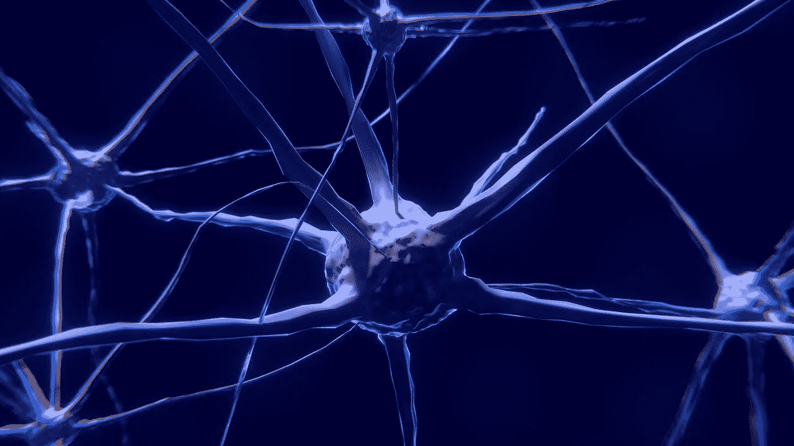

Source : pixabay.com

在这篇文章中，我想创建一个应用程序，可以让他们轻松地创作歌词。我会做一个基于人工智能的应用程序。人工智能知识是我的兴趣之一，我希望能帮助他们。

目前，人工智能是最热门的时髦词汇之一，人们在每个角落谈论它。它可以轻松解决一些对人类来说相当困难的问题。人工智能的一个分支是机器学习。机器学习是人工智能领域的一个分支，它可以根据给定的数据预测输出。它会从数据中学习。当我们想写一首歌词时，我认为我们应该偷看一些老歌，以了解他们是如何写歌词的。我们需要搜索他们如何连接每个单词的“模式”。这类似于从给定数据中学习的机器学习。

在本文中，我们将基于我丢弃的歌词数据集生成一个新的歌词。我们将使用深度学习，一种机器学习技术。我们将使用递归神经网络(RNN)来制作发电机的模型。

即使我选择的歌词是印度尼西亚语，不要担心。我将用英语写这篇文章。如果你想知道歌词的意思，用谷歌翻译或其他熟悉的工具翻译。

如果你对深度学习的术语还不熟悉，不要担心。我将告诉你每个人的简要描述。我会告诉你如何从开始(刮)管道。正如我在开始时所说的，我会尽可能让它对新手友好。

# 概述

我将按以下顺序写这篇文章:

1.  工具
2.  步骤
3.  收集数据
4.  预处理数据
5.  建立模型
6.  生成歌词
7.  结论
8.  编后记
9.  来源

# 工具

将使用的库、工具和语言编程包括:

1.  Python 3.6
2.  Python 库 numpy，python 中的数学工具
3.  Python 库 pandas，python 中的数据表格工具
4.  Python 库— [Keras](http://keras.io) ，深度学习框架。必须有 Tensorflow、CNTK 或 Theano 库
5.  Python 库— [Scrapy](http://scrapy.org) ，Python 中流行的 scrapper 工具
6.  Jupyter 笔记本，(可选)牛逼的 Python IDE，也可以用来做演示或者教育代码。

我使用图形处理器英伟达 GTX 1050 来训练我的模型。

# 步骤或管道

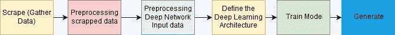

Image 1 : Step or Pipeline

这是我们制作发电机的步骤。

首先，通过使用 *scrapy* 抓取一些包含印度尼西亚歌词的网站来收集数据。然后使用 regex 清理仍然包含 HTML 标签的文本歌词。之后，处理歌词中的文本，以便它可以用于模型的输入。我们将需要构建深度学习架构。最后训练模型生成歌词。我会告诉你我是如何做到每一步的。

# 收集数据(网络搜集)

我从一个印尼歌词收集网站([lirik.kapanlagi.com](http://lirik.kapanlagi.com))搜集了所有的歌词。网络抓取是从网站中提取数据。所有的工作都是由一个应用程序，我们将创建。我们将使用 *scrapy* 库来抓取一个网站。我们要提取的信息是宋的歌词和歌名。

在本文中，我们将使用 lirik.kapanlagi.com 作为我们的目标。

首先，在终端或命令提示符下使用以下命令创建 scrapy 项目:

```
scrapy startproject lyric_scrapper
```

它将创建一个新的目录。切换到新目录并执行以下命令

```
scrapy genspider lyric_scrapper lirik.kapanlagi.com
```

它将在 tutorial/spiders 文件夹中创建一个`lyricscrapper.py`。我们称之为网络爬虫，因为它通过“爬行”进入目标网站。这是我们的代码:

```
# -*- coding: utf-8 -*-
import scrapy
from scrapy.spiders import CrawlSpider, Rule
from scrapy.linkextractors import LinkExtractorclass LyricScrapperSpider(CrawlSpider):
    name = 'lyric_scrapper'
    allowed_domains = ['lirik.kapanlagi.com']
    start_urls = ['[https://lirik.kapanlagi.com/lagu/a_id'](https://lirik.kapanlagi.com/lagu/a_id')]
    rules = (Rule(LinkExtractor(allow=(), restrict_css=(".pagination2 ul li a",".col-lirik .div-horizontal2-list a", "div .letterLinksAnchor")), callback="parse_page", follow=True),)
    def parse_page(self, response):
        song = response.css('.col-lirik').extract_first()
        title= response.css('.head-lirik h5::text').extract_first()
        if len(title) > 0 and len(song) > 0:scraped_info = {
            'song' : song,
            'title' : title,
        }yield scraped_info
```

让我们看看这一部分:

```
start_urls = ['[https://lirik.kapanlagi.com/lagu/a_id'](https://lirik.kapanlagi.com/lagu/a_id')]
    rules = (Rule(LinkExtractor(allow=(), restrict_css=(".pagination2 ul li a",".col-lirik .div-horizontal2-list a", "div .letterLinksAnchor")), callback="parse_page", follow=True),)
```

我们将从`start_urls`中的 URL 开始。为了确定起始 URL，我们应该找到包含歌词索引列表的页面。我发现[是 https://lirik.kapanlagi.com/lagu/a_id](https://lirik.kapanlagi.com/lagu/a_id')的索引列表。

爬行器将通过在当前网页中查找 URL 来找到下一个要抓取的目标。为了让爬虫跟踪我们想要的页面，我们必须指定爬虫必须看到网页的哪个部分。在这种情况下，我们需要瞄准图 2 所示的这部分:

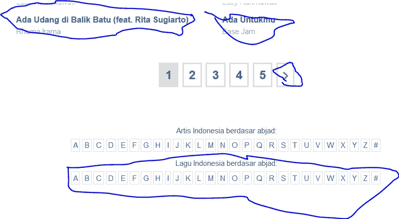

Image 2 : We will target these parts (blue marker)

我们需要通过检查 HTML 代码来得到我们想要的部分。对我来说，我用 Inspect Element 来做(Firefox)。对于这个网站，我们将限制爬虫将目标`(“.pagination2 ul li a”,”.col-lirik .div-horizontal2-list a”, “div .letterLinksAnchor”)`。它将抓取网站，直到没有更多的网址抓取(它还会检查该网址是否已被访问)。

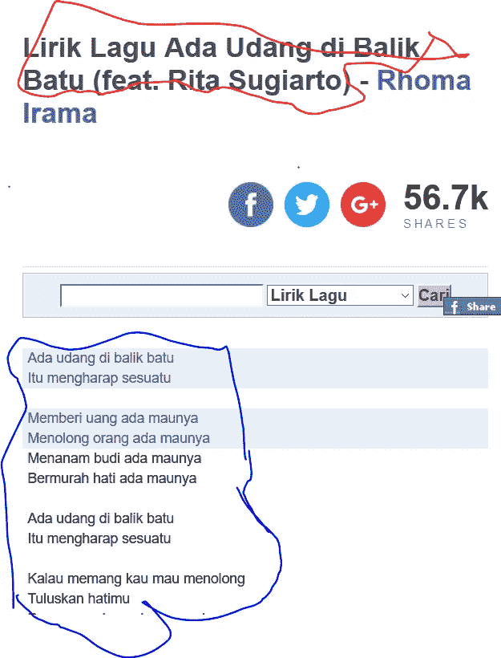

Image 3: Part that we want to extract

接下来，我们要从网页中提取歌词和标题的歌曲。为此，我们需要找到包含它们的 HTML 标签(图 3 中红色和蓝色的标签)。

```
song = response.css('.col-lirik').extract_first() 
title = response.css('.head-lirik h5::text').extract_first()
```

对于歌词(我将其命名为' song '变量)，我们需要 HTML 代码，因为这个网站的 HTML 组成有点乱。我们一会儿需要清理它。

救你的`lyricscrapper.py`。然后，打开文件夹内的`settings.py`。

添加或取消注释这些行:

```
FEED_FORMAT = "csv"
FEED_URI = "scrape.csv"DOWNLOAD_DELAY = 1 # important, sometimes you will get banned if you set it to 0\. 
```

保存它，然后在控制台上执行以下命令:

```
scrapy crawl lyric_scrapper
```

瞧，我们的爬虫将爬行我们的目标站点。只要等到它结束或强迫它结束，如果你很无聊。结束后，它会在文件夹内生成`scrape.csv`。您可以使用电子表格工具打开它来查看。有点乱，不是吗？。如上所述，我们需要清理歌词的文本。所以让我们进入下一步。

# 清除报废数据

现在是时候清理我们的脏数据了。因为我们只想生成歌词，所以我们只需要来自`scrape.csv`的歌曲列。在开始之前，我建议我们使用 Python IDE，如 Jupyter Notebook 或 Spyder，以便更好地查看我们的数据。在这一部分，我们将使用 pandas 库来查看表格中的数据。

打开您的代码，然后让我们导入我们的 csv 数据，并将其转换成 dataframe 类型(`pd.DataFrame`)。为了检查歌词的歌曲，我们将采样 5 个实例。一定要把`scrape.csv`文件放到我们 python 的代码文件夹中。

```
import pandas as pd
scrape_lyric = pd.read_csv('scrape.csv')
scrape_lyric.sample(5)
```

首先，我们需要确保我们的数据没有缺失数据。然后，如果提取了一些错误页面，我们就移除不想要的数据。在我们的例子中，我们会发现我们的歌词网页应该包含 span 标签。所以删除没有 span 标签的实例。我们将删除包含“Belum ada Lirik”文本实例(翻译:没有任何歌词)。

在清理之前，我们应该检查数据的大小。使用`scrape_lyric.shape`进行检查。我有 20259 行。

```
scrape_lyric = scrape_lyric.dropna()
scrape_lyric = scrape_lyric[scrape_lyric.song.str.contains('span')]
scrape_lyric = scrape_lyric[~(scrape_lyric.song.str.contains('Belum Ada Lirik'))]
```

检查你的数据帧`scrape_lyric.shape`的大小，我有 13791 行。它遗漏了 6468 行！

我们只会看到‘宋’一栏。通过查看 song 列，我们会看到文本仍然有 HTML 标记。我们需要清理它。我们将使用正则表达式来做这件事。

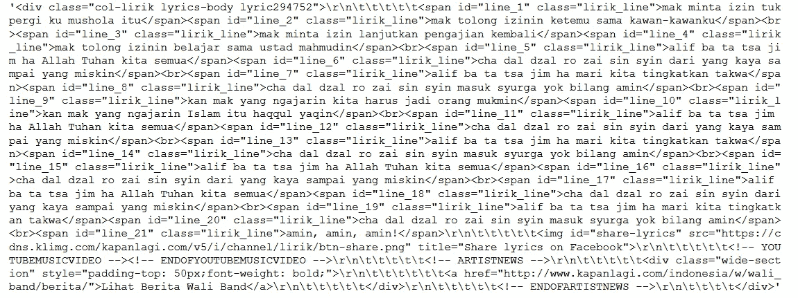

Image 4: Example of 1 instance in the data

这个清理正则表达式只适用于我们的目标网站。如果我们的目标是其他网站，我们需要看看 HTML 模式是怎样的，并使用适当的正则表达式来清理它(或者如果网站很好解析，可能不需要清理数据)。

这里是清理我们的网页的正则表达式:

```
def clean_text_lyric(lyric, max_length):
 lyric_sample = lyric.split('</span>')
 lyric_sample = lyric_sample[:-1]

 clean_song_lyric = ""
 for sentence in lyric_sample:
   if 'http' not in sentence:
      sentence = re.sub(r'<div .*>','',sentence)
      sentence = re.sub(r'<span .*>','',sentence)
      sentence = sentence.strip()
      if len(sentence) > 0:
        sentence = re.sub(r'[^a-zA-Z0-9<\/>\s]',' ', sentence) sentence = " <div> " + sentence + " </div> "
        sentence = re.sub(r'<div>\s+<br>','<br> <div> ', sentence)
        sentence = re.sub(r'(\d|\r|\t|\n)','',sentence) clean_song_lyric += sentence clean_song_lyric = ' <start> ' * (max_length-1) +                  clean_song_lyric
    return clean_song_lyric
```

我们将逐一看到:

```
lyric_sample = lyric.split('</span>')
lyric_sample = lyric_sample[:-1]
```

如果我们查看我们提取的歌词，他们用 HTML 标签“`<br>`”来分隔他们的诗句。1 节包含几行。每行由 HTML 标记“`</span>`”分隔。我们需要通过使用“`</span>`”来拆分行。

现在我们移除 HTML 标签(div，span)

```
sentence = re.sub(r'<div .*>','',sentence)
sentence = re.sub(r'<span .*>','',sentence)
```

然后我们将删除除了 `[^a-zA-Z0–9<\/>\s]`以外的所有字符。我们删除了转义字符和多余的空白。如果你不熟悉 regex，建议你试试[这个](http://regex101.com)站点玩 regex。

```
sentence = re.sub(r'[^a-zA-Z0-9<\/>\s]',' ', sentence)sentence = " <div> " + sentence + " </div> "
sentence = re.sub(r'<div>\s+<br>','<br> <div> ', sentence)
sentence = re.sub(r'(\d|\r|\t|\n)','',sentence)
```

我讨厌这个网站的 HTML 代码。提取的歌词有时在歌词内有 URL。这就是为什么我设置了循环保护来确保里面没有 URL。

在我们清理文本之后，我们想要标记我们的开始和结束歌词的行。

对我来说，我使用了`<div>`和`</div>`标签来标记我们歌词的开始和结束。

我们不会删除`<br>`标签。这是一个标记，用来分隔每一节。

最后，我们将在所需的`max_length-1`的歌词开头添加`<start>`标签。我们为什么要这么做？我以后会告诉你。

将其应用到数据框中:

```
scrape_lyric['song'] = scrape_lyric['song'].apply(lambda x: clean_text_lyric(x))
```

这是我们想要使用的歌词格式文本。

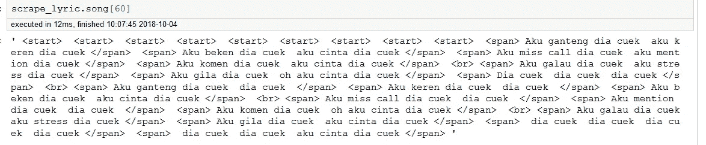

Image 5: desired lyric’s format

# 预处理数据

清理完数据后，让我们进入数据预处理。为什么我们需要这样做？我们的深度学习模型的输入是一系列文本。它不能在字符串模式下读取文本。我们需要将数据集中的所有单词编码到索引号中，在一次热编码中将索引号映射到单词中。当我们使用嵌入时，在 keras 中，我们不必将文本编码成一个热编码。我们可以使用键索引映射来映射模型中带有索引号的单词。

在此之前，让我们将包含几行的歌词转换成一个具有所需长度的序列文本数组集合。

```
def generate_train_dataset(song_series, window):
    train_data = []
    train_label = []
    for song_string in song_series:
        song_arr = song_string.split()
        len_song_arr = len(song_arr) for i in range(0,len_song_arr-window+1):
            train_data.append(' '.join(song_arr[i:i+window-1]))
            train_label.append(song_arr[i+window-1])
    return np.array(train_data), np.array(train_label)
```

请看图 6，想象一下`generate_train_dataset` 功能是如何工作的。它将从开始切片到`window-1`并将其添加到 train_data 列表中。然后将最后一个索引添加到`train_label` 列表中。这叫做**滑动窗口**，窗口长度等于我们的`window`参数。在本文中，我们将设置窗口等于 10。


Image 6: sent_len parameter set to 5

我们创建的函数需要一个`pandas.Series`类型作为输入。

```
max_length = 10 #window
X, y = generate_train_dataset(scrape_lyric.song, sent_len=max_length)
```

成功了吗？很好，接下来我们将使用`keras.preprocessing.text.Tokenizer` 库来创建一个输入映射，它将一个单词映射到函数选择的索引号。确保更改参数过滤器，不包括`‘<’`和`‘>’`。

```
pre = keras.preprocessing.text.Tokenizer(filters='!"#$%&()*+,-.:;=?@[\\]^_`{|}~\t\n')
pre.fit_on_texts(X.flatten()) # need to flatten the array
```

我们将得到词汇量，它包含了我们的数据中有多少独特的单词。

```
vocab_size = len(pre.word_index)
```

我们将数据转换成单词索引序列:

```
X = pre.texts_to_sequences(X)
y = pre.texts_to_sequences(y)
```

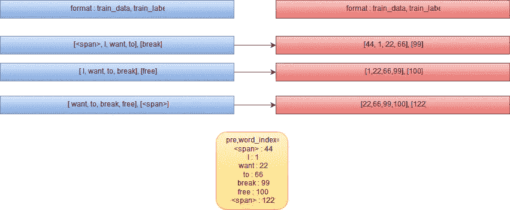

Image 7: How Our Tokenization works

我们已经完成了对输入数据的预处理。我有大约 200 万个例子。

让我们继续创建模型。

# 定义深度学习的架构

在我们深入研究代码和实现之前，让我们回忆一下什么是深度学习、密集层、RNN、LSTM 层和激活函数。我们会召回他们。

## 深度学习

深度学习是机器学习技术的一个子集。根据 Yoshua Bengio 的说法，他说“*深度学习算法寻求利用输入分布中的未知结构，以便发现良好的表示，通常是在多个级别，较高级别的学习特征根据较低级别的特征来定义”。*

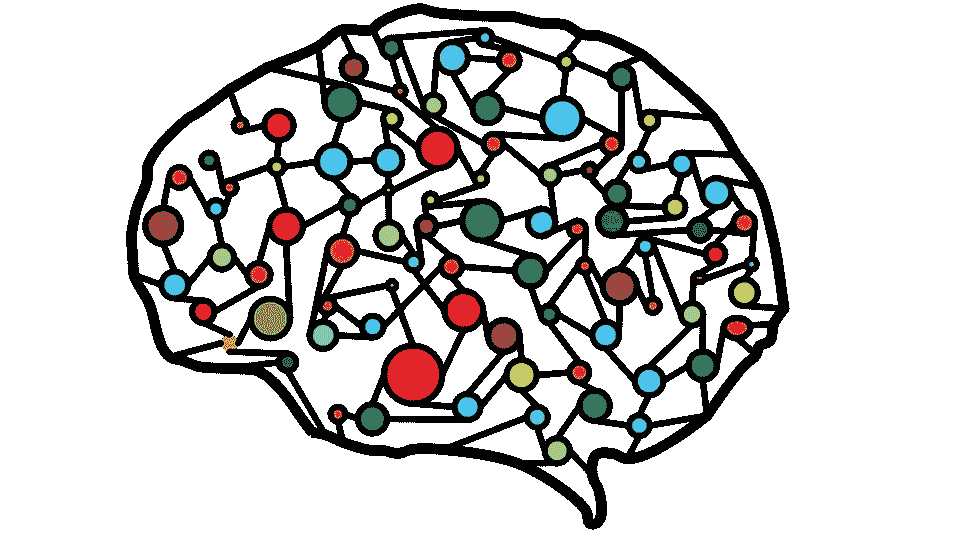

Source : pixabay.com

深度学习将从数据中学习特征表示。我们不必从数据中提取特征。它不同于其他需要提取特征的机器学习算法。它由模仿人脑的几个层次和网络组成。它有许多别名，如深度神经网络。深度神经网络的主要部分是**反向传播**算法，它将使用优化器算法更新我们的模型权重，使误差最小。如果你想了解更多，请访问这个[网站](https://machinelearningmastery.com/what-is-deep-learning/)。

## 把...嵌入

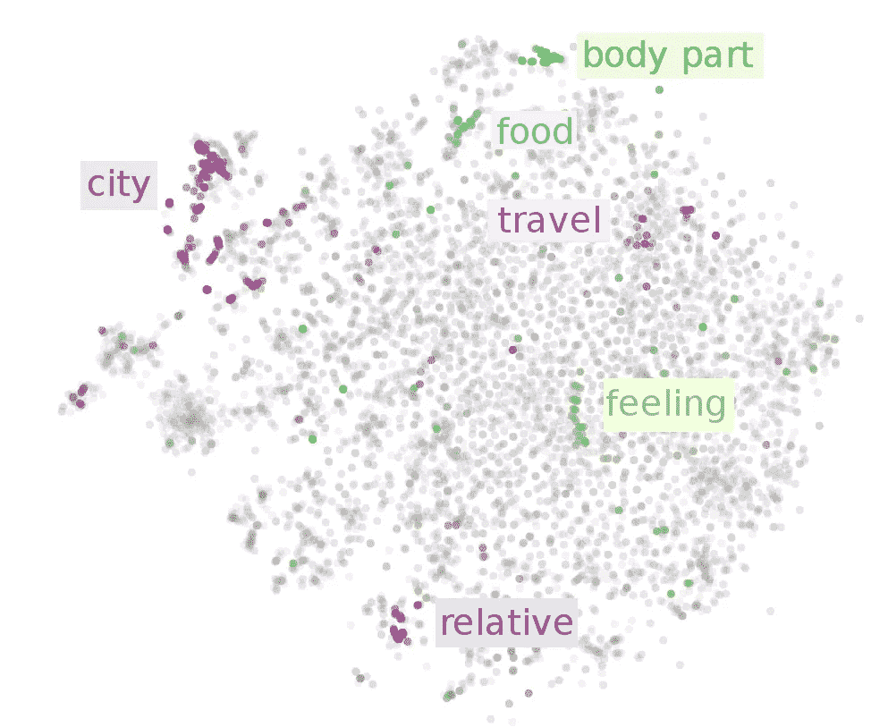

Source : ruder.io

嵌入是一种技术，它将使我们在数据集中的实例成为一种经过学习的表示。在本教程中，我们将使用单词嵌入。单词嵌入将把我们的单词表示成作为实值向量的学习表示。它通常由十维或数百维向量组成。向量通常会捕捉单词的意思。

有几种算法可以进行单词嵌入。有:

1.  嵌入层
2.  Word2vec
3.  手套
4.  节目预留装置
5.  埃尔莫(**新**)

在我们的模型中，我们将使用嵌入层。它将根据我们的模型更新向量。

## 致密层

这是全连接层的别名。它是一个线性层，传播一个**线性函数**，并使用该函数的导数(梯度)从一个神经元反向传播到另一个神经元。更简单地说，这是一个网络，它只接受输入并乘以从反向传播中学习到的权重。我找到了一篇中型文章，可以帮助你更好地理解[全连接层。](/under-the-hood-of-neural-networks-part-1-fully-connected-5223b7f78528)

## RNN 和 LSTM

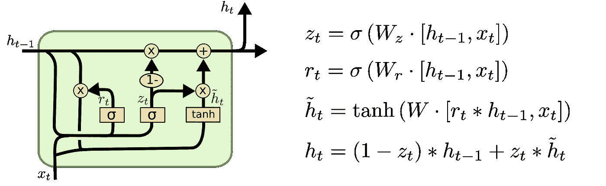

Source : colah.github.io

递归神经网络(RNN)是一个具有内部存储器的层，因此它可以记住输入的序列信息。神经元之间连接是一系列有向图。它会记住前一个神经元的信息(权重),并将其传递给当前神经元。

使用 RNN 有几个缺点。它学不会'*长期依赖*'。它会遇到一个问题，叫做“*消失梯度*”。它不会再更新神经元的权重。为了解决这个问题，长短期记忆(LSTM)被使用。

LSTM 是 RNN 问题的一剂良药。它有能力解决“长期依赖”问题。LSTM 有能力通过一种叫做“门”的结构给新神经元添加或删除信息。LSTM 有三个门:遗忘门、输入门和输出门。他们将控制神经元的状态。如需了解更多信息，您可以访问此[网站](https://colah.github.io/posts/2015-08-Understanding-LSTMs/)。

## 批量标准化

归一化目标图层的输出值。它们的平均输出激活为 0，标准偏差为 1。它有几个好处，如加快我们的训练速度。如果你想了解更多关于 BatchNormalization 的细节，请看这篇[文章](https://medium.com/deeper-learning/glossary-of-deep-learning-batch-normalisation-8266dcd2fa82)。

## 激活功能

它用于确定一个层的输出是否被激活。它将输出映射到激活函数的范围。要了解更多细节，请访问[这篇](/activation-functions-neural-networks-1cbd9f8d91d6)文章。

# 体系结构

回忆完了吗？让我们进入代码

我们将建立的是一个简单的架构深度网络。它由嵌入层、LSTM 层和密集层组成，以*分类交叉熵*和 *softmax 激活*作为输出。图 7 是我们想要创建的架构的可视化。

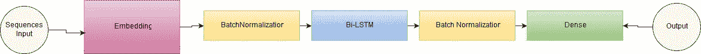

Image 7 : Visualization of our architecture

```
 model = Sequential()
e = Embedding(vocab_size,100 ,input_length=max_length-1, trainable=True)
model.add(e)
model.add(keras.layers.BatchNormalization())
model.add(keras.layers.Bidirectional(keras.layers.CuDNNLSTM(100)))
model.add(keras.layers.BatchNormalization())model.add(Dense(100, activation='relu'))
model.add(keras.layers.BatchNormalization())model.add(Dense(vocab_size+1, activation='softmax')) 
# vocab_size +1 to avoid out of bound
# compile the model
model.compile(optimizer='adam', loss='categorical_crossentropy')
```

在本文中，我们将使用具有所述超参数的模型。当然，你可以调整我们模型的超参数。为了简单起见，我们将只使用一个双 LSTM 和一个密集层。我们使用批处理标准化来加速我们的学习者。如果用 GPU，就要用 CuDNNLSTM 来加快训练速度。

我使用亚当优化，因为它是一个流行的优化现在。该算法速度快，能很好地适应反向传播模型的学习速度。

# 火车模型

在我们调整或训练我们的模型之前。我们有一个问题要解决。如果我们看到我们的 vocab_size，它有大约 45000 个独特的单词。在 keras 中，我们应该将火车标签编码成一个热编码[0 0 0 … 1 … 0]。如果我们将我们所有训练标签改变成一个热编码，这将导致**内存错误**(它需要 45.000 * 2 兆* 4 字节内存。不可能保存到内存中)。因此，我们需要将我们的火车标签批量更改为一个热编码。

```
def batch_data(start,end):
    global X,y,y_input, X_input
    X_input = np.array(X)[start:end]
    y_input = np.array(y)[start:end]
    y_input = keras.utils.to_categorical(y_input,vocab_size+1)max_epoch = 40
instance_max = len(X)
batch_size = 10000for i in range(max_epoch):
    start_idx_counter = 0
    while start_idx_counter < instance_max:
        batch_data(start_idx_counter, min(start_idx_counter+batch_size,instance_max))
        model.fit(X_input, y_input, epochs=1, batch_size=64) 
        start_idx_counter += batch_size
```

我们将 10000 定义为我们的批量。你可以随意增减尺寸。我们用 40 个时期(迭代)来拟合我们的模型。执行代码！fit 方法中的 batch_size 也可以调整。

> 等着吧！！


source: me.me

用 GPU 训练我的模型花了 1 天。如果你不想等那么久，减小`max_epoch`。

完成了吗？不要忘记保存模型和记号赋予器。你想再等一天来训练我们的模特吗？没有吗？**不要忘记保存模型！**

```
model.save('lyric_gen_model.h5')
```

我们将使用`pickle` 库来保存我们的标记器

```
import pickle
pickle.dump( pre, open( "tokenizer_pre_lyric.p", "wb" ) )
```

我们完了。让我们创作我们的歌词吧！！！

# 生成歌词

让我们使用我们的模型来生成歌词。我们已经训练了我们的模型，我们将使用它。为此，我们需要加载我们的模型和标记器。

```
model = keras.models.load_model('lyric_gen_model.h5')
pre = pickle.load( open( "tokenizer_pre_lyric.p", "rb" ) )
```

然后我们需要首先预处理我们的输入。

```
def preprocess_predict(X):
    X = pre.texts_to_sequences(X)
    return X
```

在我们的文章中，我们在歌词的开头插入了“<start>”符号。我们这样做是为了标志这首歌歌词的开始。如果我们想在没有任何起始词的情况下生成。我们可以这样做:</start>

```
seed = "<start> " * (max_length-1)
```

或者，您也可以包含一些起始单词。

```
seed = "<start> " * (max_length-3)
seed = "<div> love"
```

我们应该定义函数来帮助我们生成歌词

```
def is_word_in_dict(words, word_idx):
    for word in words.split():
        if word not in word_idx:
            return False
    return Truedef generate_song_by_model(model, idx_word, X_sent, word_idx, total_classes, word_generated=80):
    string_returned = X_sent
    if is_word_in_dict(X_sent, word_idx):
        X = np.array(preprocess_predict([X_sent]))
        counter = 1

        for i in range(word_generated):
           y_pred = model.predict(X)
           rnd_choice = np.random.choice(range(0,total_classes),size=1,replace=False, p=y_pred[0])
           word_predict = idx_word[rnd_choice[0]]
           string_returned += " " + word_predict
           X = ' '.join(string_returned.split()[counter:])
           X = np.array(preprocess_predict([X]))
           counter += 1 return string_returned
```

在这个函数中，我们将根据我们的种子(generate 函数中的 **X_sent** 变量)来预测单词。我们将窗口大小长度为 1 的标记作为我们的模型的输入，并且该模型将预测下一个标记。在下一个循环中，它将把预测的输出和 size-length-2 标记带入模型。它会一直循环到我们设定的终点。我们将根据 softmax 的输出产生的概率分布得到一个随机单词。如果您正在使用 Jupyter Notebook，使用此命令显示生成的歌词

```
from IPython.display import HTML
generated_lyric = generate_song_by_model(model, pre.index_word, seed, max_length, pre.word_index, vocab_size+1,loop_count=50)
HTML(generated_lyric)
```

它将生成 50 个新的令牌/单词(包括标签)。生成的歌词应该有 HTML 标签

和
，作为行和诗的分隔符。我们使用 IPython.display 中的 HTML 函数来清理显示中的标签。这里有一些我们生成的歌词的例子。

> 我试着带你回家
> 
> 我是救世主之光
> 
> 总有一天沙漠会飞走
> 
> 谁俯视着我的双手
> 
> 如果我做得不好
> 
> 你开始想办法

在这个生成的歌词里。使用英语单词非常一致。虽然有些令人困惑的意思，但还不错。我们的结果是基于随机性的。如果你的模型学得少，它会产生糟糕的歌词！

如果你想知道为什么它会产生英语单词，有时印尼歌曲包含混合语言。有些歌曲包含完整的英文单词。

这里是另一个生成的歌词。

> dara kau bertanya siapa namamu
> 
> 杨森永坦吉斯穆
> 
> pasti pahit di ayahku
> 
> 帕达·贝尔穆拉·迪潘当·卢卡
> 
> dan semua karena cintamu
> 
> 这是我第一次见到你。
> 
> ku tak ingin sendiri

想知道歌词的意思就翻译一下。关于用印尼语和谈情说爱也很一致。同样，它的随机性将决定歌词的好坏。

# 结论

如果你关注这篇文章，我们已经建立了一个工具来生成印度尼西亚歌词。我们利用网络爬虫和深度学习库来构建生成器。它可以产生一些好的歌词，虽然这取决于我们的运气(随机性对概率)。

在本文中，我们跳过了一些步骤，如探索性分析。我们应该尝试另一种架构或超参数。我们还需要评估生成的歌词。

# 编后记

感谢您阅读我的第一篇关于人工智能的文章。由于这是我的第一次，我在这方面还不太专业，我需要一些建设性的反馈，让我在写作和深度学习方面做得更好。请手下留情> _

抱歉任何拼写错误，语法，和低效的代码。

哦，我提到第一部分了吗？是的，我计划通过使架构更复杂(可能使用 GAN)，使用另一种嵌入和超参数来改进这个歌词生成器。

在下一篇文章中，我将从一个将从头开发的游戏中进行一些强化学习。

下一篇文章再见！


Source: pixabay.com

# 来源

1.  [https://www . up work . com/hiring/for-clients/web-scraping-tutorial/](https://www.upwork.com/hiring/for-clients/web-scraping-tutorial/)
2.  https://colah.github.io/posts/2015-08-Understanding-LSTMs/
3.  [https://machine learning mastery . com/what-are-word-embedding/](https://machinelearningmastery.com/what-are-word-embeddings/)
4.  [https://medium . com/deep-learning/glossary-of-deep-learning-batch-normalization-8266 dcd2fa 82](https://medium.com/deeper-learning/glossary-of-deep-learning-batch-normalisation-8266dcd2fa82)
5.  [https://towards data science . com/activation-functions-neural-networks-1 CBD 9 F8 d 91d 6](/activation-functions-neural-networks-1cbd9f8d91d6)