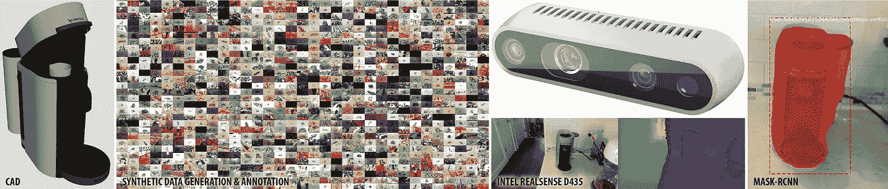
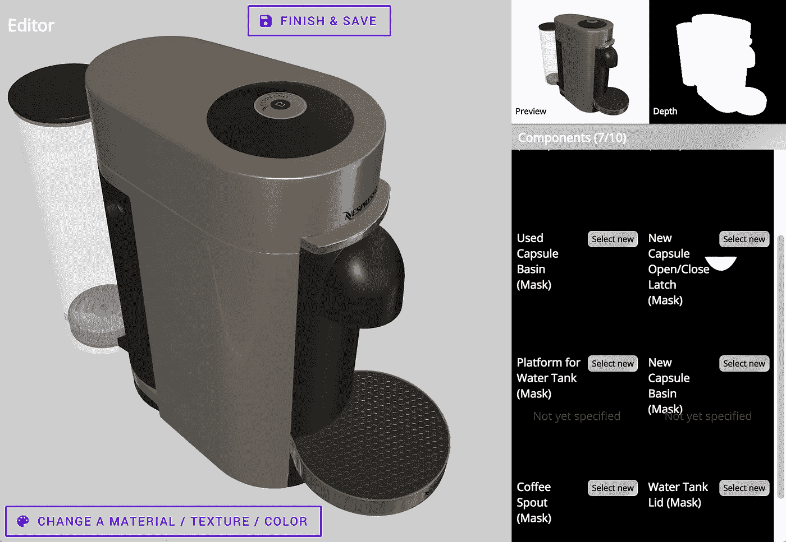
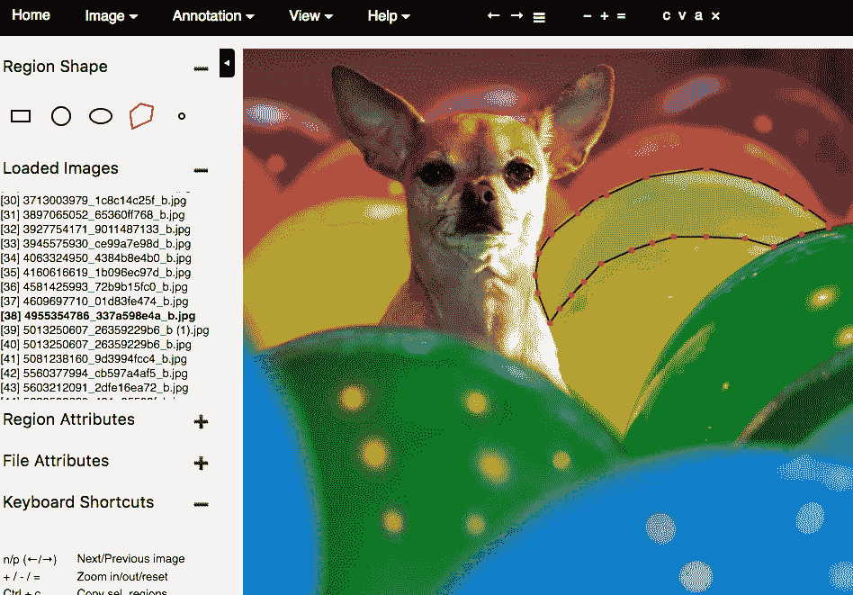
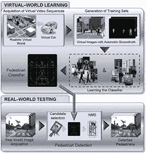
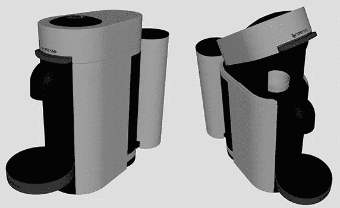
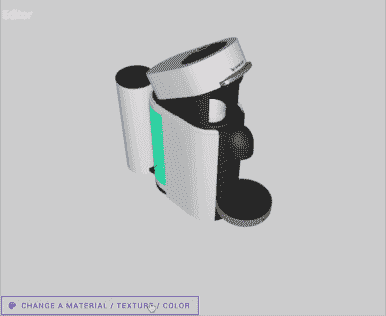
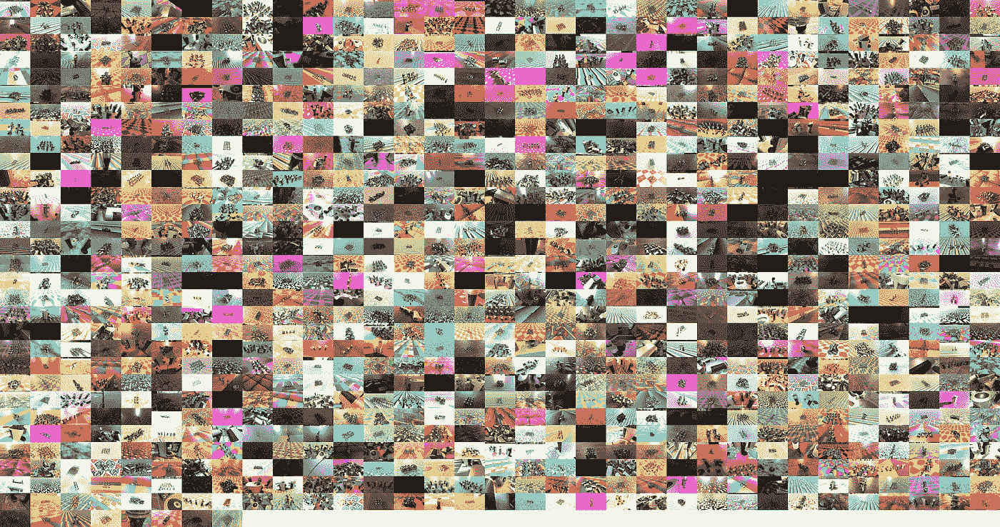
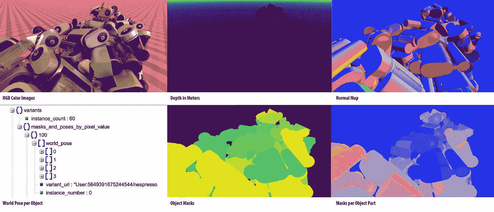
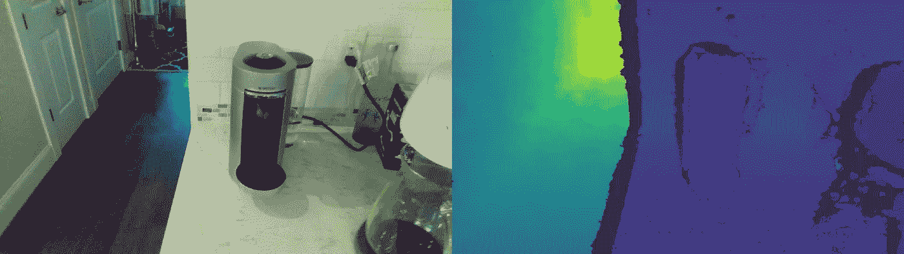
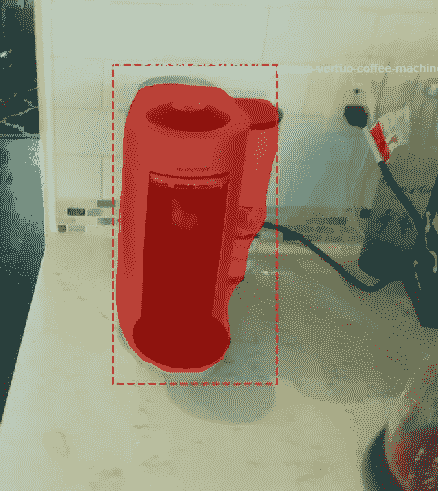

# 为计算机视觉生成大型、合成、带注释和照片级真实感数据集

> 原文：<https://towardsdatascience.com/generating-large-synthetic-annotated-photorealistic-datasets-for-computer-vision-ffac6f50a29c?source=collection_archive---------16----------------------->

我给大家介绍一下我们在 Greppy 一直在做的一个工具的 beta 版，叫 Greppy 元宇宙(*2020 年 2 月 18 日更新:* [*合成 AI*](https://synthesis.ai/) *已经获得了这个软件，请通过*[*Synthesis . AI*](https://synthesis.ai/)联系他们！)，它通过快速轻松地生成大量用于机器学习的训练数据，来辅助计算机视觉对象识别/语义分割/实例分割。*(旁白:如果可以的话，合成 AI 也喜欢帮助你的项目——在 LinkedIn* *上通过*[【https://synthesis.ai/contact/】](https://synthesis.ai/contact/)*或* [*联系他们)。*](https://www.linkedin.com/company/synthesis-ai/)

如果您过去做过图像识别，您会知道数据集的大小和准确性非常重要。你的所有场景也需要被注释，这可能意味着成千上万的图像。对于我们的小团队来说，这样的时间和精力是不可扩展的。

## 概观

因此，我们发明了一种工具，使得创建大型的带注释的数据集更加容易。我们希望这可以对增强现实、自主导航和机器人技术有所帮助——通过生成识别和分割各种新对象所需的数据。

我们甚至开源了我们的 [VertuoPlus 豪华银数据集](https://drive.google.com/file/d/1J4fnNh9IaXa6gkqbU93V2RmZStr8M9Bf/view?usp=sharing)，其中有 1000 个咖啡机的场景，所以你可以一起玩！是个 [6.3 GB 下载](https://drive.google.com/file/d/1J4fnNh9IaXa6gkqbU93V2RmZStr8M9Bf/view?usp=sharing)。

为了展示它的功能，我将在 Greppy 这里为您展示一个真实的例子，我们需要用一个[英特尔实感 D435](https://click.intel.com/intelr-realsensetm-depth-camera-d435.html) 深度摄像头来识别我们的咖啡机及其按钮。将来会有更多关于*为什么*我们想认识我们的咖啡机，但可以说我们经常需要咖啡因。

Screenshot of the Greppy Metaverse website

## 在过去的日子里，我们不得不用手来注释。

VGG Image Annotator tool example, courtesy of [Waleed Abdulla’s](https://www.linkedin.com/in/waleedka/) “[Splash of Color](https://engineering.matterport.com/splash-of-color-instance-segmentation-with-mask-r-cnn-and-tensorflow-7c761e238b46)”

对于过去的大多数数据集，注释任务都是由(人类)手工完成的。正如你在左边看到的，这不是特别有趣的工作，而且和所有人类的事情一样，它容易出错。

它也几乎不可能准确地注释其他重要信息，如物体姿态，物体法线和深度。

## 合成数据:10 年前的想法

人工标记的一个有希望的替代方法是合成产生(理解:计算机生成)的数据。这是一个已经存在了十多年的想法(参见这个 [GitHub repo 链接到许多这样的项目](https://github.com/unrealcv/synthetic-computer-vision))。

From [Learning Appearance in Virtual Scenarios for Pedestrian Detection, 2010](http://people.csail.mit.edu/jmarin/docs/cvpr10.pdf)

不过，我们在现有项目中遇到了一些问题，因为它们要么需要编程技能才能使用，要么不能输出逼真的图像。我们需要一些非编程团队成员可以用来帮助有效生成大量数据以识别新类型对象的东西。此外，我们的一些对象在没有光线追踪([维基百科](https://en.wikipedia.org/wiki/Ray_tracing_(graphics)))的情况下很难产生真实感，这是其他现有项目没有使用的技术。

## 用格雷皮·元宇宙制作大规模合成数据

为了达到我们想要的目标数量，我们制作了 Greppy 元宇宙工具。例如，我们可以使用来自 [3D 仓库](https://3dwarehouse.sketchup.com/)网站的预制 CAD 模型，并使用网络界面使它们更加逼真。或者，我们的艺术家可以创建一个定制的 3D 模型，但不必担心如何编码。

让我们回到咖啡上。使用我们的工具，我们首先上传我们拥有的 Nespresso VertuoPlus 豪华银机的 2 个非真实感 CAD 模型。我们实际上上传了两个 CAD 模型，因为我们想在两种配置中识别机器。

Custom-made CAD models by our team.

CAD 模型上传后，我们从预先制作的照片级真实材料中进行选择，并应用到每个表面。Greppy 元宇宙的目标之一是建立一个开源的、真实感的材料库，任何人都可以使用(最好是在社区的帮助下！).作为一个旁注，3D 艺术家通常需要创建自定义材料。

Select pre-made, photorealistic materials for CAD models.

为了能够识别机器的不同部分，我们还需要标注我们关心机器的哪些部分。web 界面提供了实现这一点的工具，因此不了解 3D 建模软件的人可以帮助完成这一注释。不需要 3D 艺术家或程序员；-)

Easily label all the parts of interest for each object.

然后……就这样了！我们自动生成多达数万个场景，这些场景在姿势、对象实例数量、相机角度和照明条件方面各不相同。它们都会被自动标注，并且精确到像素。在幕后，该工具用 GPU 旋转了一堆云实例，并在一个小“renderfarm”上渲染这些变化。

以下是来自[开源 VertuoPlus 豪华银数据集](https://drive.google.com/open?id=1J4fnNh9IaXa6gkqbU93V2RmZStr8M9Bf)的 RGB 图像示例:

A lot of scene RGBs with various lighting conditions, camera angles, and arrangements of the object.

对于每个场景，我们输出一些东西:基于所选相机的单目或立体相机 RGB 图片，相机看到的深度，所有对象和对象部分的像素完美注释，相机和每个对象的姿势，最后，场景中对象的表面法线。

让我再次强调**任何场景都不需要手工标注！**

单个场景的输出示例如下:

Output examples from each scene

## 基于合成数据集的机器学习

随着整个数据集的生成，很容易使用它来训练 Mask-RCNN 模型(关于 Mask-RCNN 的历史有一个很好的[帖子](https://blog.athelas.com/a-brief-history-of-cnns-in-image-segmentation-from-r-cnn-to-mask-r-cnn-34ea83205de4))。在后续的帖子中，我们将使用 Mask-RCNN 的 [Matterport 实现，开源我们用于从 Greppy 元宇宙数据集训练 3D 实例分割的代码。](https://github.com/matterport/Mask_RCNN)

与此同时，这里有一个小小的预览。这是来自[英特尔实感 D435](https://click.intel.com/intelr-realsensetm-depth-camera-d435.html) 相机的原始捕捉数据，左边是 RGB，右边是对齐的深度(总共构成 4 个通道的 RGB-D):

Raw data capture from Intel RealSense D435\. Yes, that’s coffee, tea, and vodka together ;-)

对于这个 Mask-RCNN 模型，我们在具有大约 1000 个场景的开源数据集上进行训练。经过 30 个时期的模型训练后，我们可以在上面的 RGB-D 上看到运行推理。瞧！我们得到一个几乎 100%确定的输出掩码，只对合成数据进行训练。

当然，我们也会开源培训代码，这样你就可以自己验证了。

一旦我们能够识别图像中的哪些像素是感兴趣的对象，我们就可以使用英特尔实感框架来收集这些像素处咖啡机的深度(以米为单位)。知道 Nespresso 机器的精确像素和精确深度对任何 AR、导航规划和机器人操纵应用都非常有帮助。

## 总结想法

目前，Greppy 元宇宙还处于测试阶段，我们还有很多需要改进的地方，但我们对目前的结果非常满意。

同时，如果你有一个项目需要帮助，请联系 https://synthesis.ai/contact/[的合成人工智能](https://synthesis.ai/contact/)或 LinkedIn 的[。](https://www.linkedin.com/company/synthesis-ai/)

特别感谢[瓦利德·阿卜杜拉](https://www.linkedin.com/in/waleedka/)和[叶锦华](https://www.linkedin.com/in/jyip4849/)帮助改进这篇文章:)