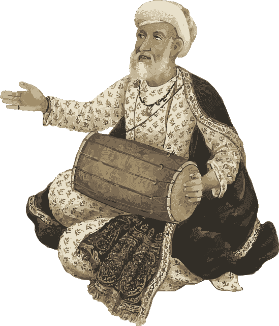
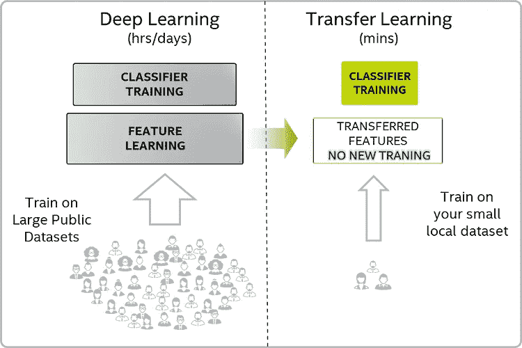
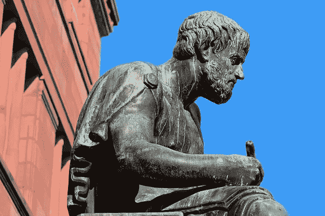
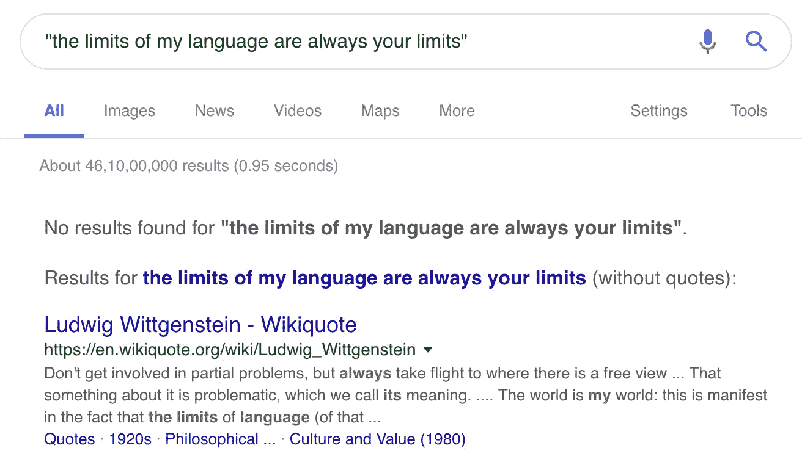

# 通过机器学习为机器学习项目产生新想法

> 原文：<https://towardsdatascience.com/generating-new-ideas-for-machine-learning-projects-through-machine-learning-ce3fee50ec2?source=collection_archive---------7----------------------->

## 使用预先训练的语言模型从 2.5k 句子的小型语料库中生成风格特定的文本。PyTorch 代码

让我们做一个快速图灵测试。下面，你会看到十个机器学习项目创意。其中五个是由人类产生的，五个是由神经网络产生的。你的任务是区分它们。

准备好了吗？(不要想多了。跟着感觉走)。

1.  股票交易学习者
2.  预测数据中的频率差异
3.  专利分类的机器学习
4.  遥感图像卷积特征的分类
5.  基于随机森林的人脸检测
6.  机器学习预测职业成功
7.  旋转不变稀疏编码
8.  深度学习在公平性中的应用
9.  三维点云中的物体识别
10.  加利福尼亚的建筑模型

看到名单了吗？记下你认为神经网络产生的五个想法，以及人类产生的五个想法。

*提示鼓声*寻找答案。



Who’s the robot and who’s the human? Reveal time. (image via [Pixabay](https://pixabay.com/en/drum-drummer-instrument-music-1299129/))

**回答**:所有奇数编号的想法都是斯坦福大学 [CS229 机器学习课程](http://cs229.stanford.edu/projects.html)完成的最终项目的标题，所有偶数编号的想法都是由在该数据集上训练的神经网络生成的。

是的，向上滚动并再次查看列表，比较您的笔记，然后我们将深入了解这些想法是如何产生的细节。你有多准确？(评论里讲！)

这个项目的动机是让我学会使用递归神经网络(RNN)来生成类似于我最喜欢的哲学家和思想家的引文。我见过许多其他人[用 RNNs 创作音乐](https://medium.com/artists-and-machine-intelligence/neural-nets-for-generating-music-f46dffac21c0)、[笑话](https://amoudgl.github.io/blog/funnybot/)，甚至[分子](https://pubs.acs.org/doi/full/10.1021/acscentsci.7b00512)。除了哲学，我也想做同样的事情。

我从网上收集了大约 5000 条来自加缪、尼采、维特根斯坦、费曼、大卫·休谟、斯蒂芬·霍金和詹姆斯·卡尔斯等思想家的引文。

我完全没有注意到的是，我作为灵感的项目通常有数百万的数据集，而我自己只有 5000 个句子。天真而盲目地，我继续前进，而*在让我的人造哲学家工作方面一再失败。最后，在三次失败的实验后，我让它工作了，随后我为机器学习的想法建立了一个生成器。*

# 当训练样本很小时，RNNs 不合理的顽固

这是我用 RNNs 做的第一个失败的实验:

*   我认为语料库不够大，不足以训练一个单词级语言模型，所以我选择了一个[字符级语言模型](http://karpathy.github.io/2015/05/21/rnn-effectiveness/)
*   我在语料库上训练了一个非常简单的基于 LSTM/GRU 的单层递归网络，但效果不佳
*   它输出看起来像英语，但最终却是乱码的句子，如“*我可以到某处我们和可以到这来撕到界限撕到保留地*

我的**第二次失败的实验**:

*   我想也许一层循环单元是不够的，所以我试验了两层，也尝试了更高的学习率。
*   什么都没用。我仍然在胡言乱语，比如:“*我真的在昨天的演讲中发现，在你那里的男人对你来说更重要一些*

我的**第三次失败的实验**:

*   由于语料库规模较小，我认为生成性对抗框架可能会更好
*   但这也没用，我意识到 LSTMs 的 GAN 很难，有关于它的[论文](https://arxiv.org/abs/1706.01399)，但训练很难，输出质量也不是很好。
*   经过大量训练后，我的感冒更严重了。它生成的文本完全是垃圾:“*x 11114111141111111111111111*

经过这么多次失败的尝试，我感到非常沮丧，我的人工哲学家将永远是一个白日梦。


Why can’t I get my artificial philosopher to work? (Not my photo, but you wouldn’t know) via [Pixabay](https://pixabay.com/en/frustrated-sad-stress-depressed-man-1169941/)

我从这些失败的尝试中得出的结论是，罪魁祸首是小文本语料库。

> 也许 5000 个报价不足以产生高质量的类似报价？

因此，作为我的下一个实验，我想尝试预先存在的单词嵌入，如 [word2vec](https://en.wikipedia.org/wiki/Word2vec) ，而不是强迫网络从头开始学习嵌入。但是，在此之前，我决定听取 Reddit 的机器学习 subreddit 的建议。在我开始的[帖子](https://www.reddit.com/r/MachineLearning/comments/a4ihvd/d_how_to_do_text_generation_from_a_small_dataset/)上，有人给我指了一张 2018 NeurIPS 大会的海报，标题是:“[针对特定风格文本生成的迁移学习](https://nips2018creativity.github.io/doc/Transfer%20Learning%20for%20Style-Specific%20Text%20Generation.pdf)”。我遵循了那篇论文的观点，它们非常有效。

# 什么是迁移学习？

迁移学习是一个简单但强大的想法。这意味着使用在非常大的数据集上训练的现有模型作为起点，并调整它以在特定领域的数据集上工作良好。



Image via [Intel’s developer website](https://software.intel.com/en-us/articles/use-transfer-learning-for-efficient-deep-learning-training-on-intel-xeon-processors)

在计算机视觉领域，迁移学习已经使用了很长时间。这个想法是使用一个公开可用的模型，如 VGG，它在 [ImageNet 数据集](https://en.wikipedia.org/wiki/ImageNet)上进行训练，该数据集包含 20，000 个类别的 1400 万张图像，并使用其最后一层的激活作为附加任务特定层的输入。然后，额外的层专门在您的小型、特定于域的数据集上进行训练，以用于预测、分类或任何其他任务。

使用预训练模型的惊人之处在于**你可以免费使用预训练模型在数百小时的训练中从数百万张图片中学到的所有概念。**

> 预先训练的模型是压缩的知识。

这些预先学习的概念和激活使您能够对您的小型特定领域数据集进行预测和分类。这种神奇的事情发生是因为所有“自然”数据集都有相似的特征。大多数图像共享许多特征:从形状、线条和边缘的原始概念到诸如纹理和光影效果的高级概念。

如果没有预先训练的模型，您将不得不从头开始学习所有这些概念，并且您的数据集可能不包含足够的示例来做到这一点。有了一个预先训练好的模型，你可以直接了解在你的领域/问题中什么是重要的和不同的，而不用担心在数据集之间发现的共同的东西。

## 使用预先训练的语言模型进行文本和自然语言处理中的迁移学习

最近，迁移学习开始在 NLP 中出现，令人兴奋的可能性已经出现。有谷歌的巨型[伯特](https://arxiv.org/abs/1810.04805)模型，然后还有[乌尔姆菲特](https://arxiv.org/abs/1801.06146)。

这些语言模型是在公开可用的文本语料库(如议会记录、维基百科等)上训练的，并且隐含地编码了英语知识。因此，即使数据集非常小，它们也能实现机器学习任务，如对文本进行分类和预测。

这正是我想要的！我的引语数据集很小(~5k)，我的目标是生成与我最喜欢的思想家风格相似的新引语。

# 从小型数据集生成文本的代码

为了从我的小语料库中生成风格特定的文本，我遵循了从 [Reddit 线程](https://www.reddit.com/r/MachineLearning/comments/a4ihvd/d_how_to_do_text_generation_from_a_small_dataset/)链接的论文，这将我带到了 FastAI 的[关于使用预训练模型对 IMDB 评论进行分类的课程](https://course.fast.ai/lessons/lesson10.html)。这一课是关于分类的，但是当我浏览 [FastAI 库的文档](https://docs.fast.ai/text.html)时，我发现由于库中的帮助函数，即使是生成文本也变得很简单。

我的代码和数据集存在于[这个库](https://github.com/paraschopra/generating-text-small-corpus/)中。你需要 PyTorch v1，FastAI v1 和熊猫。注意，我的代码实际上是从 F [astAI 文本模块的文档](https://docs.fast.ai/text.html)中复制粘贴而来的。他们让使用预先训练好的模型变得如此简单。

**我们使用什么样的预训练模型？**这是一个由 Salesforce 的研究团队开发的[三层 AWD-LSTM 模型](https://github.com/salesforce/awd-lstm-lm)，它在来自[维基百科文章](https://blog.einstein.ai/the-wikitext-long-term-dependency-language-modeling-dataset/)的 1 亿个令牌上进行训练。我鼓励你阅读更多关于这个特定模型的细节，但是使用预训练模型的一个主要好处是，你可以不理解底层的细节。就像你很可能不关心 Pytorch 和 Numpy 如何在幕后工作一样，你也可以不关心 AWD-LSTM 法案如何在幕后工作。

> 由预先训练的模型提供的这种抽象级别是真正革命性的。

现在，任何人都可以在各自的领域组装最先进的深度学习模型，而不需要数月或数年的努力。(但是当你没有得到结果时，知道细节是有好处的)

# 人工哲学家:由我的神经网络产生的新的哲学见解



What would my artificial philosopher spit out? (Photo by [Pixabay](https://pixabay.com/en/photos/philosopher/?))

当我运行我的模型时，我简直不敢相信它的结果。兴奋之余，我发了微博:

我的网络说:“**世界上没有一个人不是奴隶**”，这听起来好得令人难以置信，以至于我首先检查了它是否只是重复了一段从数据集中背下来的话。当我没有找到它时，我谷歌了确切的短语，看看这个想法以前是否被表达过。你瞧，我也没有在谷歌上找到它。

这是由神经网络生成的 100 个报价的运行。这些都不是我以任何方式修改的。我从我的笔记本上复制粘贴了这些。(我加粗的是那些耐人寻味且可能独一无二的)。

```
'por las vida de los mundo de los mundo en el chi',
 '**the truth is that we can not be sure of what we do not know** .',
 'according to the standard , man is the real animal .',
 "it is my business that i think that 's what i do n't know .",
 'after a adventure , it was not until that point that old ideas were drawn up .',
 'the lives of a finite player player must be avoided .',
 '**a human being is also an animal** .',
 'i had to turn',
 "i want people to be happy but i do n't want to be ourselves .",
 'there is a greater freedom for the philosophers and for the philosophers .',
 '**for a moment is not merely a thought , but a tragedy** .',
 'at this stage it is the true art .',
 'i am the bridge , which is the bridge and the one that carries the bridge .',
 'it is the wisdom that the world has not yet seen established at all .',
 '**the future is great because we love everything** .',
 'what is the belief in the right to man ?',
 'nature is a perfect field of vision .',
 't',
 '**to learn to draw is to impose a law on the law of physics** .',
 '**the feeling of absurdity : that is , as we see why we are here** .',
 '**he who fights with monsters knows what he is** .',
 '**no longer culture is a sign of self - mastery** .',
 'when the universe is rotating , i will make a very very big decision .',
 'today this is probably the most so - called mystery of science .',
 'it is not a matter of fact , a reason for being ashamed of love .',
 'the world around me , i believe , it is the world itself .',
 'the subject must always be a man who is not alone . the',
 "some people n't want to be stupid .",
 '**the good dream is that you have to struggle for the good and the bad** .',
 'there is no community without the strong and just no one to live across .',
 'i am not the man who is myself .',
 '**i felt that i had to quite cease to exist when i was touched** .',
 'the above principle of infinite players is perfectly good .',
 '**the stars are small and solitary , though they are neither great nor bad** .',
 'all souls are ignorance .',
 '**the limits of my language are always your limits** .',
 '**the world is a world without any real purpose** .',
 'beyond the curve of the days become his favorite .',
 'i continue to believe in this condition of life',
 'here is the origin of all things .',
 '**we have to live and let live in order that we can create a universe** .',
 '**a man is very much the most fertile man** .',
 '**this world comes out of nowhere** .',
 'to live is to be happy .',
 '**the present man has a reason to be able to give birth to a dancing star** .',
 "it 's surprising to say that the real world had a beginning :",
 'the first thing is to die at heart .',
 'and how i learned to walk and dance , i must sing .',
 '**as long as the mind is limited by its laws , it can not be understood** .',
 '**the weakness of the apes is not infinite , but our surprise** .',
 'at the end of a conversation there is an invincible summer .',
 'les de la vida pour la vie a es se non het la vida .',
 'i say the last thing , in the end , is to die .',
 '**what does man understand is that the true man is a unjust child** .',
 'the soul is a dead cause .',
 "it seems that there is nothing less than a child 's love .",
 'that is why the world is governed by the laws of physics .',
 'the king is a genius who goes to school to be a public relations yes .',
 '**the child is born of this solitude** .',
 '**i am a tree among trees** .',
 'we have never got the least of ideas and ideas .',
 'every age in the middle ages is born of the holy spirit of peace .',
 'but no one is willing to strive for peace , justice or reason .',
 "but n't the time is going to happen if what breathe is bad .",
 'at the heart of all beauty lies something monstrous and full of things .',
 'really , my heart is never .',
 'yes , it is to say that there is a very rapid increase in human affairs .',
 'everything in the world is like a dead world .',
 'the good man is a man who wants to play my own .',
 'there are no real truths , but it is a perpetual truth that is true .',
 'you imagine that he can not live without knowing how to live .',
 'the problems of life are not universal , but the future of mankind .',
 'no one can build a bridge across the river of life .',
 '**passion is the desire to be strong . however it is necessary to love the weak** .',
 '**in the end one must have experience to live with envy** .',
 'from the dark horizon of my future a future will never be seen .',
 'he who does not know has the meaning , his reason to do .',
 '**no one has any idea how youth ... must have learned how to walk** .',
 'it is true that mersault was a very poor soil .',
 'this is where we see and where there are , and what we see here .',
 'a species of th',
 'there are no boundaries between those limits of physical limits .',
 'man is one who has the advantage of being overcome',
 'woman is a woman . she is a tahu .',
 '**to live is to live alone**',
 '**the fate of a man must be as great as the rank of man** .',
 'all artists of the twentieth century are quite free to live alone !',
 'there is no justification of the state for the astonishment of the world .',
 'there is evidence that in every human being , a human being must win the match .',
 '**the world is worth living** .',
 'the dumb man is not a bad bad conscience but a bad liar',
 'because we have to choose between being understood we have a friend and love .',
 'the mother of child dignity is a mother or mother .',
 '**it is the art of value that we do not understand** .',
 'a writer has been written with a definite idea of what is really in his universe',
 'they believe that something is rare for the rare .',
 'every step forward in the world preclude a future and there is a certain future .',
 'and continuing that is the horror of original conservation .',
 '**solitude is often an activity** .',
 '**one concerns me that things can never be forgotten** .',
 '**i love people who have no happiness , but not lest they become strong** .'
```

您一定在其他文章中看到过同样令人印象深刻的生成文本。但是我认为**这里令人印象深刻的是生成文本的质量，因为我的训练集非常小** (5k 个句子)。只有使用预先训练好的模型才可能做到这一点。

这可能看起来不多，但我认为像“**我语言的极限永远是你的极限**”这样的想法似乎是语言哲学家路德维希·维特斯坦根说过的。事实上，当你用谷歌搜索这个短语时，你找不到确切的结果，但是谷歌建议你去维基百科上查一下关于维特根斯坦的文章。



Getting Wittgenstein to say new things after he’s dead

事实上，维特根斯坦说过:“我的语言的限制意味着我的世界的限制”，我们的模型聪明地(并且以语法上准确的方式)把它改成了新的东西。

类似地，生成的引用“**现在的人有理由能够生下一颗跳舞的星**”让人想起尼采，因为他在他的书中提到了“[跳舞的星](https://activeintellect.wordpress.com/nietzsche-chaos-and-the-dancing-star/)”，但他从未在现在的人的上下文中说过。我可能读得太多了，但对我来说，产生的引用代表了这样一种想法，即我们在技术上已经变得如此先进，以至于我们可以产生真正复杂的机器(像一个跳舞的明星)，我们已经变得如此具有竞争力，以至于我们有理由这样做。(我的神经网络是在警告我们 AI 的潜在危险和它的不可避免性吗？)

# 让我们产生跳舞的明星:产生新的机器学习想法

记得我的哲学引语语料库大约有 5000 句。我想知道如果我给它一个更小的语料库，这种方法会有什么表现。

我决定产生机器学习的想法会很有趣。据我所知，到目前为止还没有人尝试过这样做。所以我收集了斯坦福大学 CS229 班的学生从 2004 年到 2017 年提交的所有机器学习项目的标题。**数据集包括 2500 个想法，每个想法包含五到七个单词**。数据集和相应的笔记本可在[我的存储库](https://github.com/paraschopra/generating-text-small-corpus/)中找到。(注:我不拥有创意的版权。收集这些只是为了研究和探索)

该项目似乎令人兴奋，但我主要担心的是，机器学习项目想法的领域非常狭窄，包含利基和技术术语。我认为这个模型会把记忆中的想法吐出来，和数据集中的想法一样。

然而，令我惊讶的是，它产生了一些非常新颖的想法(粗体，后面是我的评论):

*   **通过数码相机行为的不同类型的社交视频游戏**。数据集中没有“社交视频游戏”这个短语，所以这一定是新的。
*   **从学术话题中学习识别事件的机器学习方法**。数据集中没有“学术话题”短语。
*   "**预测数据中的频率差异** " < -数据集中没有"数据中的频率"短语。
*   "**利用学习预测特征来识别基因表达** " < -实际上是一个新颖的想法！
*   **对光学图像中的人类基因表达进行分类**<-目前还没有对人类基因表达进行分类的项目构想。
*   **制作世界图像**。我认为这是一个有趣的项目建议，你必须想出一个代表整个世界的图像/图形。
*   **预测人类行为的维度**。可能是对人类所有不同行为方式的无监督分类的建议？
*   **强化学习提高专业学习”。**训练数据集没有短语“专业学习”。如何运用强化学习的思想来提高专业课的学习能力？我对此印象深刻，因为它看起来既有价值又可行。
*   ”**单一表达公司市场上有什么？**”。你如何将所有股票市场的可用指标结合起来，得出一个最能提供信息的指标？
*   **心脏过程的类型**。无监督学习，对心脏过程的相似模式进行聚类，以帮助预测和分析可能导致心脏骤停的模式。
*   **人类交往的自然史**。使用人类迁移数据集，如何对历史上的人类互动进行分类。你能对历史学家和人类学家忽略的人类互动产生新的见解吗？
*   **遥感图像卷积特征分类**。数据集没有“卷积特征”这个短语。对于任何对 CNN 背后的理论感兴趣的人来说，这个项目听起来像是一个有趣的研究项目。
*   "**分类预测事件评论** " < -哇，数据集没有"事件评论"这个词。就像 IMDB 评论一样，我们可以收集事件评论(戏剧或摇滚音乐会)并预测未来的事件，哪些会成功，哪些会失败吗？

如果你想从模型中得到未经过滤的输出，这里有它产生的 100 个想法。我没有修改任何东西(只是把我认为有趣和新颖的部分加粗)。

```
'the problem is right : grasping and extracting the face of pose',
 'applying machine learning to text treatment',
 'machine learning techniques for learning through machine learning',
 '**a machine learning approach to predicting career success from a single object**',
 '**using machine learning to predict the outcome of a machine learning approach**',
 'based on stock prices',
 '**identifying stock price models for machine learning techniques**',
 'a study in time travel time series analysis of musical features',
 'vectors in the amazon impact network',
 '**classification of web articles in facebook**',
 'dynamic signal processing in post - secondary order data',
 'copy selection with machine learning techniques',
 'interpretation of user classification',
 '**the application of deep learning to fairness in using a semantic framework**',
 "creating a different entity 's portfolio",
 'using supervised learning of blind data',
 'system classification for driving automatic vehicle design and classification with gene expression',
 'based on public documents from text expression',
 '**semantic learning for music**',
 '**machine learning for cancer prediction**',
 'learning static variations with deep learning for learning options',
 'image classification for svm',
 '**satellite imagery classification**',
 'making decision selection from a single object',
 'object detection using product preferences',
 '**speech detection with deep learning**',
 '**genomic data based on stock trading**',
 '**learning to predict approach to handwriting**',
 '**classification of musical features from the composer data**',
 'semantic social network and smartphone features',
 'machine learning techniques',
 '**using real - time information to predict the popularity of the market**',
 '**video game classification**',
 'a learning task for time series players',
 'using a single machine learning approach for a single learning approach to learning to identify other environments',
 'multiple - genre classification of fraud \n prediction for a mass neural network',
 '**learning of human activity recognition from analysis of text**',
 "an nba player 's approach to learning and character forecasting through video game ecg",
 'playing a vocal instrument in local mri learning',
 'real - time music recordings',
 '**finding new artistic and artistic features in music videos**',
 '**an analysis of musical genres**',
 'predicting a single image - specific musical style',
 'a cost approach to crime prediction',
 'automatic user prediction and automated review recognition',
 '**food processing via machine learning**',
 'human activity recognition using multi - label fantasy',
 'predicting a match in the keystroke poker',
 'estimation of game types',
 'ai identification of deep learning in locomotion monitoring using neural networks',
 'the value of collaborative attention projecting for real - time playing',
 'the sea level and low speed : the two waves',
 'learning to predict the price of beer and personal genomes',
 '**trading and removing a novel image from the text**',
 'real - time news user identification on google gestures',
 'removing and re - learning to play game and lyrics',
 'rapid - mass dynamics with acoustic images',
 'real - time music direction',
 "what 's your right ?",
 'exploring event and music',
 'human activity prediction using machine learning',
 '**model of architecture in california**',
 'vs light crime',
 '**adaptive learning for image recognition**',
 'predicting the approach of human activity using machine learning',
 'the win given trajectories',
 '**a machine learning approach to online design**',
 'a massive based multi - layer feature unsupervised approach for multi - agent music',
 'can you learn from a single hand',
 'reaction with the media',
 'measurement of time to order over time',
 'how people can stop : learning the objects of blood and blood',
 'machine learning for autonomous vehicles',
 '**vehicle types in neural networks**',
 'building a model for what does it store ?',
 'for enhanced identification of machine learning techniques',
 "**exploring new york city 's public image through machine learning**",
 'a novel approach to career image recognition',
 'in general game playing',
 'structure classification for adaptation of text',
 'a variance learning approach for speech recognition',
 'the optimization of a non - peer temporal layer',
 "a distinguishing feature of a song 's legal expression",
 'learning to sound in english : learning to learn using word learning',
 'information sharing with adaptive neural networks',
 'playing the game with multi - touch neural networks',
 'recursive estimation of dynamic and static images',
 'predicting the quality of the net - style result in the media',
 'the character of the sea snake robot',
 'predicting the stock market price of machine learning',
 'using inverted nucleotide data to predict the price of convolutional protein models',
 '**search engine**',
 'using twitter data to predict prices in high - cost trading',
 'a machine learning approach',
 'creating a new approach to building a deep learning approach',
 'fingerprint learning component',
 'machine learning techniques for functional change learning for the building of new york city college football networks',
 'predicting cancer risk of breast cancer risk',
 'cancer diagnosis and prediction',
 'stock market classification',
 '**identifying the outcome of the news media**'
```

我没有彻底检查过，但随机检查告诉我，大多数生成的想法都是独特的。我认为生成的文本没有从训练语料库中记忆的原因是因为我们使用了预先训练的模型。预训练语言模型是在维基百科上训练的，因此它甚至在看到训练数据之前就对概念和单词如何相关有强烈的看法。

对于随机初始化的模型，减少训练数据的最简单方法是记住训练语料库。这导致过度拟合。然而，对于预训练的模型，如果网络试图学习训练语料库，它只能在首先忘记先前学习的权重的情况下才能这样做。并且由于这导致更高的误差，更容易的方法是在更早学习的权重的上下文中适应训练语料库。因此，网络被迫归纳并生成语法正确的句子(这要感谢维基百科上的预先训练)，但使用特定领域的概念和单词(这要感谢你的数据集)。

# 你会用这种方法训练什么？

在预先训练好的模型出现之前，你需要一个巨大的文本语料库来做任何有意义的事情。现在，即使是很小的数据集也足以做有趣的事情。**请在评论中告诉我，你想到了哪些可以使用小型文本语料库**和预训练模型的项目想法。

一些让你的神经元兴奋的想法:

*   利用你的微博，训练一个像你一样发微博的模型
*   使用 WhatsApp 上的数据转储，制作一个像你一样聊天的机器人
*   对于您的公司，将支持票据分类为错误或功能请求
*   制作一个机器人，生成类似于你最喜欢的作者的报价
*   为 Gmail 制作您自己定制的自动回复草稿
*   提供一张照片和一个 Instagram 帐户，按照该帐户以前的标题样式生成标题
*   为您的博客产生新的博文想法(基于以前的博文标题)

此外，如果你最终实现了由我的模型(或本文中包含的模型)生成的机器学习项目想法，那将会非常酷。你将成为**的一部分，这是世界上第一个由机器思考并由人类实施的项目！**

感谢阅读到目前为止。请在评论中告诉我你的想法和问题。

*PS:查看我之前的动手教程* [*贝叶斯神经网络*](/making-your-neural-network-say-i-dont-know-bayesian-nns-using-pyro-and-pytorch-b1c24e6ab8cd)

感谢 [Nirant Kasliwal](https://medium.com/u/75f7ca12ae5c?source=post_page-----ce3fee50ec2--------------------------------) 审阅本帖草稿并给出有益建议。

## 在 Twitter 上关注我

我定期发关于人工智能、深度学习、创业公司、科学和哲学的推特。跟着我上[https://twitter.com/paraschopra](https://twitter.com/paraschopra)

[](https://twitter.com/paraschopra) [## Paras Chopra (@paraschopra) |推特

### Paras Chopra 的最新推文(@paraschopra)。@Wingify |的创始人兼董事长写道…

twitter.com](https://twitter.com/paraschopra)