# 使用具有交互式代码的条件对抗网络从分割掩模生成像素化图像

> 原文：<https://towardsdatascience.com/generating-pixelated-images-from-segmentation-masks-using-conditional-adversarial-networks-with-6479c304ea5f?source=collection_archive---------8----------------------->

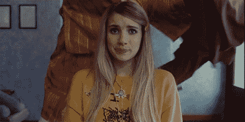

Gif from this [website](https://giphy.com/gifs/love-movie-cute-3TJZLqvhiLzhe/media)

我想用条件对抗网络 实现这篇论文[*的图像到图像翻译已经很久了，现在我终于有机会这样做了。*](https://arxiv.org/pdf/1611.07004.pdf)

此外，我们将使用来自“[显著对象分割的秘密](http://cbi.gatech.edu/salobj/)的二进制掩码数据集，更具体地说，我将使用来自 pascal 数据集的图像。

Paper from this [website](https://arxiv.org/pdf/1611.07004.pdf)

**数据集**

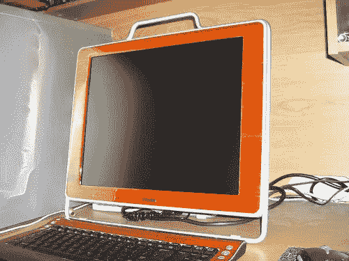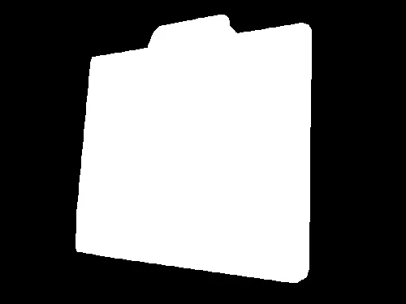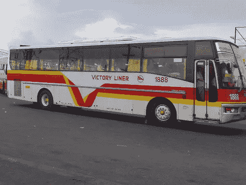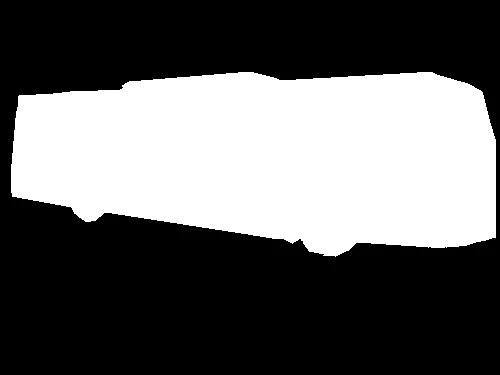

**左图像** →全彩色图像
**右图像** →分割蒙版

因此，数据集由两种类型的图像组成，全色图像和分割掩模。我们将为网络提供分段掩码，希望它能够生成全色图像。也请注意，有几个类别的图像。(例如，有图像的人，公共汽车，飞机等…..)

**网络层(单层)**

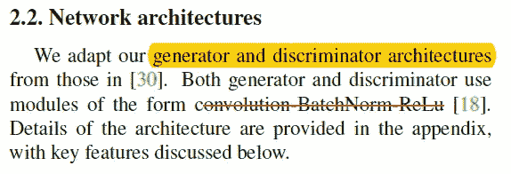

**红线** →每一层是如何组成的它是由卷积批量归一化最后 Relu()

从上图中我们已经可以看到，这个网络的每一层都由三个操作组成，当在 Tensorflow 中实现时，它看起来像下面这样。

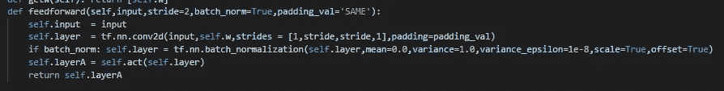

批规范化之所以有 if 条件，是因为生成器的第一层没有批规范化层。

**发电机网络架构(全网)**

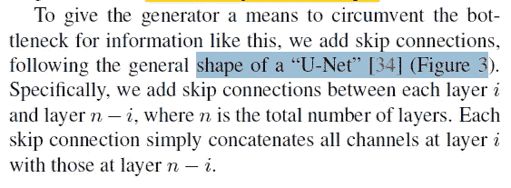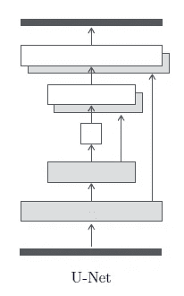

蓝色下划线→发电机网络架构

如上所述，网络的生成器部分与 U-Net 架构非常相似，如果有人感兴趣，我在这里写了一篇关于 [U-Net 的博文，请查看。](/medical-image-segmentation-part-1-unet-convolutional-networks-with-interactive-code-70f0f17f46c6)

网络的解码器部分用转置卷积运算代替卷积运算，当在 Tensorflow 中实现时，它看起来像下面这样。

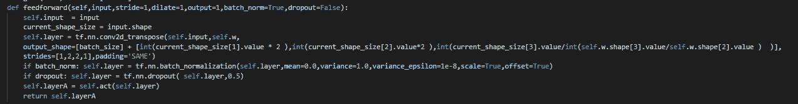

请注意批处理规范化和删除层的 if 条件。所以把编码器部分和解码器放在一起，我们得到如下的东西。

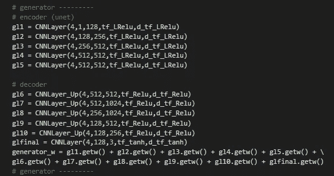

请注意，我们的网络比原始论文中的网络层数少。原始网络具有用于编码器网络和解码器网络的 8 层。然而，在我们上面的网络中，每个解码器和编码器只有 5 层。

**鉴别器网络架构(全网络)**

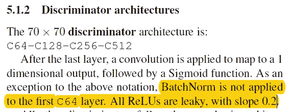

黄线→如上所述，鉴别器网络本身并不难实现。它只是背对背连接的卷积层，(我们也可以称这个网络为全卷积网络。)在 Tensorflow 中实现上述架构时，它看起来会像下面这样。

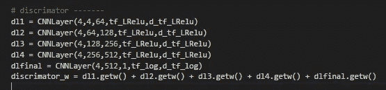

相同的卷积层，我们用于编码器部分，但与泄漏 ReLU()激活函数。

**结果**

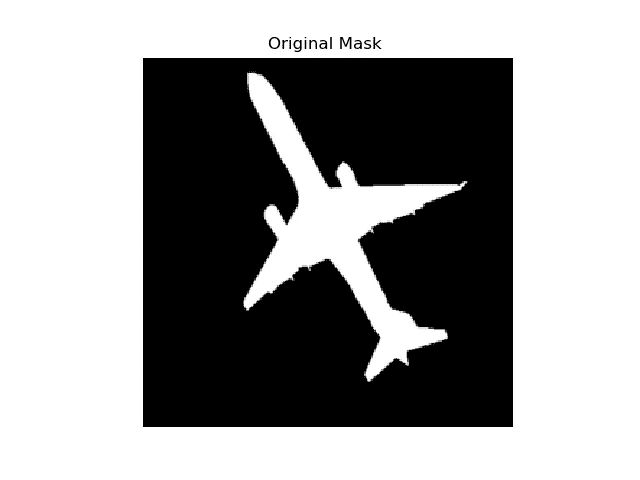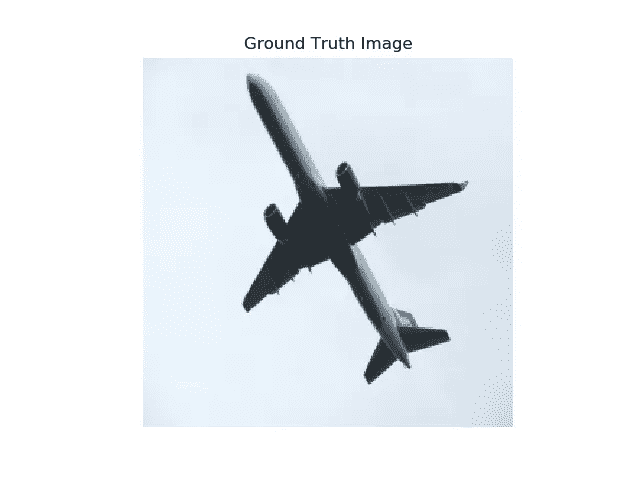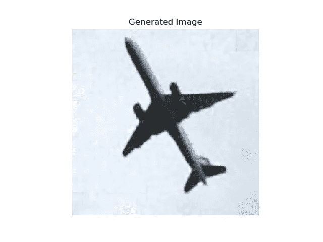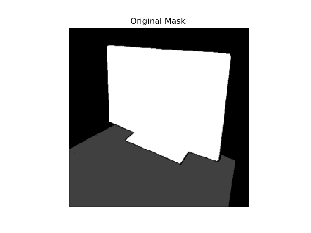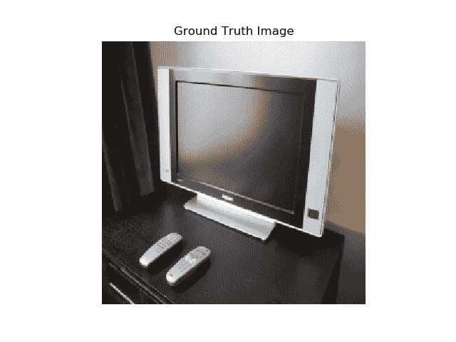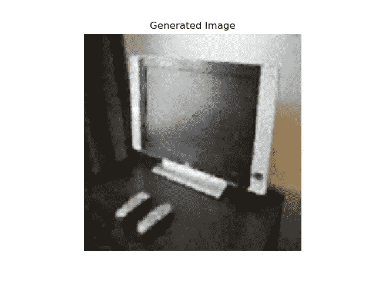

**左图像** →输入图像分割蒙版
中间图像 →地面真实图像，原始图像是什么样子
右图像 →网络生成图像

一些图像看起来不错，当然不是很令人印象深刻，但我仍然能够说出网络中呈现的是什么对象。然而，该网络在其他图像上表现不佳。

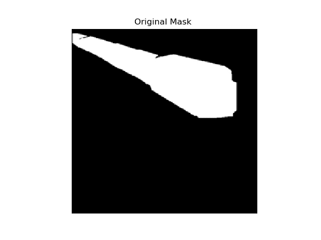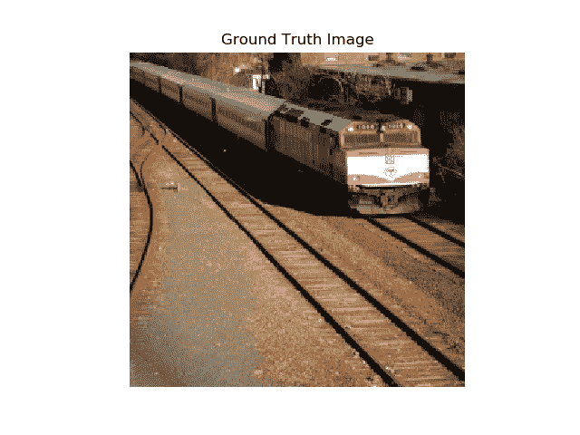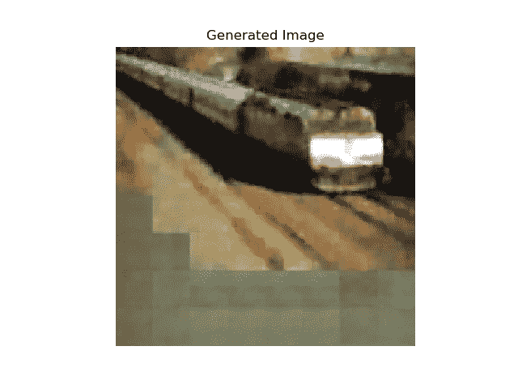

如右图所示，我们可以看到图像的很大一部分没有被填充，只是灰色的方块。这当然不是一个好消息。最后让我们看看生成的 GIF 格式的图像。

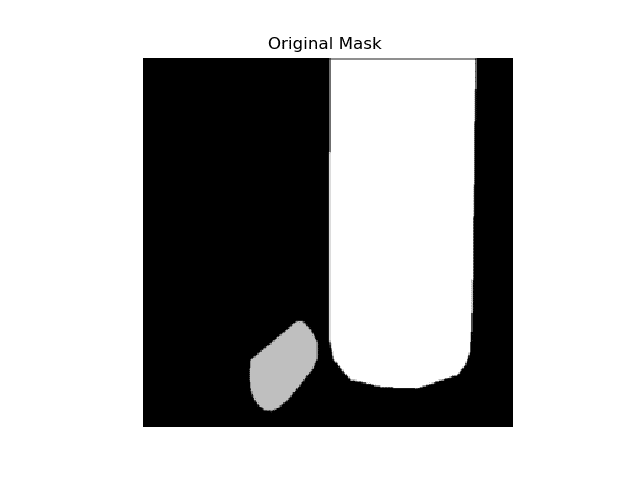

**交互代码**

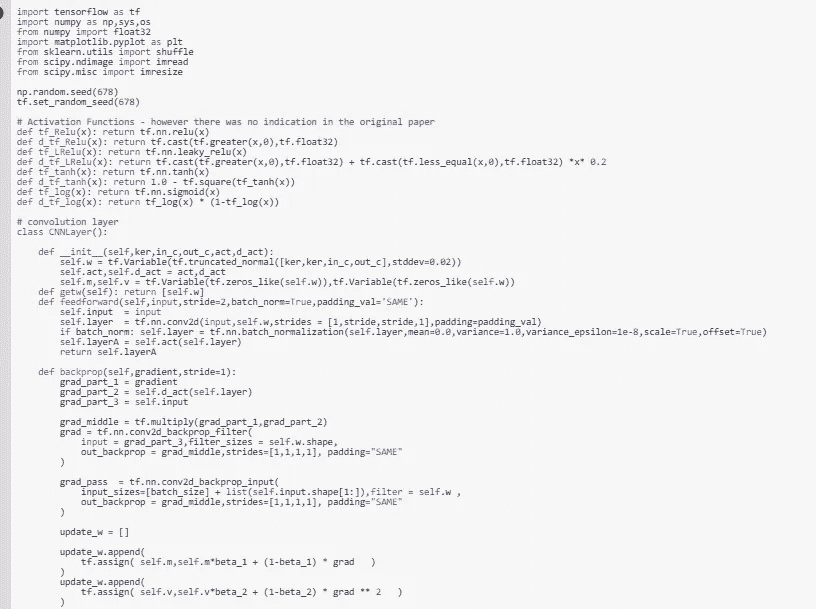

*对于 Google Colab，您需要一个 Google 帐户来查看代码，而且您不能在 Google Colab 中运行只读脚本，因此请在您的操场上创建一个副本。最后，我永远不会请求允许访问你在 Google Drive 上的文件，仅供参考。编码快乐！*

要访问[自动微分的代码，请点击此处。](https://colab.research.google.com/drive/1vmUTjHA66gQroUD6NrYOTirmAFlfmlfl)

**遗言**

对于 Pix2Pix Gan 来说，这是一个很好的实践，下次我将在编码器部分添加更多的层，希望能够生成更清晰的图像。

如果发现任何错误，请发电子邮件到 jae.duk.seo@gmail.com 给我，如果你想看我所有写作的列表，请在这里查看我的网站。

同时，在我的推特[这里](https://twitter.com/JaeDukSeo)关注我，并访问[我的网站](https://jaedukseo.me/)，或我的 [Youtube 频道](https://www.youtube.com/c/JaeDukSeo)了解更多内容。如果你感兴趣的话，我还做了解耦神经网络[的比较。](https://becominghuman.ai/only-numpy-implementing-and-comparing-combination-of-google-brains-decoupled-neural-interfaces-6712e758c1af)

**参考**

1.  tf.nn.leaky_relu | TensorFlow。(2018).张量流。检索于 2018 年 4 月 29 日，来自[https://www.tensorflow.org/api_docs/python/tf/nn/leaky_relu](https://www.tensorflow.org/api_docs/python/tf/nn/leaky_relu)
2.  tf.exp |张量流。(2018).张量流。检索于 2018 年 4 月 29 日，来自 https://www.tensorflow.org/api_docs/python/tf/exp
3.  乙状结肠的导数。(2018).Ai.mit.edu。检索于 2018 年 4 月 29 日，来自[http://www . ai . MIT . edu/courses/6.892/lecture 8-html/SLD 015 . htm](http://www.ai.mit.edu/courses/6.892/lecture8-html/sld015.htm)
4.  affini layer/pix 2 pix-tensor flow。(2018).GitHub。检索于 2018 年 4 月 29 日，来自[https://github . com/affini layer/pix 2 pix-tensor flow/blob/master/pix 2 pix . py](https://github.com/affinelayer/pix2pix-tensorflow/blob/master/pix2pix.py)
5.  phillipi/pix2pix。(2018).GitHub。检索于 2018 年 4 月 29 日，来自[https://github.com/phillipi/pix2pix](https://github.com/phillipi/pix2pix)
6.  医学图像分割[第 1 部分] — UNet:交互式编码卷积网络。(2018).走向数据科学。检索于 2018 年 5 月 1 日，来自[https://towards data science . com/medical-image-segmentation-part-1-unet-convolutionary-networks-with-interactive-code-70f 0 f 17 f 46 c 6](/medical-image-segmentation-part-1-unet-convolutional-networks-with-interactive-code-70f0f17f46c6)
7.  设计，R. (2018)。显著对象分割的秘密。Cbi.gatech.edu。于 2018 年 5 月 1 日检索，来自[http://cbi.gatech.edu/salobj/](http://cbi.gatech.edu/salobj/)