# 用熊猫生成产品使用数据

> 原文：<https://towardsdatascience.com/generating-product-usage-data-from-scratch-with-pandas-319487590c6d?source=collection_archive---------3----------------------->

## 我们如何近似高级用户行为？

Source: Pixabay

洞察我们产品的行为使用是至关重要的，因为它不仅表明我们如何获得用户，而且还能留住他们。这是一种确定**问题答案的方法，有多少用户真正在使用我们的产品？**它通常被称为重要指标(OMTM)，帮助我们抵制使用虚荣指标来量化业务增长的诱惑。更多关于 OMTM 和产品成长的[在这里](https://medium.com/@joshelman/the-only-metric-that-matters-ab24a585b5ea/)和[在这里](https://www.amazon.com/Lean-Analytics-Better-Startup-Faster/dp/1449335675)。

虽然我通常更喜欢探索现有的数据集，但这次我采用了一种不同的方法，试图从头开始逼近一个真实的数据集。

有两个主要原因:

*   **对行为数据的更深入理解**。正如从头开始编写一个算法来理解它的运动部分是有价值的一样，我相信数据集也是如此。这是在回答**的问题“我如何才能估算出产品的使用情况？”我们的行为模型中肯定会有一些简化但必要的假设。**
*   探索熊猫，了解如何更好地建立数据模型，因为**有效的数据操作可以大大加快数据科学工作流程**以更深入地了解您想要探索的数据。

我们的目标是为 1000 个用户生成一个数据集，其中每个用户都存储有一个可能使用 20 个月的设备 uuid。正如我们将在后面看到的，模拟数据很好地收敛到预期值。我们添加了两个过程来更接近真实数据集:

*   **定义用户群组(用户首次使用产品时)**
*   **定义用户流失(用户上次使用产品的时间)**

这使我们能够更准确地表示我们可能在公司工作的数据集。

# 决赛成绩

我们希望最终数据集包括设备所有月份的活动数据:

*   **数字(使用)特性**:用户在那个月使用了多少特性(当用户不活跃时，我们删除条目)
*   **分类特征**:根据设备定义(如平台、国家)

为了简化模型，每个设备的数据仅针对使用特征而变化，而对于分类特征而言是静态的。

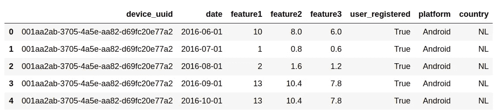

Preview of the final dataset

最终数据集看起来像是我们从两个表中查询我们业务的关系数据库(例如 MySQL、PostgreSQL)得到的东西，一个包含用户的表(包含分类特征)，另一个包含所有事件(包含使用特征)。然后，我们将在 device_uuid(两个表中的主键)上连接两个表，并得出如下所示的结果。每个公司的数据基础设施明显不同，但这是我们可能达到这一点的方式之一。

本文将只关注生成数据，但稍后我们可以使用它来产生群组分析，例如，用户保留曲线，这在本文中没有涉及，但将在接下来的文章中探讨:

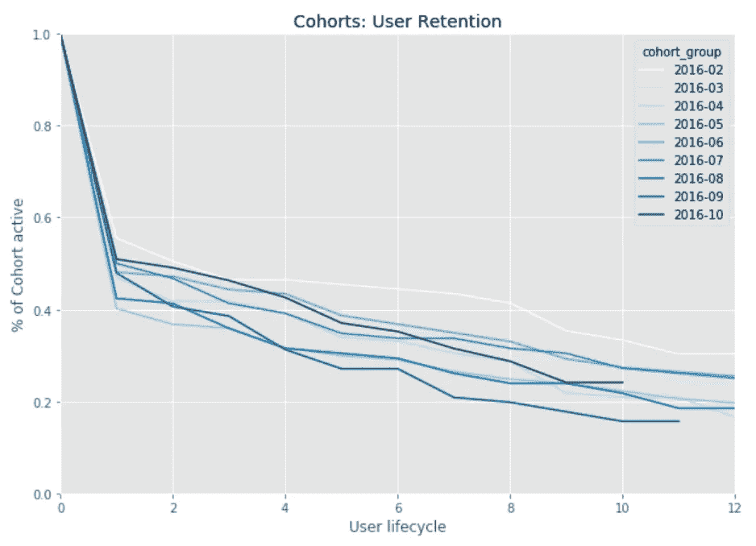

User retention plot based on the final data frame

我们什么时候会失去大部分用户？在上一个产品版本中，我们的入职流程的变化是否提高了员工保留率？我们不同细分用户的留存有区别吗？通过这种分析，我们可以回答不同类型的问题，从而更好地了解我们的用户如何使用产品。

你可以在这里找到本帖[中使用的所有代码的笔记本。](https://github.com/josolnik/behavioral-data-playground-projects/blob/master/Generating%20product%20usage%20data%20from%20scratch%20with%20Pandas/Generating%20product%20usage%20data%20from%20scratch%20with%20Pandas.ipynb)

# **1。定义主要参数**

我们首先导入所有必要的依赖项，并定义上面提到的主要参数(1000 台设备，20 个月，从 2016 年 1 月开始)。

Importing the dependencies

# 2.生成设备 uuids 并将其与日期时间数据相结合

**生成设备 uuid**

Generating device uuids

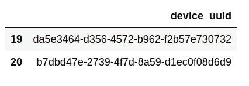

An example oof two device uuids

设备 uuids 是用户使用的每个设备的唯一标识符。

**生成日期时间**

Generating datetime

*输出:*

*(' 2016–01–01 00:00:00 '，' 2017–08–01 00:00:00 ')*

我们可以看到，使用指定的参数(起始月，月数)，我们将生成 2016 年 1 月到 2017 年 8 月的数据。

Adding datetime

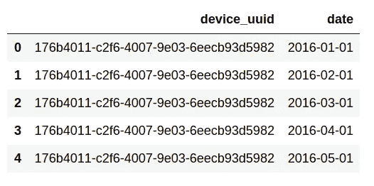

Adding datetime data

我们得到一个包含两列的数据帧，device_uuid 和 date。有 1000 * 20 行(设备 uuids 数*周期数)。

# 3.生成使用特征

在我们的数据帧包括设备 uuid 和日期时间数据之后，我们接下来生成描述产品用途的特性。

我们要做的第一件事是定义:

*   **我们希望生成的使用特征数量**
*   **用户使用每项功能的频率相对于其他功能的比率**

虽然特性的数量是不言自明的，但是特性比率需要一些进一步的解释。

我们将特征的数量设置为 3，比率为 0.8，这意味着第一个特征将采用随机生成的数字并乘以 1(保持不变)。这就是比例的来源。**第二个特征是第一个特征的 0.8 倍。第三个特征的使用是第二个特征的 0.8 倍。**

这意味着如果第一个特性被使用 10 次，第二个特性被使用 8 次，第三个特性被使用 6 次。这只是一种简单的方法，可以避免所有的使用特性都被用在相同的程度上。在这种情况下，特征 1 对应于产品的核心特征。这当然是完全任意选择的。

这种调整产生了以类似方式一致使用的特性，就像真实产品一样。这里有一个很强的假设，即**的使用是同质的，因此所有用户都以相同的比例使用特性**，这对我们的使用来说已经足够了。

# **3.1。计算特征比率**

然后我们应用上面定义的比率。

Calculate feature ratios

*输出:*

*每个特征的比率:{ '特征 1': 1.0，'特征 2': 0.8，'特征 3': 0.6}*

# **3。2.将群组分配给设备**

现在，我们选择任意数量的群组，并将每个设备分配给特定群组。每个群组对应于用户开始使用产品的日期时间(在我们的例子中是月)。**在我们的数据**中，群组的数量等于所有月数的一半。在这种情况下，它是 20 / 2 = 10 个群组。1000 个用户意味着每个群组大约有 100 个用户。

Assigning cohort groups to devices

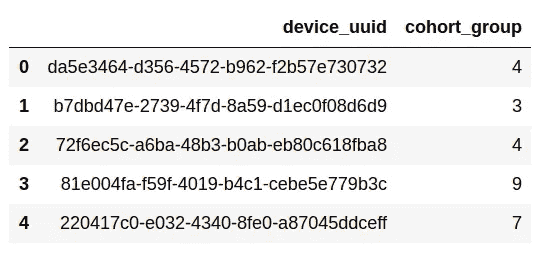

Cohort per device uuid

# 3.3.添加群组数据

首先，我们定义一个函数，将一系列数据帧连接成一个数据帧。我们将在获得一系列数据帧的输出时使用它，每个数据帧代表特定设备的数据:

Concatenate series of dataframes into one dataframe

然后，我们定义一个函数，并将指定的群组添加到主数据框架中:

Adding cohorts to the main dataframe

接下来，我们使用两个函数来添加群组:

Applying both functions to all devices

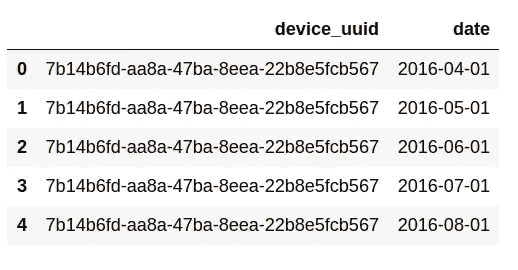

Adding cohort data

**正如我们在上面第一个用户的例子中看到的，我们将他们的群组定义为 2016 年 4 月，因此他们是在那时开始使用产品的。**我们删除了他们前 3 个月的数据来模拟这种情况。

An average number of months per device

*输出:*

*15*

因为我们给用户分配了群组，所以在这个过程中我们删除了相当多的行。我们可以看到，现在每个用户的平均使用时间从 20 个月下降到了 15 个月。

# 3.4.生成使用数据

这里我们为功能 1 的使用生成一个随机数(0 到 14)。然后，我们根据为功能 1 生成的数量，使用功能比率来计算功能 2 和功能 3 的使用率。

Generating usage data

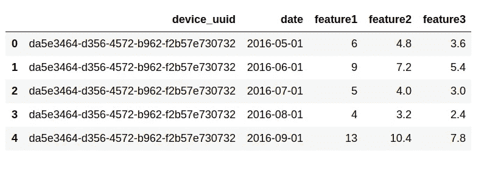

Generating usage data

# 3.5.产生流失行为

**虽然我们通过分配群组定义了使用时间段的下限，但我们将使用流失率定义上限**。当用户停止使用产品时，就会发生流失。

一般来说，我们有两个简化原则，在此基础上，我们决定用户如何使用产品:

*   **搅拌器仍是搅拌器(一个月不使用后，用户不再使用该产品)**
*   **50%的用户在第一个月流失(大约 50%的用户有 1 个月的数据，50%有更多，因此使用时间更长)**

第一个是为了简化模拟，第二个是为了更准确地模拟现实生活中的数据，因为大多数用户通常在尝试产品后就再也不会回来了。

我们定义了模拟流失的函数:

Simulating churn

我们将它应用于我们的数据框架:

Applying the simulating _churn function to all devices

我们有与上一个相同的数据帧结构。现在唯一的区别是，我们删除了模拟用户流失的额外行

An average number of months per device

*输出:*

5

我们可以看到，我们现在有大约 25%的月份是最初为每个用户生成的(5 / 20)。

# 4.生成分类特征

在使用特征之后，我们将定义一些分类特征来丰富我们的数据集。然后，我们将能够根据用户的平台、国家或他们是否注册来细分用户，并尝试找到一些模式。

**注册用户和未注册用户使用产品的方式有所不同吗(如果有，如何使用)?特定国家的用户呢？我们的大部分超级用户位于哪里，他们有什么共同点？**

像这样的洞察力的有益影响可以帮助我们的营销努力瞄准对我们的业务最有利可图的用户(最高 LTV)。更多关于那个[这里](https://www.shopify.com/blog/customer-lifetime-value)。

Defining categorical features

*输出:*

*{ '国家':['NL '，' AU '，' FR']，'平台':['iOS '，' Android']，' user_registered':[False，True]}*

# 4.1.生成分类特征权重

为与单个用户相关联的分类特征出现的可能性定义权重。

Defining weights for categorical features

如果分类变量中有两个可能的变量(例如“Android”和“iOS”)，那么我们预计生成的数据将包含第一个变量的 70%和第二个变量的 30%。

如果分类变量中有三个可能的变量(例如“NL”、“AU”、“FR”)，那么我们期望生成的数据包含第一个变量的 60%、第二个变量的 30%和第三个变量的 10%。

# 4.2.应用分类特征权重

我们创建一个函数来根据定义的参数产生分类特征。

Generating categorical features

接下来，我们应用函数:

Applying the generation of categorical features to all devices

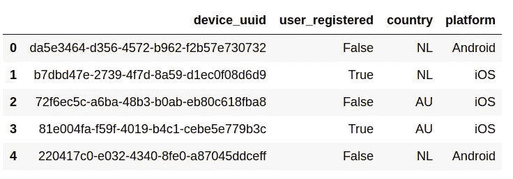

Applying categorical feature weights

每个设备都有自己对应的国家、平台以及是否注册。

# 5.将所有特征合并到最终数据帧中

我们现在有两个数据帧，一个包含日期时间数据和使用特性，另一个包含分类特性。接下来，我们将它们合并成最终的数据帧。

Merging categorical and usage features

然后，我们将该功能应用于所有设备:

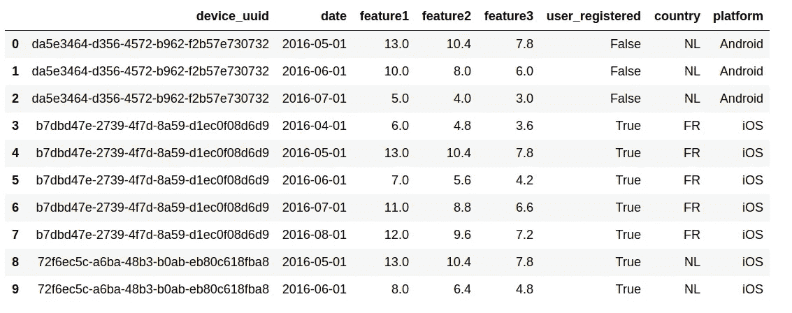

Merging all features

我们可以看到第一台设备(da5e 3464-d356–4572-b962-f2b 57e 730732)于 2016 年 5 月开始使用该产品，使用了三个月，然后被搅动。他们来自荷兰，使用 Android 手机，还没有注册该产品。

# 6.检查最终数据帧中的模拟输出

我们可以检查我们设置的参数是否也体现在最终的数据帧中。

我们是否生成了我们想要的数据？为什么我们能够做到这一点？因为大数定律:从大量试验中得到的结果的平均值应该接近期望值，并且随着更多试验的进行，将趋向于变得更接近)。更多关于大数定律[这里](https://en.wikipedia.org/wiki/Law_of_large_numbers)。

# 6.1.检查使用功能模拟

每项功能的平均使用情况:

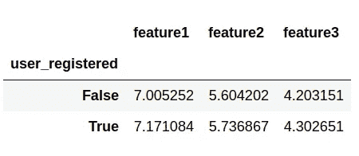

Checking simulating of usage features

注册用户和未注册用户的平均值大致相同。

然后我们检查使用特性的比例(每个特性是前一个特性的 80%)。

Checking proportion feature 1 / feature 2

*输出:*

*功能 1 /功能 2: 79%(预期值为 80%)*

Checking proportion feature 2/ feature 3

*输出:*

*功能 2 /功能 3: 75%(预期值为 80%)*

正如我们在上面的输出中看到的，比例很好地收敛到了期望值。如果我们增加设备的数量，数字会更接近。

# 6.2.检查分类特征模拟

我们用两个可能的变量来检查分类特征的比例。我们已经将具有 2 个可能变量的特征的权重设置为[0.7，0.3]并将 user_registered 设置为[False，True]，因此它具有 2 个可能变量。

**检查注册用户:**

Checking the proportion for user_registered

*输出:*

*32%的用户注册(预期值为 30%)*

**检查国家:**

我们用三种可能的变量来检查分类特征的比例。

Plotting proportion of rows per country

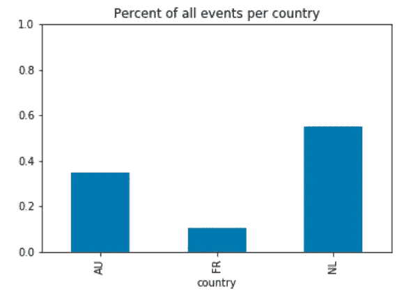

Checking the simulation of the country feature

我们可以在上面的图表中看到每个国家所有事件的百分比。比例接近定义的参数([0.6，0.3，0.1])

# 6.3.检查流失模拟

第一个月有多少流失用户，有多少继续使用产品更长时间？

*输出:*

*m1 搅拌器数量/非 m1 搅拌器数量:489 / 455*

*输出:*

*48%的用户在第一个月流失(预期值为 50%)*

正如预期的那样，大约 50%的用户在第一个月的使用中流失，另外 50%的用户使用产品的时间更长。

# 7.后续步骤

接下来要做的是进一步**处理最终的数据框架，以便更清楚地了解产品中用户的行为模式**。我们可以制作可视化图，如上面的保留曲线来回答一些最关键的业务问题:我们在发展业务方面有多成功？