# 用 LSTM 网络生成新加坡英语文本消息

> 原文：<https://towardsdatascience.com/generating-singlish-text-messages-with-a-lstm-network-7d0fdc4593b6?source=collection_archive---------16----------------------->

在 Medium 上发表了我的第一篇文章后，我意识到从构思一个想法到分享我的发现和学习经验的整个过程是多么令人愉快。我意识到大多数与数据相关的项目和解决方案都源于这两件事——1)我们试图解决的问题 2)我们拥有的数据带来的机遇。由于我之前的帖子是关于[解决社交媒体竞赛中手工工作的问题](/automating-social-media-contests-with-web-scraping-41c55ff6022a)，我想这次我应该先寻找数据。

# 谷歌数据集搜索

谷歌最近发布了[谷歌数据集搜索](https://toolbox.google.com/datasetsearch)，这是一个数据集的谷歌学术，这对我的起步很有帮助。我偶然发现了一个非常有趣的数据集，来自我的学校[，新加坡国立大学短信语料库](https://toolbox.google.com/datasetsearch/search?query=singapore&docid=kqHXm0QYCrFZ229DAAAAAA%3D%3D)。这是一个超过 50，000 条新加坡英语短信的语料库，它是计算机科学系的[研究工作的一部分。这些信息主要来自这项研究的志愿者，他们是在大学就读的新加坡人。](http://scholarbank.nus.edu.sg/handle/10635/137343)

# 理解我们语言的机会

我认为这是一个非常好的机会来学习这些课文的语言，特别是因为我自己是新加坡国立大学的学生，我一直用新加坡英语说话和发短信。对于门外汉来说，新加坡式英语似乎是一种蹩脚的英语，甚至是一种非常粗俗的俚语。尽管看起来缺乏连贯性和语义，但它在新加坡实际上非常普遍。事实上，它经常可以用来立即与新加坡人建立联系和信任。


You can come from all walks of life and despite your race and mother tongue, as long as you’re Singaporean, you will totally get this.

当一个单词可以改变整个信息的意思时，新加坡式英语也很难理解，这也是为什么它是一种非常有效的语言的原因之一。

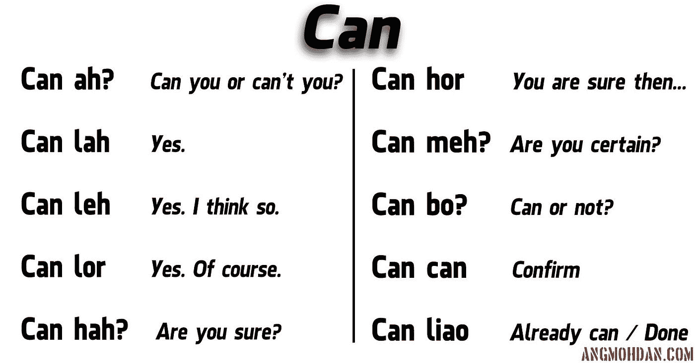

The nuances of Singlish.

短信里的新加坡式英语是另一个层面。除了缺少完整的句子之外，短信和网络语言进一步缩短了句子。

虽然我不是语言学专家，但我认为通过在语料库上训练神经网络来生成类似的文本信息可能有助于理解这一点。我想理解并演示为我们的文本生成选择模型的最终表示的原因。

# 如果不想理解 NNs、RNNs 和 LSTMs，请向下滚动到 Code。

# 前馈神经网络

人工神经网络模拟我们的大脑，并用节点表示神经元。该网络具有接收信息的输入层、处理信息(操作、计算、特征提取)的隐藏层以及基于通常用于进行预测的信息产生期望输出的最终输出层。

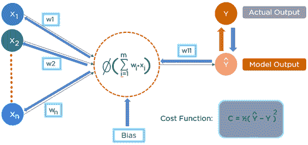

A simplistic representation of a neural net.

预测输出和实际输出可能会有很大差异，这可以通过我们希望最小化的成本函数来衡量。

1.  神经网络就像一个婴儿，他想学习如何正确地说话(模型输出 Yhat)
2.  通过做一套特定的动作，比如说说，…，喊随机的东西(X_1 到 X_n)，
3.  一些比另一些更频繁(W_1 到 W_n)。
4.  他试图通过在脑海中反复尝试不同的行动场景来说出什么是正确的(更新权重)。
5.  他在那个时间点选择的最后一组行动尽可能接近他父母告诉他的是正确的(最小化成本函数 C)。


这就是为什么它是一种监督学习的形式。他头脑中的这种更新/理解过程也被称为反向传播。

前馈神经网络是设计的第一种也是最简单的人工神经网络，它只允许信号从输入传输到输出。它没有时间因素。当谈到文本生成时，我们试图预测给定单词序列的下一个单词，我们需要一个代表*记忆*的模型。

# 递归神经网络

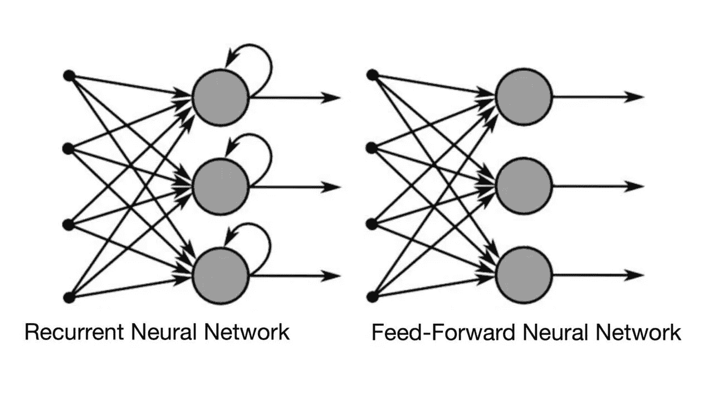

RNN is a type of ANN that has a recurring connection to itself.

这种循环连接有助于 RNN 学习先前输入 X_t-1(向量)以及当前输入 X_t(向量)的效果，同时预测时间 Yhat_t 时的输出。这给了 RNN 时间感。这可以让宝宝从过去被责骂的场景中学习，避免犯同样的错误。

## 让我们想象一个多层香草 RNN

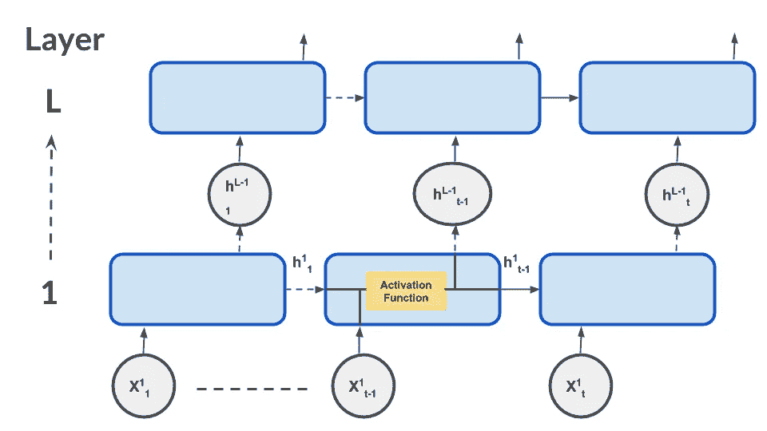

Recurrent Neural Network with L layers. In each layer, the input (a vector) is unrolled into t different states.

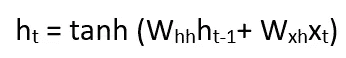

Activation function in each state

状态(蓝色)的每个输出(h)是前一状态(h_t-1)的输出和当前输入向量(X_t)的激活函数。第一层的这些输出 h_1 到 h_t 然后将作为输入馈送到下一层，因为它深入到 RNN 中。

这将允许我们根据句子的上下文来预测下一个单词。

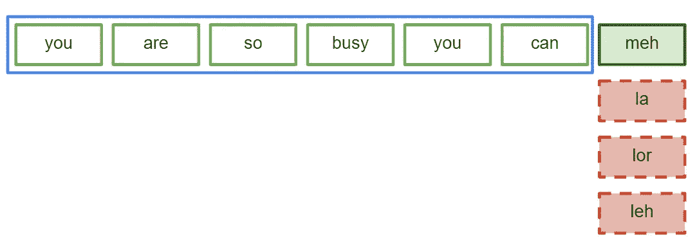

Based on the context of the sentence, we can find the right word “**meh”** to use after “**can”**.

然而，当句子所需的上下文变得非常大时，记住诸如“**so”**之类的单词可能就不那么重要了。不幸的是，随着这种差距的增长，传统的 rnn 变得无法学习连接信息，因为它无法忽略或忘记所有不必要的信息。

# 长短期记忆(LSTM)

LSTM 模型能够表示接受信息**(输入门)**，给出预测值**(输出门)**，遗漏不重要信息**(遗忘门)**的行为。LSTM 在文本生成等序列建模任务中非常流行。与前面的 RNN 图类似，LSTM 网络将使用 LSTM 单元代替节点。

## 让我们设想一个由 LSTM 单元态组成的单层

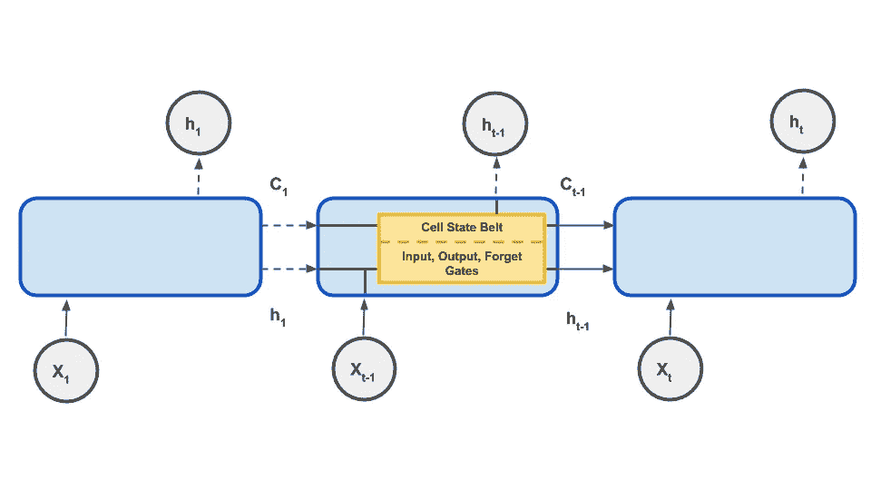

t LSTM cells (blue) in a single layer with num_units of cell units (yellow is 1 cell unit). Each cell unit has 1 Cell State *Belt* and 3 Gates.

LSTM 结构和香草 RNN 结构在外表上非常相似，但主要区别是在单个细胞内。这将有助于我们及时模拟不同的状态，在这些状态下，我们能够输入、输出和忘记信息。

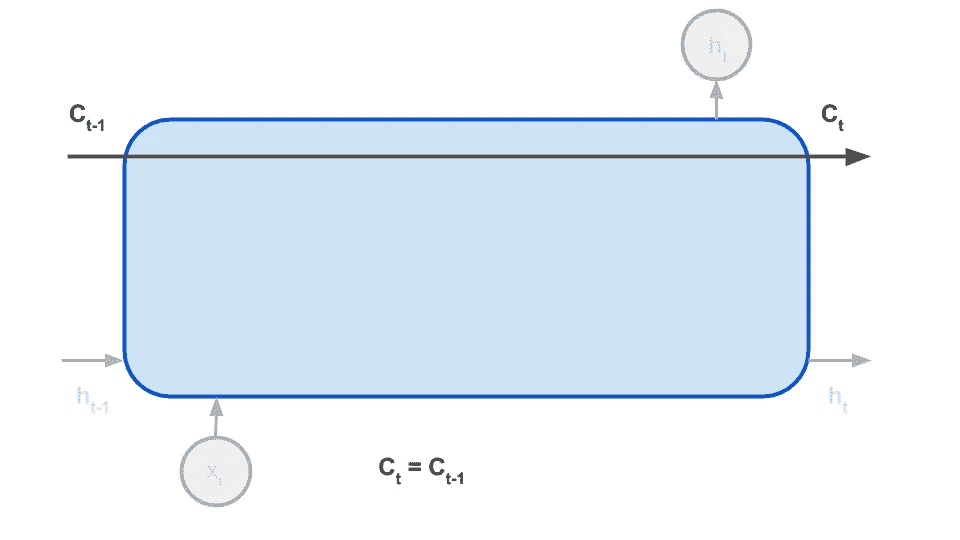

The Cell State Belt allows information to flow from one state to the other.

每个门都有一个 sigmoid 函数，它将返回 0–1 的输出，表示通过门的信息比例。每个门将具有权重函数 W 和 U 以及偏置项 b。

𝞂 **(W*Xt + U*ht-1 + b) = [0，1]**

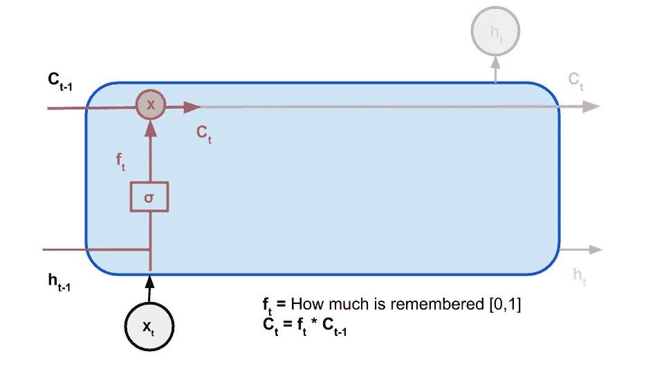

The Forget Gate (in purple) allows the current state to only retain a proportion of information from the previous state.

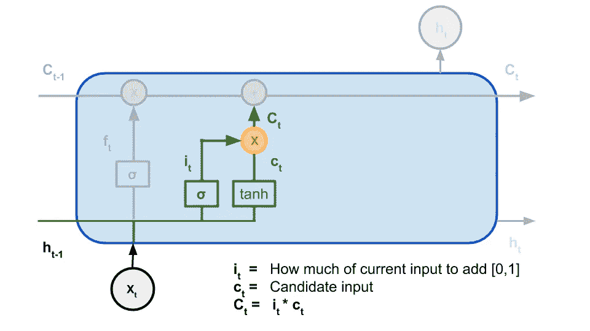

The Input Gate (in green) allows us to decide the proportion of information that should be updated in the current state.

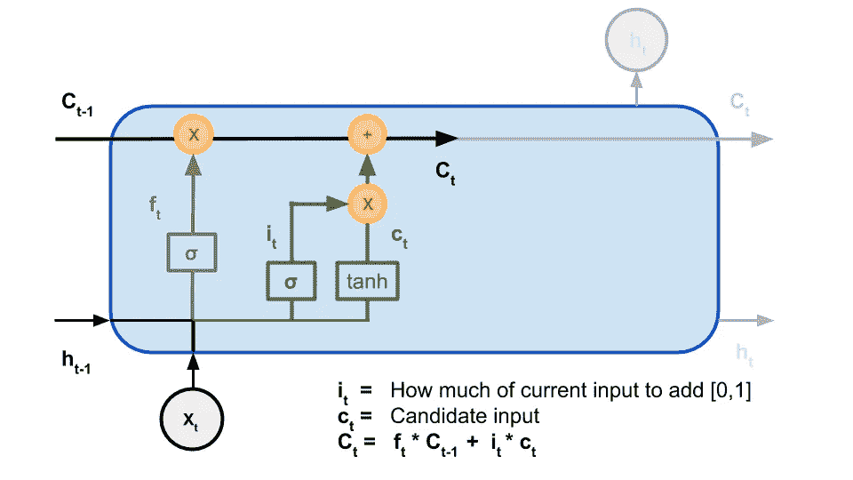

Having both the Forget Gate and Input Gate allows us to both retain past information and update current information in this state.

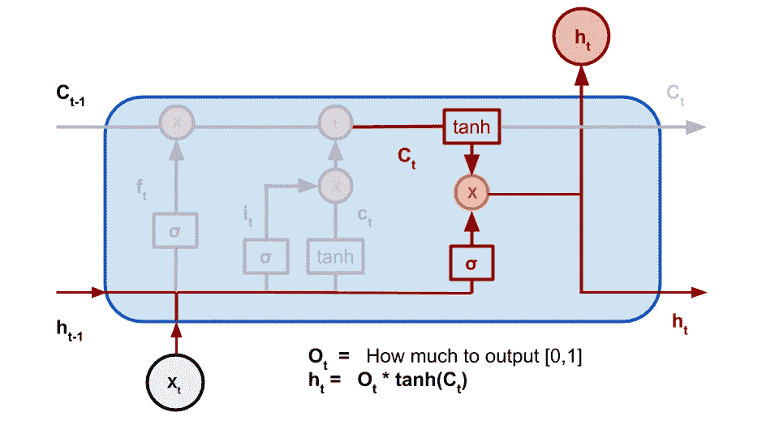

The Output Gate (in red) allows us to decide how much information in the state should finally “release”, giving us the output h_t for that state.

有了对 LSTMs 的一些了解，我们最终可以探索语料库并建立我们的模型。

# 密码

我将使用 Python 3.6 和 Keras 来完成这项任务。首先，我们将解析数据并标记每个文本。

```
Number of Users: 343
Number of Texts: 55835
Sequence Length:  5
```

## 创造词汇

仅取前 1000 条消息后，文本的模态长度为 5，我们将使用它作为序列长度。基本上我们会用一个句子中过去的 4 个单词来预测下一个单词。

```
['just', 'now', 'i', 'heard', 'thunder', 'but', 'e', 'sky', 'still', 'looks', 'ok', 'hee', 'if', 'really', 'rain', 'den', 'i', 'no', 'need', 'to', 'run', 'liao', 'i', 'also', 'lazy', 'but', 'no', 'choice', 'have', 'to', 'force', 'myself', 'to', 'run']
```

上面是一个标记化文本消息的例子。我的模型的缺点是我排除了标点符号，但它也可以以其他方式建模。

We can get the vocabulary of all the texts (unique words).

```
Vocab Size: 1490
Total words 10419
Vocab / Total words ratio: 0.143
```

Next we must encode the words with numbers so that they can be fed into the neural network.

## 用数字表示单词

`tokenizer.word_index`返回一个将单词映射到索引的字典，而`tokenizer.index_word`返回相反的结果。每个单词都用一个索引进行编码，这个索引实际上是在各自的独热向量数组中启动的位置。

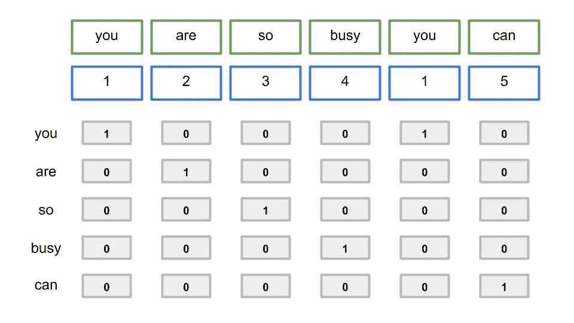

这有助于神经网络理解现在由一个热点向量表示的词汇。然而，这导致一个非常大且稀疏的矩阵，其当前占据了相当于 5×6 个单元的空间，但是当词汇表的大小增加时，它会增长很多。

我们可以使用单词嵌入层将表示映射到指定数量的维度中。实践中推荐的大小(我在网上找到的)是 vocab_size**0.25，但是在下面的例子中，我将使用嵌入大小 3。

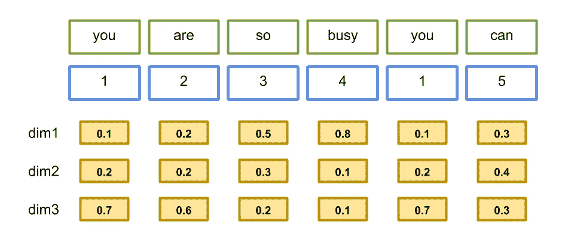

Size is reduced when word embeddings are used. The similarity between words will also be represented based on the distance in the vector space.

## 模型架构

我们可以用一个简单的架构和一个顺序模型—

1.  嵌入层
2.  双向 LSTM 层(学习一个句子的前一个和后一个上下文，这里不赘述)
3.  脱落层(防止过度拟合)
4.  将输出大小映射回 vocab_size 的密集层
5.  使用 Softmax 在词汇表中找到最有可能使用的类别(单词)的激活

## 准备培训数据

随着我们的模型建立和文本编码，下一步是准备序列数据进行训练。

这种多词对多词的上下文帮助我们训练模型，告诉他们哪个单词序列(我们的预测器 X)导致最终的单词(我们的标签 Y)。

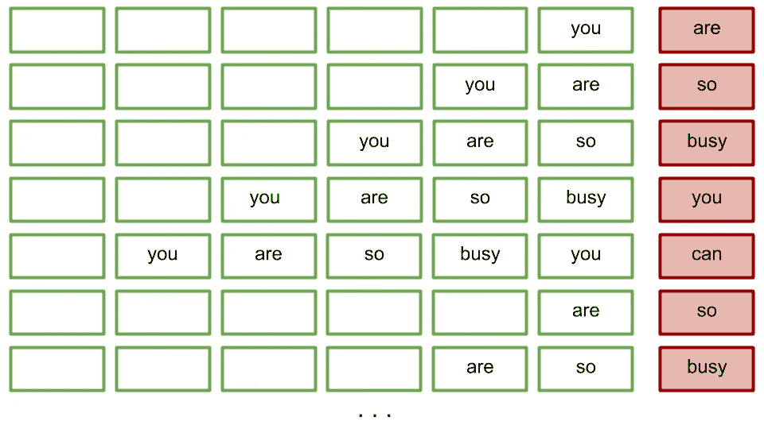

Using the green words as **X** and red word as **Y**

最后，我们将编译并拟合我们的模型，使用—

1.  Adam Optimizer(深度学习流行，易于配置)
2.  稀疏分类交叉熵(多类分类的成本/损失函数，其中目标输出是整数索引而不是一位热编码)
3.  每次精确度提高时，保存最佳权重的模型检查点
4.  当验证准确率连续 4 次没有提高时，提前停止训练。

我们还将把所有对象保存在一个 Pickle 文件中，以便在生成文本时可以重新加载它们。

培训过程看起来会像这样

```
Epoch 39/100
loss: 4.2459 - sparse_categorical_accuracy: 0.2050 - val_loss: 6.4890 - val_sparse_categorical_accuracy: 0.0924
Epoch 00039: sparse_categorical_accuracy improved from 0.20413 to 0.20503, saving model to best_weights.hdf5Epoch 40/100
loss: 4.2390 - sparse_categorical_accuracy: 0.2051 - val_loss: 6.4887 - val_sparse_categorical_accuracy: 0.0935
Epoch 00040: sparse_categorical_accuracy improved from 0.20503 to 0.20513, saving model to best_weights.hdf5
```

最后，我们可以创建一个 generate_text 函数，它接受一个种子句子“i will be ”,将其填充到正确的 sequence_length，并使用它来迭代预测下一个单词。

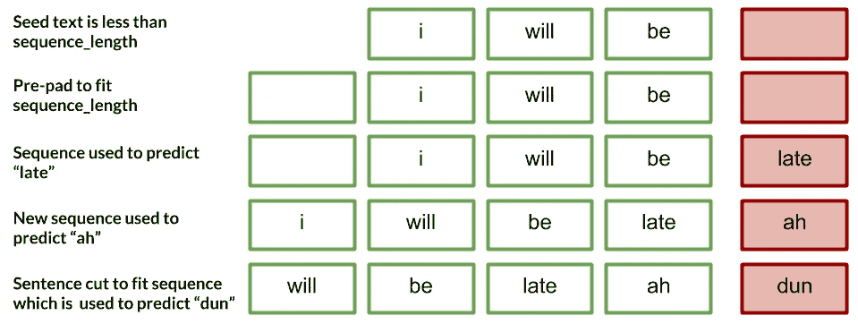

# 工作中的文本生成

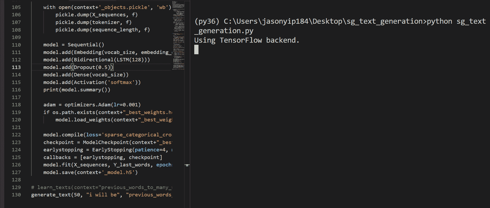

这听起来确实像短信里的新加坡英语！该模型已经设法学习语法，即使拼写不完整，即使文本被迫具有 5 个单词的长度，它也是相当容易理解的。

# 现状核实

出于时间和金钱的考虑，我没有在整个语料库上对网络进行充分的训练。事实上，我只在 1000 条文本上使用它来测试整个流程。验证的准确性非常低，模型当然是过度拟合的。我也没有使用最佳网络结构进行测试，也没有调整任何参数。我也用了 https://www.floydhub.com，但是他们的 GPU 只有 2 个小时空闲。我目前正在等待我的 AWS 学生帐户得到验证，以便我可以在整个语料库上训练模型。然而，我的期末考试快到了，我不能再等了。

然而，这是一个非常有趣的问题，也是一次很好的学习经历。期待回来的时候多学习，多探索，多分享！

[链接到项目的回购](https://github.com/jasonyip184/SGTextGenerationLSTM)

请通过 LinkedIn 或 jasonyip184@gmail.com 与我在[进一步讨论！](http://linkedin.com/in/jasonyip184)

## 参考

[](https://machinelearningmastery.com/develop-word-based-neural-language-models-python-keras/) [## 如何用 Keras 在 Python 中开发基于单词的神经语言模型

### 语言建模包括在已知单词序列的情况下，预测序列中的下一个单词。一个…

machinelearningmastery.com](https://machinelearningmastery.com/develop-word-based-neural-language-models-python-keras/) [](https://www.quora.com/What-is-the-embedding-layer-in-LSTM-long-short-term-memory) [## LSTM(长短期记忆)的嵌入层是什么？

### 回答(第 1 题，共 2 题):如果你考虑如何提供一个单词作为 LSTM 的输入，它基本上是一个网络/模型…

www.quora.com](https://www.quora.com/What-is-the-embedding-layer-in-LSTM-long-short-term-memory) [](https://medium.com/@david.campion/text-generation-using-bidirectional-lstm-and-doc2vec-models-1-3-8979eb65cb3a) [## 使用双向 LSTM 和 Doc2Vec 模型 1/3 生成文本

### 本文的目的是讨论文本生成，使用机器学习的方法，特别是…

medium.com](https://medium.com/@david.campion/text-generation-using-bidirectional-lstm-and-doc2vec-models-1-3-8979eb65cb3a) [](https://www.analyticsvidhya.com/blog/2017/12/fundamentals-of-deep-learning-introduction-to-lstm/) [## 深度学习精要:长短期记忆导论

### 引言序列预测问题由来已久。他们被认为是最难的…

www.analyticsvidhya.com](https://www.analyticsvidhya.com/blog/2017/12/fundamentals-of-deep-learning-introduction-to-lstm/) [](https://vishnuviswanath.com/ann_rnn_lstm.html) [## 深度学习-安，RNN，LSTM 网络

### 长短期记忆(LSTM)模型是一种有监督的深度神经网络，非常适合处理时间序列问题

vishnuviswanath.com](https://vishnuviswanath.com/ann_rnn_lstm.html)