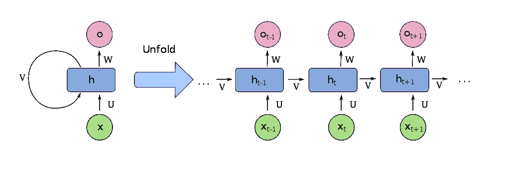

# 使用递归神经网络生成文本

> 原文：<https://towardsdatascience.com/generating-text-using-a-recurrent-neural-network-1c3bfee27a5e?source=collection_archive---------5----------------------->


Figure 1: person writing on paper by [rawpixel](https://unsplash.com/@rawpixel?utm_source=medium&utm_medium=referral) on [Unsplash](https://unsplash.com?utm_source=medium&utm_medium=referral)

## 如何使用 Keras 创建亚瑟·柯南·道尔风格的文本

深度学习可以用于许多有趣的事情，但通常它可能会觉得只有最聪明的工程师才能创建这样的应用程序。但这根本不是真的。

通过 [Keras](https://keras.io/) 和其他高级深度学习库，每个人都可以创建和使用深度学习模型，无论他对理论和算法内部工作的理解如何。

在本文中，我们将看看如何使用递归神经网络来创建亚瑟·柯南·道尔爵士风格的新文本，使用他的书“夏洛克·福尔摩斯的冒险”作为我们的数据集。

我们可以从[古腾堡网站](http://www.gutenberg.org/cache/epub/1661/pg1661.txt)获得数据。我们只需要将其保存为文本(。txt)文件并删除文本中嵌入的 Gutenberg 页眉和页脚。如果你不想自己做这些，你可以从[我的 Github](https://github.com/TannerGilbert/Tutorials/blob/master/Keras-Tutorials/4.%20LSTM%20Text%20Generation/Keras%20LSTM%20Text%20Generation.ipynb) 获得本文的文本和所有代码。

# 递归神经网络



Figure 2: Unfold RNN by [François Deloche](https://commons.wikimedia.org/w/index.php?curid=60109157)

递归神经网络(RNN)是用于顺序数据的最先进的算法。这是因为它们可以通过内部记忆记住以前的输入。

在本文中，我不会深入探讨递归神经网络是如何工作的，但如果你感兴趣，你可以查看我的视频[解释 RNN 是如何工作的，或者你可以查看](https://www.youtube.com/watch?v=2GHcSDDZYGg)[Suvro baner JEE](https://medium.com/explore-artificial-intelligence/an-introduction-to-recurrent-neural-networks-72c97bf0912)的这篇伟大文章。

# 创建我们的数据集

像往常一样，我们将开始创建我们的数据集。为了能够在 RNN 中使用文本数据，我们需要将其转换为数值。然后，我们将创建一个字符序列作为我们的 X 数据，并使用下面的字符作为我们的 Y 值。最后，我们将把数据转换成一个布尔数组。

首先，我们将加载数据，并创建从字符到整数和整数到字符的映射:

```
with open('sherlock_homes.txt', 'r') as file:
    text = file.read().lower()
print('text length', len(text))chars = sorted(list(set(text))) # getting all unique chars
print('total chars: ', len(chars))char_indices = dict((c, i) for i, c in enumerate(chars))
indices_char = dict((i, c) for i, c in enumerate(chars))
```

为了获得有价值的数据，我们可以用它来训练我们的模型，我们将把我们的数据分成长度为 40 个字符的子序列。然后我们将把数据转换成一个布尔数组。

```
maxlen = 40
step = 3
sentences = []
next_chars = []
for i in range(0, len(text) - maxlen, step):
    sentences.append(text[i: i + maxlen])
    next_chars.append(text[i + maxlen])x = np.zeros((len(sentences), maxlen, len(chars)), dtype=np.bool)
y = np.zeros((len(sentences), len(chars)), dtype=np.bool)
for i, sentence in enumerate(sentences):
    for t, char in enumerate(sentence):
        x[i, t, char_indices[char]] = 1
    y[i, char_indices[next_chars[i]]] = 1
```

# 递归神经网络模型

虽然创建一个 RNN 听起来很复杂，但是使用 [Keras](https://keras.io/) 实现起来非常容易。我们将创建一个简单的 RNN，其结构如下:

1.  **LSTM 层:**将学习序列
2.  **密集(全连接)层:**每个独特字符一个输出神经元
3.  **Softmax 激活:**将输出转换为概率值

我们将使用 [RMSprop](https://keras.io/optimizers/#rmsprop) 优化器和[分类交叉熵](https://keras.io/losses/#categorical_crossentropy)损失函数。

```
from keras.models import Sequential
from keras.layers import Dense, Activation
from keras.layers import LSTM
from keras.optimizers import RMSpropmodel = Sequential()
model.add(LSTM(128, input_shape=(maxlen, len(chars))))
model.add(Dense(len(chars)))
model.add(Activation('softmax'))optimizer = RMSprop(lr=0.01)
model.compile(loss='categorical_crossentropy', optimizer=optimizer)
```

# 助手功能

为了看到我们的模型在训练时的改进，我们将创建两个辅助函数。这两个函数来自 Keras 团队的[官方 LSTM 文本生成示例](https://github.com/keras-team/keras/blob/master/examples/lstm_text_generation.py)。

第一个辅助函数将从输出(概率数组)中抽取一个索引。它有一个名为 temperature 的参数，这个参数定义了函数在创建文本时的自由度。第二个将在每个时期结束时生成具有四个不同温度的文本，以便我们可以看到我们的模型做得如何。

```
def sample(preds, temperature=1.0):
    # helper function to sample an index from a probability array
    preds = np.asarray(preds).astype('float64')
    preds = np.log(preds) / temperature
    exp_preds = np.exp(preds)
    preds = exp_preds / np.sum(exp_preds)
    probas = np.random.multinomial(1, preds, 1)
    return np.argmax(probas)def on_epoch_end(epoch, logs):
    # Function invoked at end of each epoch. Prints generated text.
    print()
    print('----- Generating text after Epoch: %d' % epoch)

    start_index = random.randint(0, len(text) - maxlen - 1)
    for diversity in [0.2, 0.5, 1.0, 1.2]:
        print('----- diversity:', diversity)

        generated = ''
        sentence = text[start_index: start_index + maxlen]
        generated += sentence
        print('----- Generating with seed: "' + sentence + '"')
        sys.stdout.write(generated)

        for i in range(400):
            x_pred = np.zeros((1, maxlen, len(chars)))
            for t, char in enumerate(sentence):
                x_pred[0, t, char_indices[char]] = 1.

            preds = model.predict(x_pred, verbose=0)[0]
            next_index = sample(preds, diversity)
            next_char = indices_char[next_index]

            generated += next_char
            sentence = sentence[1:] + next_char

            sys.stdout.write(next_char)
            sys.stdout.flush()
        print()
print_callback = LambdaCallback(on_epoch_end=on_epoch_end)
```

我们还将定义另外两个回调函数。第一个名为 *ModelCheckpoint。这将节省我们的模型每一个时代的损失减少。*

```
from keras.callbacks import ModelCheckpoint

filepath = "weights.hdf5"
checkpoint = ModelCheckpoint(filepath, monitor='loss',
                             verbose=1, save_best_only=True,
                             mode='min')
```

另一个回调会在每次学习停滞时降低学习速度。

```
rom keras.callbacks import ReduceLROnPlateau
reduce_lr = ReduceLROnPlateau(monitor='loss', factor=0.2,
                              patience=1, min_lr=0.001)callbacks = [print_callback, checkpoint, reduce_lr]
```

# 训练模型并生成新文本

对于训练，我们需要选择一个 batch_size 和我们想要训练的时期数。对于 batch_size，我选择 128，这只是一个任意的数字。我只训练了 5 个时期的模型，所以我不需要等这么久，但如果你想你可以训练它更多。

```
model.fit(x, y, batch_size=128, epochs=5, callbacks=callbacks)
```

培训产出:

```
Epoch 1/5
187271/187271 [==============================] - 225s 1ms/step - loss: 1.9731----- Generating text after Epoch: 0
----- diversity: 0.2
----- Generating with seed: "lge
on the right side of his top-hat to "
lge
on the right side of his top-hat to he wise as the bore with the stor and string that i was a bile that i was a contion with the man with the hadd and the striet with the striet in the stries in the struttle and the striet with the strange with the man with the struttle with the stratter with the striet with the street with the striet which when she with the strunt of the stright of my stright of the string that i shall had been whi
----- diversity: 0.5
----- Generating with seed: "lge
on the right side of his top-hat to "
lge
on the right side of his top-hat to he had putting the stratce, and that is street in the striet man would not the stepe which we had been of the strude
in our in my step withinst in some with the hudied that in had a had become and the corted to a give with his right with a comon was and confice my could to my sule i was and shugher. i little which a sitter and the site my dippene with a chair drive to be but the some his site with
```

为了自己生成文本，我们将创建一个类似于 on_epoch_end 函数的函数。它将采用一个随机的起始索引，从文本中取出接下来的 40 个字符，然后用它们来进行预测。作为参数，我们将传递给它我们想要生成的文本的长度和生成的文本的多样性。

```
def generate_text(length, diversity):
    # Get random starting text
    start_index = random.randint(0, len(text) - maxlen - 1)
    generated = ''
    sentence = text[start_index: start_index + maxlen]
    generated += sentence
    for i in range(length):
            x_pred = np.zeros((1, maxlen, len(chars)))
            for t, char in enumerate(sentence):
                x_pred[0, t, char_indices[char]] = 1.

            preds = model.predict(x_pred, verbose=0)[0]
            next_index = sample(preds, diversity)
            next_char = indices_char[next_index]

            generated += next_char
            sentence = sentence[1:] + next_char
    return generated
```

现在我们可以通过调用 generate_text 函数来创建文本:

```
print(generate_text(500, 0.2)
```

生成的文本:

```
of something akin to fear had begun
to be a sount of his door and a man in the man of the compants and the commins of the compants of the street. i could he could he married him to be a man which i had a sound of the compant and a street in the compants of the companion, and the country of the little to come and the companion and looked at the street. i have a man which i shall be a man of the comminstance to a some of the man which i could he said to the house of the commins and the man of street in the country and a sound and the c
```

# 结论

递归神经网络是一种处理顺序数据的技术，因为它们可以通过内部存储器记住最后的输入。它们在几乎每一个顺序问题上都达到了最先进的性能，并被大多数大公司所采用。RNN 可用于以特定作者的风格生成文本。

创建文本生成 RNN 的步骤如下:

1.  创建或收集数据集
2.  建立 RNN 模式
3.  以一个随机的句子为起点创建新的文本

这个项目的细节可以在[这里](https://github.com/TannerGilbert/Keras-Tutorials/tree/master/4.%20LSTM%20Text%20Generation)找到。我鼓励任何人试验一下代码，也许可以改变数据集和预处理步骤，看看会发生什么。

为了获得更好的输出，您还可以对模型进行许多改进。其中一些是:

1.  使用更复杂的网络结构(更多 LSTM 层、密集层)
2.  为更多时代而训练
3.  摆弄批处理大小

如果你喜欢这篇文章，可以考虑订阅我的 [Youtube 频道](https://www.youtube.com/channel/UCBOKpYBjPe2kD8FSvGRhJwA)，在社交媒体上关注我。

如果你有任何问题或批评，可以通过[推特](https://twitter.com/Tanner__Gilbert)或评论区联系我。