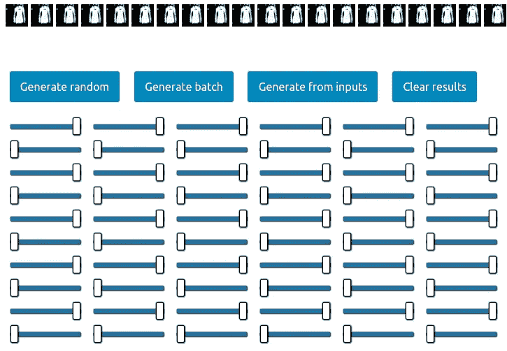

# 只需一次点击，即可打造您自己的时尚系列

> 原文：<https://towardsdatascience.com/generating-your-own-fashion-line-in-1-click-a8155c0c207?source=collection_archive---------12----------------------->

我想分享一下我上周在做的一个玩具项目——时尚发电机。为什么？因为甘人很棒，正如扬·勒村所说:

> 对抗训练是自切片面包以来最酷的事情

这种生成网络通过 GPU 加速在你的浏览器中工作。现场演示在这里— [时尚甘](http://cognitivechaos.com/playground/fashion-gan/)，源代码在这里— [github](https://github.com/EgorDezhic/fashion-generator) 。也许通过调整输入足够长的时间，你将创造一个新的著名的时装系列(可能性很低，但无论如何，如果发生这种情况，请给我发电子邮件)。

## 时尚甘食谱

首先，我们需要[时尚 mnist 数据集](https://github.com/zalandoresearch/fashion-mnist)，这是疲惫的 mnist 的一个很好的替代品。它采用相同的包装，可作为替代产品使用。还有 10 类:t 恤/上衣、裤子、套头衫、连衣裙、大衣、凉鞋、衬衫、运动鞋、包和踝靴，这些有时很难辨别，尤其是套头衫和大衣。

然后，我们需要一些框架:Tensorflow 来训练模型，以及 [deeplearnjs](https://github.com/PAIR-code/deeplearnjs) 在带有 GPU 加速的浏览器中运行。关于 TF 部分没什么可说的，除了 [YellowFin](https://github.com/JianGoForIt/YellowFin) ，我加这个是因为我喜欢自调优器的想法。关于 deeplearnjs:它是一个完整的 js 框架，用类似 tensorflow 的 API 对 ML 模型(或任何线性代数)进行训练和推理。我很难想象在浏览器中训练神经网络的真实场景，但它可能对客户端推理有用。尽管如此，它仍处于早期测试阶段。

接下来是模型。我从这个[回购](https://github.com/hwalsuklee/tensorflow-generative-model-collections)里拿了原来的 GAN，稍微修改了一下。发电机的结构:

**z**>(**FC**>**BN**>**ReLU**)* 3>**de conv**>**BN**>**ReLU**>**de conv**>**乙状结肠** > **图像**

**FC —全连接，BN —批量归一化，DeConv —转置卷积(“反卷积”)*

在 gtx770 上进行了几个小时的培训后，我准备将大约 27mb 的权重移植到 dl.js 中。最后一步是使用数学运算重新创建这个架构(因为 dl.js 中的 graph API 目前缺乏转置卷积),并编写一个简单的 UI:输入控件和一些按钮。菜做好了！

我忍不住一遍又一遍地看这个视频:

*最初发表于* [*认知混乱*](http://cognitivechaos.com/fashion-generator/) *。*