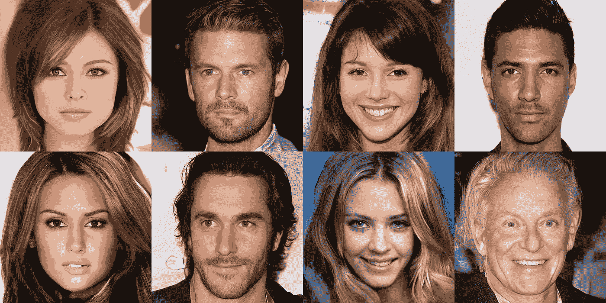
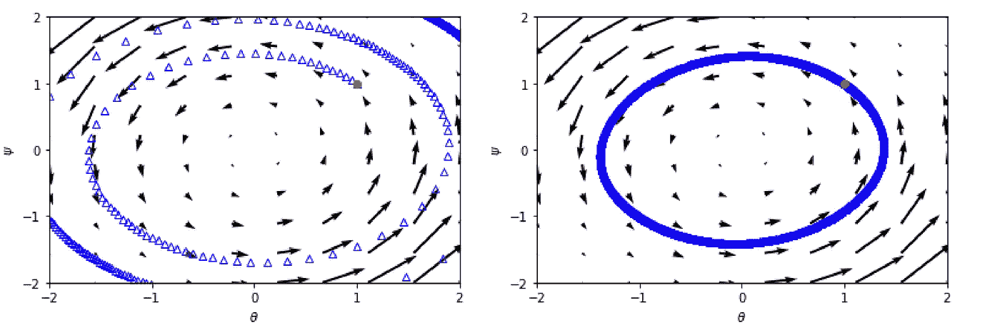
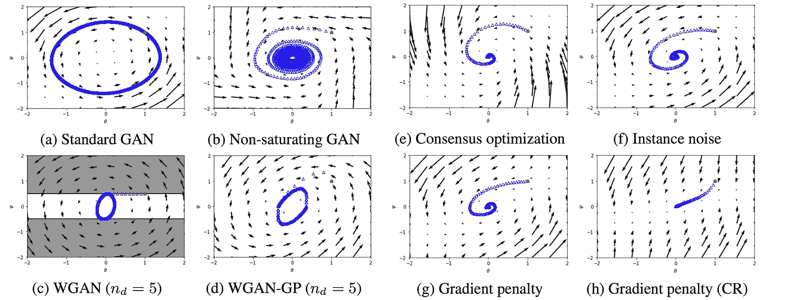
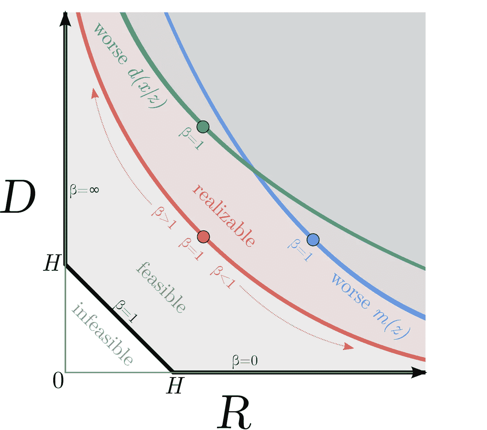
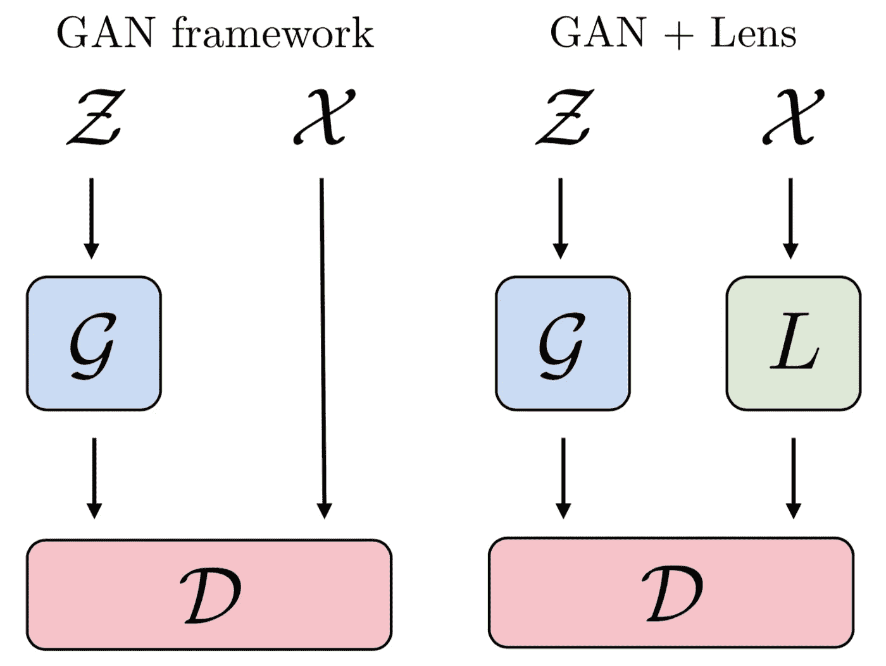
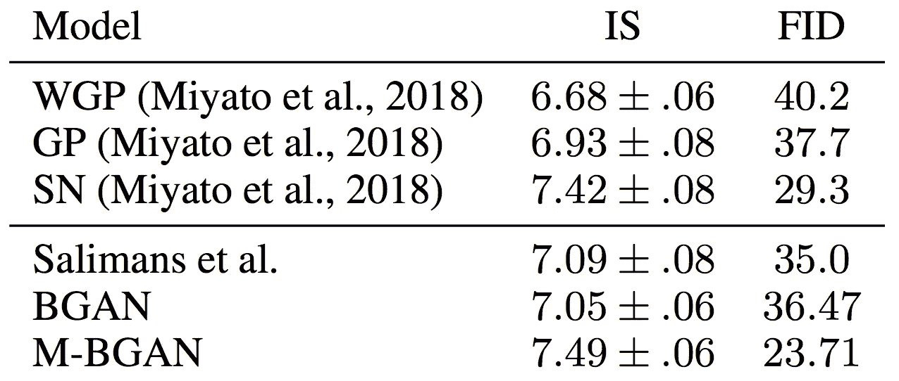
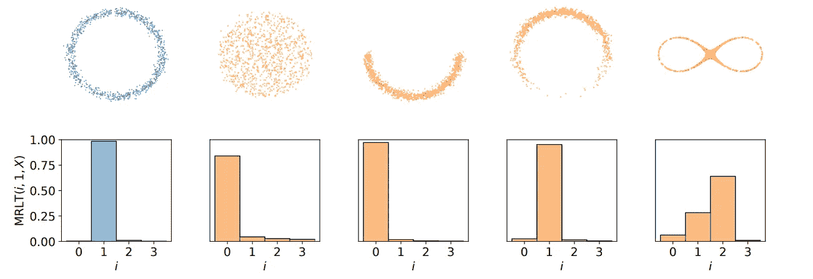
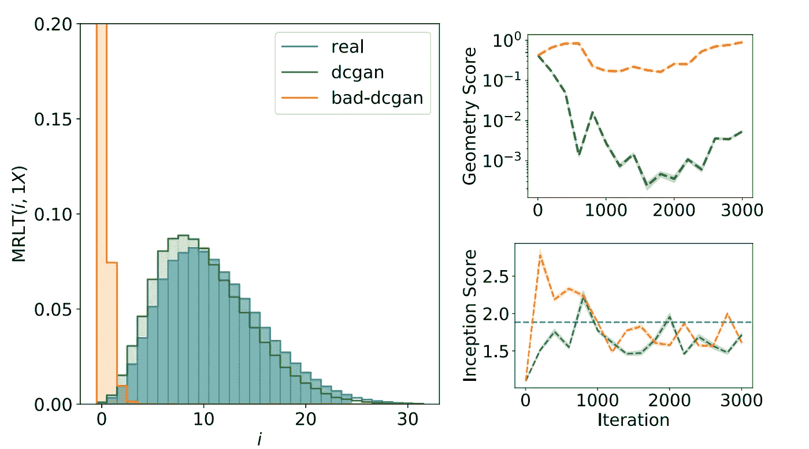
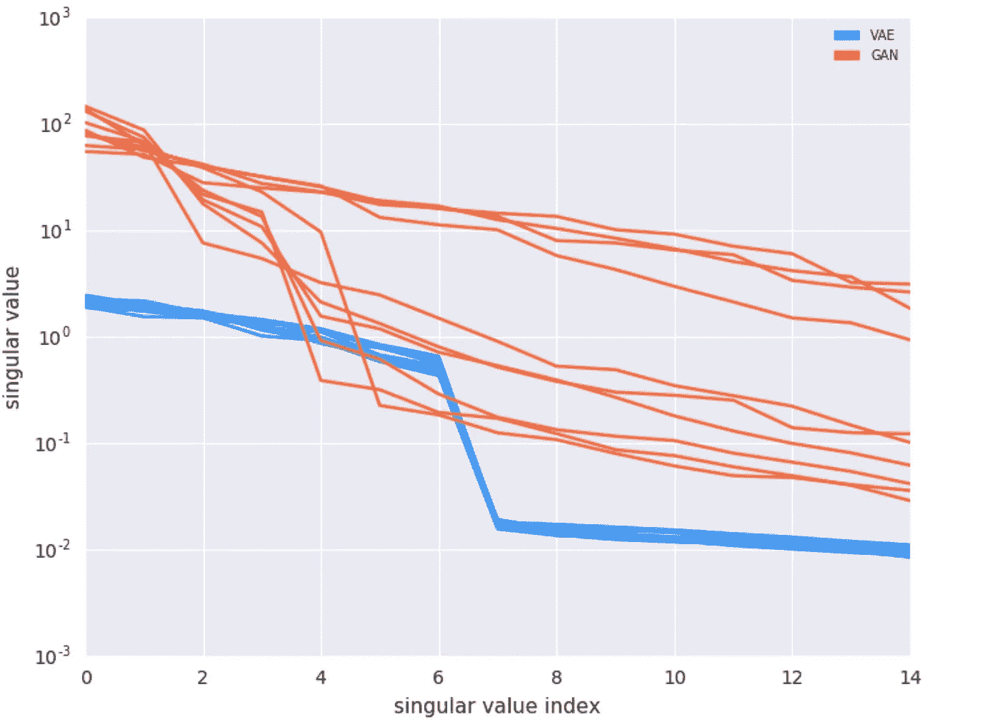

# ICML 2018 上的生成对抗网络和变分自动编码器

> 原文：<https://towardsdatascience.com/generative-adversarial-nets-and-variational-autoencoders-at-icml-2018-6878416ebf22?source=collection_archive---------4----------------------->

在今年的[*【ICML】*](https://icml.cc/Conferences/2018)*展会上，展示了大量生成模型方面的工作。当谈到像这样受欢迎的领域时，很难看到正在探索什么主题的更大图景，以及不同的方法如何相互关联。因此，在这篇文章中，我想简要概述一些我觉得特别有趣的主题，分享一个在会议上展示的伟大作品的样本，并且在可能的情况下，我会提供额外的背景，并将这些作品与其他作品相关联。*

生成模型经典地用数据(x)和标签(y)描述联合分布 p(x，y)的模型。然而，在这种情况下，*生成模型*将被理解为具有从数据 *X* 的(近似)分布中取样以产生新样本 x ~ *X* 的机制。两种最常见的生成模型是我们将要研究的:生成对抗网络(GANs)和变分自动编码器(VAEs)。有很多关于 gan 和 VAEs 的精彩介绍。以下是一些建议:

*   Ian Goodfellow 的[来自 NIPS 2016 的 GAN 教程](https://arxiv.org/abs/1701.00160)
*   Irhum Shafkat 的[直观理解变型自动编码器](/intuitively-understanding-variational-autoencoders-1bfe67eb5daf)

尽管目前生成模型很流行，但反思当前的方法和它们面临的问题是一个好的实践。Sanjeev Arora 的 ICML 教程[对深度学习的理论理解](http://unsupervised.cs.princeton.edu/deeplearningtutorial.html)强调，像 GANs 和 VAEs 那样遍历潜在代码需要非常高的数值精度，这样做也许应该避免。有自回归模型，如 [WaveNet](https://arxiv.org/abs/1609.03499) 和 [PixelCNN](http://proceedings.mlr.press/v48/oord16) 的变体，它们可以通过采样生成内容，而无需通过潜在代码。此外，gan 具有众所周知的不稳定的训练动态，并且遭受所谓的 [*模式崩溃*](http://aiden.nibali.org/blog/2017-01-18-mode-collapse-gans/) *，*，这导致数据的一些模式被过度表示。然而，在理想条件下，它们能够生成高度逼真的图像，如下图所示。vae 更容易训练，但是由于*最大似然*目标，倾向于生成更模糊的图像。当使用强大的(表达)解码器时，vae 有时会忽略潜在向量，导致所谓的*后验崩溃*。

Samples generated by a progressively grown GAN trained on the CelebA-HQ dataset illustrating how realistic the generated images from a GAN can look. Figure 5 in [Progressive Growing of GANs for Improved Quality, Stability, and Variation](https://openreview.net/forum?id=Hk99zCeAb) by Karras et al.

让我们从会议上提交的一些论文开始，这些论文基于我们对相应模型的理解，解决了上面强调的问题。

# 理解生成模型

[GANs 的哪些训练方法确实趋同？](http://proceedings.mlr.press/v80/mescheder18a.html)解决 GAN 训练的稳定性问题，并研究许多之前提出的用于提高 GAN 训练稳定性的方法。作为一个希望[阶段画像](https://en.wikipedia.org/wiki/Phase_portrait)了解深度学习训练动态的人，我很高兴看到这被包括在内。本文首先构建了一个只有两个参数的简化 GAN，它控制构成生成器的 Dirac 分布的中心，并控制线性分类器鉴别器的斜率。作者将这个系统命名为*狄拉克-甘*。

通过研究不同训练方法对 Dirac-GAN 的影响，并查看它如何影响系统，该论文的作者能够得出关于这些方法的稳定性和收敛性的结论。除了确定收敛性质，他们还说明了梯度矢量场和一些类似于前面提到的动力系统相图的训练轨迹，这是一个很大的补充，使结果更加接近。例如，它们表明同时更新(计算梯度并同时更新鉴别器和生成器的权重)导致不稳定的训练，如下所示。

Trajectory of a standard Dirac-GAN trained with simultaneous updates (left) and alternating updates (right) with gradients illustrated with arrows in the — plane. Initial parameters are shown in red. Simultaneous updates lead to a gradient field with a positive divergence, forcing the trajectory away from the local optima in the middle. Figure 2 from [Which Training Methods for GANs do actually Converge?](http://proceedings.mlr.press/v80/mescheder18a.html) by Mescheder, Geiger and Nowozin.

其他几种方法也进行了类似的评估和可视化(左)。我不能在这里对所有的观察结果和随之而来的建议进行公正的评价，但是我强烈建议参考这篇论文，了解作者对不同甘的训练动态的研究结果。然而，所有方法的共同点是梯度向量场似乎具有高旋度(旋转分量),并且许多方法倾向于陷入极限环。这就是作者建议不应该在优化器中使用动量的原因，因为它可能会迫使解决方案远离驻点。

他们创建一个简化的 GAN“测试床”的方法与“线性化原理”产生了很好的共鸣，该原理来自“对深度学习的理论理解”教程，该教程鼓励在扩展到更一般的场景之前研究更简单的线性方法，这是一种在许多其他科学领域常见的方法。鉴于人们对更好地理解深度学习方法的浓厚兴趣(深度学习理论[是 ICML 2018](https://medium.com/peltarion/icml-2018-an-ai-party-in-our-own-backyard-ba249bfedd32) 上第三大热门话题)，我相信我们也会在其他类型的模型上看到类似的分析。

Trajectory of a Dirac-GAN trained with various GAN training methods (listed below individual subfigures). Initial parameters are shown in red. Adapted from Figure 3 in [Which Training Methods for GANs do actually Converge?](http://proceedings.mlr.press/v80/mescheder18a.html) by Mescheder, Geiger and Nowozin.

L 看 VAEs，[修一个坏掉的 ELBO](http://proceedings.mlr.press/v80/alemi18a.html) 检验*证据下界* (ELBO)损失项。作者没有采用推导 ELBO 的经典方法，而是从研究互信息 I(X；z)在数据 X 和潜在代码 z 之间。基于互信息的一些先前已知的界限，它们规定了界限

h D≤I(X；Z) ≤ R，

这在下图中显示为粗黑线。在本文的框架中，H 是数据的*熵*，D 是通过编码器的*失真*的度量，R 是所谓的*速率* —与 z 上的最佳代码相比，对来自编码器的潜在代码样本进行编码所需的附加信息的度量。零失真(D)意味着潜在代码中没有信息丢失，并且样本可以被准确地再现。然而，这并不意味着潜在的代码实际上实现了任何有用的东西。另一方面，零速率(R)意味着 Z 独立于 x。

Shows the D-R plane with the feasible region boundary marked with a thick black line. ELBO for realizable and suboptimal solutions. Figure 1 in [Fixing a Broken ELBO](http://proceedings.mlr.press/v80/alemi18a.html) by Alemi et al.

从这个框架，作者可视化(左)什么变分自动编码器可以实现。通过使用具有目标 D + R 的β- [VAE](https://openreview.net/forum?id=Sy2fzU9gl) ，或者通过目标中的正则化项，可以控制 D 和 R 的折衷，以实现期望的特性。在何处使用正则化项进行控制的建议示例是避免后验崩溃(R = 0)，而不是像通常所做的那样削弱解码器(在图中从红色变为绿色)。最后，他们进行了大量实验，并展示了各种 vae 如何实现 D 和 R 之间的不同权衡。有人建议，比较这些量可能是理解 vae 之间差异的更好方法，而不是只看 ELBO (-ELBO = D + R)。

# 新方法

除了扩展我们对模型和方法的理解之外，还有一大套新方法或“技巧”,通过不同程度理解的机制，似乎有助于训练 GANs。vae 通常更容易训练，根据我的经验，成绩好的论文往往不会列出大量的技巧。我想到的方法类型可以在论文中找到，如[训练甘的改进技术](https://arxiv.org/abs/1606.03498)和[提高甘的质量、稳定性和多样性的渐进生长](https://arxiv.org/abs/1710.10196)。通常，对于 GANs 来说，这些技巧是实现尖端成果的绝对必要条件。以下是今年 ICML 报纸在这一领域的报道样本。

Illustrates the added lens component in the GAN. Figure 1 in [Tempered Adversarial Networks](http://proceedings.mlr.press/v80/sajjadi18a.html) by Sajjadi et al.

[缓和敌对网络](http://proceedings.mlr.press/v80/sajjadi18a.html)将*透镜*的概念引入标准 GANs，如图(左)所示。这是为了扭曲真实数据，使其看起来像生成器的数据，这似乎是为了解决真实图像和生成图像分布之间的[非重叠支持](http://proceedings.mlr.press/v70/arjovsky17a.html)的问题。为了保持专注，作者决定不采用其他一些技巧来获得最先进的结果。相反，像许多其他人一样，该评估基于 Frenchet 初始距离(FID)，[由双时标更新规则训练的 GANs 收敛到局部纳什均衡](https://papers.nips.cc/paper/7240-gans-trained-by-a-two-time-scale-update-rule-converge-to-a-local-nash-equilibrium)，在那里它似乎产生更平滑和更稳定的下降。然而，很难相信分类器的分数(例如，参见[关于 Inception 分数的注释](https://arxiv.org/abs/1801.01973))，并且由于生成的图像不太雄心勃勃，也很难定性地将其与其他并发工作进行比较。如果能看看这篇论文的结果是否能和 HQ 生成所需的技巧一起被复制，以及结果是否会持续下去，那将是非常棒的。

会议上介绍的另一个有趣的方法是[混合批次和对称鉴别器用于 GAN 训练](http://proceedings.mlr.press/v80/lucas18a.html)。本文描述了*小批量鉴别* ( [训练 GANs 的改进技术](https://arxiv.org/abs/1606.03498))的一种变体。然而，在这篇新论文中，生成的图像和真实的图像在每一批中都以随机的比例结合在一起。鉴别器被设置为预测每批中产生的样品与实际样品的比率。他们解决的另一个困难是，通过建立置换不变鉴别器，批内样本的排序不应影响预测。

他们基于上述概念建立的两个模型被命名为 BGAN 和 M-BGAN。他们唯一的区别是平均损失发生的地方。这些与在 CIFAR10 上用下表中的其他方法训练的 gan 进行比较。就所给出的指标而言，M-BGAN 获得了最高分，尽管根据下一节中的评论，人们应该小心不要从这些指标中得出太强的结论。特别有趣的是，作者揭示了这个模型是作为一个 bug 出现的(也许 M 代表错误)。这篇论文在证明这些方法方面做得很好，但我希望能比补充材料中给出的更深入地探索为什么这个模型表现得如此之好。这可能是一个很好的研究课题。

Results as measured in *Inception Score* (IS) (higher is better) and FID (lower is better) on models with the same architecture but with either wasserstein gradient-penalty (WGP), standard gan with gradient-penalty (GP), spectral normalization (SN), minibatch discrimination (Salimans et al.) and the introduced models BGAN and M-BGAN. Table 1 in [Mixed batches and symmetric discriminators for GAN training](http://proceedings.mlr.press/v80/lucas18a.html) by Lucas et al.

# 衡量和比较生成数据的质量

理解如何测量和比较生成数据的质量是极其重要的，因为它为社区提供了持续比较哪种方法更好的方法。用于评估的常见指标包括基于预训练分类器的*初始得分* (IS)和 FID，它们可能会被常见的对抗性攻击所欺骗，并且已被证明并不总是与感知质量很好地相关联([关于初始得分的注释](https://arxiv.org/abs/1801.01973))。其他指标依赖于许多手动分配的分数的平均值，这很难重复执行，并且可能很昂贵。我在下面讨论的最后一组论文介绍了测试，这些测试测量生成器能够多好地逼近目标分布。

在 [几何得分:一种比较生成性对抗网络的方法](http://proceedings.mlr.press/v80/khrulkov18a.html)作者使用拓扑数据分析(TDA)将生成数据的拓扑结构与真实数据进行比较。他们的方法建立在 [*持久性条形码*](https://en.wikipedia.org/wiki/Persistent_homology) 的基础上，该条形码总结了在连接彼此越来越远的点时，某个维度的洞存在多长时间。这些被浓缩成*平均相对存活时间* (MRLT)，它列出了一定数量、一定尺寸的孔洞在生长过程中所占的时间比例。然后，这项工作完全集中在一维空穴的 MRLT 上(我将把它称为 MRLT1)。下面是各种生成的数据集的 MRLT1 的可视化，显示它确实似乎是孔数量的一个很好的总结。

Illustrates the MRLT for different generated 2D datasets. This shows that the MRLT encodes information about the homology of the dataset. Figure 6 in [Geometry Score: A Method For Comparing Generative Adversarial Networks](http://proceedings.mlr.press/v80/khrulkov18a.html) by Khrulkov and Oseledets.

最后，作者设计了一个称为*几何分数*的度量，它被定义为真实数据集和生成数据集的 MRLT1 之间的 **L2** 距离。这个指标的效用在许多实验中得到了体现，我在下面列出了我认为最有趣的数字。

Comparison of MRLT, IS and Geometry Score of real images from CelebA and those generated with a DCGAN which is performing well (dcgan) and one which has experienced mode collapse (bad-dcgan). The interesting note here is that whereas the inception score barely shows a difference between the two GANs, the Geometry Score shows a large difference between them. Figure 8 in [Geometry Score: A Method For Comparing Generative Adversarial Networks](http://proceedings.mlr.press/v80/khrulkov18a.html) by Khrulkov and Oseledets.

看起来几何分数是近似分布接近真实分布的必要但非充分条件。也就是说，好(低)的分数不一定意味着好的生成器，但是坏(高)的分数意味着生成数据的分布可能与真实数据非常不同。看到这种基于真实数据和生成数据分布的拓扑相似性的推理令人兴奋，我希望我们将来能看到类似的工作。

T 何[走向深度学习的理论理解](http://unsupervised.cs.princeton.edu/deeplearningtutorial.html)教程重点介绍了同一作者论文中的一个方法[GANs 学习分布吗？今年 ICLR 发表的一些理论和经验](https://openreview.net/forum?id=BJehNfW0-)，值得重提。这种方法依赖于生日悖论，它根据样本中相同值的数量来确定总体的大小。通过对图像进行采样，用试探法找到近似的副本，并使用回路中的人来评估副本，该方法可以给出对生成器多样性的估计。

[发电机调节与 GAN 性能有因果关系吗？](http://proceedings.mlr.press/v80/odena18a.html)扩展了之前的工作，显示了控制深度神经网络的雅可比奇异值的重要性。作者专注于*条件数* (CN)，这是最大和最小奇异值之间的比率。这一选择部分是由于其与不稳定性的理论联系(越低越稳定)，部分是由于作者的观察，这与 is 和 FID 都有很好的相关性。除了研究 CN，他们还研究奇异值的整个谱(这里是奇异值的有序向量)。有两件事似乎特别值得注意:

1.  大约一半的运行得到低 CN，另一半得到高 CN，同一个集群中的值非常接近。因此，他们能够识别“好的”和“坏的”训练跑步。
2.  作者研究了 GANs 和 VAE 解码器平均雅可比矩阵的奇异值谱(见下图)。他们注意到 a)vae 在运行之间的奇异值中具有较小的方差，b)vae 具有较低的 CN。这很有趣，因为这是一个反映训练稳定性的量，当应用于 VAEs 和 gan 的比较时，反映了 gan 明显不太稳定的一般经验。

Here the singular value spectrum of the average Jacobian is shown for multiple training runs of GANs and VAEs. Figure 3 in [Is Generator Conditioning Causally Related to GAN Performance?](http://proceedings.mlr.press/v80/odena18a.html) by Odena et al.

最后，作者提出了一种控制奇异值范围以减小 CN 的方法，他们称之为*雅可比箝位*。作者评论说,[用于生成敌对网络的谱归一化](https://openreview.net/forum?id=B1QRgziT-)试图实现与雅可比箝位类似的任务。这种联系还没有被完全探索，但是通过研究和控制神经网络的奇异值，又一项工作显示了改进的结果。我期待在接下来的一年里，这个领域会有更多令人兴奋的工作。

# 结论

虽然 ICML 2018 上展示的工作比我能够涵盖的多得多，但我希望这篇文章有助于浏览关于 GANs 和 VAEs 的出版物的增长列表。看到这些模型的结果改善得如此之快，以及关于这些模型的知识是如何发展的，这是令人兴奋的。为此，我很想知道是否有人将 GAN 发生器作为逆 CDF 进行评估，或者将采样过程与逆变换采样联系起来。如果你有任何想法，想法或链接到以前的工作，利用和讨论这种关系，特别是如果他们讨论这可能是如何反演的数据密度函数的估计，请让我知道！

如果你错过了今年的 ICML，并且对参加会议的感觉很好奇，看看这篇由我的一些同事写的关于整体会议体验的[文章](https://medium.com/peltarion/icml-2018-an-ai-party-in-our-own-backyard-ba249bfedd32)。

*原载于***。**

****2018 年 8 月 12 日:*** *做了一些轻微的编辑，主要是在布局上，以提高可读性。**