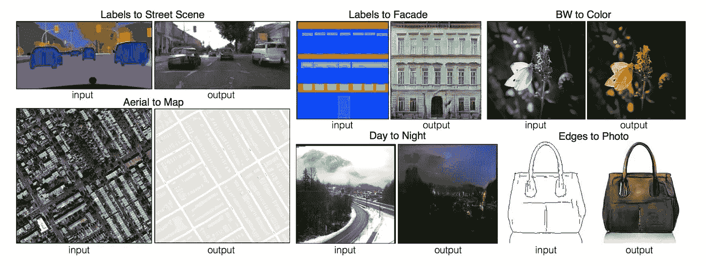
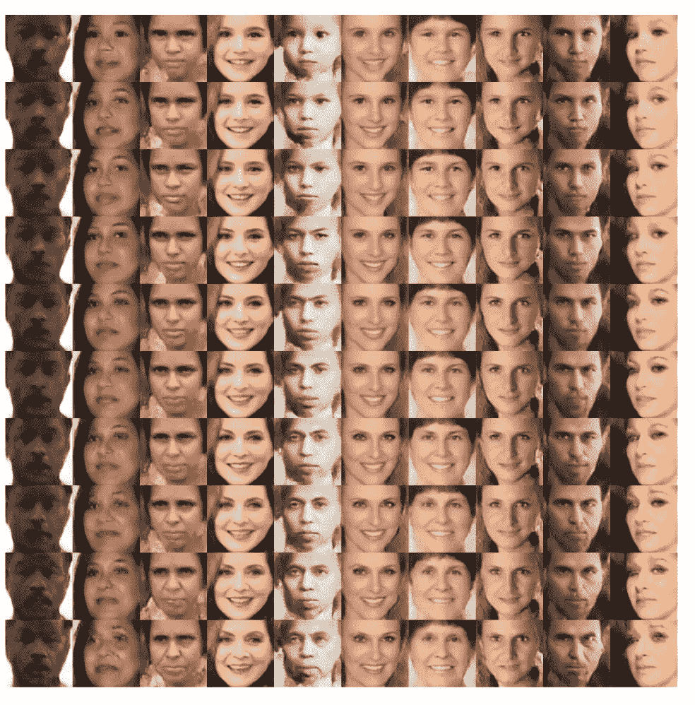
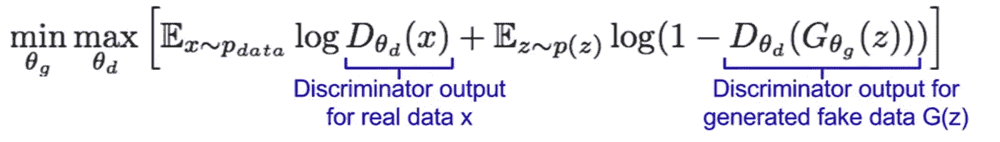
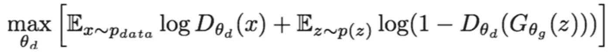
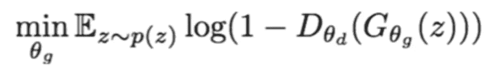
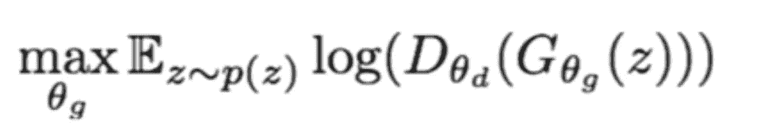

# 生成性对抗网络——解释

> 原文：<https://towardsdatascience.com/generative-adversarial-networks-explained-34472718707a?source=collection_archive---------2----------------------->

深度学习改变了我们的工作和计算方式，让我们的生活变得更加轻松。正如安德烈·卡帕西提到的，这确实是 T2 软件 2.0 版，因为我们已经教会了机器自己解决问题。有许多现有的深度学习技术可以归因于其多产的成功。但深度生成模型并没有产生重大影响，这是因为它们无法逼近棘手的概率计算。 [Ian Goodfellow](https://www.google.co.in/search?q=ian+goodfellow&rlz=1C5CHFA_enIN780IN781&oq=ian+&aqs=chrome.0.69i59j69i57j69i60l2j0l2.3062j0j7&sourceid=chrome&ie=UTF-8) 能够找到一个解决方案，可以避开生成模型面临的这些困难，并创建了一个新的巧妙的模型，称为生成对抗网络。当你看到 GAN 的能力时，我相信这是令人惊讶的。在继续介绍 GAN 之前，让我们看一些例子来了解 GAN 及其变体的能力。

## 例子

*   给定道路的分段图像，网络能够用诸如汽车等物体来填充细节。该网络能够将黑白图像转换成彩色图像。给定一张航空地图，网络能够找到图像中的道路。它还能够填充照片的细节，给定边缘。

*   给定一张脸的图像，网络可以构建一张代表这个人年老时样子的图像。

这些只是 GAN 的几个例子，还有更多例子。既然我已经吊起了你的胃口，让我们继续讨论什么是 GAN 以及它是如何工作的。

## 介绍

与传统的神经网络不同，生成对抗网络采用了一种博弈论的方法。该网络通过两人游戏从训练分布中学习生成。这两个实体是生成器和鉴别器。这两个对手在整个训练过程中一直在战斗。由于采用了对抗学习方法，我们不需要关心逼近难以处理的密度函数。

## 它是如何工作的

Generative Adversarial Network

正如你可以从它们的名字中识别出来的那样，一个生成器被用来生成看起来真实的图像，而鉴别器的工作就是识别哪个是赝品。当一个实体(生成者)试图愚弄另一个实体(鉴别者)，而另一个实体试图不被愚弄时，实体/对手处于持续的战斗中。为了生成最好的图像，你需要一个非常好的生成器和一个鉴别器。这是因为如果你的生成器不够好，它将永远无法欺骗鉴别器，模型将永远不会收敛。如果鉴别器是坏的，那么没有意义的图像也将被分类为真实的，因此你的模型永远不会训练，反过来你永远不会产生想要的输出。输入的随机噪声可以是高斯分布，并且可以从该分布中采样值，并将其馈送到发生器网络中，从而生成图像。鉴别器将生成的图像与真实图像进行比较，并尝试识别给定图像是假的还是真实的。

## 目标函数

Objective Function

由于采用了博弈论的方法，我们的目标函数被表示为一个极大极小函数。鉴别器试图最大化目标函数，因此我们可以对目标函数执行梯度上升。生成器试图最小化目标函数，因此我们可以对目标函数执行梯度下降。通过在梯度上升和下降之间交替，可以训练网络。

Gradient Ascent on Discriminator

Gradient Descent on Generator

但是当应用时，观察到优化生成器目标函数并不那么有效，这是因为当生成的样本很可能被分类为假时，模型想要从梯度中学习，但是梯度变得相对平坦。这使得模型很难学习。因此，发电机目标函数改变如下。

New Generator Objective function

我们不是最小化鉴别器正确的可能性，而是最大化鉴别器错误的可能性。因此，我们根据这个目标函数在生成器上执行梯度上升。

## 不足之处

*   gan 训练起来更不稳定，因为你必须从一个反向传播训练两个网络。因此，选择正确的目标会有很大的不同。
*   我们不能用 GANs 执行任何推理查询

## 结论

生成性对抗网络是最近的发展，已经显示出巨大的前景。这是一个活跃的研究领域，GANs 的新变种经常出现。

## 参考

1.  [https://arxiv.org/abs/1406.2661](https://arxiv.org/abs/1406.2661)
2.  [http://cs 231n . Stanford . edu/slides/2017/cs 231n _ 2017 _ lecture 13 . pdf](http://cs231n.stanford.edu/slides/2017/cs231n_2017_lecture13.pdf)
3.  【https://github.com/ZZUTK/Face-Aging-CAAE 
4.  [https://github.com/phillipi/pix2pix](https://github.com/phillipi/pix2pix)