# 生成性对抗网络——历史与综述

> 原文：<https://towardsdatascience.com/generative-adversarial-networks-history-and-overview-7effbb713545?source=collection_archive---------1----------------------->

最近，生成模型越来越受欢迎。特别是，由 Ian Goodfellow 等人引入的一个相对较新的模型，称为生成对抗网络或 GANs，显示出产生现实样本的前景。这篇博文分为两部分。第 1 部分包括对 GANs 的介绍，它背后的历史，以及它的各种应用。第 2 部分包括生成图像样本的 GANs 实现(带代码)。

# 第 1 部分-了解 GANs

## 生成建模

让我们先来看看什么是生成模型，以及它与判别模型有什么不同。假设你有输入数据 *x* ，以及相应的输出标签 *y* 。判别模型试图直接学习条件概率分布 *P(y|x)* 。另一方面，生成模型试图学习联合概率分布 *P(x，y)* 。这可以用贝叶斯法则转化为 *P(y|x)* 。然而，另外，与判别模型相反，生成模型可以使用联合分布 *P(x，y)* 来生成可能的 *(x，y)* 样本。

## 炒作都是为了什么？

那么，为什么有人想要研究生成模型呢？有人可能想知道简单地生成更多数据有什么大不了的，尤其是因为已经有如此丰富的数据可用。但实际上，这可以有多种用途。例如，可以将一些以特定笔迹书写的文本输入到生成模型中，以生成更多相同笔迹的文本。生成模型，尤其是 GANs，也可以用于强化学习的探索中，其中它们可以用于生成人工环境。其他应用包括草图到图像的转换、图像去噪、低分辨率图像到高分辨率的转换、艺术的生成以及卫星图像到地图的转换等等。除了广泛的应用之外，当大部分标签缺失时，生成模型特别有用，因为它们能够执行半监督学习。

## 多年来的生成模型

既然我们已经奠定了什么是生成式建模以及它们为什么有用的基础，那么让我们来看看生成式建模中的各种方法。出于比较模型的目的，它们都可以被描述为执行最大似然。

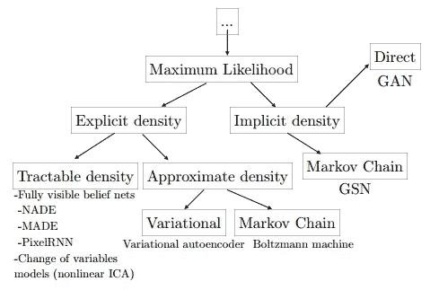

Taxonomy of Generative Models (from Ian Goodfellow’s NIPS tutorial, 2016)

上图描绘了 Ian Goodfellow 在他的 NIPS 教程中描述的各种族的生成模型。现在让我们来看看上面提到的模型家族中一些流行方法的优缺点。

## 完全可见的信念网络

他们使用概率链规则将向量上的概率分布分解成向量中每个成员的乘积。

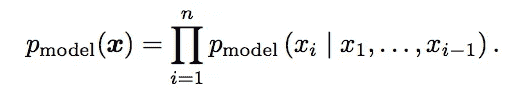

这家最受欢迎的型号是 PixelCNN。

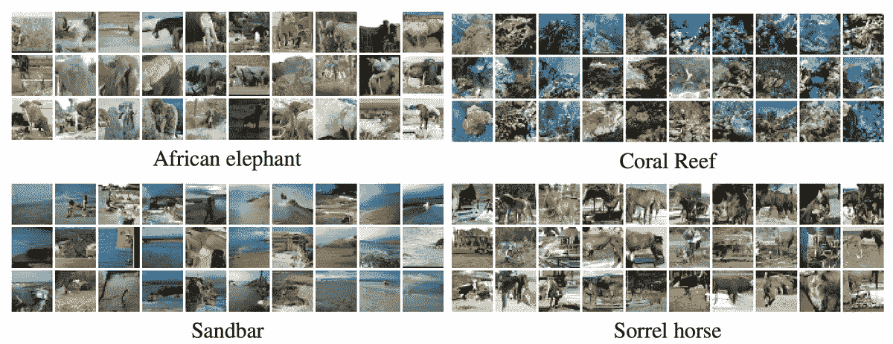

Images generated by PixelCNN (van den Ord et al 2016)

FVBNs 最大的缺点是生成样本的速度非常慢。每次您想要生成新的样本时，您都必须再次运行该模型。这不能同时进行。

## 基于变量变化的模型(非线性 ICA)

这种模型从简单的高斯分布开始，并使用非线性函数将分布转换到另一个空间。这样做的主要缺点是转换需要被设计成可逆的，并且潜在变量必须与数据具有相同的维数。所以如果你想生成 5000 个像素，你需要有 5000 个潜变量。

## 变分自动编码器

变分自动编码器的工作方式是从密度函数 *log p(x)* 中边缘化随机变量 *z* 。由于这是难以处理的，它使用了变分近似。该模型希望最大化数据对数似然的下限。

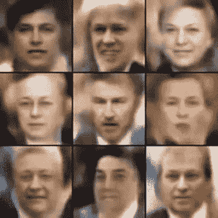

Images of celebrity-like faces generated by a VAE (By Alec Radford)

这里的主要缺点是，如果分布 *q* 是完美的，那么模型是渐近一致的。否则，数据的下限和实际密度之间会有差距。另一个缺点是生成的样本质量相对较低。

## 玻尔兹曼机器

玻尔兹曼机可以由一个能量函数来定义，而一个特定状态的概率，正比于每个能量的值。为了将其转换为实际的概率分布，通过将总和除以不同的状态来进行重正化。这个总和是难以处理的，这需要使用蒙特卡罗方法进行近似。缺点是这些方法，尤其是马尔可夫链蒙特卡罗方法，在高维空间表现不好。因此，尽管它们可能在像 [MNIST](http://yann.lecun.com/exdb/mnist/) 这样的图像上表现良好，但你不会在来自 [ImageNet](http://image-net.org/) 的图像上获得类似的性能。

## 生成对抗网络

既然我们已经讨论了其他流行的生成模型，我们可以看看 GANs，以及它们与其他模型的比较。

gan 旨在克服上述模型中陈述的许多缺点。与完全可见的信念网络相反，GANs 使用潜在的代码，并且可以并行生成样本。与变分自动编码器不同，gan 是渐近一致的。此外，GANs 不需要马尔可夫链，这是相对于玻尔兹曼机器的一个优势。最后，GANs 通常被高度评价为产生最好的样本，尽管这是非常主观的，并且目前是一个争论的话题，有像 PixelCNN 这样的模型与之竞争。

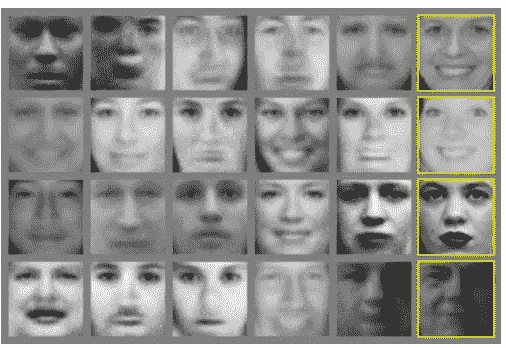

Images generated by GAN using the Toronto Face Database (Ian Goodfellow et al 2014)

## GANs 如何工作

既然我们已经确定了为什么 gan 值得研究，让我们更深入地研究它们到底是如何工作的。

GANs 背后的主要思想可以解释为两个玩家之间的博弈——生成器和鉴别器。生成器尝试生成与训练数据遵循相同基础分布的样本。鉴别器试图区分由生成器生成的样本(假数据)和来自训练集的实际数据。生成器的目标是通过近似基本分布来欺骗鉴别器，以便生成与实际数据无法区分的样本。另一方面，鉴别器的目标是从真实数据中识别假数据。鉴别器的任务只是一个二进制分类问题，它决定数据是真是假。这个游戏的一个常见类比是伪造者和警察。伪造者就像发电机一样，试图伪造货币，并尽可能使其看起来合法，以便愚弄警察。警察就像鉴别者，其目标是能够识别出被伪造的货币。

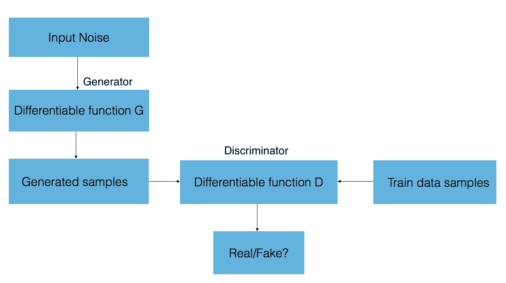

GAN overview

生成器是一个可微分函数 *G* ，它具有可以通过梯度下降学习的参数。对 *G* 的输入是通过对潜在变量的一些先验分布中的潜在向量 *z* 进行采样而获得的。所以本质上， *z* 是非结构化噪声的矢量。 *G* 应用于 z，以从模型中获得样本 *x* ，该样本在理想情况下应类似于来自列车组的实际数据。像发生器一样，鉴别器也是一个可微分函数 *D* ，它具有可以通过梯度下降学习的参数。函数 *D* 在应用于从 *G(z)* 获得的样本 *x* 时，理想情况下应该输出一个接近于零的值，表示该样本是假的。当数据中的一个实际样本被输入到 *D* 时，它应该输出一个接近 1 的值。

说𝞱 *(D)* 和𝞱 *(G)* 分别是 *D* 和 *G* 的参数。鉴别器想要最小化它的成本*j(d)(*𝞱*(d)*,𝞱*(g)*，但是对𝞱 *(G)* 没有控制，而生成器想要最小化*j(g)(*𝞱*(d)*𝞱*(g)*而对𝞱 *(D)* 没有控制。所以我们想要找到*(*𝞱*(d)*,𝞱*(g)*的纳什均衡值，使得 *J(D)* 相对于𝞱 *(D)* 最小， *J(G)* 相对于𝞱 *(G)* 最小。

那么训练实际上是如何进行的呢？训练程序是
选择一个优化算法，比如 Adam，并将其同时应用于两个小批数据，一个来自实际训练数据，另一个来自 *G* 生成的样本。此外，你可以更新一个球员比其他球员更频繁。

## 发电机和鉴别器成本

算法进行的方式取决于每个玩家的成本。指定成本的最简单方法是使用最小最大博弈，其中发生器成本是鉴别器成本的负数。那么鉴别器想要最大化，而生成器想要最小化的成本到底是多少呢？它只是鉴别器输出和实际标签(真/假)之间的标准交叉熵函数。

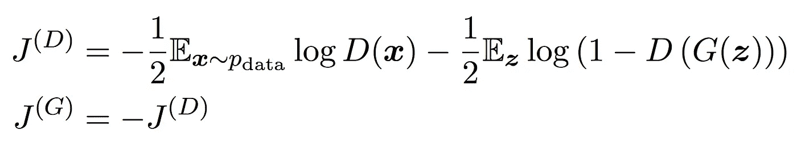

J(D)中的第一项表示将实际数据提供给鉴别器，鉴别器希望最大化预测的对数概率，表明数据是真实的。第二项表示 g 生成的样本。在这里，鉴别器会希望最大化预测零的对数概率，这表明数据是假的。另一方面，生成器试图最小化鉴别器正确的对数概率。这个问题的解是博弈的一个均衡点，这个均衡点是鉴别器损失的一个鞍点。

这个极大极小游戏的主要问题是，当鉴别器变得越来越聪明时，生成器的梯度就消失了。解决这个问题的一个方法是翻转交叉熵函数中参数的顺序，而不是简单地翻转鉴别器成本的符号。

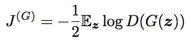

生成器现在想要最大化鉴别器出错的对数概率。现在，这种均衡不能用一个单一的价值函数来描述，这种特殊成本的动机更具启发性。

## 结垢甘斯

最初的 GANs 本身并不能很好地扩展到大型应用程序。为了克服这一点，Radfort 等人引入了深度卷积 GAN 架构。虽然最初，GANs 已经是深度和卷积的，但 DCGANs 强调有更多的卷积层，并额外使用诸如批量标准化的技术。除了生成器的最后一层之外，对每一层都应用批量标准化，以便使学习过程更加稳定。

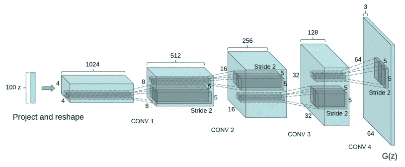

DCGAN Architecture (Radford et al 2015)

## 更多应用

GANs 在人工智能世界掀起了一场风暴，这不是神话，他们确实会留下来。在结束本节之前，我们先来看看 GANs 今天的一些迷人应用。

一个流行的应用是使用超分辨率技术从低分辨率图像生成高分辨率图像。

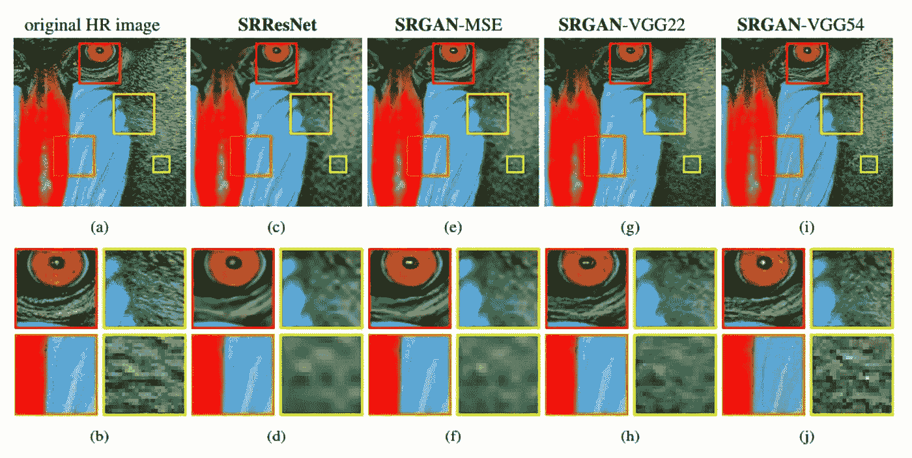

SRGAN used to obtain high resolution images. The original HR image is first downsampled to make a low-resolution image, and different methods are used to recover the original HR image (Christian Ledig et all 2016)

Scott Reed 等人在 2016 年取得了另一项最新进展，其中 GANs 被用于从文本中合成逼真的图像。

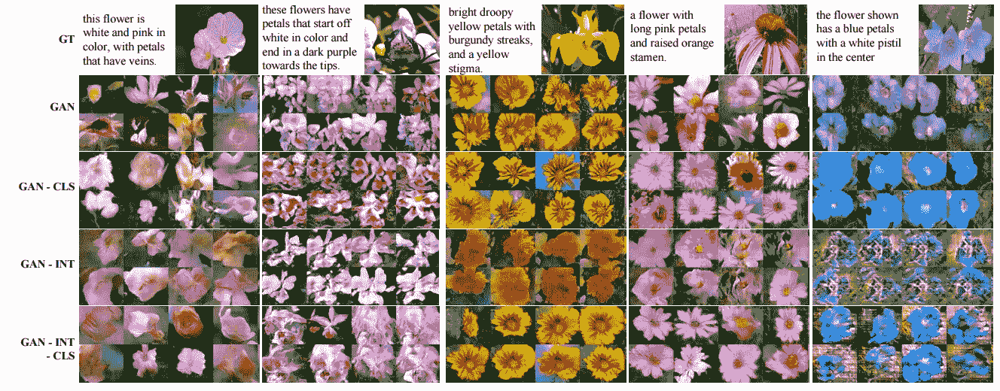

Generative Adversarial Text to Image Synthesis (Scott Reed et al 2016)

如前所述，gan 在强化学习中也有许多应用。仅举几个例子，它们还被应用于图像去噪和艺术生成。

# 第 2 部分—实施 GANs

现在你已经了解了什么是 GANs 以及它们具体是如何工作的，你已经正式进入了博客的激动人心的部分。是时候开始写点代码了！

因为 GANs 最突出的应用是图像生成，所以熟悉用 GANs 编写图像生成器是有意义的。代码应该将一组图像作为输入，并生成一组相似的图像作为输出。大多数人通常从 MNIST 这样的图像开始，并尝试使用 GANs 生成更多的手绘数字。这里，我们将使用来自 ImageNet 的图像作为我们的输入。由于这些图像是非常高维的，我们将使用 DCGANs 来生成图像。

对于输入，使用来自 ImageNet 的“植物”数据集的图像。调整每个图像的大小以获得 128×128 的图像。

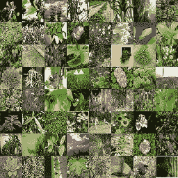

Plant data from ImageNet

以下 DCGAN 实现在 TensorFlow 中。这个实现的关键包含在一个名为 DCGAN 的 Python 类中，我们将在其中定义用于定义模型和训练模型的方法。

生成器的定义如下。它由一个线性层和四个卷积层组成。linear 和 conv2dTranspose 方法是用于获取图层的辅助函数。除了最后一个图层之外，批规范化应用于每一个图层。

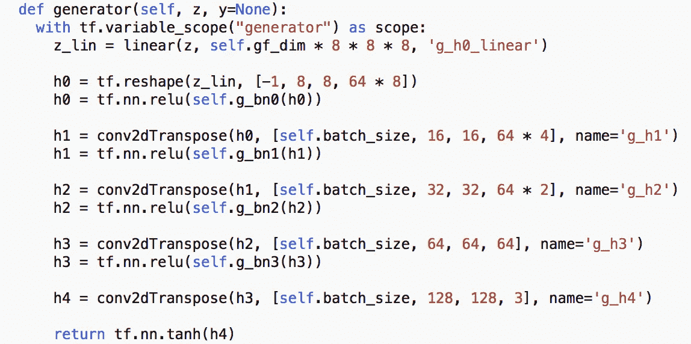

接下来，我们定义鉴别器。我们定义它有四个卷积层，后面是一个线性层。我们使用辅助函数 lrelu 来定义一个自定义激活函数(Leaky ReLU)。

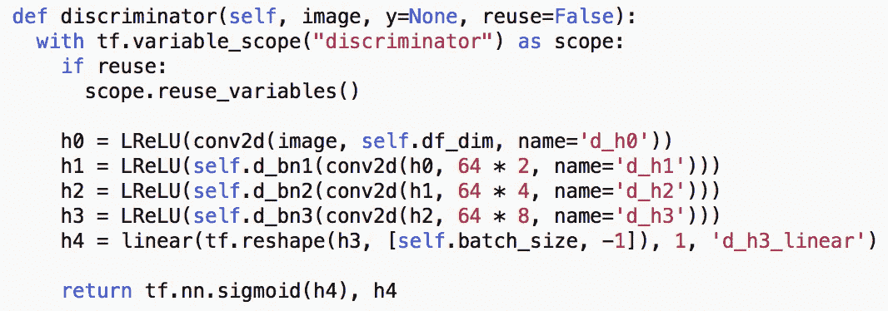

现在我们可以创建生成器和鉴别器模型了。我们定义了两个共享相同参数的鉴别器。一个被馈送来自训练数据的实际图像的小批量，而另一个被馈送由生成器生成的图像的小批量。

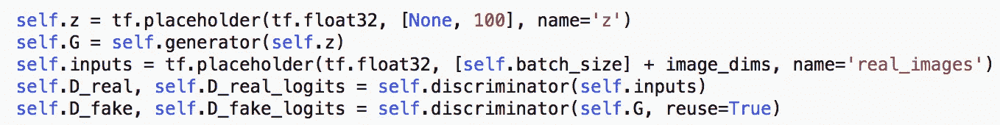

接下来，我们必须定义发生器和鉴别器的损失函数。如博客第 1 部分所述，我们在鉴别器的输出和实际标签(真/假)之间使用交叉熵函数。这里，标签“真实”对应于 1。标签“假”对应于 0。因此，鉴别器应该针对真实图像输出接近 1 的值，针对生成器产生的图像输出接近 0 的值。使用第 1 部分中规定的试探法计算发电机损耗。它是根据鉴别器出错的概率计算的，即生成器希望鉴别器为其生成的图像输出接近 1 的值。

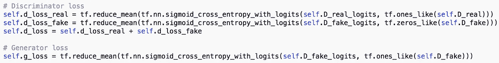

在我们开始训练之前，我们需要首先定义一个优化函数来最小化上述损失。这里我们使用 Adam 优化器，学习率= 0.0002，用于生成器和鉴别器。这里 d_theta 表示鉴别器的所有参数，g_theta 表示发生器的所有参数。

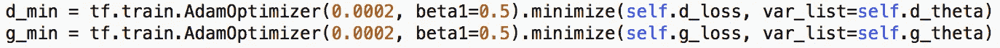

最后一步是实际开始训练数据和生成图像。对于每个历元，生成两个微批次对，一个来自训练图像，另一个来自采样 z。此外，为了防止鉴频器损耗变为零，每次更新鉴频器时，发生器都会更新两次。

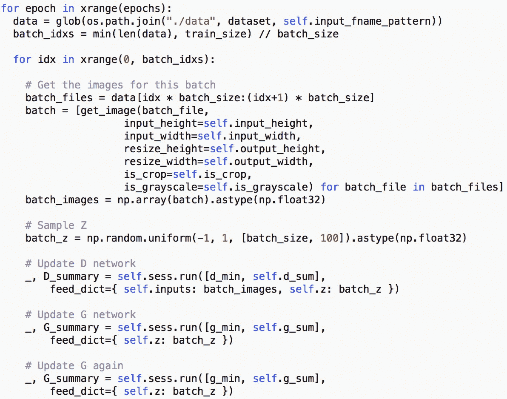

## 结果

以下是在运行 DCGAN 时获得的输出，其中来自 ImageNet 的工厂数据作为输入(大小调整为 128x128)，历元数设置为 250。

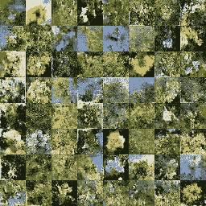

Output images generated by DCGAN

这四种损失分别标绘如下。

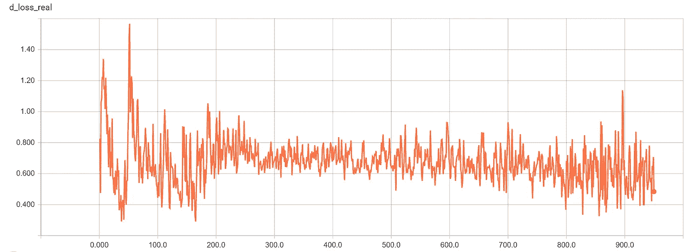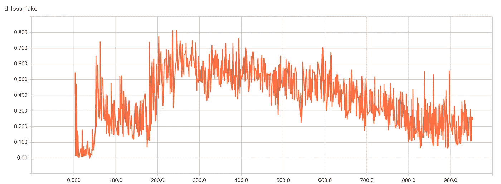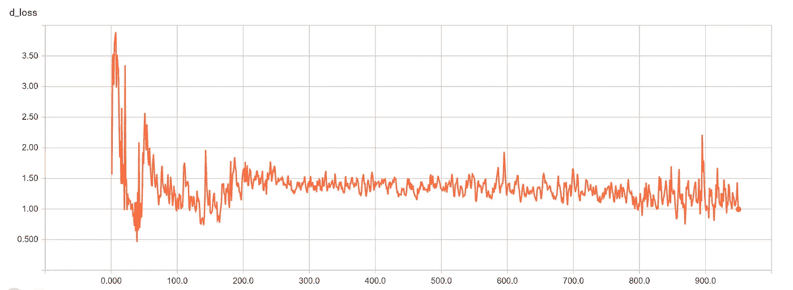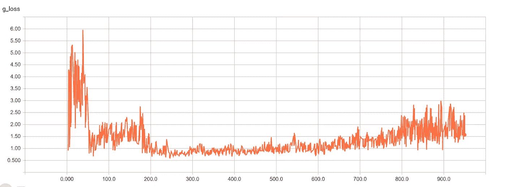

## 结论和未来工作

对于大多数时期，发电机损耗低于鉴频器损耗。这可能是因为每次更新鉴别器时，生成器都会更新两次。

虽然并不完美，但许多生成的图像确实类似于植物/花朵，而不仅仅是一些随机像素的分布。因此，可以得出结论，DCGAN 能够智能地构建自己的图像。然而，仍有很大的改进余地。这种实现的主要限制之一是缺乏计算资源。图像生成本身是一项计算密集型任务。在这个特定的例子中，与其他更原始的图像数据集如 MNIST 相比，图像具有相对更高的分辨率。此外，图像是彩色的。因此，使用 GPU 将在运行时产生巨大的差异，使运行更多的时代成为可能。

然而，简单地增加历元可能不能保证产生更好的图像，并且如果学习率太低，鉴别器将开始获胜，并且图像的质量将开始恶化。改进模型的一个显而易见的方法是给生成器添加更多的层。我一开始只有一层，添加更多层后，结果有了显著的改善。人们还可以试验不同类型的激活函数以及优化函数。我在这里用过 AdamOptimizer，因为它是 Ian Goodfellow 自己推荐的。

虽然上面生成植物图像的例子可能不是特别有用，但是相同的底层模型可以用于生成其他图像，例如小猫和小狗的图像。这也为使用 GANs 开发更复杂的应用程序奠定了基础，例如 art 的生成。

## *参考文献:*

[T3【https://github.com/carpedm20/DCGAN-tensorflow】T5](https://github.com/carpedm20/DCGAN-tensorflow)