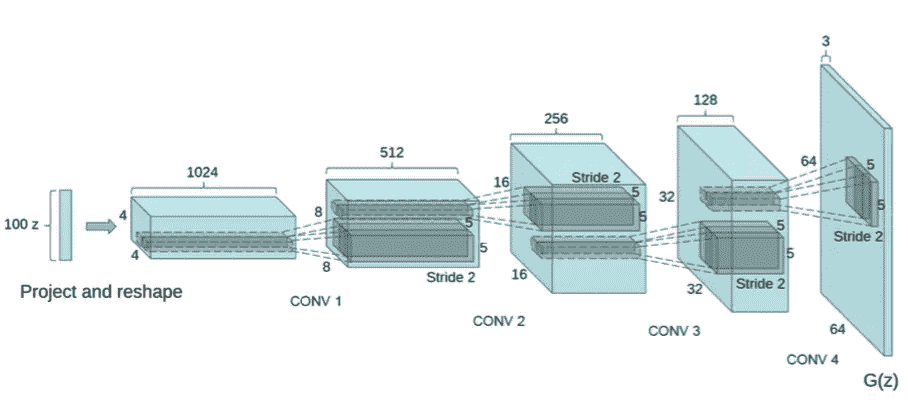
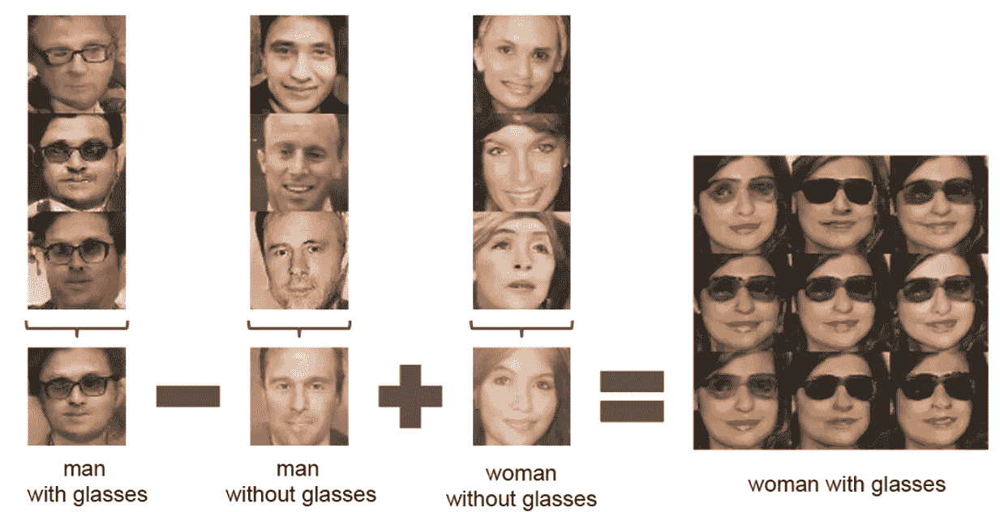
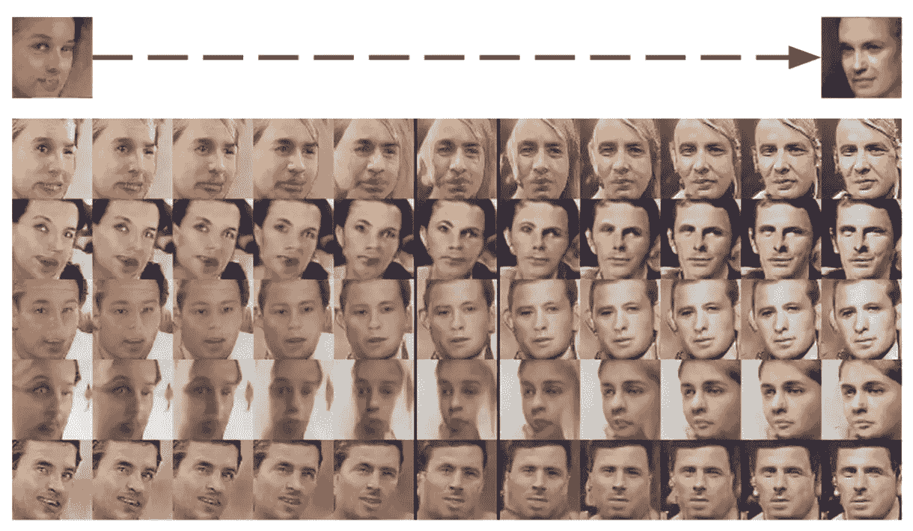

# 生成性对抗网络——第二部分

> 原文：<https://towardsdatascience.com/generative-adversarial-networks-part-ii-6212f7755c1f?source=collection_archive---------1----------------------->

*来看看我的* [*甘斯*](https://www.youtube.com/watch?v=3z8VSpBL6Vg&list=PLSgGvve8UweFoMyAEFlFiE--JtWect5-T) *上的 YouTube 视频换个视角。本文原载于*

*在本系列的第一部分[中，我们展示了最初的 GAN 论文。尽管在当时很聪明并给出了最先进的结果，但自那以后已经有了很大的改进。在这篇文章中，我将谈论来自](https://medium.com/@zjost85/overview-of-gans-generative-adversarial-networks-part-i-ac78ec775e31)[深度卷积 GAN (DCGAN)论文的贡献。](https://arxiv.org/abs/1511.06434)*

# *动机*

*第一部分最后列举了甘的一些问题。其中最主要的是训练稳定性。DCGAN 通过给出具体的网络架构建议，为解决这一问题做出了重大贡献。*

*这些建议针对的是计算机视觉领域，这是深度学习最成功的应用领域之一。特别是卷积层的使用。*

# *DCGAN*

*让我们直接进入架构细节。我假设您对卷积层有基本的了解。如果你需要这个背景，看看[这个帖子](https://adeshpande3.github.io/A-Beginner%27s-Guide-To-Understanding-Convolutional-Neural-Networks-Part-2/)。推荐的改变直接来自于计算机视觉文献的进步。*

1.  *用交错卷积替换池层。历史上，CNN 使用池层来减少维度。例如，一个 2x2 最大池层将采用一个 2x2 像素数组并映射到一个数字，这是其中的最大值。步进卷积可以通过在卷积之间跳跃多个像素来降低维度，而不是逐个滑动内核。类似地，它可以通过在真实像素之间添加空像素来增加维度，这被称为分数步长卷积。[这个](https://arxiv.org/abs/1603.07285)是一个很好的资源，可以学习更多关于步进卷积的细节，但关键是这允许网络学习它自己的空间下采样或上采样。*
2.  *移除完全连接的层，并将输出直接连接到卷积层。*
3.  *批量标准化。这将重新调整每一层的输入，使其具有零均值和单位方差。据称，这极大地有助于模型学习的开始，并有助于避免模式崩溃。但是，批处理规范不适用于发生器输出层或鉴别器输入层(即图像层)，因为这会导致不稳定性。*
4.  *发生器中的 ReLU 激活(使用 tanh 的输出层除外)，以及鉴别器的泄漏 ReLU。据称，这有助于学习更快地覆盖色彩空间。*

**

*DCGAN architecture for Generator*

*上面显示了发生器，但是鉴别器本质上是一个镜像。100-D 噪声输入与高级卷积特性完全相关。然后，这一层使用分数步长将过滤器的大小增加一倍，但创建的数量是一半。重复这种尺寸加倍、数量减半的过程，直到产生 128 个尺寸为 32×32 的过滤器。然后，这是一个 64x64 的三层图像，代表三个颜色通道。*

# *结果*

*以下是在 LSUN 卧室数据集上经过 5 个时期的训练后生成的一些卧室图像。相当酷。*

**

*Generated bedroom images*

*为了进一步证明生成器正在学习有意义的高级特征，他们做了一个实验，进行“图像算术”。*

**

*这里他们找了一个戴眼镜的男人，减去“男人”，加上“女人”，结果是一个戴眼镜的女人。这表明发生器中有专门的部分控制眼镜的存在和性别。这是通过对发电机噪声输入进行这些算术运算来实现的。所以，你取戴眼镜的人的 z 输入向量，减去不戴眼镜的人的 z 输入向量…等等。生成的矢量然后被输入到生成器中，以产生想要的图像。通过向输入向量添加小的随机变化，创建了多个相似的图像。*

*一个更系统的例子是通过在看起来向左和向右的面之间的方向上进行插值。所以你从一个代表向右看的脸的向量开始，慢慢地向向左看的脸的方向移动。这是结果:*

**

*这表明，通过在潜在/噪声空间 z 中行走，您可以对生成的样本中的特征进行系统控制！*

*最后，他们还通过移除真假分类器并将卷积特征输入到一个新的分类器来展示鉴别器的质量，即鉴别器是一个特征提取器。如果有用的、一般的特征被学习是真的，那么通过使用这些特征来训练分类器应该是直截了当的。使用具有 10 种不同图像类别的 CIFAR-10，它具有 83%的竞争精度。有趣的是，DCGAN 不是在 CIFAR-10 数据集本身上训练的，而是在 Imagenet-1k 上训练的。这表明该模型学习了一般的、有用的特征，因为它在完全不同的数据集上给出了很好的性能。*

# *问题*

*剩下的一个问题是表象是*纠缠*的。这意味着输入向量 z 的有用方面与原始噪声纠缠在一起。如果人们能够将“潜在代码”从噪音中分离出来，那么发电机将会更加有用，因为你可以系统而可靠地控制输出，而不必在空间中随意走动。这个问题和解决方案将在第三部分探讨。*