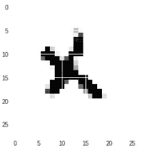
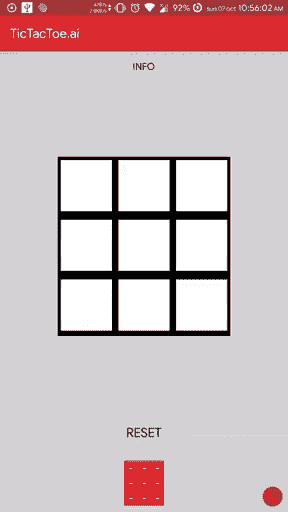

# Android 中的生成对手网络(GAN)——TIC tactoe . ai(第二部分)

> 原文：<https://towardsdatascience.com/generativeadversarialnetwork-gan-in-android-tictactoe-ai-part-2-70155c5ca55b?source=collection_archive---------9----------------------->

生成对抗网络是一种深度网络，用于从随机数据生成图像。它包括两个不同的网络:发生器和鉴别器。鉴别器网络是一个标准的卷积神经网络，可以对输入的图像进行分类，类似于二项式分类器对图像进行真假分类的方式。生成器是一个逆卷积网络，它对随机噪声向量进行上采样以产生图像。


source: [https://skymind.ai/images/wiki/gan_schema.png](https://skymind.ai/images/wiki/gan_schema.png)

作为鉴别者，你帮助生成者创建类似真实的图像。它有助于 GAN 的训练，因为它具有最小-最大损失函数。发生器使 log(1- D(G(z))) (z 是一个随机数据向量)最小，而鉴别器使输出 log(D(x)最大。(x 是一个真实的图像，你可以称之为地面真相，以生成一个图像)

训练 GAN 是一项艰巨的任务，因为两个网络都在努力减少其损耗。它们成反比；如果一个减少，另一个增加。我们必须适当地训练 GAN，给它们相等的迭代次数来训练。此外，检查生成的图像的输出，看看它是否正确。

# GAN 在 tictactoe.ai 中有什么用？

想到把这个游戏拿到单人玩，应该会有人为电脑端画图，于是想到引入两个不同的 gan 来生成 X 和 o。

# 生成对抗网络

我们只需要网络的发电机部分。

定义输入和输出节点，并给它们指定名称。

```
**input_node_name** = 'noise_input_x'
**output_node_name** = 'gen_x'gen_inp = tf.placeholder(tf.float32,shape=[None, noise_dim],name=**input_node_name**)
disc_inp = tf.placeholder(tf.float32,shape= [None, img_dim])def gen_fun(x,output_node_name):
    h1 = tf.matmul(x,W["w1"])
    h1 = tf.add(h1,b["b1"])
    h1 = tf.nn.relu(h1)

    h1 = tf.matmul(h1,W["w2"])
    h1 = tf.add(h1,b["b2"])
    h1 = tf.nn.sigmoid(h1, name=**output_node_name**)

    return h1def disc_fun(x):
    h2 = tf.matmul(x,W["w3"])
    h2 = tf.add(h2,b["b3"])
    h2 = tf.nn.relu(h2)

    h2 = tf.matmul(h2,W["w4"])
    h2 = tf.add(h2,b["b4"])
    h2 = tf.nn.sigmoid(h2)

    return h2
```

# 培训产出



generated image

# **从图形中提取生成器**

```
freeze_graph.freeze_graph('out/' + **MODEL_NAME** + '.pbtxt', None, False,
    'out/' + **MODEL_NAME** + '.chkp', **output_node_name**, "save/restore_all",
    "save/Const:0", 'out/frozen_' + **MODEL_NAME** + '.pb', True, "")input_graph_def = tf.GraphDef()
with tf.gfile.Open('out/frozen_' + **MODEL_NAME** + '.pb', "rb") as f:
    input_graph_def.ParseFromString(f.read())**input_node_names = ['noise_input_x']**

output_graph_def = optimize_for_inference_lib.optimize_for_inference(
        input_graph_def, **input_node_names**, [**output_node_name**],
        tf.float32.as_datatype_enum)with tf.gfile.FastGFile('out/opt_' + **MODEL_NAME** + '.pb', "wb") as f:
    f.write(output_graph_def.SerializeToString())
```

对于上面的代码，您将得到一个优化的发电机网络图

# 放在安卓系统里

首先，在 Android 的资产文件夹中复制你的发电机优化图

```
private String MODEL_GAN_O = "file:///android_asset/opt_gan_O.pb";
private String MODEL_GAN_X = "file:///android_asset/opt_gan_X.pb";private void loadGANs(){
        inferenceInterface_GAN_O = new TensorFlowInferenceInterface(getAssets(),MODEL_GAN_O);
        inferenceInterface_GAN_X = new TensorFlowInferenceInterface(getAssets(),MODEL_GAN_X);
}
```

要生成 O，我们必须将随机噪声向量传递给图

```
public int[] getGAN_O(){ **// random noise input vector**    
        **float [] noise_input = new float [100];
        for(int i =0 ; i<noise_input.length; i++){
            float value = rand.nextFloat();
            noise_input[i] = (value*2)-1;
        }**
        inferenceInterface_GAN_O.feed(INPUT_NODE_GAN_O, noise_input,1,100);
        inferenceInterface_GAN_O.run(new String[]{OUTPUT_NODE_GAN_O},false); float [] image = new float[784];
        int [] int_image = new int[784];
        //get the output
        inferenceInterface_GAN_O.fetch(OUTPUT_NODE_GAN_O,image); ** //output image**
        **for(int i =0 ; i<image.length; i++){
            int_image[i] = (int)(image[i]*255);
        }
        return int_image;**
}
```

同样，为了生成 X，我们必须将随机噪声向量传递给图形

```
public int[] getGAN_X(){ **// random noise input vector**    
        **float [] noise_input = new float [100];
        for(int i =0 ; i<noise_input.length; i++){
            float value = rand.nextFloat();
            noise_input[i] = (value*2)-1;
        }**
        inferenceInterface_GAN_X.feed(INPUT_NODE_GAN_X, noise_input,1,100);
        inferenceInterface_GAN_X.run(new String[]{OUTPUT_NODE_GAN_X},false);float [] image = new float[784];
        int [] int_image = new int[784];
        //get the output
        inferenceInterface_GAN_X.fetch(OUTPUT_NODE_GAN_X,image); **//output image**
        **for(int i =0 ; i<image.length; i++){
            int_image[i] = (int)(image[i]*255);
        }
        return int_image;**
}
```



这是 CNN 和 GAN 整合后的结果。完成应用程序的所有逻辑。

你可以在 play store 上试用它上传的应用:【https://play.google.com/store/apps/details?id=com.harsh.xo 

**未来作品**:可能在做条件 GAN，帮我从同一个网络生成 X 和 O。

[](/android-with-tensorflow-part-1-6897ba617b1e) [## Android 中的 ConvolutionNeuralNetwork(CNN)——TIC tactoe . ai(第 1 部分)

### Google Tensorflow 现在已经在 Android 中用于集成机器学习模型。

towardsdatascience.com](/android-with-tensorflow-part-1-6897ba617b1e) [](https://play.google.com/store/apps/details?id=com.harsh.xo) [## tictactoe . ai-Google Play 上的应用程序

### 我正致力于在安卓系统中集成卷积神经网络，因为我在…

play.google.com](https://play.google.com/store/apps/details?id=com.harsh.xo)