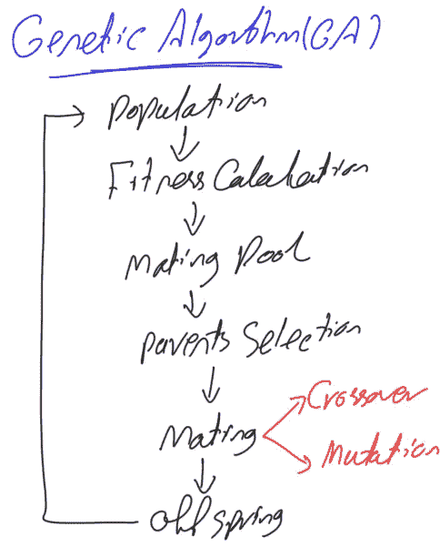

# 遗传算法在 Python 中的实现

> 原文：<https://towardsdatascience.com/genetic-algorithm-implementation-in-python-5ab67bb124a6?source=collection_archive---------0----------------------->

本教程将基于一个简单的例子用 Python 实现遗传算法优化技术，在这个例子中，我们试图最大化一个方程的输出。本教程使用基因的十进制表示、单点交叉和一致变异。

2020 年 5 月 5 日注

> 本教程的 GitHub 项目进行了更新，对项目进行了重大修改，以支持多种功能:【https://github.com/ahmedfgad/GeneticAlgorithmPython】T2。例如，除了能够定制适应度函数来处理任何类型的问题之外，还实现了多种类型的变异和交叉。基于这个项目，一个名为 PyGAD 的库被部署到 PyPI 中，在那里您可以使用 pip 进行安装:【https://pypi.org/project/pygad
> 
> 本教程的原始代码位于[教程项目](https://github.com/ahmedfgad/GeneticAlgorithmPython/tree/master/Tutorial%20Project)目录下，该目录可从以下链接获得:[https://github . com/ahmedfgad/geneticalgorithpython/tree/master/Tutorial % 20 Project](https://github.com/ahmedfgad/GeneticAlgorithmPython/tree/master/Tutorial%20Project)


**Genetic Algorithm Implementation in Python — By Ahmed F. Gad**

# **遗传算法概述**

遗传算法(GA)的流程图如图 1 所示。遗传算法中涉及的每一步都有一些变化。



**Figure 1\. Genetic algorithm flowchart**

例如，基因有不同类型的表示，如二进制、十进制、整数等。每种类型都有不同的处理方式。有不同类型的突变，如位翻转、交换、逆、均匀、非均匀、高斯、收缩等。此外，交叉有不同的类型，如混合、一点、两点、均匀和其他。本教程不会实现所有这些，而只是实现 GA 中涉及的每个步骤的一种类型。本教程使用基因的十进制表示、单点交叉和一致变异。读者应该了解遗传算法是如何工作的。如果没有，请阅读这篇题为“遗传算法优化简介”的文章，文章链接如下:

LinkedIn:[https://www . LinkedIn . com/pulse/introduction-optimization-genetic-algorithm-Ahmed-gad/](https://www.linkedin.com/pulse/introduction-optimization-genetic-algorithm-ahmed-gad/)

KDnuggets:[https://www . kdnugges . com/2018/03/introduction-optimization-with-genetic-algorithm . html](https://www.kdnuggets.com/2018/03/introduction-optimization-with-genetic-algorithm.html)

towards data science:[https://towards data science . com/introduction-to-optimization-with-genetic-algorithm-2f 5001d 9964 b](/introduction-to-optimization-with-genetic-algorithm-2f5001d9964b)

slide share:[https://www . slide share . net/AhmedGadFCIT/introduction-to-optimization-with-genetic-algorithm-ga](https://www.slideshare.net/AhmedGadFCIT/introduction-to-optimization-with-genetic-algorithm-ga)

# **教程示例**

本教程首先介绍我们将要实现的等式。该等式如下所示:

**Y = w1x 1+w2x 2+w3x 3+w4x 4+w5x 5+w6x 6**

如图所示，该等式具有 6 个输入(x1 至 x6)和 6 个权重(w1 至 w6)，输入值为(x1，x2，x3，x4，x5，x6)=(4，-2，7，5，11，1)。我们正在寻找使该等式最大化的参数(权重)。最大化这个等式的想法似乎很简单。正输入要乘以最大可能的正数，负数要乘以最小可能的负数。但我们希望实现的想法是，如何让 GA 自己去做，以便知道最好是使用正输入的正权重和负输入的负权重。让我们开始实施 GA。

首先，让我们创建一个包含 6 个输入和一个变量的列表来保存权重的数量，如下所示:

```
*# Inputs of the equation.* equation_inputs = [4,-2,3.5,5,-11,-4.7]
 *# Number of the weights we are looking to optimize.* num_weights = 6
```

下一步是定义初始群体。基于权重的数量，群体中的每个染色体(解或个体)肯定会有 6 个基因，每个权重一个基因。但问题是每个人有多少解决方案？没有固定的值，我们可以选择适合我们问题的值。但是我们可以让它保持通用，这样就可以在代码中修改它。接下来，我们创建一个保存每个群体的解的数量的变量，另一个保存群体的大小，最后，一个保存实际初始群体的变量:

```
**import** numpysol_per_pop = 8*# Defining the population size.* pop_size = (sol_per_pop,num_weights) *# The population will have sol_per_pop chromosome where each chromosome has num_weights genes.

#Creating the initial population.* new_population = numpy.random.uniform(low=-4.0, high=4.0, size=pop_size)
```

导入 numpy 库后，我们能够使用 numpy.random.uniform 函数随机创建初始群体。根据选定的参数，它的形状将是(8，6)。这是 8 条染色体，每条染色体有 6 个基因，每个基因对应一个体重。运行此代码后，填充如下:

```
[[-2.19134006 -2.88907857  2.02365737 -3.97346034  3.45160502  2.05773249][ 2.12480298  2.97122243  3.60375452  3.78571392  0.28776565  3.5170347 ][ 1.81098962  0.35130155  1.03049548 -0.33163294  3.52586421  2.53845644][-0.63698911 -2.8638447   2.93392615 -1.40103767 -1.20313655  0.30567304][-1.48998583 -1.53845766  1.11905299 -3.67541087  1.33225142  2.86073836][ 1.14159503  2.88160332  1.74877772 -3.45854293  0.96125878  2.99178241][ 1.96561297  0.51030292  0.52852716 -1.56909315 -2.35855588  2.29682254][ 3.00912373 -2.745417    3.27131287 -0.72163167  0.7516408   0.00677938]]
```

请注意，它是随机生成的，因此在再次运行时肯定会发生变化。

准备好群体后，接下来要遵循图 1 中的流程图。基于适应度函数，我们将选择当前种群中最好的个体作为交配的亲本。下一步是应用 GA 变体(交叉和变异)来产生下一代的后代，通过附加父母和后代来创建新的群体，并重复这样的步骤若干次迭代/世代。下一段代码应用这些步骤:

```
**import ga**num_generations = 5

num_parents_mating = 4
**for** generation **in** range(num_generations):
     *# Measuring the fitness of each chromosome in the population.* fitness = ga.cal_pop_fitness(equation_inputs, new_population)
    *# Selecting the best parents in the population for mating.* parents = ga.select_mating_pool(new_population, fitness, 
                                       num_parents_mating)

     *# Generating next generation using crossover.* offspring_crossover = ga.crossover(parents,
                                        offspring_size=(pop_size[0]-parents.shape[0], num_weights))

     *# Adding some variations to the offsrping using mutation.* offspring_mutation = ga.mutation(offspring_crossover)*# Creating the new population based on the parents and offspring.* new_population[0:parents.shape[0], :] = parents
     new_population[parents.shape[0]:, :] = offspring_mutation
```

目前的世代数是 5。它被选择为小，用于呈现教程中所有代的结果。有一个名为 GA 的模块保存算法的实现。

第一步是使用 ga `.cal_pop_fitness`函数找到群体中每个解的适应值。该功能在 GA 模块中的实现如下:

```
**def** cal_pop_fitness(equation_inputs, pop):
     *# Calculating the fitness value of each solution in the current population.
     # The fitness function calculates the sum of products between each input and its corresponding weight.* fitness = numpy.sum(pop*equation_inputs, axis=1)
     **return** fitness
```

除了总体，适应度函数还接受两个方程输入值(x1 至 x6)。根据我们的函数，将适应值计算为每个输入与其相应基因(权重)之间的乘积之和(SOP)。根据每个群体的解决方案数量，将会有多个 sop。由于我们之前在名为`sol_per_pop`的变量中将解的数量设置为 8，因此将有 8 个 sop，如下所示:

```
[-63.41070188  14.40299221 -42.22532674  18.24112489 -45.44363278 -37.00404311  15.99527402  17.0688537 ]
```

请注意，适应值越高，解决方案越好。

在计算出所有解的适应值后，接下来是根据下一个函数`ga.select_mating_pool`在交配池中选择其中最好的作为亲本。该函数接受人口、适应值和所需的双亲数量。它返回所选的父节点。它在 GA 模块中的实现如下:

```
**def** select_mating_pool(pop, fitness, num_parents):

    *# Selecting the best individuals in the current generation as parents for producing the offspring of the next generation.* parents = numpy.empty((num_parents, pop.shape[1]))

    **for** parent_num **in** range(num_parents):

        max_fitness_idx = numpy.where(fitness == numpy.max(fitness))

        max_fitness_idx = max_fitness_idx[0][0]

        parents[parent_num, :] = pop[max_fitness_idx, :]

        fitness[max_fitness_idx] = -99999999999

    **return** parents
```

根据变量`num_parents_mating`中定义的所需父节点的数量，该函数创建一个空数组来保存它们，如下行所示:

```
parents = numpy.empty((num_parents, pop.shape[1]))
```

循环遍历当前群体，该函数获得最高适应值的索引，因为它是根据该行选择的最佳解决方案:

```
max_fitness_idx = numpy.where(fitness == numpy.max(fitness))
```

该索引用于使用以下代码行检索与此类适应值对应的解决方案:

```
parents[parent_num, :] = pop[max_fitness_idx, :]
```

为了避免再次选择这样的解决方案，其适应度值被设置为很小的值，该值很可能不会被再次选择，即**-9999999999**。最后返回 **parents** 数组，根据我们的例子如下:

```
[[-0.63698911 -2.8638447   2.93392615 -1.40103767 -1.20313655  0.30567304][ 3.00912373 -2.745417    3.27131287 -0.72163167  0.7516408   0.00677938][ 1.96561297  0.51030292  0.52852716 -1.56909315 -2.35855588  2.29682254]
[ 2.12480298  2.97122243  3.60375452  3.78571392  0.28776565  3.5170347 ]]
```

请注意，这三个父母是当前群体中的最佳个体，基于他们的适合度值分别为 18.24112489、17.0688537、15.99527402 和 14.40299221。

下一步是使用这样选择的父母交配，以产生后代。根据`ga.crossover`功能，配对从交叉操作开始。这个函数接受父母和后代的大小。它使用后代大小来知道从这样的父母产生的后代的数量。这种功能在 GA 模块中实现如下:

```
**def** crossover(parents, offspring_size):
     offspring = numpy.empty(offspring_size)
     *# The point at which crossover takes place between two parents. Usually, it is at the center.* crossover_point = numpy.uint8(offspring_size[1]/2)

     **for** k **in** range(offspring_size[0]):
         *# Index of the first parent to mate.* parent1_idx = k%parents.shape[0]
         *# Index of the second parent to mate.* parent2_idx = (k+1)%parents.shape[0]
         *# The new offspring will have its first half of its genes taken from the first parent.* offspring[k, 0:crossover_point] = parents[parent1_idx, 0:crossover_point]
         *# The new offspring will have its second half of its genes taken from the second parent.* offspring[k, crossover_point:] = parents[parent2_idx, crossover_point:]
     **return** offspring
```

该函数首先根据后代大小创建一个空数组，如下所示:

```
offspring = numpy.empty(offspring_size)
```

因为我们使用单点交叉，我们需要指定交叉发生的点。选择该点，根据这条线将解分成相等的两半:

```
crossover_point = numpy.uint8(offspring_size[1]/2)
```

然后我们需要选择双亲进行杂交。这些亲本的指数是根据这两条线选择的:

```
parent1_idx = k%parents.shape[0]
parent2_idx = (k+1)%parents.shape[0]
```

双亲以类似于环的方式被选择。首先选择具有索引 0 和 1 的第一个来产生两个后代。如果还有剩余的后代要产生，那么我们选择亲本 1 和亲本 2 来产生另外两个后代。如果我们需要更多的后代，那么我们选择指数为 2 和 3 的下两个父母。通过索引 3，我们到达了最后一个父节点。如果我们需要产生更多的后代，那么我们选择索引为 3 的父代，然后回到索引为 0 的父代，依此类推。

将交叉操作应用于双亲后的解存储在`offspring` 变量中，如下所示:

```
[[-0.63698911 -2.8638447   2.93392615 -0.72163167  0.7516408   0.00677938][ 3.00912373 -2.745417    3.27131287 -1.56909315 -2.35855588  2.29682254][ 1.96561297  0.51030292  0.52852716  3.78571392  0.28776565  3.5170347 ][ 2.12480298  2.97122243  3.60375452 -1.40103767 -1.20313655  0.30567304]]
```

下一步是使用 GA 模块中的`ga.mutation`函数将第二个 GA 变体(突变)应用于存储在`offspring` 变量中的交叉结果。该函数接受交叉子代，并在应用统一变异后返回它们。该功能实现如下:

```
**def** mutation(offspring_crossover):

    *# Mutation changes a single gene in each offspring randomly.* **for** idx **in** range(offspring_crossover.shape[0]):

        *# The random value to be added to the gene.* random_value = numpy.random.uniform(-1.0, 1.0, 1)

        offspring_crossover[idx, 4] = offspring_crossover[idx, 4] + random_value

    **return** offspring_crossover
```

它循环遍历每个后代，并根据下面的代码行添加一个在-1 到 1 范围内统一生成的随机数:

```
random_value = numpy.random.uniform(-1.0, 1.0, 1)
```

这样的随机数然后被加到后代的索引为 4 的基因上:

```
offspring_crossover[idx, 4] = offspring_crossover[idx, 4] + random_value
```

请注意，该索引可以更改为任何其他索引。应用突变后的后代如下:

```
[[-0.63698911 -2.8638447   2.93392615 -0.72163167  1.66083721  0.00677938][ 3.00912373 -2.745417    3.27131287 -1.56909315 -1.94513681  2.29682254][ 1.96561297  0.51030292  0.52852716  3.78571392  0.45337472  3.5170347 ][ 2.12480298  2.97122243  3.60375452 -1.40103767 -1.5781162   0.30567304]]
```

这些结果被添加到变量`offspring_crossover`中，并由函数返回。

在这一点上，我们成功地从 4 个选择的亲本中产生了 4 个后代，并且我们准备创建下一代的新群体。

注意，遗传算法是一种基于随机的优化技术。它试图通过对当前解决方案进行一些随机更改来增强它们。因为这样的改变是随机的，我们不确定它们会产生更好的解决方案。因此，最好在新的种群中保留以前的最佳解(父代)。在最坏的情况下，当所有新的后代都比这样的父母更差时，我们将继续使用这样的父母。这样一来，我们保证新一代至少会保留以前的好成绩，不会变得更差。新群体将从以前的父母那里得到它的前 4 个解决方案。最后 4 个解决方案来自应用交叉和变异后产生的后代:

```
new_population[0:parents.shape[0], :] = parents
new_population[parents.shape[0]:, :] = offspring_mutation
```

通过计算第一代所有解(父代和后代)的适应度，它们的适应度如下:

```
[ 18.24112489  17.0688537   15.99527402  14.40299221  -8.46075629  31.73289712   6.10307563  24.08733441]
```

之前最高体能是 **18.24112489** 现在是**31.971158**。这意味着随机变化朝着更好的解决方案发展。这太棒了。但是，这样的结果可以通过更多代来加强。下面是另外 4 代的每个步骤的结果:

```
**Generation :  1****Fitness values:**[ 18.24112489  17.0688537   15.99527402  14.40299221  -8.46075629  31.73289712   6.10307563  24.08733441]**Selected parents:**[[ 3.00912373 -2.745417    3.27131287 -1.56909315 -1.94513681  2.29682254][ 2.12480298  2.97122243  3.60375452 -1.40103767 -1.5781162   0.30567304][-0.63698911 -2.8638447   2.93392615 -1.40103767 -1.20313655  0.30567304][ 3.00912373 -2.745417    3.27131287 -0.72163167  0.7516408   0.00677938]]**Crossover result:**[[ 3.00912373 -2.745417    3.27131287 -1.40103767 -1.5781162   0.30567304][ 2.12480298  2.97122243  3.60375452 -1.40103767 -1.20313655  0.30567304][-0.63698911 -2.8638447   2.93392615 -0.72163167  0.7516408   0.00677938][ 3.00912373 -2.745417    3.27131287 -1.56909315 -1.94513681  2.29682254]]**Mutation result:**[[ 3.00912373 -2.745417    3.27131287 -1.40103767 -1.2392086   0.30567304][ 2.12480298  2.97122243  3.60375452 -1.40103767 -0.38610586  0.30567304][-0.63698911 -2.8638447   2.93392615 -0.72163167  1.33639943  0.00677938][ 3.00912373 -2.745417    3.27131287 -1.56909315 -1.13941727  2.29682254]]**Best result after generation 1 :  34.1663669207****Generation :  2****Fitness values:**[ 31.73289712  24.08733441  18.24112489  17.0688537   34.16636692  10.97522073  -4.89194068  22.86998223]**Selected Parents:**[[ 3.00912373 -2.745417    3.27131287 -1.40103767 -1.2392086   0.30567304][ 3.00912373 -2.745417    3.27131287 -1.56909315 -1.94513681  2.29682254][ 2.12480298  2.97122243  3.60375452 -1.40103767 -1.5781162   0.30567304][ 3.00912373 -2.745417    3.27131287 -1.56909315 -1.13941727  2.29682254]]**Crossover result:**[[ 3.00912373 -2.745417    3.27131287 -1.56909315 -1.94513681  2.29682254][ 3.00912373 -2.745417    3.27131287 -1.40103767 -1.5781162   0.30567304][ 2.12480298  2.97122243  3.60375452 -1.56909315 -1.13941727  2.29682254][ 3.00912373 -2.745417    3.27131287 -1.40103767 -1.2392086   0.30567304]]**Mutation result:**[[ 3.00912373 -2.745417    3.27131287 -1.56909315 -2.20515009  2.29682254][ 3.00912373 -2.745417    3.27131287 -1.40103767 -0.73543721  0.30567304][ 2.12480298  2.97122243  3.60375452 -1.56909315 -0.50581509  2.29682254][ 3.00912373 -2.745417    3.27131287 -1.40103767 -1.20089639  0.30567304]]**Best result after generation 2:  34.5930432629****Generation :  3****Fitness values:**[ 34.16636692  31.73289712  24.08733441  22.86998223  34.59304326  28.6248816    2.09334217  33.7449326 ]**Selected parents:**[[ 3.00912373 -2.745417    3.27131287 -1.56909315 -2.20515009  2.29682254][ 3.00912373 -2.745417    3.27131287 -1.40103767 -1.2392086   0.30567304][ 3.00912373 -2.745417    3.27131287 -1.40103767 -1.20089639  0.30567304][ 3.00912373 -2.745417    3.27131287 -1.56909315 -1.94513681  2.29682254]]**Crossover result:**[[ 3.00912373 -2.745417    3.27131287 -1.40103767 -1.2392086   0.30567304][ 3.00912373 -2.745417    3.27131287 -1.40103767 -1.20089639  0.30567304][ 3.00912373 -2.745417    3.27131287 -1.56909315 -1.94513681  2.29682254][ 3.00912373 -2.745417    3.27131287 -1.56909315 -2.20515009  2.29682254]]**Mutation result:**[[ 3.00912373 -2.745417    3.27131287 -1.40103767 -2.20744102  0.30567304][ 3.00912373 -2.745417    3.27131287 -1.40103767 -1.16589294  0.30567304][ 3.00912373 -2.745417    3.27131287 -1.56909315 -2.37553107  2.29682254][ 3.00912373 -2.745417    3.27131287 -1.56909315 -2.44124005  2.29682254]]**Best result after generation 3:  44.8169235189****Generation :  4****Fitness values**[ 34.59304326  34.16636692  33.7449326   31.73289712  44.8169235233.35989464  36.46723397  37.19003273]**Selected parents:**[[ 3.00912373 -2.745417    3.27131287 -1.40103767 -2.20744102  0.30567304][ 3.00912373 -2.745417    3.27131287 -1.56909315 -2.44124005  2.29682254][ 3.00912373 -2.745417    3.27131287 -1.56909315 -2.37553107  2.29682254][ 3.00912373 -2.745417    3.27131287 -1.56909315 -2.20515009  2.29682254]]**Crossover result:**[[ 3.00912373 -2.745417    3.27131287 -1.56909315 -2.37553107  2.29682254][ 3.00912373 -2.745417    3.27131287 -1.56909315 -2.20515009  2.29682254][ 3.00912373 -2.745417    3.27131287 -1.40103767 -2.20744102  0.30567304]]**Mutation result:**[[ 3.00912373 -2.745417    3.27131287 -1.56909315 -2.13382082  2.29682254][ 3.00912373 -2.745417    3.27131287 -1.56909315 -2.98105233  2.29682254][ 3.00912373 -2.745417    3.27131287 -1.56909315 -2.27638584  2.29682254][ 3.00912373 -2.745417    3.27131287 -1.40103767 -1.70558545  0.30567304]]**Best result after generation 4:  44.8169235189**
```

在上述 5 代之后，与第一代之后的最佳结果 **18.24112489** 相比，最佳结果现在具有等于 **44.8169235189** 的适应值。

最佳解决方案具有以下权重:

```
[3.00912373 -2.745417    3.27131287 -1.40103767 -2.20744102  0.30567304]
```

# 完整的 Python 实现

完整的代码可以在我的 GitHub 账号这里获得:[https://GitHub . com/ahmedfgad/genetical gorithm python/tree/master/Tutorial % 20 project](https://github.com/ahmedfgad/GeneticAlgorithmPython/tree/master/Tutorial%20Project)。它也会在教程中列出。

下面是该示例的实现:

**遗传算法模块如下:**

原文可在 LinkedIn 本页面获得:[https://www . LinkedIn . com/pulse/genetic-algorithm-implementation-python-Ahmed-gad/](https://www.linkedin.com/pulse/genetic-algorithm-implementation-python-ahmed-gad/)

## **联系作者:**

领英:[https://linkedin.com/in/ahmedfgad](https://linkedin.com/in/ahmedfgad)

电子邮件:ahmed.f.gad@gmail.com