# 流派精要——建立专辑推荐系统

> 原文：<https://towardsdatascience.com/genre-essentials-building-an-album-recommender-system-c89c308d16f0?source=collection_archive---------3----------------------->

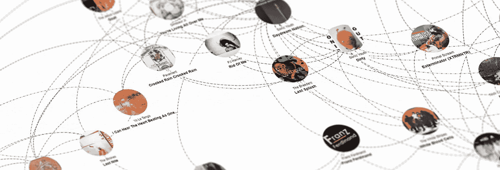

# 这个想法

为了练习我的 Python 技能并探索推荐系统的内部工作方式，我决定使用协作过滤来构建一个推荐系统，该系统基于以音乐专辑的用户评级形式的明确反馈。我自己提出的一个约束是我不会使用任何外部库。因此，我没有使用黑盒库方法，而是自己编写了所有代码。

4chan 的音乐鉴赏家创作的[generessentials](http://www.genreessentials.com/)的主要灵感来源是 [mu/essential](http://4chanmusic.wikia.com/wiki/Essential_Charts) 图表。这些专辑选曲帮助听众对音乐类型有一个基本的了解。每个图表由黑色背景上的专辑封面网格组成，并附有专辑标题列表，以帮助用户识别有问题的专辑。

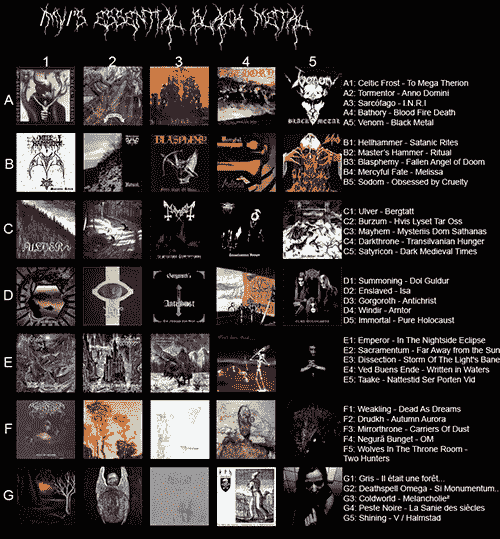

Essential Black Metal

我已经使用这些图表很长时间了，它们帮助我找到了一些我最喜欢的专辑(例如。*九州——欢迎来到天空谷*)，它们很棒……但是……它们不切实际。首先，我必须从列表中随机选择一张专辑封面，然后浏览列表找到相应的标题，在音乐流媒体网站上查找，开始听它，如果不好就从头开始。这个过程不仅浪费时间，而且由于下一张专辑的选择是随机的，它还浪费了潜在的有用信息——用户已经听过的专辑列表。

GenreEssentials 保留了这些图表的基本概念，并用推荐系统扩展了它们，该推荐系统可以预测用户将喜欢的专辑列表，并根据这些预测生成个性化的收听顺序。只需点击一下，用户就可以在 YouTube 上找到专辑，听听它，然后在提供反馈后，网络应用程序根据用户的偏好对图表进行排序。

# 1.获取数据

该应用的架构由两个主要组件组成，一个用 Java 和 Python 编写的数据管道和一个用 JavaScript 编写的演示模块，部署在 PHP 服务器上。我最初的意图是只用 Java 编写 scraper，用 Python 编写数据挖掘模块，但是我对自己的和机器的 Python 缓慢性能感到沮丧，所以我最终用 Java 编写了大部分代码。

管道的输入是包含专辑列表的 TSV 文本文件。Java web scraper 模块解析列表，使用 JSoup 在公共 API 和 web 上查找每个相册，使用 Hibernate 将其映射到一个模式，并将其作为相册包保存在 MySQL 数据库中。大部分信息是从 Discogs、LastFM 和维基百科 API 获得的。

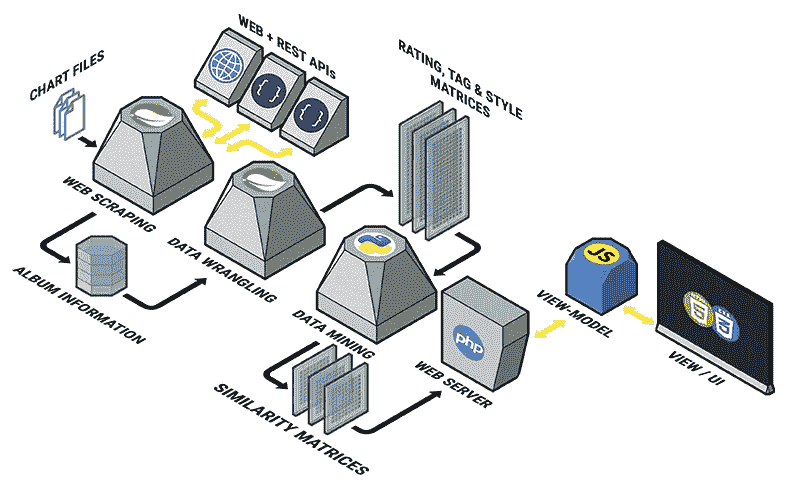

GenreEssentials Architecture

数据争论和挖掘模块读取相册包，分析数据，对其执行各种矩阵操作，并使用 Jackson 输出 JSON 包列表。表示层托管在 PHP 服务器上，数据用 d3.js 可视化，UI 交互用 knockout.js 和 jQuery 处理。

# 2.了解数据

在收集了我需要的所有数据后，第一步是将这些数据转换成有用的格式。我为每张专辑收集了三类信息:风格&流派、标签和用户评分。目标是将它们转换成[向量空间模型](https://en.wikipedia.org/wiki/Vector_space_model)，这样它们就可以被比较、分解等等。以获得对它们之间关系的有价值的见解。

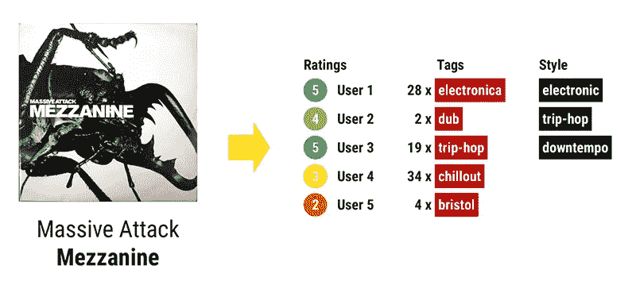

Album information example

风格和流派信息被组合形成一个[关联矩阵](https://en.wikipedia.org/wiki/Incidence_matrix)，其中每行代表一个专辑的术语向量，每个术语的出现得到一个二进制权重。我增加了从中获得有用信息的机会，方法是将每个术语转换为小写，用空格替换破折号、与号和斜线，分解多词术语，并将这些新术语添加到集合中。例如，虽然在原始设置中["psy-trance"]和["trance"]是零匹配，但是现在在["psy "、" Trance "、" psy trance"]和["trance"]之间有一些重叠。

对于标签“clouds ”,我也有每张专辑的出现次数，所以我使用了与风格和流派相同的替换和拆分方法，但这次我还必须给新术语一些虚拟权重。我决定将原始术语的出现拆分到新术语中。例如，如果一张专辑的标签“另类摇滚”被使用了 240 次，我就添加了 120 x“另类”和 120 x“摇滚”。

可能到目前为止，我得到的最相关的信息是用户评分。我把这些想象成一个 UxI 矩阵来获得第一印象。

sparsity of the Rating Matrix of the Pink Floyd Discography

如你所见，它相当稀疏。一些用户对一张专辑进行了评级，使得他们在专辑相似性方面或多或少不相关，所以我最终删除了他们以[减少维度](https://en.wikipedia.org/wiki/Feature_selection)。但在此之前，我提取了他们确实会影响的所有相关信息，即总评分(衡量每个项目的知名度)和平均评分(衡量“喜欢”它的程度)。我将该信息存储在 Ix5 矩阵中，其中专辑向量的 5 个值是投票计数，并使用它来确定专辑列表的初始顺序。

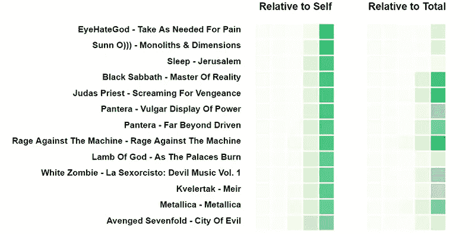

Essential Metal Albums sorted by average rating with rating distributions visualized

看着相对于总评分和相对于专辑自身评分的评分分布的可视化，我们可以问这样一个问题:这些评分真的有多大意义？如果我们按平均评分对专辑进行排序，我们可以看到，例如 *EyeHateGod，*一个有点地下的乐队拥有最高的平均评分，而“对机器的愤怒”,一个最受欢迎的乐队在名单的下半部分。[以 IMDb 为例](http://www.imdb.com/help/show_leaf?ratingsexplanation)通过给每一票分配权重来平衡铁杆粉丝的热情，从而消除了这种极端情况。

另一方面，总评分提供了一个很好的专辑受欢迎程度的估计，所以我决定用它作为列表初始排序的基础。

## 计算相似度

共享评级也揭示了专辑之间的一些相关联系，这给了我探索专辑相似性的想法。计算每个专辑对之间的联系或相似性将产生 IxI 评级-相似性矩阵。因为我已经有了向量空间模型形式的所有数据，所以我可以使用相似性度量从中提取有价值的信息。我将我拥有的 3 个矩阵缩减为 3 个方阵，然后将它们合并在一起。矩阵的值根本不同，所以我不得不选择稍微不同的方法来度量相似性。

## **算计风格&流派相似点**

由于风格&流派向量值是二进制的，所以可以通过使用[余弦相似度](https://en.wikipedia.org/wiki/Cosine_similarity)来计算项目之间的距离。

如果原始值为正(我们的情况)，余弦相似性将向量之间的角度映射到[-1，1]或[0，1]的范围。它对相似之处给予了很高的奖励，而没有惩罚差异，所以在这种情况下这是一个很好的选择。这样，IxN 矩阵可以简化为 IxI 矩阵。

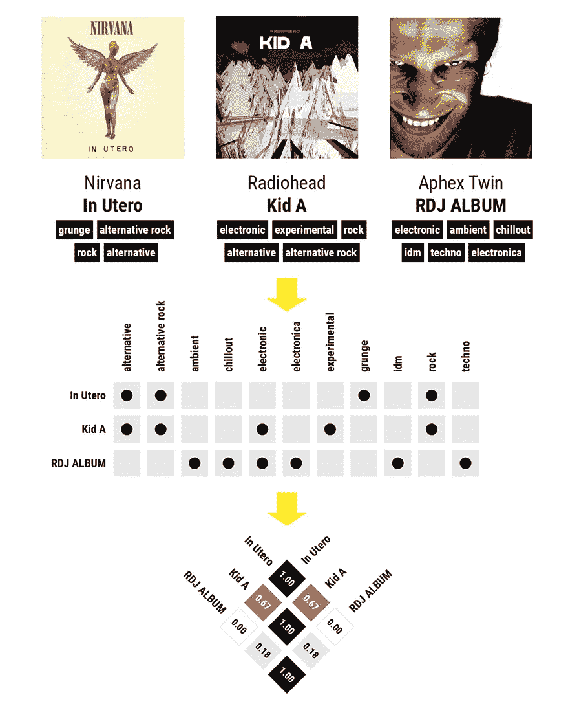

Comparing genres & styles with Cosine Similarity

## **计算标签相似度**

虽然风格&流派矩阵是二进制的，但是标签矩阵值保存标签计数信息，所以它也是严格正的，但是在可以计算它们之间的相似性之前，必须对这些值进行缩放和平滑。

这个矩阵的一个不便之处是，一些不太出名的专辑在最后一张里没有找到。所以我即兴使用了他们的风格和流派术语。因此，这些专辑的总标签数低于 10，而其他专辑有 100 个标签。这意味着一个不太受欢迎的专辑将错过标签，不是因为这些标签是不相关的，而仅仅是因为标签数量相差很大。为了平滑这一点并减少假阴性的数量，我选择牺牲一些细节，使专辑彼此更加相似。我将计数调整到 0 到 20 之间，并应用 k=1 的[拉普拉斯平滑](https://en.wikipedia.org/wiki/Additive_smoothing)，以确保原始计数和为平滑而添加的计数之间的比率为 1:20，并基于这些值计算余弦相似性。

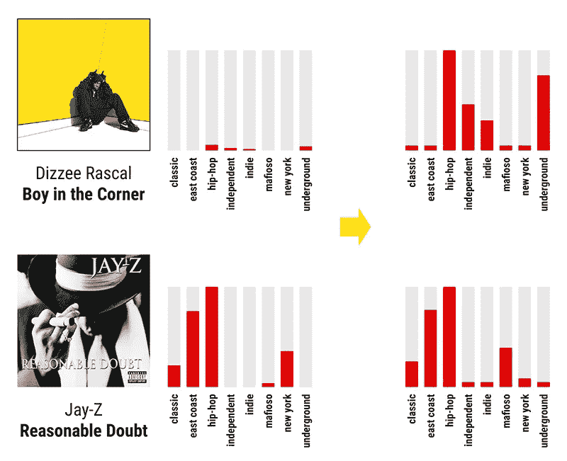

## **计算评分相似度**

使用余弦相似度进行评级的问题在于，它对于变化并不是不变的。换句话说，它认为一个给专辑 A 和专辑 B 都打 1 星的用户和一个给 5 星的用户非常相似。我们真的不知道 1 分实际上意味着什么，但更有可能的是，给予 1 星评级更多的是强烈的负面反应，而不是轻微的正面反应。这很重要，因为就矢量而言，尤其是余弦距离而言，原点的不同位置会导致完全不同的相似系数。

如果我们将评级相对于它们的平均值(假设是 3)居中，以前的 1 星和 5 星评级现在变成了-2 和+2，它们之间的角度从 0°变为 180°，它们的余弦相似度从 1 变为 1。例如，假设我们想要比较两个项目，一个项目获得了两个评分[1，1]，另一个项目获得了[4，5]。得到的余弦相似度将接近 1。将数据集移动到中心将导致向量[-2，-2]和[1，2]以及接近-1 的相似度。

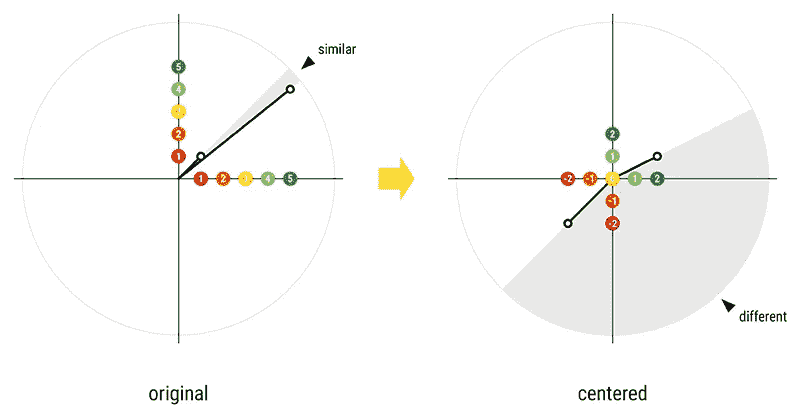

center shifted Cosine Similarity

因此，如果我们想要更精确，我们可以计算评级的平均值来确定数据集的真正中心，然后从所有评级中减去它。还可以使用[皮尔逊相关系数](https://en.wikipedia.org/wiki/Pearson_correlation_coefficient)来计算中心的相似性不变量。

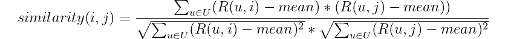

adjusted cosine similarity

在计算所有 3 个相似性矩阵之后，可以通过计算加权平均值来合并它们，以形成单个正方形矩阵。结果可以用热图的形式显示出来。矩阵是对称的，因此为了节省空间，它可以旋转 45 度并切成两半:

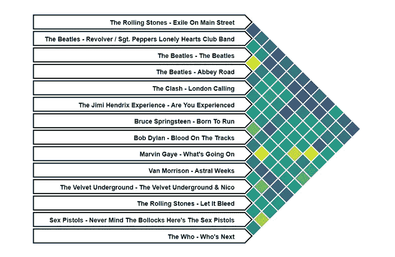

Combined similarities in a random selection of Essential Oldies

# 3.数据挖掘

对数据集有了基本的了解之后，在深入挖掘之前，应该问一些具体的问题。我到底想知道什么？

这个实验的主要目标是能够根据已经听过和评价过的专辑和/或根据社区的评价(如果用户还没有评价过任何专辑)来对未听过的专辑进行排名。

选择和微调算法是一个反复试验的过程。我的方法是选择一条路，走几步，衡量结果，然后重新评估计划。

## **计划 A:使用矩阵分解的基于用户的协同过滤**

在大多数情况下，推荐系统可以使用的最有价值的信息是评级形式的用户偏好，因为我拥有这些信息，所以围绕这些信息构建算法是一个显而易见的选择。

[协同过滤](https://en.wikipedia.org/wiki/Collaborative_filtering)是一种流行的评分预测方法，其基于具有相似品味的用户将对一组项目给出相似评分的假设。例如，一个基于用户的实现将首先找到与当前用户最相似的用户，然后根据这些“邻近”用户给出的评级来预测给定项目的评级。当我们没有关于当前用户的足够信息(冷启动)或者当我们没有足够相似的邻居(稀疏性)时，问题就出现了。

我们如何计算用户的品味或一个项目的质量？假设评级不是随机的，我们可以想象它们是基于一个项目的特性列表和用户对这些特性的偏好列表。实际上，这两个向量不仅是无限的，而且它们的值根据一天中的时间、用户的情绪等不断变化。从数学意义上来说，我们可以把评级的形成想象成特征向量和偏好向量的点积。

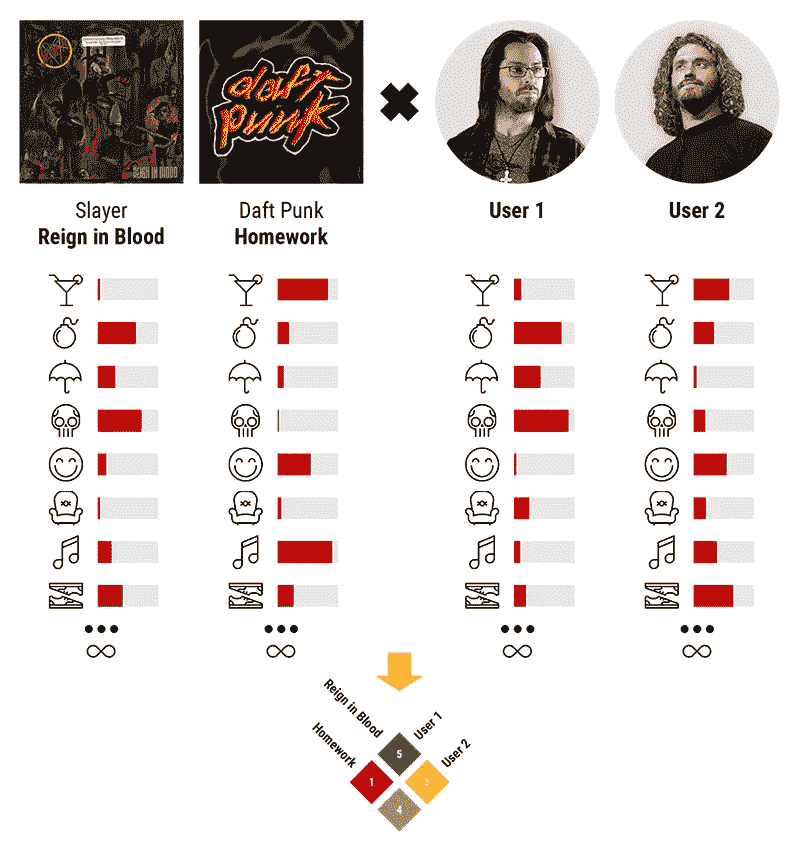

ratings determined by user preference and item characteristics

当然，不难看出，在计算我们的估计值时，我们考虑的特征数量将对准确性产生积极影响，对计算速度产生消极影响(在某些情况下，会以指数方式减慢计算速度)。

accuracy vs. computation time trade-off

我们的目标是估计这两个无限向量，通过丢弃或组合特征将它们减少到其本质，同时保持结果尽可能接近实际值。每个项目或用户的高度相关特征的数量很少，其余特征的值接近于零。不幸的是，消除这些特性是不可能的，因为它们可能对另一个项目非常重要，所以减少特性数量的最有效方法是将它们组合并分组到相关的桶中。

[矩阵分解](https://en.wikipedia.org/wiki/Matrix_decomposition)或矩阵分解是一种技术，简单地说，它帮助我们计算这些最相关的特征桶。已知评级矩阵 R 是包含用户偏好值的矩阵(P)和包含项目特征值的矩阵(Q)的乘积，我们的目标是尽可能精确地估计这两个未知矩阵。

R = rating matrix, P = user latent feature matrix, Q = item latent feature matrix

计算这些矩阵的值是一个迭代过程，这意味着成本函数的最小化，该成本函数由误差(实际评级-估计评级)加上通常用于保持特征接近于零以避免过拟合的正则化因子加上可以提高精度的任何其他权重来确定。这将导致基于函数梯度的更新公式:

η = learning speed, λ = regularization factor, e = error

这种迭代估计最流行的方法是[梯度下降](https://en.wikipedia.org/wiki/Gradient_descent)和交替最小二乘法，它间歇地固定一个矩阵并调整另一个矩阵。我选择实现一个基于梯度下降的解决方案，选择一个 9 的特征计数，并用 Python 训练模型。

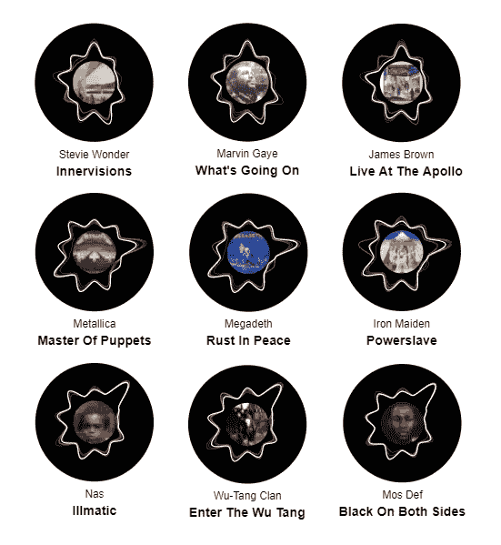

latent feature similarities (visualized as radial “petals”)

我在 UI 逻辑中也使用了梯度下降。我根据社区的平均偏好初始化当前用户的用户偏好向量，然后在每次用户对新专辑进行评级后，我重新训练这个向量，以准确匹配给定的评级。然后我预测了其他所有专辑的评分，按升序排序。

不幸的是，在几次 UI 测试运行之后，我发现这些预测是相当随机的。我的结论是，评级数据过于嘈杂和/或过于稀疏。在训练模型时，我认为空评级是不相关的，但也许我可以通过为现有评级分配 1 的重要性权重来改进模型，并降低重要性权重，如 0.01 到 0/缺失评级。

我也不喜欢 MF 方法，因为在训练模型之前的随机初始化，结果不仅是随机的，而且在单次运行之间也不一致。我想要每次都给出相同固定结果的东西，所以我决定后退一步，把事情简化一点。

## **B 计划——结合协作和基于内容的过滤进行基于项目的排名**

虽然矩阵分解和潜在特征绝对值得探索，但我意识到我可以用更简单的方法更快地实现我的目标，所以我简单地建立了基于组合余弦相似矩阵的排名系统。因为我处在一个舒适的环境中，最大项目数只有大约 300 个，了解项目对之间的距离大大简化了这个过程。[基于内容的过滤](https://en.wikipedia.org/wiki/Recommender_system#Content-based_filtering)是另一种过滤方法，利用用户简档和物品简档的相关性对物品进行排名。我使用了现有的风格、流派&标签信息来帮助我提高预测的准确性。

基于项目的 CF 是基于用户的过滤的镜像方法:作为第一步，它找到与当前项目最相似的 n 个项目，然后根据其邻居的评级预测其评级。

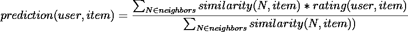

item based collaborative filtering

我对预测收视率不感兴趣，所以我决定使用这个公式的修改版本，只保留公式的红利。这样，即使用户只给了 5 分，我也能对项目进行排序。对于每一张未评级的专辑，我将 T2 k 张最相似的 T3 张专辑的相似度按照它们的评级进行加权，然后根据这些总和对列表进行排序。

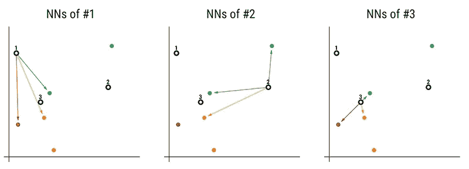

k nearest neighbors

# 4.数据可视化

## 名单

对于主图表，我使用了 knockout.js，这是一个极简的前端框架，可以非常容易地将事情联系在一起。图表数据从几个 JSON 文件中读取，然后使用 knockout 呈现。点击一个相册会打开一个带有详细相册信息的旁白。在这里，用户可以对专辑进行评级，这将把它从“未听过”列表移到屏幕左侧的“听过”列表。这触发了预测专辑分数的重新计算。每个“听过”的专辑通过它们的评级来加权(转移到[-2，2]范围),并且每个“没听过”的专辑基于与“听过”的专辑的相似性距离接收新的预测得分。

List View of the Essential Electronic Albums

在重新计算预测得分后，图表被排序，因此用户最可能喜欢的项目总是在列表的顶部。

## 图表

和弦图最初并没有计划成为应用程序的一部分，它只是我更好地理解数据集的一个工具。但它看起来很酷，所以我决定留着它。它显示每两个相册之间的组合(标签+风格+评分)相似性。

我考虑了几种可能性，具体来说，共同评分的数量会很有趣，但评分计数之间存在巨大差异，所以即使我对它们进行了缩放，也存在太多差异。我最终使用了组合相似度。为了降低图表的复杂性，我选择只显示前 5 个最相似专辑的链接。

我根据相应相似性的强度缩放了每个连接弧的宽度和不透明度。

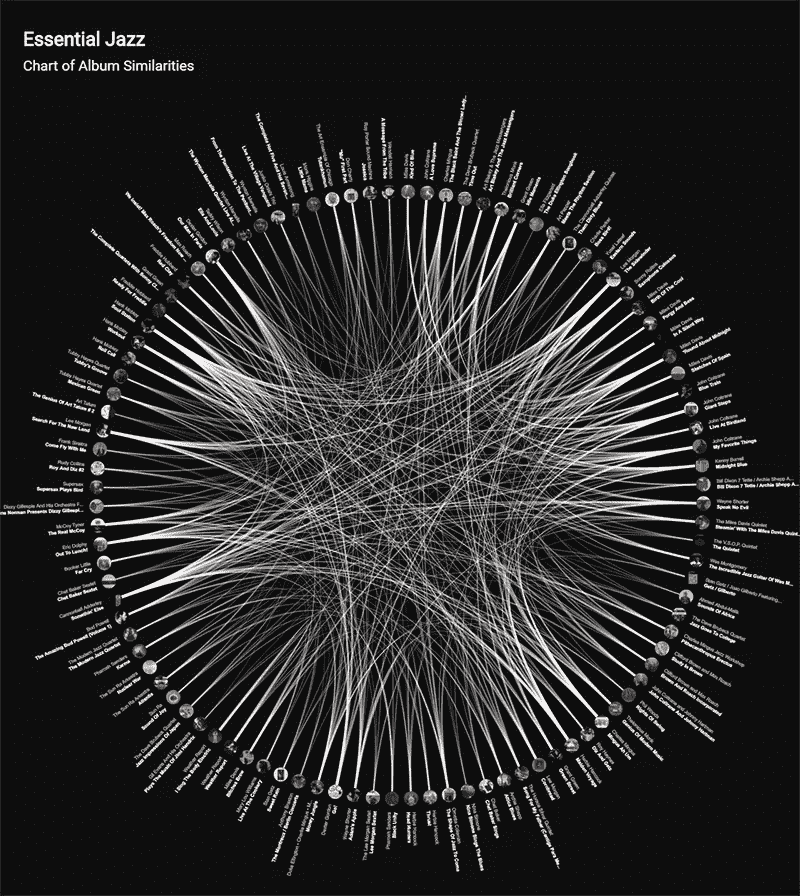

Chart of Essential Jazz Album Similarities

## 地图

除了列表和图表之外，我认为创建一个 2D 地图来表示数据，以便能够看到相册的位置、它们的链接、组和簇，这将是很好的。

为了获得数据集的 2D 投影，我考虑同时使用[主成分分析](https://en.wikipedia.org/wiki/Principal_component_analysis)和 [t 分布随机邻居嵌入](https://en.wikipedia.org/wiki/T-distributed_stochastic_neighbor_embedding)。T-SNE 似乎更适合我的情况，因为我的首要任务是保持距离，但 PCA 似乎更直观，我可以自己编写算法而不会浪费太多时间，所以我选择了 PCA。

我运行算法并在 d3 中可视化地图。虽然看起来还可以，而且各个子风格都清晰地聚集在一起，但当我将 5 个最相似的相册链接可视化时，发现它们在地图上并不一定紧挨着。为了解决这个问题，我做了一点手脚，用了一个 d3 力模拟来放松距离。我在 d3 模拟中添加了一些力来使相似的专辑更接近，另一个力迫使图形根据画布的比例来塑造自己。最后，我在图表上应用了一个比例因子，使它很好地适合屏幕。有 250 多个节点时，模拟非常慢，所以我导出了结果坐标，并重用它们来加速这个过程。

应用一些聚类方法来分离专辑组，对它们进行颜色编码，或者基于与专辑相同的空间来计算标签云的 2D 投影并覆盖它，这将是很有趣的。我尝试将 PCA-reduced 或 MF-latent 特征作为径向表示，但对于不了解背景过程的人来说，它们没有多大意义。我认为将这些可视化在一个单独的图表中更有意义，也许结合一些与每个特性相关的标签和样式信息。

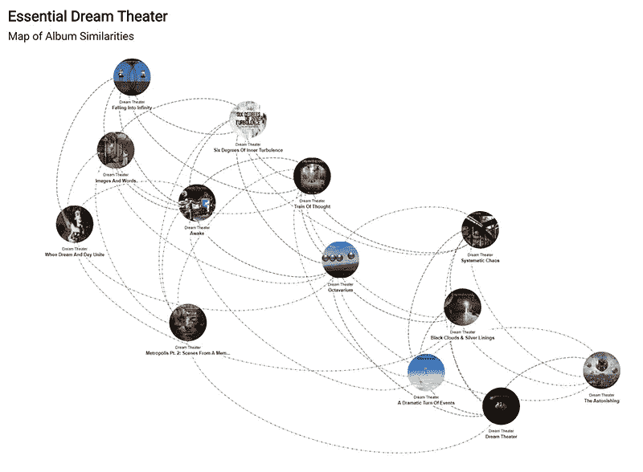

Map of Dream Theater Album Similarities

# 结论

玩矩阵有点像玩魔方。如果你知道正确的算法，你就可以一层一层地把所有的东西放好，更高层次的东西就会开始显现出来。我在这个项目中探索的数据挖掘和机器学习工具非常容易理解和使用，但是惊人的强大。在我看来，获得最佳结果的关键不仅是拥有正确的工具集，最重要的是对数据的结构和纹理有很好的理解。选择应用哪种算法总是取决于具体的情况，所以下一次我将玩一个类似的项目，我肯定会从探索和可视化数据集的更多方面开始。我发现收集的数据非常有趣，我将来一定会再次访问它，可能会使用 TensorFlow 实现。