# 地理编码:OpenStreetMap + R + Tableau

> 原文：<https://towardsdatascience.com/geocoding-tableau-and-r-integration-c5b32dc0eda6?source=collection_archive---------5----------------------->

## 便捷的地理编码，R + Tableau BI 工具的所有功能


Geocoding with OpenStreetMap Without API Token

## 背景

在过去，谷歌地图不需要 API 令牌，这对于简短的用例很有帮助。现在，必须创建一个云帐户。老实说，令人惊讶的是谷歌允许免费令牌 API 持续这么长时间。

在寻找需要街道地址地理位置的短期用例的替代方案时，我发现 OpenStreetMap 是一个简单而有用的替代方案。

## 这项功能是为谁设计的？

该特性主要面向已经有一些 r 使用经验的用户，这些用户会发现这种集成有几个好处:

*   对安装在 R 中的任何 R 包或函数的完全访问权
*   使用 Tableau 功能进一步分析和理解数据
*   提供一个平台，将开源数据和软件与专有软件相集成

用户必须能够访问 R/RStudio 和 Tableau。这两个软件可以存在于同一台计算机上，也可以远程存在(云)。

## **Tableau 脚本— R 和 Python 集成**

有一种方法可以从 Tableau 执行 R 或 Python 命令，以便允许我们利用这些编程语言的功能(函数、模型和包)。您可以通过与 R 或 Python 实例动态通信的计算字段来实现这一点，结果将作为预定的数据类型(INT、REAL、BOOL、STR)返回给 Tableau。

当需要动态计算的字段来支持分析师的需求，而不必单独运行代码并发回新的数据集时，这种集成非常有用。出于这个原因，我们不会使用这个功能，但你可以查看下面的相关博客。

# **地理编码入门**

*   在许多情况下，我们可以访问带有位置信息的数据(例如，地址、城市、县、邮政编码、国家)。如果我们想更详细地可视化这些数据，我们需要使用地理定位。
*   地理位置坐标(经度、纬度)需要基于位置数据来计算。
*   nomist 是 OpenStreetMap 数据的免费搜索引擎。使用 Nominatim，我们可以很容易地从给定的地址计算地理位置坐标。

OpenStreetMap 由一个地图绘制者社区构建的数据组成，他们贡献并维护世界各地的道路、小径、咖啡馆、火车站等数据。

*   [https://www.openstreetmap.org/about](https://www.openstreetmap.org/about)

## 在 R/RStudio 中加载包

为了在 R/RStudio 中加载包，我们将使用 tidyverse，这是一个为数据科学设计的 R 包以及其他帮助数据清理和处理的包的集合。下面的代码块允许您:

1.  检查是否安装了所需的软件包
2.  安装未安装的软件包
3.  安装后加载软件包

**包装潮流**

[](https://www.tidyverse.org/) [## Tidyverse

### tidyverse 是 R 包的集成集合，旨在使数据科学变得快速、流畅和有趣。

www.tidyverse.org](https://www.tidyverse.org/) 

```
# CHECK IF PACKAGE IS INSTALLED
if(!require("tidyverse")){ # IF PACKAGE NOT FOUND, INSTALL IT
  install.packages("tidyverse", dependencies = TRUE) # LOAD PACKAGE AFTER INSTALLETION
  library("tidyverse")
}
```

**包 rvest**

[](https://github.com/tidyverse/rvest) [## tidyverse/rvest

### 通过在 GitHub 上创建一个帐户，为 tidyverse/rvest 开发做贡献。

github.com](https://github.com/tidyverse/rvest) 

```
# CHECK IF PACKAGE IS INSTALLED
if(!require("rvest")){# IF PACKAGE NOT FOUND, INSTALL IT
  install.packages("rvest", dependencies = TRUE)# LOAD PACKAGE AFTER INSTALLETION
  library("rvest")
}
```

**包青天**

[](https://github.com/gagolews/stringi) [## gagolews/stringi

### 带 ICU 的 R 的字符串处理包。通过在…上创建一个帐户，为 gagolews/stringi 开发做出贡献

github.com](https://github.com/gagolews/stringi) 

```
# CHECK IF PACKAGE IS INSTALLED
if(!require("stringi")){# IF PACKAGE NOT FOUND, INSTALL IT
  install.packages("stringi", dependencies = TRUE)# LOAD PACKAGE AFTER INSTALLETION
  library("stringi")
}
```

**包 jsonlite**

[](https://github.com/jeroen/jsonlite) [## jeroen/jsonlite

### 一个健壮的、高性能的 JSON 解析器和生成器

github.com](https://github.com/jeroen/jsonlite) 

```
# CHECK IF PACKAGE IS INSTALLED
if(!require("jsonlite")){# IF PACKAGE NOT FOUND, INSTALL IT
  install.packages("jsonlite", dependencies = TRUE)# LOAD PACKAGE AFTER INSTALLETION
  library("jsonlite")
}
```

## OpenStreetMap API 搜索函数

下面的地理编码功能允许我们向 nomist im(OpenStreetMap 数据的搜索引擎)发出请求。

*   提名:[https://nominatim.openstreetmap.org/](https://nominatim.openstreetmap.org/)
*   资源:[https://nominatim.org/release-docs/develop/api/Search](https://nominatim.org/release-docs/develop/api/Search)

该函数获取并输入以下参数，这些参数可以根据您的需要进行修改:*【姓名】、【地址】、【城市】、【州】、【邮政编码】*

```
geocode <- function(name, address, city, state, zipcode){
  # NOMINATIM SEARCH API URL
  src_url <- "[https://nominatim.openstreetmap.org/search?q=](https://nominatim.openstreetmap.org/search?q=)"

  # CREATE A FULL ADDRESS
  addr <- paste(address, city, state, zipcode, sep = "%2C")

  # CREATE A SEARCH URL BASED ON NOMINATIM API TO RETURN GEOJSON
  requests <- paste0(src_url, query, "&format=geojson")

  # ITERATE OVER THE URLS AND MAKE REQUEST TO THE SEARCH API
  for (i in 1:length(requests)) {

    # QUERY THE API TRANSFORM RESPONSE FROM JSON TO R LIST
    response <- read_html(requests[i]) %>%
      html_node("p") %>%
      html_text() %>%
      fromJSON()

    # FROM THE RESPONSE EXTRACT LATITUDE AND LONGITUDE COORDINATES
    lon <- response$features$geometry$coordinates[[1]][1]
    lat <- response$features$geometry$coordinates[[1]][2]

    # CREATE A COORDINATES DATAFRAME
    if(i == 1) {
      loc <- tibble(name = name[i], 
                    address = str_replace_all(addr[i], "%2C", ","),
                    latitude = lat, longitude = lon)
    }else{
      df <- tibble(name = name[i], 
                   address = str_replace_all(addr[i], "%2C", ","),
                   latitude = lat, longitude = lon)
      loc <- bind_rows(loc, df)
    }
  }
  return(loc)
}
```

# 数据来源:芝加哥市食品检验局

这些信息来源于从 2010 年 1 月 1 日至今对芝加哥的餐馆和其他食品机构的检查。芝加哥公共卫生部食品保护项目的工作人员使用标准化程序进行检查。

[](https://data.cityofchicago.org/browse?q=food+inspection&sortBy=relevance) [## 芝加哥市|数据门户

### 关于 2018 年 7 月 1 日影响此数据集的变更的注意事项:http://bit.ly/2yWd2JB-此信息源自检查…

data.cityofchicago.org](https://data.cityofchicago.org/browse?q=food+inspection&sortBy=relevance) 

食品检测数据具有地理位置坐标，我们可以使用它们来检查结果的准确性。在这个示例数据集中，我们将只使用 location 列来查找餐馆的坐标。

## 数据检查和清理

在下面的代码块中，我们正在读取数据并进行一些更改，以确保该地址与 Nominatim API 一起工作。

**读取数据**

```
# READ THE DATA
data <- read_csv("food_inspection_sample.csv")# REMOVE SPACE FROM COLUMNS
colnames(data) <- str_replace_all(colnames(data)," ", "_")
```

**清理数据**

```
# REMOVE SPACE FROM RESULTS
data$Results <- data$Results %>% 
  str_replace_all(" w/ ", " with ") %>% 
  str_replace_all(" ", "_")# EXTRACT RISK LEVEL 
data$Risk <- tolower(data$Risk) %>% 
  str_extract("\\(.*\\)") %>% 
  str_extract("[a-z]+")head(data)
```

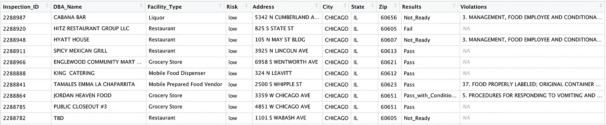

[https://gist.github.com/jlroo/9c65f9e599f116487b33047ed1be0837#file-food_inspection_sample-csv](https://gist.github.com/jlroo/9c65f9e599f116487b33047ed1be0837#file-food_inspection_sample-csv)

## 地址的地理定位

在本节中，我们将准备 address 变量来匹配 nomim API 样式。

```
# EXTRACT THE ADDRESS VARIABLE 
address <- data$Address
```

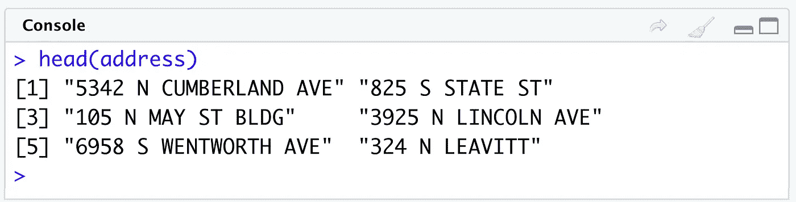

Original address variable

修改地址变量以匹配 API

```
# CLEAN SPECIAL CASES (e.g. 1 N MAY BLDG)
query <- str_replace_all(string = address, 
                         pattern = "BLDG", 
                         replacement = " ")# CLEAN SPECIAL CASES (e.g. 3333-3339 N CLARK)
query <- stri_replace(str = query, 
                      replacement = " ", 
                      regex = "(-[0-9]+\\s)")# REPLACE SPACES (\\s) OR COMMAS (,) WITH PLUS SIGN (+)
query <- str_replace_all(string = query, 
                         pattern = "\\s|,", 
                         replacement = "+")
```

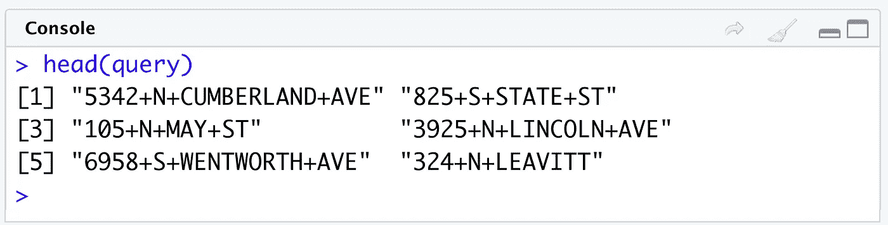

Transformed address variable

## 发出 API 请求-地理编码功能

为 API 准备好地址变量后，我们可以使用开始时创建的 geocode 函数来查找餐馆的地理坐标。

```
df <- geocode(name = data$DBA_Name,
              address = query,
              city = data$City, 
              state = data$State,
              zipcode = data$Zipcode)
```

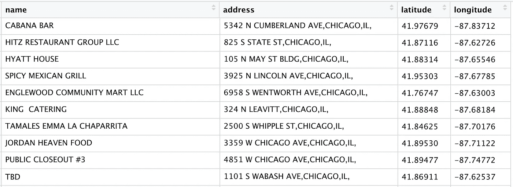

Returned DataFrame with geo coordinates

最后，我们可以合并两个数据集来创建一个主数据集，并在 Tableau 中工作。为了实现这一点，我们使用了一个 *left_join* by 变量 *name* 对返回的数据帧和 *DBA_Name* 变量进行连接。

```
geo_df <- data %>% left_join(df, by = c("DBA_Name" = "name"))
```

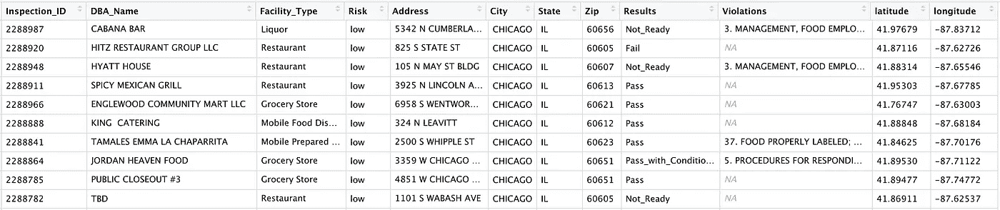

[https://gist.github.com/jlroo/e4518cf821aa1f103f822931db83e418#file-food_inspection-csv](https://gist.github.com/jlroo/e4518cf821aa1f103f822931db83e418#file-food_inspection-csv)

# 数据可视化:使用 Tableau 进行地理定位分析

现在有了一个带有地理坐标的主数据集，我们可以将其导入 Tableau 进行进一步分析。

要开始处理 Tableau，请通过文本文件(CSV)连接到文件。这是之前在 r 中创建的文件。


Connect to the food_inspections.csv file

Tableau 数据解释器有助于识别列的数据类型，但是仔细检查以确保数据类型是正确的总是很重要的。在这种情况下，我们将确保变量(纬度和经度)数据类型(地理角色)是正确的。

在 Tableau 中工作的一个好习惯是通过选择屏幕右上角的选项来*提取*您正在处理的数据集。这将防止您覆盖/损坏原始数据。

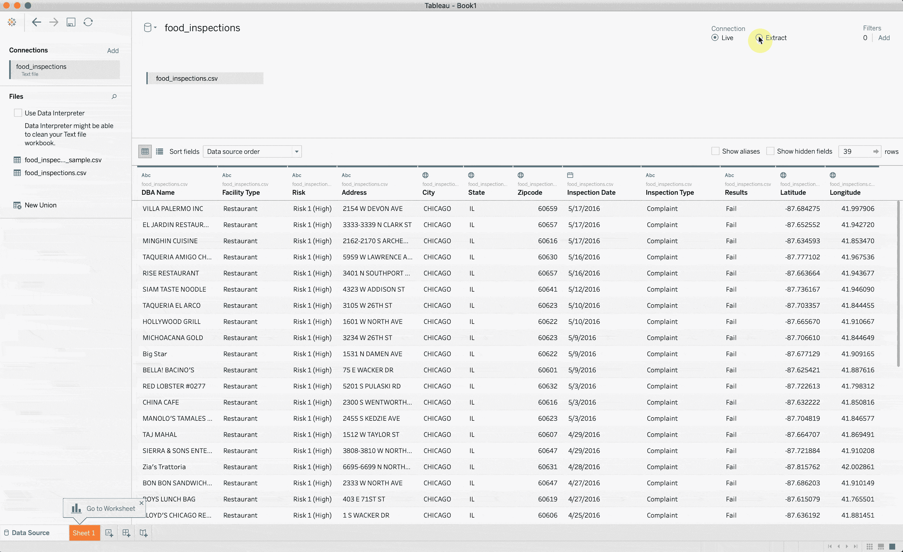

Check that columns data types are correct

完成对数据类型的更改后，转到屏幕左下方突出显示的工作表部分。将出现保存数据集(提取)的提示。按照提示将其保存在默认位置。

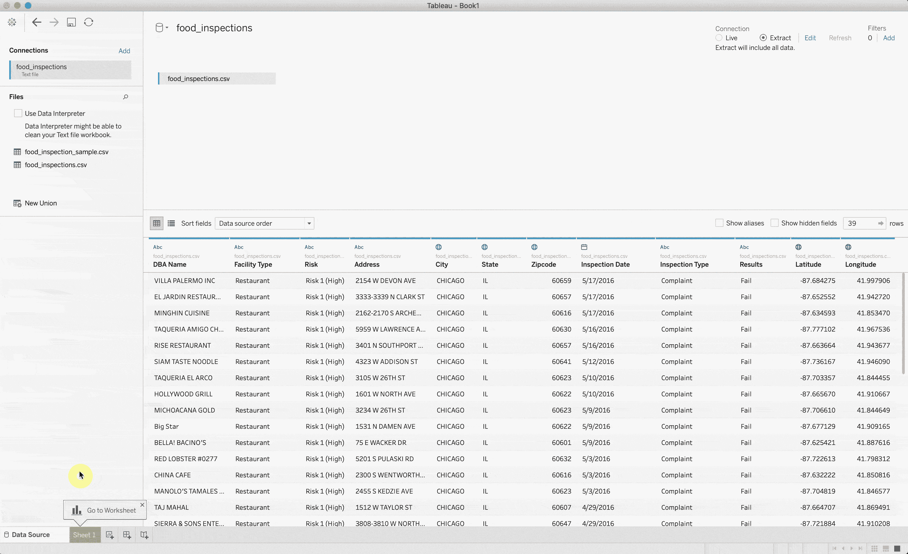

Default Folder Location — My Tableau Repository

## 测绘经度和纬度

在工作表中，根据数据类型(维度和度量)，您将看到数据集列分为两个部分。在 measures 部分，您将找到经度和纬度变量。要映射坐标，请遵循以下步骤:

1.  双击经度变量，Tableau 会将变量放在正确的轴(列)上。
2.  双击纬度变量，它将被放置在正确的轴(行)上。
3.  将变量放入正确的轴后，将每个变量的数据类型从 Measure 更改为 Dimension。

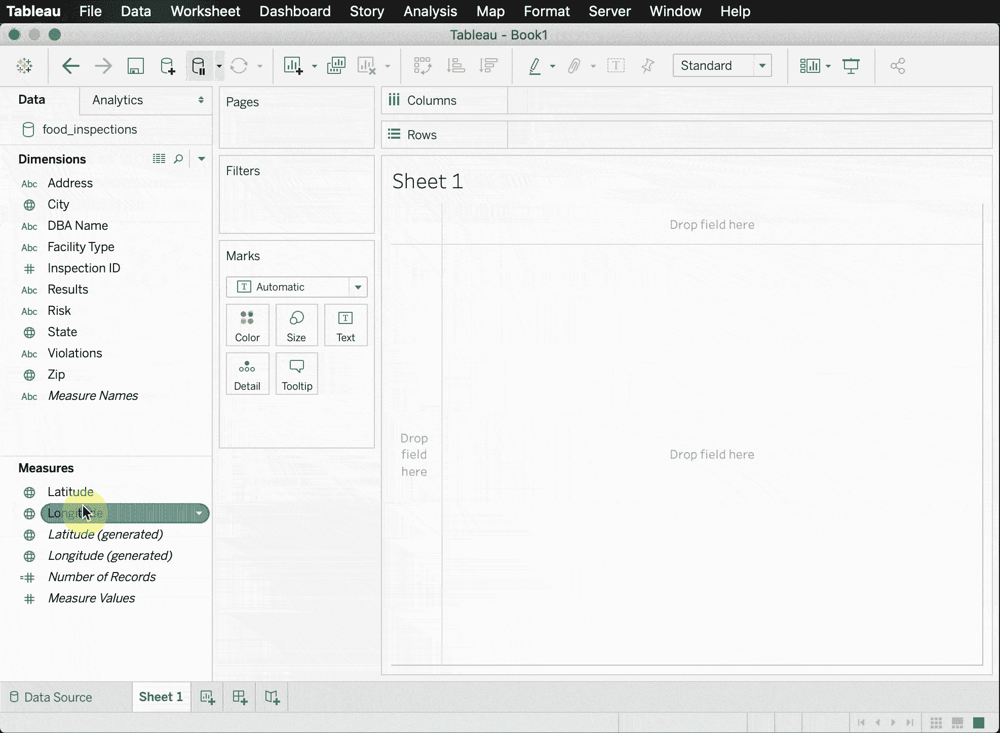

Mapping coordinates, change of data type

## 丰富地图功能-邮政编码、细节、颜色

有了地图中的地址，我们现在可以添加更多的要素，例如县边界、邮政编码、位置详细信息和颜色。

1.  双击 *DBA Name* 变量，自动将其指定为细节标记，以查看每个位置的名称。
2.  双击*风险*变量。由于有三个类别，颜色标记是自动分配的。
3.  当鼠标悬停在这些点上时，我们应该能够看到餐馆的名称、风险和地理坐标。

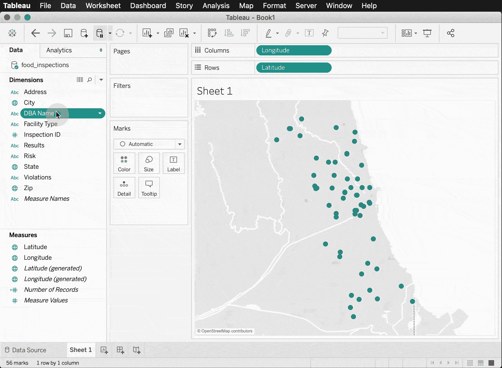

## 地图图层-邮政编码边界

Tableau 允许我们向默认地图添加额外的图层。在这种情况下，了解邮政编码标签和界限会很有帮助。

1.  在主工具栏上，选择*地图→地图图层。*
2.  工作表的左上角应该会出现一个地图图层视图。向下滚动并启用*邮政编码边界*和*邮政编码标签*选项。

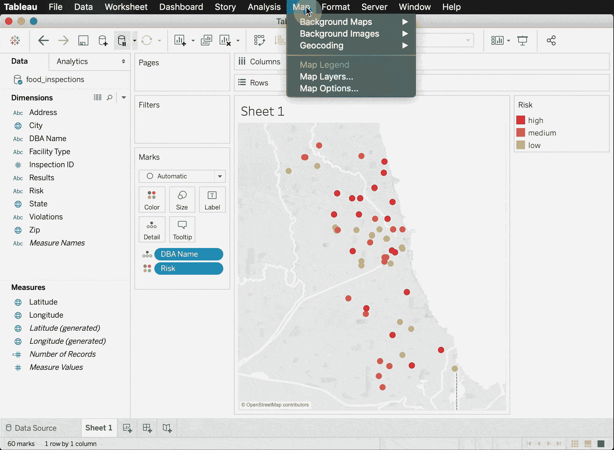

最后，您可以放大以仔细查看特定区域。

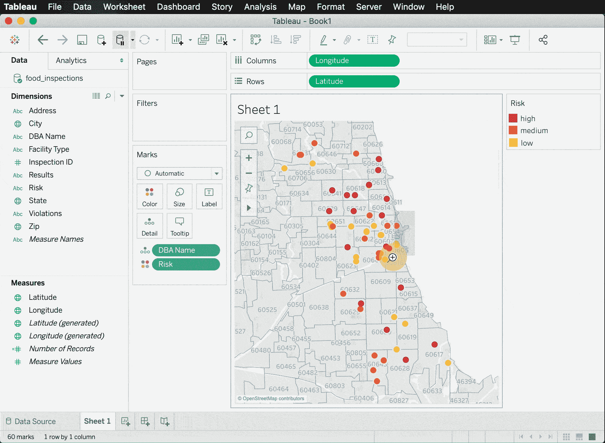

请记住，这篇博客文章只是触及了当我们集成 OpenStreetMap、R 和 Tableau 时可能发生的事情的表面。OpenStreetMap API 不需要令牌，而其他 API(Google，Mapquest)需要令牌。

通过利用 OpenStreetMap 作为资源，简单的用例可以得到极大的丰富。也就是说，要注意你在任何时候提出的请求数量。