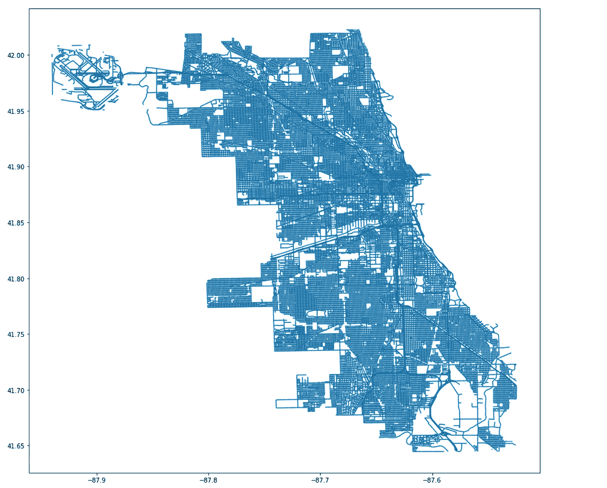
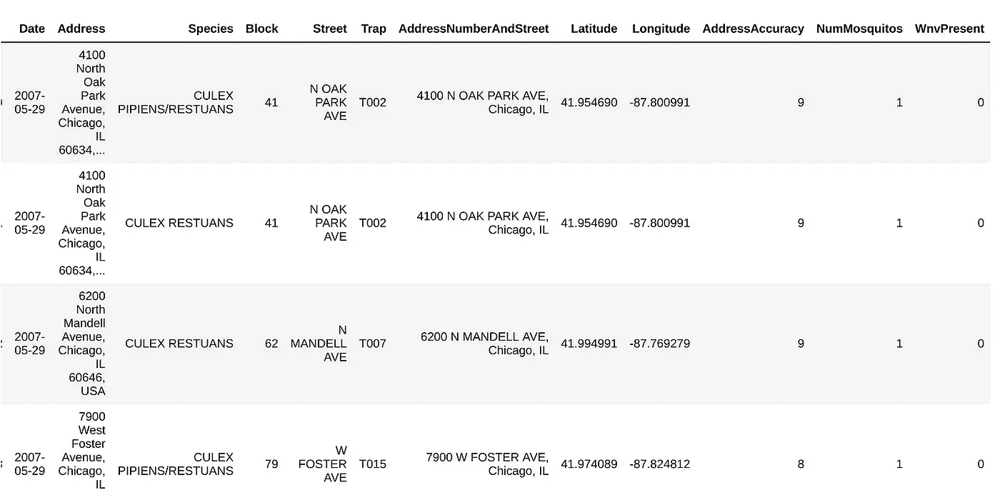
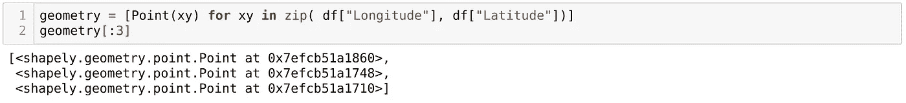
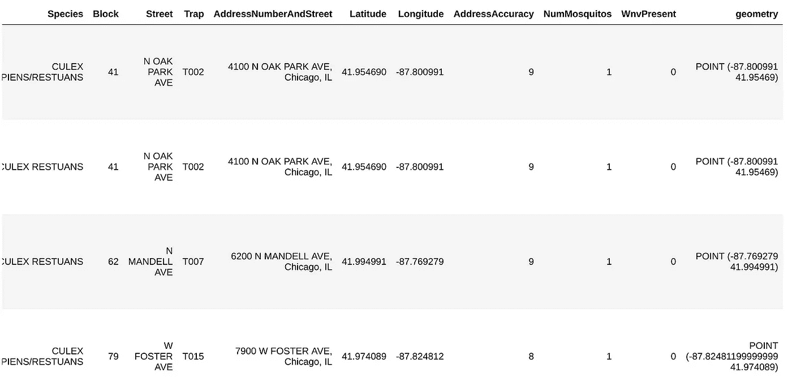
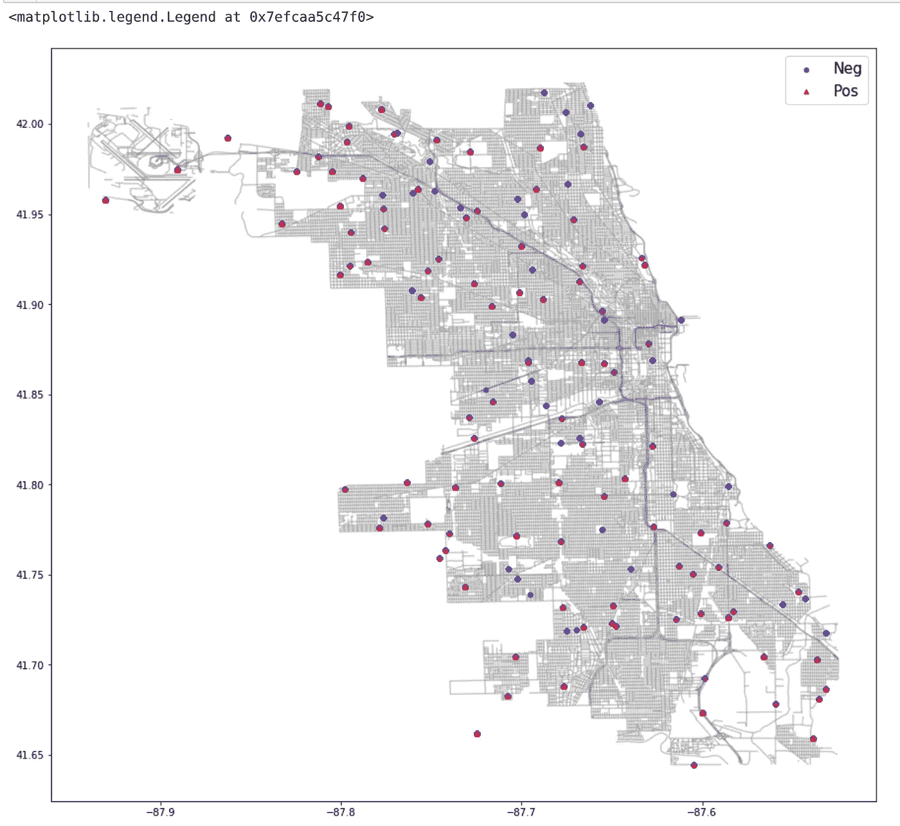

# GeoPandas 101:在地图上绘制带有纬度和经度的任何数据

> 原文：<https://towardsdatascience.com/geopandas-101-plot-any-data-with-a-latitude-and-longitude-on-a-map-98e01944b972?source=collection_archive---------0----------------------->


在我的几个同学问我如何使用 GeoPandas(通常以别名 gpd 导入)之后，我受到了写这篇教程的启发。我最初是从一篇关于媒体的文章中了解到的，但是这个链接似乎已经停止工作了。唉，我们到了。虽然我不可能在一篇博文中分享 GeoPandas 奇妙世界的一切，但我的意图是给你一个起点。我强烈建议你去看看官方文档，即使只是为了看看 GeoPandas 能做的所有很酷的事情。希望你觉得这个教程是有帮助的和令人兴奋的！所有相关的数据和笔记本都可以在[我的 GitHub 页面这里](https://github.com/rylativity/identifying_wnv_locations)找到。

在我看来，GeoPandas 是使用起来最令人满意的 Python 包之一，因为它产生了与现实世界直接相关的有形、可见的输出。此外，我们收集数据的许多对象(例如，人口统计数据、销售指标、传感器数据)至少有一个物理元素，可以帮助我们将数据与特定位置联系起来，并描述有关对象的一些信息。

在本例中，我们将使用芝加哥市的数据来绘制带有西尼罗河病毒的蚊子的位置。第一步是下载一个形状文件。shp 文件)，如果您知道地理空间数据所在的大致区域。如果你不知道在哪里可以找到一个形状文件，谷歌一下！形状文件中通常有几个其他的文件；请确保将所有这些文件放在同一个文件夹中，否则您将无法读取您的文件。

下一步是导入库。我们将需要以下内容，所有这些都可以通过快速的“pip install <package_name>”从命令行快速安装:</package_name>

```
import pandas as pd
import matplotlib.pyplot as plt
import descartes
import geopandas as gpd
from shapely.geometry import Point, Polygon

%matplotlib inline
```

现在我们已经有了一个形状文件和必要的包，让我们绘制我们的地图！只需用 GeoPandas 读入您的形状文件，并使用 matplotlib 像这样绘制它(用您自己的形状文件的路径替换文件路径):

```
street_map = gpd.read_file('/path/to/your/geo_export_12345.shp')
```

```
fig, ax = plt.subplots(figsize=(15,15))
street_map.plot(ax=ax)
```



Shapefile of Chicago, IL

请注意，我们的地图显示了街道中心线；您可以找到各种各样不同细节层次的形状文件，所以请选择最适合您特定需求的类型。

下一步是以正确的格式获取数据。我们这样做的方法是将我们的常规 Pandas 数据框架转换为地理数据框架，这将要求我们指定原始数据框架、我们的[坐标参考系统(CRS)](http://geopandas.org/projections.html) 以及我们的新数据框架的几何形状作为参数。为了适当地格式化我们的几何图形，我们需要将经度和纬度转换成*点*(我们从上面的 shapely 中导入了点)，所以首先让我们读入训练数据集，并像这样指定 *EPSG:4326* CRS(用包含纬度和经度坐标的您自己的数据的路径替换文件路径):

```
df = pd.read_csv('./my_data.csv')
crs = {'init':'epsg:4326'}
df.head()
```



现在我们有了纬度和经度信息，我们可以创建*点*。一个*点*本质上是一个描述数据点的经度和纬度的单一对象。使用 list comprehension 将允许我们在一行中完成这项工作，但是要确保总是在“纬度”列之前指定“经度”列:

```
geometry = [Point(xy) for xy in zip(df['Longitude'], df['Latitude'])]
```



One point for each row in our DataFrame. Check the length of the geometry list if you want to make sure.

我们最终应该会得到一个可用于创建地理数据框架的*点*列表:

```
geo_df = gpd.GeoDataFrame(df, #specify our data
                          crs=crs #specify our coordinate reference system
                          geometry=geometry) #specify the geometry list we created
geo_df.head()
```



此时，如果您愿意，可以删除“纬度”和“经度”列，但是 GeoPandas 会在您绘制数据时自动引用“几何”列。要做到这一点，我们只需将数据放在上面绘制的地图上。我将更改一些显示选项，以便我们的地图更容易看到，[使用蒙版](https://stackoverflow.com/questions/38802675/create-bool-mask-from-filter-results-in-pandas)用不同的标记绘制 WNV+和 WNV-蚊子，并添加标签和图例:

```
fig, ax = plt.subplots(figsize=(15,15))
street_map.plot(ax=ax, alpha=0.4, color='grey')
geo_df[geo_df['WnvPresent'] == 0].plot(ax=ax, 
                                       markersize=20, 
                                       color='blue', 
                                       marker='o', 
                                       label='Neg')
geo_df[geo_df['WnvPresent'] == 1].plot(ax=ax, 
                                       markersize=20, 
                                       color='red', 
                                       marker='^', 
                                       label='Pos')
plt.legend(prop={'size':15})
```



你做到了！有大量的选项和令人敬畏的包可以使用，并与 GeoPandas 结合使用来制作地图。如果你想深入了解，我建议你从散景开始。虽然它不像单独使用 GeoPandas 绘图那么容易，但它可以为您的地理地图添加一些令人印象深刻的交互功能，并且使用起来非常有趣！

希望到现在为止，你已经习惯于用 GeoPandas 制作简单的图形了。它们非常适合于探索性分析，以及快速直观地传达空间信息。如果你有问题，请随时联系我，或者给我发一些你的 GeoPandas 作品的例子！