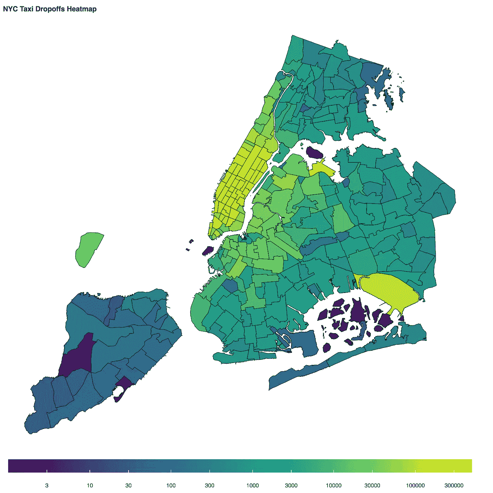
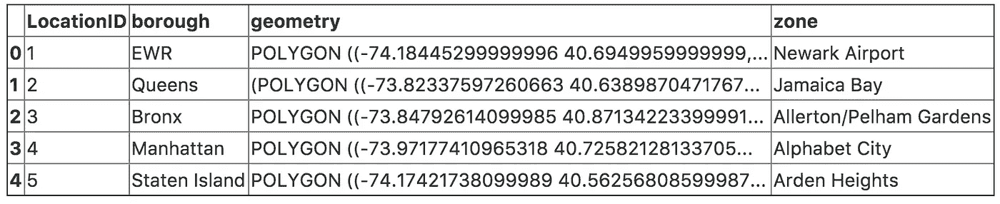
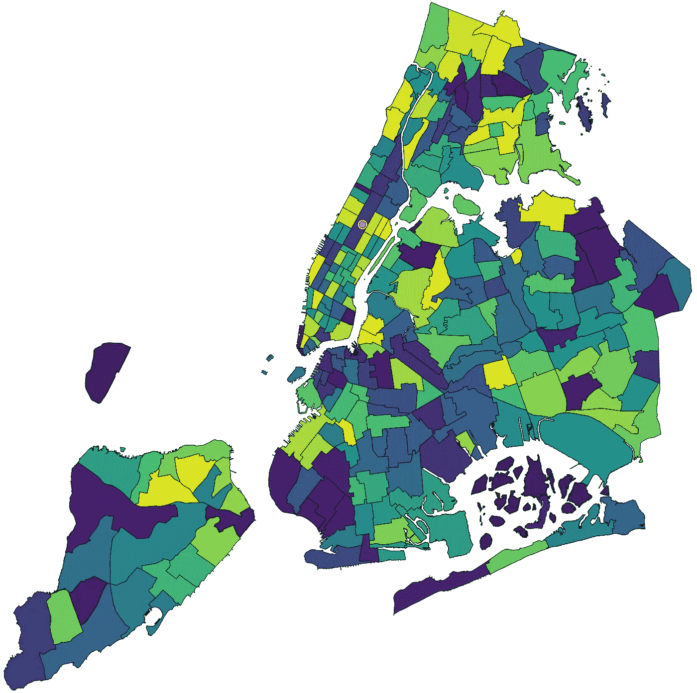
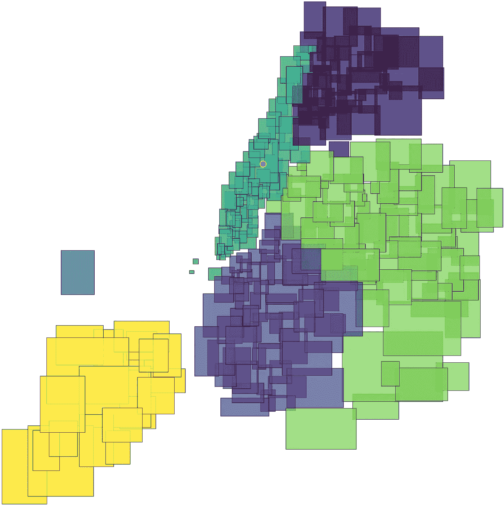
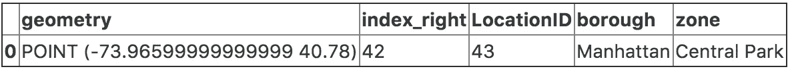
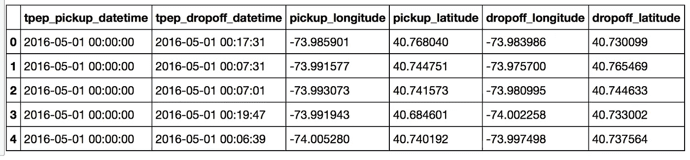
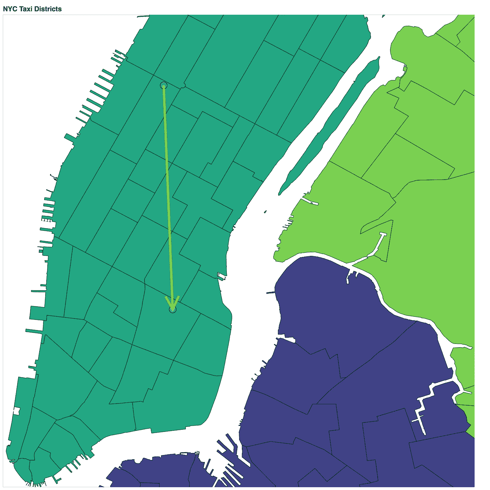

# 使用 Dask 和 Geopandas 进行大规模地理空间操作

> 原文：<https://towardsdatascience.com/geospatial-operations-at-scale-with-dask-and-geopandas-4d92d00eb7e8?source=collection_archive---------1----------------------->



May 2016 New York City Taxi Dropoffs Heatmap by Taxi Zone.

在本文中，我将给出一个空间连接的示例，然后描述如何使用 GeoPandas 和 Dask 执行大规模的空间连接。

**注意:**为了精简这篇文章，我删除了交互式图形和大部分代码。你可以在 [nbviewer](https://nbviewer.jupyter.org/github/r-shekhar/NYC-transport/blob/master/15_dataframe_analysis/spatialjoin_geopandas_dask.ipynb) 上查看 Jupyter 的原始笔记本。

# 第 1 部分:对空间连接的简单介绍

我在分析纽约市[出租车数据集](http://www.nyc.gov/html/tlc/html/about/trip_record_data.shtml)时遇到的一个问题是，从 2009 年到 2016 年 6 月，出租车行程的起点和终点都是以经度和纬度点的形式给出的。2016 年 7 月之后，为了在向公众发布数据时提供一定程度的匿名性，出租车和豪华轿车委员会(TLC)只提供一次旅行的开始和结束“出租车区域”，以及一个指定边界的 shapefile，[可在此处获得](https://s3.amazonaws.com/nyc-tlc/misc/taxi_zones.zip)。为了获得连续的数据集，我需要一种有效的方法将经纬度坐标对转换成“出租车区域”。让我们在 Geopandas 中加载 shapefile，将坐标系设置为' epsg:4326 '，这是经纬度坐标。以下是前几行。



The first few rows of the dataset.

我们看到几何列由多边形(来自 Shapely)组成，这些多边形的顶点由经度和纬度点定义。让我们按照 LocationID 的升序来绘图。



Taxi Zones chloropleth colored by taxi zone ID

这是一张熟悉的纽约地图，显示了 262 个出租车区域，用出租车区域的 id 进行着色。我发现 LocationID 没有任何特定的地理顺序。我在洋红色加了一个随机点(-73.966 \u E，40.78˚ N)，正好落在中央公园中间。分配一个点在滑行区域内是人类可以很容易做到的事情，但在计算机上，这需要解决多边形问题中的[点。幸运的是，](https://en.wikipedia.org/wiki/Point_in_polygon) [Shapely](http://toblerity.org/shapely/project.html) 库为 Python 中的这种几何运算提供了一个简单的接口。但是，多边形中的点在计算上是昂贵的，并且使用 24 亿(纬度，经度)对上的 Shapely 库来分配出租车区域，就像在纽约出租车数据集中一样，将花费现代单核 cpu 大约四年的时间。为了加快速度，我们计算每个滑行区域的边界框，如下所示:



Bounding boxes for each Taxi Zone

现在，给定一个(经度，纬度)坐标对，包含该坐标对的边界框可以用一个 [R 树](https://en.wikipedia.org/wiki/R-tree)有效地计算出来。你可以在这里找到关于 R 树[的精彩介绍](https://medium.com/@agafonkin/a-dive-into-spatial-search-algorithms-ebd0c5e39d2a)。只需要检查具有包含坐标对的边界框的多边形(滑行区域),然后为这几个滑行区域(希望如此)求解多边形中的点。这将计算量减少了大约 100-1000 倍。将坐标对分配给滑行区域的过程就是空间连接的一个例子。 [Geopandas](http://geopandas.org/) 为 Python 中的高效空间连接提供了一个很好的接口，它负责为您计算边界框和 R 树，如执行左空间连接的代码片段所示。

```
import geopandas as gpd
from shapely.geometry import Pointdf = gpd.read_file('taxi_zones.shp').to_crs({'init': 'epsg:4326'})
df = df.drop(['Shape_Area', 'Shape_Leng', 'OBJECTID'], axis=1)gpd.sjoin(gpd.GeoDataFrame(crs={'init': 'epsg:4326'},
    geometry=[Point(-73.966, 40.78)]), 
    df, how='left', op='within')
```

此代码对上面地图上的单个点(用洋红色绘制)进行合并，并在中央公园正确地识别它



The spatial join for the magenta point in the figures above

# 第 2 部分:使用 Dask 进行大规模空间连接

在我的纽约公交项目中，我下载并处理了整个 200GB 的出租车数据集。在这里，我从 taxi 数据集(2016 年 5 月)加载一个文件到 Dask，并显示前几行和几列。该文件 1.8GB 有点大，Dask 选择将数据帧划分为 30 个分区，以提高计算效率。每个分区都是一个 pandas 数据帧，dask 负责所有的逻辑，将组合视为一个单独的数据帧。这里有几个栏目。



The first few rows of time and location data in May 2016

所以每次旅行都有接送(经度，纬度)坐标对。为了让您对数据有个感觉，我画出了第一次旅行的起点和终点，终点在东村。驾驶方向带来了很多额外的复杂性，所以这里我只画了一个直线箭头。空间连接将出租车区域标识为克林顿东和东村。



The first trip in May 2016 — As the crow flies

所以，Dask 数据帧[只是熊猫数据帧](http://dask.pydata.org/en/latest/dataframe-overview.html)的集合，我知道如何在熊猫数据帧上执行空间连接。让我们利用 Dask 的`[map_partitions](http://dask.pydata.org/en/latest/dataframe-api.html#dask.dataframe.DataFrame.map_partitions)`函数对每个分区上的滑行区域进行空间连接。下面是执行空间连接的函数，给定一个 Pandas 数据帧，以及经度、纬度和 taxizone id 列的名称。代码直接链接到[这里](https://gist.github.com/r-shekhar/7625fd524e9639933371da5560b6dccc)。

## 按比例

使用`map_partitions`函数，我将空间连接应用于组成 Dask 数据帧的每个熊猫数据帧。为了简单起见，我只调用该函数两次，一次用于取货地点，一次用于卸货地点。为了帮助 dask 确定返回数据的模式，我们将它指定为一列浮点数(允许 NaN 值)。

```
trips['pickup_taxizone_id'] = trips.map_partitions(
    assign_taxi_zones, "pickup_longitude", "pickup_latitude",
    "pickup_taxizone_id", meta=('pickup_taxizone_id', np.float64))
trips['dropoff_taxizone_id'] = trips.map_partitions(
    assign_taxi_zones, "dropoff_longitude", "dropoff_latitude",
    "dropoff_taxizone_id", meta=('dropoff_taxizone_id', np.float64))
trips[['pickup_taxizone_id', 'dropoff_taxizone_id']].head()
```

此时，trips Dask 数据帧将具有有效的 taxizone_id 信息。让我们将这些数据保存到 [Parquet](https://parquet.apache.org/) 中，这是一种[列格式](https://en.wikipedia.org/wiki/Column-oriented_DBMS)，在 Dask 和 Apache Spark 中得到很好的支持。这可以防止 Dask 在每次需要对 trips 数据帧进行操作时重新计算空间连接(这是非常昂贵的)。

```
trips.to_parquet('trips_2016-05.parquet', has_nulls=True,
     object_encoding='json', compression="SNAPPY")
trips = dd.read_parquet('trips_2016-05.parquet',
    columns=['pickup_taxizone_id', 'dropoff_taxizone_id'])
```

为了结束这篇文章，我将使用 Dask 生成一个出租车下车地点的热图，按出租车区域进行汇总。不出所料(至少对纽约人来说)，绝大多数出租车停靠点都在曼哈顿的市中心和中城区。我将在以后的文章中进一步分析这个数据集。


May 2016 New York City Taxi Dropoffs by Taxi Zone.

# 摘要

在这篇文章中，我描述了空间连接的过程，并使用 Dask 和 Pandas 在集群上进行大规模的空间连接。我忽略了对整个纽约出租车数据集[很重要的一些细节](http://www.nyc.gov/html/tlc/html/about/trip_record_data.shtml)，但是我的完整代码可以在 Github 上的[这里找到。在以后的文章中，我将更彻底地分析这些数据，并可能将处理后的数据作为一个 parquet 文件发布，供其他人分析。](https://github.com/r-shekhar/NYC-transport)

## 关于空间连接性能的补充说明

上面使用 GeoPandas 编写的空间连接使用纽约出租车数据集，可以在 4 GHz 4 核 i5 系统上为每小时大约 4000 万次出租车行程分配出租车区域。许多支持这种连接的代码是 Python 和包装 C 代码的某种融合。

这比在高度优化的 [PostGIS](http://www.postgis.net/) C/C++代码中执行相同的空间连接大约慢两倍。然而，PostGIS 并没有有效地使用多个内核(至少在没有多个空间连接同时运行的情况下)，更重要的是，往返 PostgreSQL 数据库的网络和序列化开销使 PostgreSQL/PostGIS 的速度与我在本文中描述的 GeoPandas 实现的速度大致相同，需要打破的移动部分要多得多。

基本上，对于这些类型的数据结构操作，Python 实际上是相当快的 T2 T3。