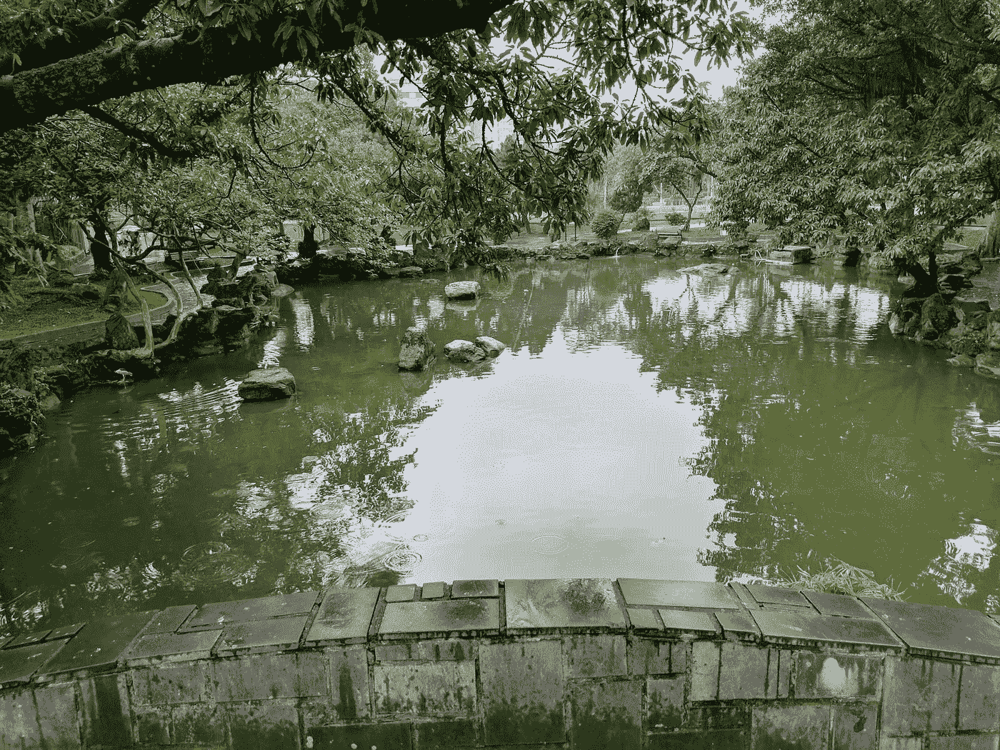
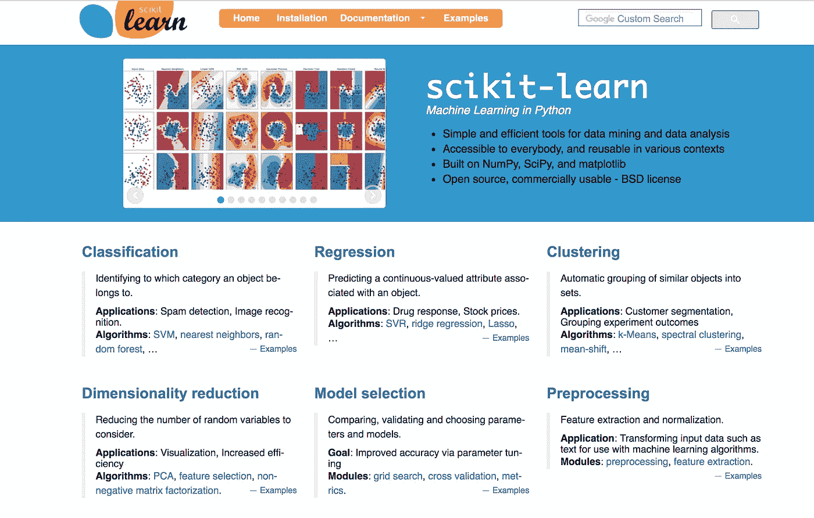

# 开始使用 sci kit-了解 Kaggle

> 原文：<https://towardsdatascience.com/get-going-with-scikit-learn-on-kaggle-32045d238eee?source=collection_archive---------10----------------------->

Taipei, Taiwan

Scikit-learn 一直是机器学习入门的流行库。然而，并不是每个人都有机会尝试它。我将向您展示如何使用 scikit——用最短的路径学习，您只需要一个 web 浏览器！

Taipei, Taiwan

在这篇文章中，我将帮助你开始在一个 [Kaggle 内核](/cooking-up-a-data-science-project-using-kaggle-datasets-and-kernels-fca2b678e268)中使用 [scikit-learn](http://scikit-learn.org) ，并为你指出可以用来指导你继续学习的资源。

 [## Kaggle 内核简介

### 在《人工智能历险记》的这一集里，你会发现什么是 Kaggle 内核，以及如何开始使用它们。虽然没有…

towardsdatascience.com](/introduction-to-kaggle-kernels-2ad754ebf77) 

# 简短的历史课

让我们从一点历史开始，作为背景。Scikit-learn 最初被称为 *scikits.learn* ，最初是由[大卫·库尔纳珀](https://en.wikipedia.org/wiki/David_Cournapeau)发起的谷歌代码之夏项目。名称中的“scikit”部分来自于它是一个 **Sci** Py 工具**工具包**。

从那以后，scikit-learn 稳步地获得了采用和流行，直到今天:一个有良好文档记录、深受喜爱的 Python 机器学习库。如果你看一下[scikit-learn.org](http://scikit-learn.org)，你会注意到版本号很低，在这篇文章发表时是 0.19。不要被这个吓跑了；图书馆已经存在很长时间了，维护得很好，相当可靠。

# Scikit-learn 是做什么的？

它真正出色的地方是一套丰富的工具，我称之为“围绕机器学习的*”,包括从数据集加载和操作到预处理管道和指标的一切。在我看来，scikit-learn 真正令人难以置信的部分是您可以尝试的大量机器学习算法，其中大多数只需进行最小的代码调整！*

这确实是一种令人惊奇的方法，可以掌握不同类型的模型做什么，以及获得一些关于各种参数如何执行的直觉。

我使用 scikit-learn 创建了一个简单的 [Kaggle 内核来帮助您入门，它还展示了内核和数据集之间的连接。跟随这个简短的视频一行一行地浏览内核，并讨论每个步骤:](https://www.kaggle.com/yufengg/scikit-learn-example)

如果你准备好了使用 Kaggle 内核并与其他人合作的更复杂的方法，请查看这篇关于在 Kaggle 上创建数据科学项目的帖子:

 [## 使用 Kaggle 数据集和内核设计一个数据科学项目

### 在《人工智能历险记》的这一集里，我请到了 Kaggle Datasets 的产品负责人 Megan Risdal，带我们参观一些…

towardsdatascience.com](/cooking-up-a-data-science-project-using-kaggle-datasets-and-kernels-fca2b678e268) 

# 后续步骤

这只是非常简单地介绍了如何开始使用 scikit-learn ，但是您应该探索 scikit-learn 提供的广阔的机器学习模型世界，所有这些都是通过一个简单干净的 API 实现的！深入学习教程和文档，制作一些令人敬畏的模型。

下次我们将讨论机器学习的另一面——scikit-learn——进行预测，以及如何扩大规模！

感谢阅读这一集的[云人工智能冒险](http://yt.be/AIAdventures)。如果你喜欢这个系列，请为这篇文章鼓掌让我知道。如果你想要更多的机器学习动作，一定要关注媒体上的[我](https://medium.com/@yufengg)或[订阅 YouTube 频道](http://yt.be/AIAdventures)以观看未来的剧集。更多剧集即将推出！