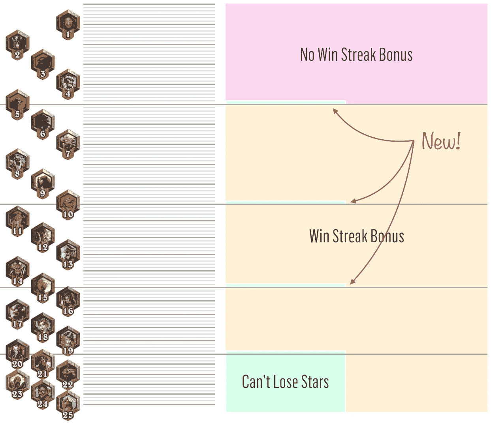
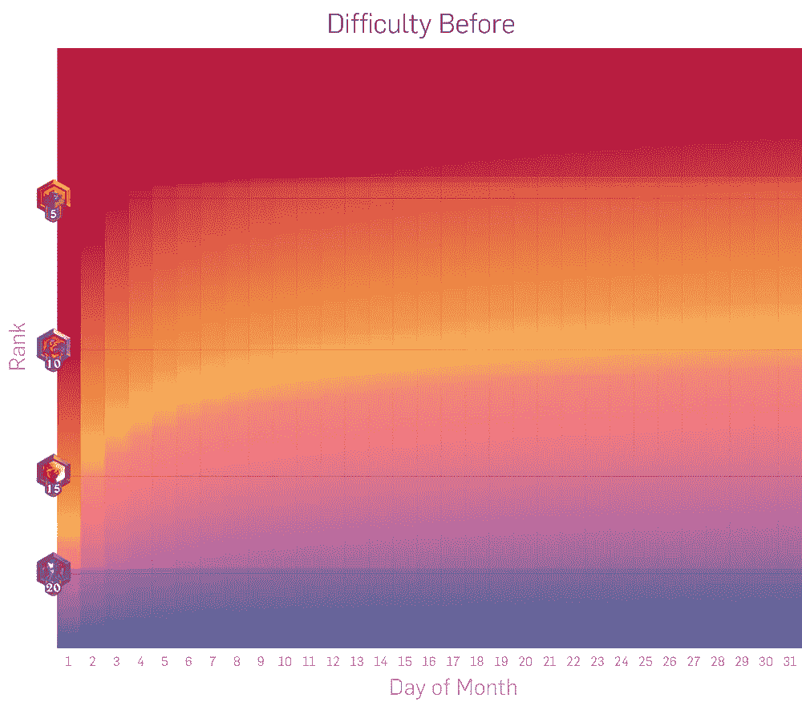
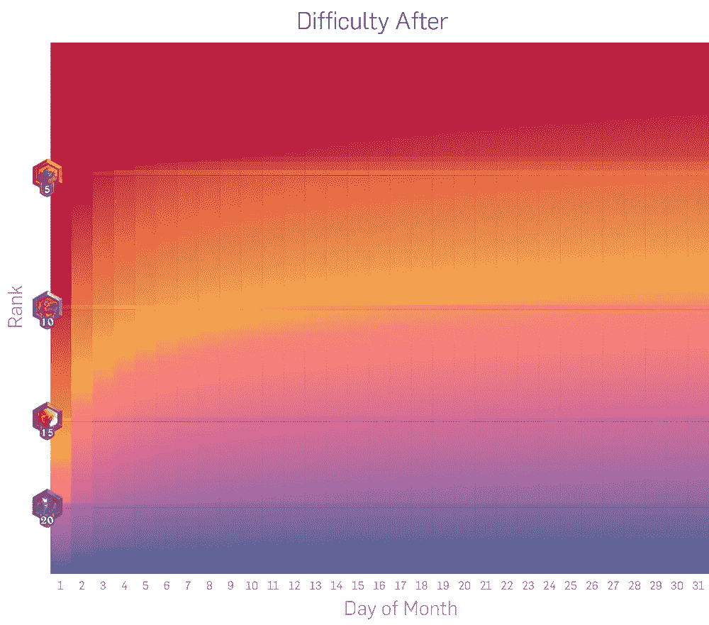

# 准备好迎接更快、更简单、更有趣的炉石吧

> 原文：<https://towardsdatascience.com/get-ready-for-a-faster-easier-and-more-fun-hearthstone-c6163e0a0d75?source=collection_archive---------0----------------------->

暴雪最近宣布对其轰动一时的纸牌交易游戏[炉石进行一些看似微小的改动。](http://us.battle.net/hearthstone/en/)我们来看看。来自暴雪:

> “一旦玩家达到**15 级、10 级或 5 级**，他们将无法在一个赛季内取消该等级，类似于现有的 20 级和传奇等级。”

这将如何改变梯子上的游戏？嗯，会好起来的。好多了。

## 更快、更稳定的攀爬

今天，即使是最好的玩家也需要 400-600 场比赛(在一个月内)才能达到传奇。随着新排名游戏楼层的增加，你将免受这种流失的影响，减少 5-10%的游戏数量。

## 游戏会更容易

上周[我发布了](https://medium.freecodecamp.com/how-to-measure-hearthstone-e6d9bdafaaf9#.451dj66ce)关于游戏难度以及它如何随着等级(duh)和月中的某一天(与赛季中的某一天同义)而变化。我甚至建立了一个模型来展示这个样子。

从 5 级爬到传奇仍然会非常困难，但是爬更低的等级会容易一些。

## 炉石会更好玩

最令人兴奋的是，这些变化将让你自由地尝试新的甲板，因为当你坐在这些地板之一的北面时，你没有什么可失去的。这种额外的变化将是一个受欢迎的补充，特别是在上层，目前除了 3-5 个顶层甲板中的一个之外，无法使用任何东西。