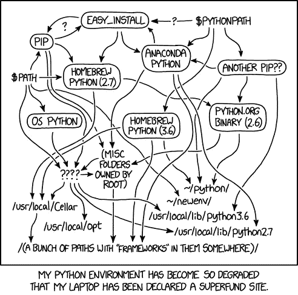
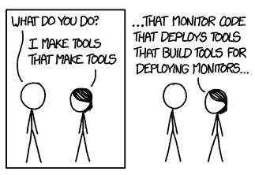
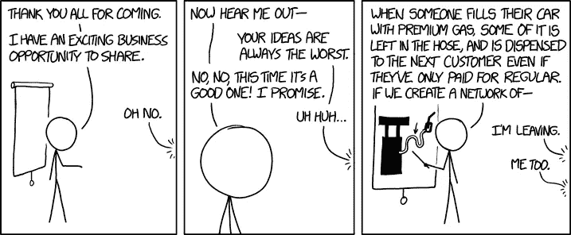
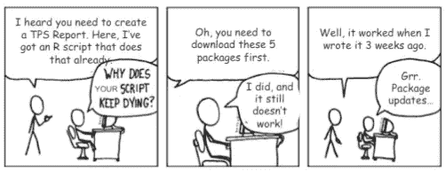
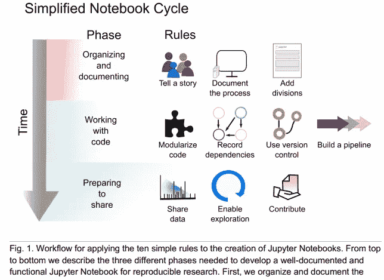
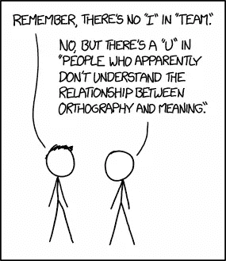
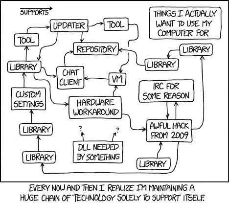
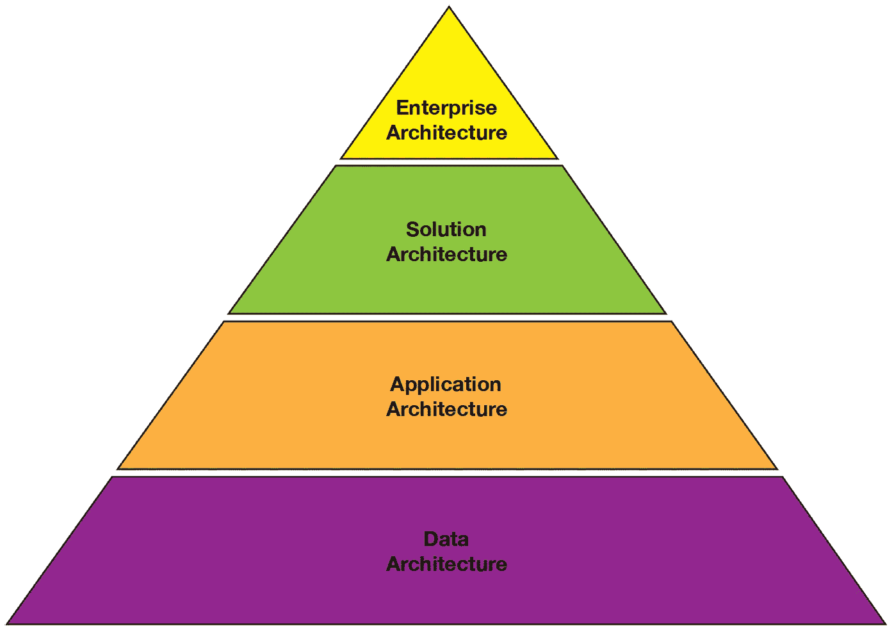
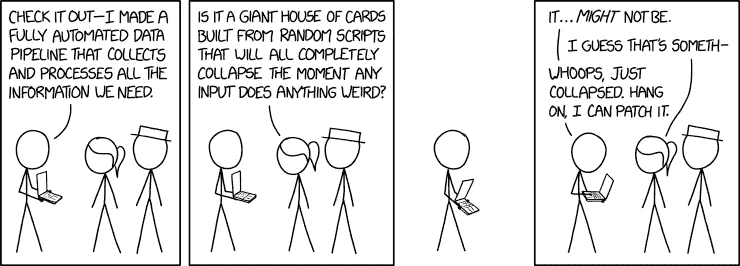
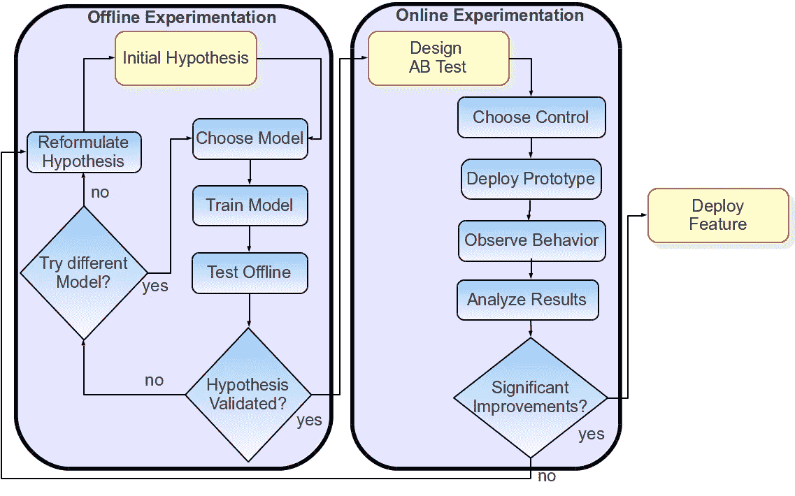

# 利用数据科学变得更聪明—应对真正的企业挑战

> 原文：<https://towardsdatascience.com/get-smarter-with-data-science-tackling-real-enterprise-challenges-67ee001f6097?source=collection_archive---------9----------------------->

## 数据科学战略指南—第 1 部分

## 让您的数据科学项目从零开始走向生产

# 介绍

' ***《数据科学战略指南——用数据科学变得更聪明'*** 被设想为一系列文章，这些文章更像是一份战略指南，描述了在现实世界中实施和执行数据科学项目时需要牢记的基本挑战、陷阱和原则。我们还将介绍如何通过关注非常真实的视角并远离炒作，从数据科学和人工智能中获得最大价值。这将使您能够在自己的领域内推动行业成功！这里的重点更多的是在行业中执行的真实项目，但是这些原则中的一些也适用于研究。

Source: [https://xkcd.com/](https://xkcd.com/)

一般来说，我的大部分文章都是面向实践的，针对的是构建系统的人和真正从事数据科学的*。然而，本指南面向更广泛的受众，包括高管、企业、架构师、分析师、工程师和数据科学家。根据我的观点和经验，您需要所有这些来成功执行数据科学项目并获得最大价值！*

> 您是否厌倦了您的数据科学项目仅仅停留在概念验证阶段？
> 
> 当您的项目最终投入生产并开始处理真实世界的数据时，您难道不喜欢吗？
> 
> 你喜欢从数据中提供可行的见解来推动业务目标吗？
> 
> 你想建立一个成功有效的数据科学团队吗？
> 
> 我能为我的团队建立有效的数据科学和人工智能战略吗？

如果你对这些问题中的至少一个回答是肯定的，这个指南就是为你准备的！我们将通过一系列文章在本指南中涵盖以下主要方面:

*   **第 1 部分—当前的挑战和潜在的解决方案**
*   **第 2 部分—建立有效的数据科学团队**
*   **第 3 部分—数据科学项目的流程模型**
*   **第 4 部分——有效的数据科学管道**
*   **第 5 部分——推动行业成功**

本指南中表达的所有观点均基于个人经验、行业趋势以及与行业专家的交流。本指南的目的不是传播任何偏见或成见，而是给出在企业中执行数据科学项目时要检查的核心组件的清晰概念。我仍然不认为自己是这个领域的专家(要学的东西太多了！)但是我希望这个指南能帮助你获得一些关于有效执行数据科学项目的有用观点。

在这篇特别的文章中，我们将关注一些困扰行业的关于执行数据科学项目的非常真实的挑战和一些潜在的解决方案。

# 当前的挑战和潜在的解决方案

大多数数据科学家(包括我自己)喜欢现成可用的工具、库和框架。在解决不同的问题时，我们有自己的个人偏好。由于这些工具和方法的临时使用，再加上我们的偏好，这导致在实际尝试部署和维护数据科学项目工件和资产时增加了工作量。

Source: [https://xkcd.com/](https://xkcd.com/)

在本节中，我们将了解一些最重要的挑战和陷阱，这些挑战和陷阱经常困扰着从未走出概念验证阶段的数据科学项目，以及一些关于我们如何应对它们的指导。

# 分散的技术格局

数据科学工具的技术前景是巨大的，并且每天都在变得更大。再加上大数据、人工智能和其他一些术语，你会看到一个更大的工具、库和框架的景观。在数据科学中，从数据科学家的角度来看，这一切都是为了使用最好的(或最容易使用和理解的)工具来解决问题，因为方法-统计或机器学习\深度学习都建立在数学、统计和优化的基础上，只要实现的算法或方法是统一的，特定的工具或框架的使用对他们来说并不重要。我相信你一定听说过这样一句话，*‘不要专注于工具和框架。专注于要解决的问题！。*

Source: [https://xkcd.com/](https://xkcd.com/)

这没有错。通常，一个数据科学家(像我一样)可能喜欢开始查看数据，打开 R 或 Python，开始编写代码来做一些分析或构建模型。基于从事数据科学的人们的使用模式，我们通常有两个极端。有些人喜欢使用编程语言，如 R、Python、Scala 或 Java，加上框架和库，使他们能够轻松地进行复杂的分析。其他人喜欢使用基于“无代码、图形拖放界面”的工具，如 KNIME、RapidMiner、Weka 等等。

拥有使用我最了解的工具的*心态，对于数据科学项目来说可能是毁灭性的，因为缺乏标准化、最小架构，尤其是如果构建项目的人最终在项目部署后离开了公司。构建一个概念证明是非常好的，但是当你需要将你的项目转移到生产中时，还要考虑以下几个方面——***使用模式、可伸缩性、标准化架构、与现有系统的集成*** 和 ***可维护性*** 。*

# 从众倾向(和炒作)

让我们面对它，我相信我们都已经看到这种情况在行业中发生，特别是围绕人工智能、自动机器学习、公民数据科学家等产生的所有宣传。C 级高管需要制定适当的数据科学和人工智能战略，并确定他们的关键业务和战略目标、数据可用性和必要性，以及数据科学和分析如何帮助他们实现这些目标。他们当然需要咨询领域专家和员工，以保持技术和业务之间的平衡。请记住，数据科学与现有业务流程的结合是推动成功的因素，两者协同工作，而不是孤立存在。

Source: [https://xkcd.com/](https://xkcd.com/)

盲目追逐大数据、数据科学或深度学习的宣传，没有目的地匆忙制定战略，可能会浪费在这些领域投入的时间、金钱和精力。如果没有最终目标或结果来说明为什么要这样做，那么像*、*、*、*、*、【为所有企业数据创建统一的数据湖】这样的战略肯定会发出危险信号。这些说法并不离谱，有趣的是，你可以看看这篇文章* 关于*数据湖没有带来商业价值的 3 个原因*在过去几年的大肆宣传之后 [*这篇来自 CIO.com 的文章*](https://www.cio.com/article/3251720/analytics/4-data-analytics-trends-that-will-dominate-2018.html) 还告诉我们，

> “数据湖需要证明商业价值，否则就会消亡”

始终将任何战略与定义明确、清晰的成果以及可用于衡量这些成果的关键绩效指标联系起来。这些不必一成不变，但也不应该太模糊。这不是一项简单的任务，但必须完成。

# 缺乏可重复性和可重用的工件

数据科学分析和代码需要是可复制的。有多少次我们听到这些台词——*‘上周模型给了我 90%的准确率’*或者*‘代码在我的机器上运行良好！’*。嘿，我也去过那里，被指控有罪！在使用编程语言和框架时，像设置随机种子这样简单的事情，对可重复分析大有帮助。除此之外，如果你想跟踪一段时间*‘哪个模型训练了什么数据，给出了什么样的性能指标？’那么模型、数据和特性集版本化是必不可少的*然后利用最佳模式或恢复到以前的模式。利用虚拟环境和容器是确保你不会陷入*“包依赖地狱*”的好方法。

Source: [https://xkcd.com/](https://xkcd.com/)

Jupyter 笔记本是实现可重复研究和数据分析的一种很好的方式，通常是数据科学家的首选工具。我强烈推荐任何感兴趣的人阅读这篇精彩的文章*，这篇文章讲述了笔记本电脑如何在业务中实现可复制性。*

* [## Jupyter 笔记本电脑迎接再现性的挑战——新堆栈

### 每个应用程序都需要有一个杀手锏。对于 Jupyter 笔记本来说，这个特性可能是可再现性…

thenewstack.io](https://thenewstack.io/jupyter-notebooks-challenge-reproducibility/) 

甚至 Jake Vanderplas 在他的文章 中也收集了大量关于 Jupyter 笔记本 [*的视频和教程。另一篇有趣的论文是 Adam Rule 等人的“Jupyter 笔记本中可重复研究的十个简单规则”，可在*](https://jakevdp.github.io/blog/2017/03/03/reproducible-data-analysis-in-jupyter/) *[*此处*](https://arxiv.org/abs/1810.08055) 找到。他们谈到了一套规则，作为科学家的指南，特别关注计算笔记本系统。*

Source: [https://arxiv.org/abs/1810.08055](https://arxiv.org/abs/1810.08055)

但是，并非一切都是完美和美好的，在使用 Jupyter 笔记本时，需要记住几个注意事项。我推荐大家一定要看乔尔·格鲁什的这个精彩演讲， [*“我不喜欢笔记本”*](https://docs.google.com/presentation/d/1n2RlMdmv1p25Xy5thJUhkKGvjtV-dkAIsUXP-AL4ffI) 讽刺地在 JupyterCon 2018 上呈现！

这里的另一个重要方面是可重用性。鉴于许多数据科学家通常喜欢以特别的方式单独工作，因此缺乏适当的协作。项目和人员以前所未有的速度流失。因此，如果你的项目是围绕着一堆分布在不同系统中的未记录的代码工件和脚本构建的，那么如果这些工件的开发人员突然离开，你将会猛然惊醒。除此之外，通常还有一些可重复的特定使用模式，如数据提取、ETL(提取-转换-加载)、功能工程，甚至是在相同数据集上建模。开发可重用的工件和组件，并使它们在公共存储库中易于访问，将在未来节省大量时间，而不是数据科学家为每个新项目重新创建这些工件。

# 缺乏协作—打破孤岛思维

数据科学家通常喜欢按照自己的节奏，以特别的方式做实验和分析数据。这有助于创造性思维和创新。虽然这一点都不坏，但我们确实需要开始合作，分享更多我们正在做的工作，并且在团队中工作(有时结对编程真的很好！).

Source: [https://xkcd.com/](https://xkcd.com/)

最好的方法之一是确保围绕项目中正在进行的工作召开定期会议，围绕每个人正在做的事情明确定义具体的交付成果和任务，并进行混合任务，数据科学家可以独自工作，也可以与其他数据科学家甚至工程师协同工作。这将有助于促进知识共享、协作工作，以及在有人突然离开的情况下项目不会沉没。

要避免的一个更关键的陷阱是——[***【筒仓心态】***](https://www.forbes.com/sites/brentgleeson/2013/10/02/the-silo-mentality-how-to-break-down-the-barriers/#2cd2652a8c7e) ，这基本上是一种*心态，出现在某些部门或部门不希望与同一公司的其他人共享信息的时候。*

 [## 筒仓心态:如何打破壁垒

### 这篇文章是与互联网营销公司的梅根罗索合著的

www.forbes.com](https://www.forbes.com/sites/brentgleeson/2013/10/02/the-silo-mentality-how-to-break-down-the-barriers/#2cd2652a8c7e) 

我相信你们中的很多人以前都面临过这种情况，甚至到今天也面临着这种情况。人们和团队需要认识到，只有通过共享和协作，才能创造伟大的事物，解决问题，项目才能成功。筒仓心态会导致生产力、效率的损失，降低士气，最终项目会被废弃。协作、朝着共同的目标努力、适当的激励和动机可以大大有助于为数据科学培养健康、高效的工作文化。鼓励工程师、分析师、科学家和建筑师在一个项目中一起工作，同时明确他们各自的具体任务。

# 将关键数据科学项目外包给第三方公司

不要误解我的意思，我们有许多纯粹的分析公司，他们拥有正确的专业知识，可以为希望更多数据驱动的公司提供关键的见解。但是，如果您计划*真正*长期投资以获得数据科学推动业务决策的好处，请在内部投资一个优秀的数据科学团队(或者根据公司规模、垂直行业等投资多个团队)。这样做的好处是多方面的。你不必担心公司带你去兜风或顾问在项目上工作，然后你不得不忍受维护他们的痛苦，当他们在合同到期后方便地消失时，通常在概念验证或 MVP(最低可行产品)阶段结束时。你也永远不会得到和你自己的员工一样的信任。也就是说，如果你有很多数据科学项目正在进行中，并且有足够的预算，请放心将不太重要的短期项目交给这些纯粹的第三方分析公司。

除此之外，请克服被大肆宣传的公民数据科学家和自动机器学习的概念。让我们面对现实吧！公民数据科学家可以让你更加数据驱动，但不是每个人都可以为你解决棘手的问题。你需要真正的数据科学家来构建模型和系统，并搅动我们的洞察力。自动化机器学习并不是解决所有问题的灵丹妙药。不要因为你可以将一个数据源连接到这些工具中的一个，并开始获得现成的见解而感到失望。许多公司犯了这样的错误，没有被一套工具所束缚，也不知道如何使用它们。您需要知道如何有效地使用这些工具来真正帮助减少您的数据科学项目的开发时间。

# 技术债务—缺乏标准和项目架构

对于任何与构建软件和产品相关的技术和工程公司来说，这都是事实。通常，从事数据科学项目的人会想，*“这些是软件工程方法和原则，我们远不止这些”*。不要！你肯定不是最重要的，没有意识到这一点，可能会在你真正复杂的深度学习模型中留下一个巨大的漏洞，导致又一个失败的概念验证，无法投入生产。

Source: [https://xkcd.com/](https://xkcd.com/)

跨团队启用适当的编码标准。在必要的地方构建可重用资产，但不要做得太多。一个关键的方面是不要总是只关注数据科学的工具和框架，还要关注非功能性需求(nfr)。流行的 nfr 有*可扩展性*、*可维护性*、*可用性*等等。就像我们有软件项目的企业架构一样，我们需要架构师和数据科学家与他们合作，为每个数据科学项目定义项目架构(解决方案-应用程序&数据),其最终目标是部署到生产中。下图描述了一个标准的分层企业架构。

*Layered Enterprise Architecture Hierarchy (Source: IBM)*

许多内容摘自一本名为 [*“数据科学西部的架构思考”*](https://developer.ibm.com/articles/architectural-thinking-in-the-wild-west-of-data-science/) 的优秀指南，该指南实际上谈到了数据科学项目中的许多挑战，以及定义项目架构的潜在优势。

 [## 数据科学蛮荒西部的架构思考

### 自由选择编程语言、工具和框架可以提高创造性思维和发展。

developer.ibm.com](https://developer.ibm.com/articles/architectural-thinking-in-the-wild-west-of-data-science/) 

典型地，一个 ***企业架构师*** 定义了在整个企业中有效的标准和指导方针。一个 ***解决方案架构师*** 在企业架构师定义的框架内工作。这个角色定义了哪些技术组件适合特定的项目和用例。您还可以选择 ***应用架构师*** ，他们更关注解决方案架构框架内与应用相关的组件，以及 ***数据架构师*** ，他们定义与数据相关的组件。解决方案架构师通常会担当这些角色。

通常，数据科学家很少与企业架构师互动，而是更多地与解决方案架构师(以及应用程序/数据架构师)直接合作。数据科学家应该能够为他们的项目设想端到端的解决方案架构，甚至为架构师提供必要的输入，以便随着时间的推移改进和转变企业架构。进化是关键，由于数据科学是一个新兴的创新领域，您需要摆脱数据科学项目的常规软件项目架构模板。

# **压装工具和行业标准流程**

仅仅因为过程模型适用于特定的项目或垂直行业，并不意味着它对数据科学也是有效的。许多企业，尤其是拥有大量员工的公司，往往会在日常运营和项目执行中使用大量流程。我们曾经有瀑布模型。现在我们有了*[*看板*](https://en.wikipedia.org/wiki/Kanban)[*缩放敏捷*](https://en.wikipedia.org/wiki/Scaled_agile_framework)[*Scrum*](https://en.wikipedia.org/wiki/Scrum_(software_development))[*Scrum ban*](https://en.wikipedia.org/wiki/Scrumban)等等更多的变种！这里的意图是不要严格遵循这些过程框架，而是根据项目的类型，将它们改编成可能最适合您的团队的东西。从事与产品开发直接相关的数据科学工作？也许更关注 scrum 驱动的敏捷思维。从事更具探索性或咨询性的特别项目？也许看板或 Scrumban 可能更适合你。关键的想法是从一组标准开始，并具有随时间发展的灵活性。对改变保持开放的心态，但改变某些东西是有原因的！*

**

*Source: [https://xkcd.com/](https://xkcd.com/)*

*关于工具和框架，就像我们之前提到的，正确的工具或框架确实是基于要解决的问题，但总是有一套关于从定义的工作流、模式、编码标准和架构开始的使用的标准和指南。也不要把工具强加给问题。不，自动化机器学习不会自动从原始数据中给你最好的模型或见解。您仍然需要了解业务问题、成功标准以及使用这些工具以有效方式帮助解决问题的正确方法。就像你永远不会优化一个模型来最大限度地解决每个问题一样，不要在不知道为什么要使用一个工具的情况下就使用它。*

# *数据科学和工程之间的差距*

*作为数据科学家，我们往往会忽略一个事实，即纯数据科学或机器学习组件只是构建整个项目或系统的所有其他组件中非常小的一个组件。NIPS 2015 论文， [*【机器学习系统中隐藏的技术债务】*](http://papers.nips.cc/paper/5656-hidden-technical-debt-in-machine-learning-systems) 以如下视觉的形式完美地解释了这一点。*

**

*Major components of a Data Science Project \ System*

****ML 代码*** 组件就是你上图看到的那个很小的黑框。但通常数据科学家更专注于开发算法、建立模型、探索和分析数据。因此，这最终导致他们更多地忘记了全局。这不可避免地导致项目停留在概念验证阶段，永远不会被部署。这方面的一个经典例子是从 [*Netflix 奖挑战赛*](https://www.netflixprize.com/) 中吸取的教训。Netflix 的 ***奖*** 是一场公开比赛，争夺最佳[协同过滤](https://en.wikipedia.org/wiki/Collaborative_filtering) [算法](https://en.wikipedia.org/wiki/Algorithm)，根据之前的评分预测[电影](https://en.wikipedia.org/wiki/Film)的用户评分。如果你看看他们在论文 [*“挖掘大规模用户数据流进行个性化推荐”*](https://www.kdd.org/exploration_files/V14-02-05-Amatriain.pdf) 中提到的获奖经验，他们必须从获奖解决方案的 107 个模型中提取两个核心算法！然后，他们不得不扩展这些来处理超过 50 亿的收视率。除此之外，他们还提到不包括几个模型，因为将这些模型投入生产需要纯粹的工程努力。*

> *“在网飞，我们评估了最终解决方案中包含的一些新方法。我们测量的额外精度增益似乎并不证明将其引入生产环境所需的工程努力是合理的。”*

*这清楚地告诉我们，为了整个系统正常运行，即使是数据科学家也需要对问题和端到端解决方案有一个整体的看法。因此，要在生产中部署数据科学项目，您需要将数据科学、数据工程、软件工程、架构、基础设施、监控和质量检查结合起来。忽视工程方面，说我只是建立机器学习模型，这不再是任何在该行业工作的数据科学家应该说的话。学会挺身而出，在需要时专注于项目的工程方面，并最大限度地利用工程团队——持续的合作有助于推动良好的协同作用。*

# *忽略质量检查和操作*

*通常，在数据科学团队中工作的人认为，在*‘所谓的’*测试数据集上训练和评估他们的模型之后，他们的工作就完成了。缺乏质量、监控和控制检查可能会导致数据科学项目在部署后崩溃——这通常比实际开发阶段更重要！*

**

*Source: [https://xkcd.com/](https://xkcd.com/)*

*永远记住通过使用有效的策略来验证你的模型，比如验证数据集和交叉验证。检查数据泄露和目标标签泄露等问题。这里要记住的另一点是，在调优模型时，不要一直在训练数据上调优您的模型，并在测试数据上检查性能。然后你就间接地在测试数据上训练了你的模型！始终将数据科学和机器学习性能评估指标与您的业务指标和成功指标联系起来。流失模型可能需要更高的召回率，欺诈检测模型可能需要更高的精确度，反之亦然，这取决于业务需求！请记住，随着时间的推移，不断重新审视您的项目的成功标准和指标，因为这是您的项目在生产中部署的关键。*

*是否有其他的方法来评估和检查您已经部署的(或者将要部署的)模型的质量？典型的离线和在线场景可能保证不同的质量和测试方法。网飞的论文中提到了一个很好的工作流程， [*【挖掘大量用户数据进行个性化推荐】*](https://www.kdd.org/exploration_files/V14-02-05-Amatriain.pdf) *。**

**

*Testing Online and Offline Models (Source: Netflix)*

*模型度量、假设测试和 A/B 测试是您可以用来进行质量检查的关键工具。除此之外，你也不应该忽视操作方面。这意味着要确保部署适当的模型性能评估监控系统，以便您可以根据实时数据跟踪模型性能。请记住，一旦模型被构建和评估，项目就不会结束。通常，拥有持续集成和交付框架(CI/CD)也有助于持续确保您的代码库工作正常，并且不会在无人知晓的情况下突然中断。*

# *结论*

*我希望这篇文章能让您对行业中关于执行数据科学项目的典型现实挑战有所了解。这里给出的建议只是一些通用的指导方针，并不是一成不变的。由于数据科学现在已经发展成为一个跨行业的学科，你们每个人都可能会找到更适合自己的特定方面，但要记住的总体挑战应该在本文中。我真诚地祝愿你们所有人在执行自己的数据科学项目中取得成功，如果有什么我忘记在这里提到的，请不要犹豫，告诉我什么最适合你！*

# *下一步是什么？*

*我们为数据科学战略指南系列计划了许多有趣的内容！在下一篇文章 的 ***中，我们将从行业专家、企业和你的友好邻居作者——我自己——的角度，探讨如何建立有效的数据科学团队*** ！敬请关注一些有趣的内容！*

*有反馈给我吗？或者有兴趣与我一起从事研究、数据科学、人工智能甚至发表一篇关于 [***TDS***](https://towardsdatascience.com/) 的文章？可以在[**LinkedIn**](https://www.linkedin.com/in/dipanzan/)**上联系我。***

* [## 人工智能顾问&数据科学导师-跳板| LinkedIn

### 查看 Dipanjan Sarkar 在世界最大的职业社区 LinkedIn 上的个人资料。Dipanjan 有 2 份工作列在…

www.linkedin.com](https://www.linkedin.com/in/dipanzan/)**