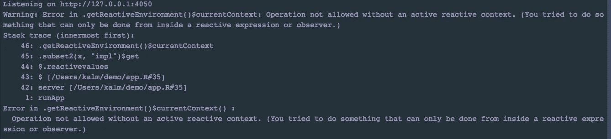
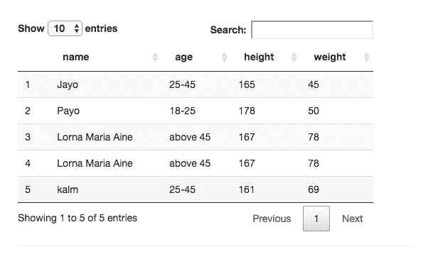
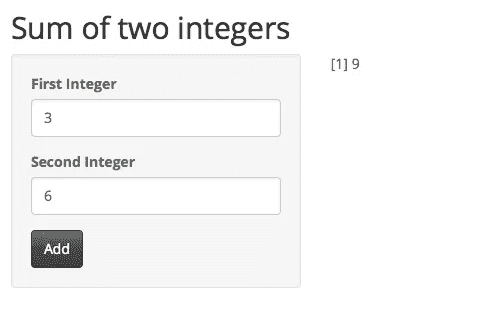
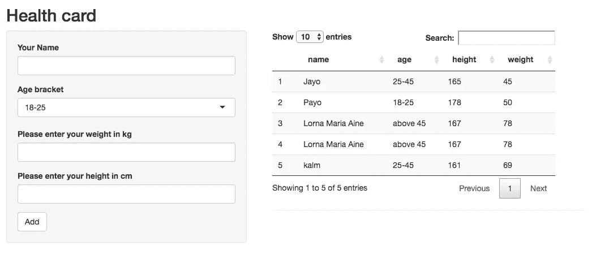

# 从闪亮应用的反应例子开始。

> 原文：<https://towardsdatascience.com/get-started-with-examples-of-reactivity-in-in-shiny-apps-db409079dd11?source=collection_archive---------3----------------------->


Photo Credit : [Pixabay](https://pixabay.com/en/background-christmas-3009949/)

# 介绍

让闪亮的应用程序具有交互性的一个因素是反应能力。用最简单的术语来说，反应性/反应性编程是程序根据一组给定的用户输入计算输出的能力。一个闪亮的应用程序处理反应的能力在用户和现有信息之间建立了双向交流。

反应性适用于执行计算、数据操作、收集用户信息等情况。

作为一个开始构建闪亮应用的初学者，掌握处理反应的基本知识将有助于你探索闪亮应用的不同用例。

# 我们开始吧

直到下面的错误消息，人们才会想到反应性的概念。



error message

当电抗组件被放置在非电抗函数中时，会出现此错误。该应用程序将不会加载，并将解析此错误。让我们看看什么是反应函数，它有什么作用。

# 闪亮应用的反应组件

一个闪亮的应用程序有三个主要的反应组件:

## **无功输入**

反应式输入被定义为用户通过浏览器界面提供的输入。例如，当用户填写表单、选择项目或单击按钮时。这些动作将触发从无功输入设置的值。


Text input and Add button are reactive inputs

## 无功输出

反应输出被定义为浏览器界面中程序提供的输出。例如图表、地图、曲线图或数值表。



Table of values as a reactive output

## 反应式表达

电抗表达式被定义为将电抗输入转换为电抗输出的表达式。它们在发送无功输出之前执行计算。这些还会屏蔽慢速操作，如从服务器读取数据、在其他场景中进行网络调用。我们将在我们的例子中看到一个。

# 例子

让我们从一个简单的例子开始，将两个整数相加，并在一个闪亮的应用程序中返回它们的和。

## 用户界面

```
titlePanel("Sum of two integers"),

  #number input form
  sidebarLayout(
    sidebarPanel(
      textInput("one", "First Integer"),
      textInput("two", "Second Integer"),
      actionButton("add", "Add")
    ),

    # Show result
    mainPanel(

   textOutput("sum")

    )
```

## 计算机网络服务器

```
server <- function(input,output,session) {#observe the add click and perform a reactive expression
  observeEvent( input$add,{
    x <- as.numeric(input$one)
    y <- as.numeric(input$two)
    #reactive expression
    n <- x+y
    output$sum <- renderPrint(n)
  }

  )
```

## 结果



Example

# 演示

现在，让我们在处理反应性的同时，构建一些稍微复杂的东西。

## 用户界面

```
fields <- c("name","age","height","weight")
ui <- fluidPage(

   # Application title
   titlePanel("Health card"),

   # Sidebar with reactive inputs
   sidebarLayout(
      sidebarPanel(
         textInput("name","Your Name"),
        selectInput("age","Age bracket",c("18-25","25-45","above 45")),
         textInput("weight","Please enter your weight in kg"),
         textInput("height","Please enter your height in cm"),
         actionButton("save","Add")

      ),

      # a table of reactive outputs
      mainPanel(
         mainPanel(

            DT::dataTableOutput("responses", width = 500), tags$hr()

         )
      )
   )
)
```

## 计算机网络服务器

```
# Define server logic 
   server <- function(input, output,session) { #create a data frame called responses
      saveData <- function(data) {
         data <- as.data.frame(t(data))
         if (exists("responses")) {
            responses <<- rbind(responses, data)
         } else {
            responses <<- data
         }
      }

      loadData <- function() {
         if (exists("responses")) {
            responses
         }
      }

      # Whenever a field is filled, aggregate all form data
      #formData is a reactive function formData <- reactive({
         data <- sapply(fields, function(x) input[[x]])
         data
      })

      # When the Save button is clicked, save the form data
      observeEvent(input$save, {
         saveData(formData())
      })

      # Show the previous responses
      # (update with current response when save is clicked)
      output$responses <- DT::renderDataTable({
         input$save
         loadData()
      })     
   }
```

## 结果



When project is run.

项目演示:【https://rstudio.cloud/project/22236 

这就对了。既然你已经掌握了基本知识，请继续尝试。欢迎分享、向我提问或在 twitter 上给出反馈 [@lornamariak](https://twitter.com/lornamariak)