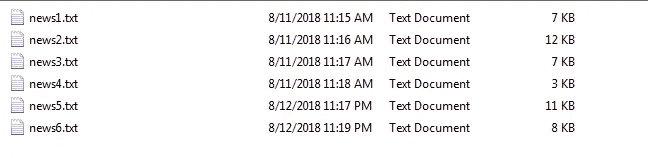
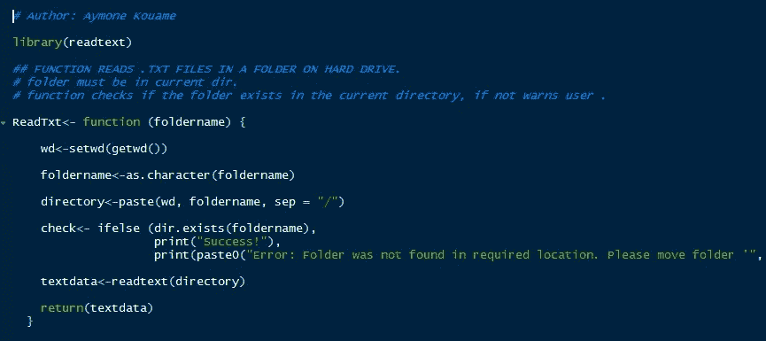
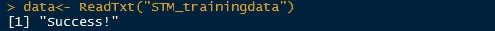
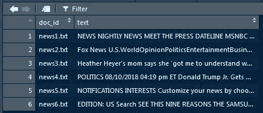
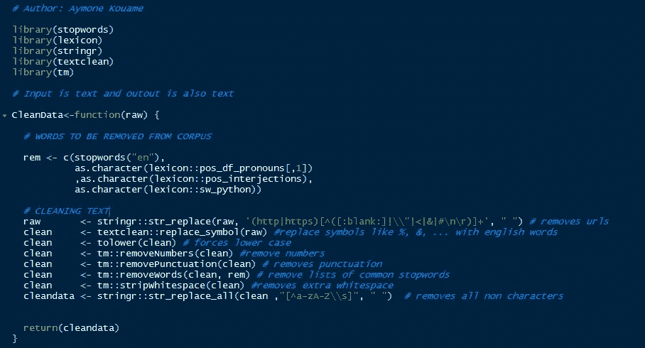
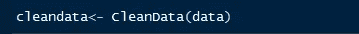
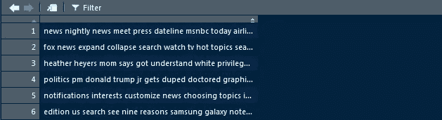
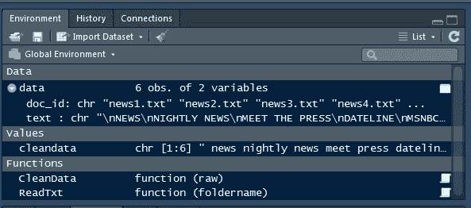

# 自然语言处理入门

> 原文：<https://towardsdatascience.com/get-started-with-natural-language-processing-a-multi-label-text-classification-example-in-r-part-bb8f064be5e4?source=collection_archive---------8----------------------->

## R 中的多标签文本分类示例(第 1 部分)

> 文本分类是自然语言处理的一种。 NLP 可以简单地定义为教授一种算法，像人类一样阅读和分析人类(自然)语言，但速度更快，更准确，并且基于大量数据。

如果你是一个有抱负的数据科学家或分析师，你必须知道如何建立一个文本分类模型。从邮件分类到信息发现，实际应用层出不穷。多标签文本分类简单地说就是将文本数据分成两个以上的类别。初学的数据分析师、没有 NLP 经验的数据分析师或其他好奇的数据科学家会发现这个博客很有趣。

**你需要对 R 和 RStudio** 有所了解。我将使用 R 中的结构化主题模型(STM)包，这是一个使用文档级协变量的无监督聚类包。我已经用 STM 建模了许多文本分类器，它用最少的训练就给出了极好的结果。你可以在这里阅读更多关于 STM [的内容](https://cran.r-project.org/web/packages/stm/index.html)。

## 让我们开始编码吧！

**第一步:获取数据。**对于这个例子，我将使用。txt 文档，这些是我使用 Python 的 BeautifulSoup 从开源中搜集的新闻文章(是的，在搜集数据时，我更喜欢 Python)。

如果你不知道怎么做，不要担心！您可以在线复制粘贴自由文本数据，并将其另存为。txt 文件(确保阅读版权。只使用免费使用的 web 数据)。这是我的数据的样子:

我保存了我所有的。txt 文件放在一个名为 *STM_trainingdata，*的文件夹里，这个文件夹在我的当前目录下。

**第二步:在 RStudio 中摄取数据。一个经验法则是为你经常重复的任务编写函数。为了将我的数据接收到 RStudio 中，我编写了一个简单的函数。根据您正在处理的项目和所需的输出，您的函数可以有不同的输入/输出。这是我的样子:**

现在，调用如下所示的函数，您应该会得到“成功！”：

您的数据在 RStudio 中应该是这样的:

现在，每次我需要在我的文件夹中添加/修改训练数据时，我在 RStudio 中更新我的数据变量所要做的就是调用 *ReadTxt()* 。

**第三步:预处理你的数据。**数据预处理是任何机器学习过程中最重要的步骤之一。不良清理和/或结构化的数据将产生不良结果。在数据浏览期间，您可以使用各种统计和可视化方法来确保数据准备就绪。

因为我们的数据样本非常小，所以我编写了一个基本函数来清理它。你可以在函数里面读到具体的清洗步骤。此外，正如您将在第 2 部分中看到的，STM 提供了额外的数据修剪选项；所以我在这里只关注基础知识。

自然语言处理中一个非常重要的步骤是去除停用词。停用词是在你的语料库中常见的词，因此在确定文本中讨论的主题时没有权重(它们只是你的数据中的噪音)。一些常见的停用词有冠词、代词、感叹词等。

下面的功能是非常可定制的。根据您的训练数据，您可能需要删除更多的停用字词。你可以将它们直接添加到 *rem* 向量中。例如，您可能也不需要删除 URL。

编写函数时，最好使用描述性名称，并添加一些关于输入、输出和过程的解释。

接下来，按如下方式调用该函数:

您的干净数据应该如下所示:

此时，RStudio 的全局环境中应该有 4 个项目。见下文:

这就是第 1 部分！在第 2 部分，我们将进入有趣的部分:训练和测试我们的 STM 模型以及一些可视化。敬请期待！

*如果你喜欢这个帖子，请为它鼓掌，并随时在*[*LinkedIn*](https://www.linkedin.com/in/aymonekouame/)*和 T*[*witter*](https://twitter.com/Aymone_K)*上添加我！*