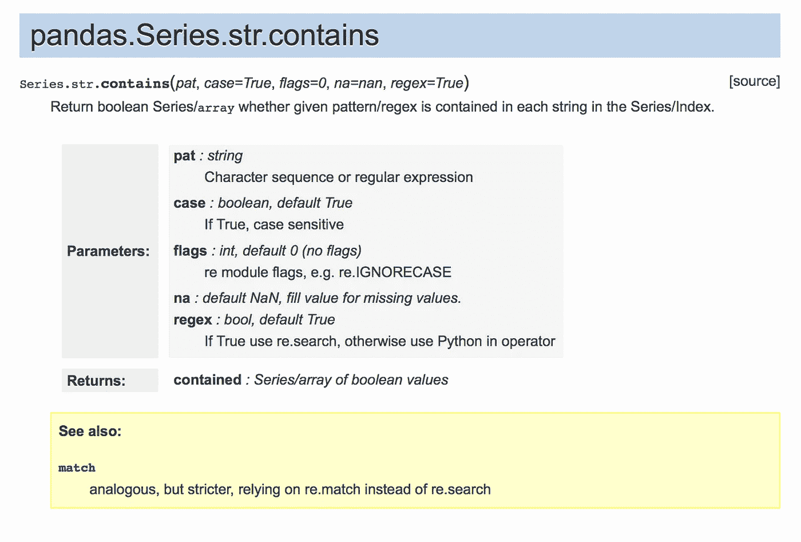
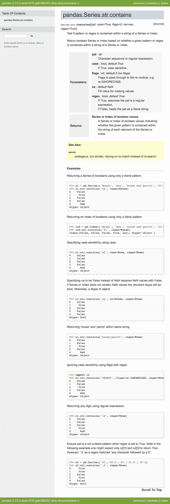

# 坚持为熊猫做贡献

> 原文：<https://towardsdatascience.com/get-stuck-in-with-contributing-to-pandas-fea87d2ac99?source=collection_archive---------9----------------------->


Photo by [Polina Razorilova](https://unsplash.com/@bolotohodova?utm_source=medium&utm_medium=referral) on [Unsplash](https://unsplash.com?utm_source=medium&utm_medium=referral)

如果这能引起任何数据人员的共鸣，请举手。你的老板给你一个数据集，让你找一些有趣的东西。你拿起数据，把它粘在笔记本上。现在怎么办？很可能你的手指已经下意识地打出了:

```
import pandas as pd
```

在这篇文章中，我们不打算浏览熊猫是什么或如何使用它的本质，你可能比我更了解图书馆！相反，我将专注于通过文档回馈数据分析社区。

在参加 PyData London 2018 时，我遇到了一场熊猫冲刺会议。正是在这里，我了解到开源包的受欢迎程度已经超过了贡献的程度，尤其是它的 API 文档。

类似于*的群体智慧*现象，这表明最好从一个群体中获取意见，而不是把个人的话当作真理——开源允许专家和业余爱好者在一个项目上合作，这可以使整个社区受益。


直到这个冲刺阶段，我还没有真正为开源做出贡献——老实说，我从来没有真正相信我的编码能力达到了标准。然而，我是一个坚持良好文档化代码的人，所以这个 sprint 关注文档的事实给了我一些非常需要的信心。

因此，如果我的故事引起了你的共鸣，而你从未为开源项目做出过贡献，但想这样做，请继续阅读，我将指导你完成这一过程。

# 让我们为熊猫做贡献

## 安装

我可以在这里通过设置步骤，但没有必要重新发明轮子…查看超级简洁的熊猫冲刺设置说明[这里](https://python-sprints.github.io/pandas/guide/pandas_setup.html)。

现在一切都准备好了🤞，让我解释一下好的文档是什么样子的，以及我们为什么需要它。

## 文件 101

文档是一组关于特定函数、方法、类或模块使用的简明信息。没有它，用户要么会误解工具的目的，要么会浪费时间去理解源代码。基本上，文档旨在减少理解如何使用工具所需的时间，以便用户可以继续他们的工作。

那么我包括哪些信息呢？

很高兴你问了这个问题，这里有一个包含在你的文档中的 7 个部分的列表…你不会相信第 5 个！

**第 1 部分-简短总结**

这是用户看到的第一个东西，所以要让它有冲击力！描述函数本质的简短有力的句子。

**第 2 部分-扩展总结**

不是所有的事情都可以用一句话来描述，没关系。本节允许您更深入地描述该函数的细微差别。

**第 3 节-参数**

在这里，您为用户提供了该功能所需的一组输入。这些必须包括每个参数的类型和描述。

**第 4 节-退货**

如果函数返回一个值或者改变一个状态，这必须引起用户的注意，因为误解可能会对下游产生严重的后果。请务必在此记录。

**第 5 节——参见**

在本节中，文档试图将用户的注意力吸引到其他相关功能上。与其他功能相关联可以给用户更直观的理解。

**第 6 节-注释**

这是一个可选部分，在“扩展总结”中没有解释的任何细节都可以在这里讨论。

**第 7 节-示例**

人们喜欢在实践中学习，没有比在真实场景中使用概念更好的方法来具体理解概念。你应该包括一些如何使用该功能的例子。

## **文档走查**

在冲刺的那一天，每个参与者都有一个功能或方法来记录——我被指定为[熊猫。Series.str.contains](https://pandas.pydata.org/pandas-docs/stable/generated/pandas.Series.str.contains.html) 。就像第 7 节一样，我会通过这个例子告诉你。

**步骤 1-初始概述**

查看文档的当前状态。创建一个潜在改进领域的清单，并在每一项都被勾掉后得到急需的多巴胺修复。



正如您所看到的，上面讨论的一些部分不存在，在参数类型和一些格式问题上有一些差异。总体来说，还不算太寒酸。

**第 2 步-试用该功能**

在你写一个函数之前，你必须理解这个函数，这很重要。想出尽可能多的理由，为什么你会想在日常编程中使用它，然后实现一些基本的用例。这些可在第 7 节中作为示例使用。您还可以通过编写几个单元测试来进一步阐明您对该函数的理解。

第三步——还有谁在同一条船上？

请记住，我们这样做的原因是为了帮助人们有效地理解代码。在 Google、Stack Overflow 或者 Github 上搜索该功能，看看之前有没有人出现过问题。如果类似的问题不断出现，针对这些问题修改文档以消除任何歧义。当搜索熊猫的问题时。Series.str.contains 我一直碰到涉及正则表达式的[题](https://stackoverflow.com/questions/19169649/using-str-contains-in-pandas-with-dataframes)。为了解决这个问题，我确保在相关的例子中包含一些这样的例子。

**第四步——合规**

不同的思想有不同的风格，一般来说，多样性是一件好事。然而，随着代码库的增长，一致性是至关重要的。对于 python，大多数库都试图遵循代码格式指南，pandas 遵循 [PEP 257](https://www.python.org/dev/peps/pep-0257/) 。这包括从空白到不定式动词使用的所有指南。这听起来可能很迂腐，但是这些指导方针已经被修改和调整了近二十年，它们的存在是有原因的——所以使用它们吧！

幸运的是，pandas 的核心开发人员已经构建了一个脚本来检查您的代码是否符合他们的风格指南。偶尔运行一下并相应地修改代码是很方便的。

```
python scripts/validate_docstrings.py <insert-your-function-here>
```

你还应该运行著名的 python linter，flake8 来保持一切整洁。

```
git diff upstream/master -u -- "*.py" | flake8 --diff
```

一旦您觉得文档符合标准，请快速预览一下:

```
python make.py html — single pandas.Series.str.contains
```

好看吗？是时候发出拉取请求了。查看此[页面](https://python-sprints.github.io/pandas/guide/pandas_pr.html)以获得您的建议。

这个阶段包括你向核心开发者发布你的建议，如果他们喜欢你的建议，他们会在下一个版本中接受它。

还有一件事…核心开发人员会比你更了解好的文档，所以他们可能会对你的建议有一些意见。我的建议是不要把它放在心上，只是冲洗和重复，做修复和推动你的拉请求。

不要害怕公开你的错误，反馈是你的朋友。否则你永远不会从你的错误中吸取教训，或者更糟——养成一个坏习惯。请记住，核心开发人员迫切需要像您这样想要提供帮助的人！


所以在这里，在所有的荣耀中，检验我的改进版[熊猫。Series.str.contains](https://pandas.pydata.org/pandas-docs/stable/generated/pandas.Series.str.contains.html)



你可以看到，我对该方法进行了清晰而简明的描述，添加了一个扩展的总结，整理了参数，整理了返回部分，并添加了大量典型用例。

如果这份美丽的文档激励你尝试为熊猫(或任何其他项目)做贡献，请在这里仔细阅读文档，尝试找出任何你认为可以改进的地方。如果您不确定要深入研究什么，可以使用以下脚本返回需要改进的文档列表:

```
python scripts/validate_docstrings.py
```

所以我们走吧！我希望这给了你一点信心，让你开始成为一名开源贡献者的旅程。感谢您的阅读，如果您有任何问题，请在下面的评论区留言。

我还要感谢[马克·加西亚](https://twitter.com/datapythonista?lang=en)对熊猫文档冲刺的指导。