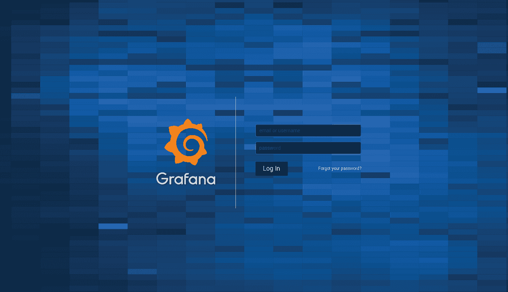
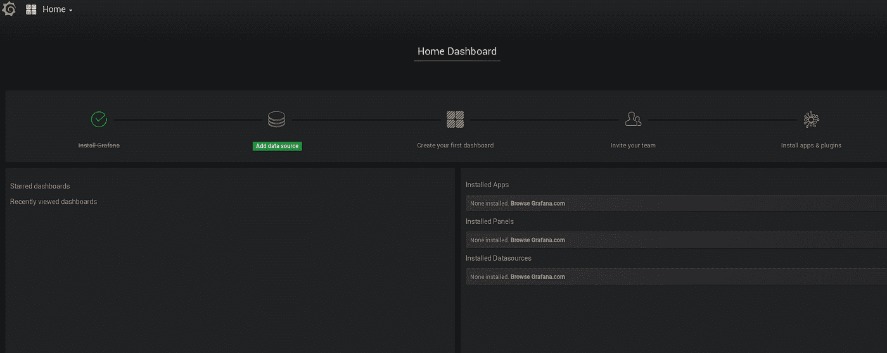
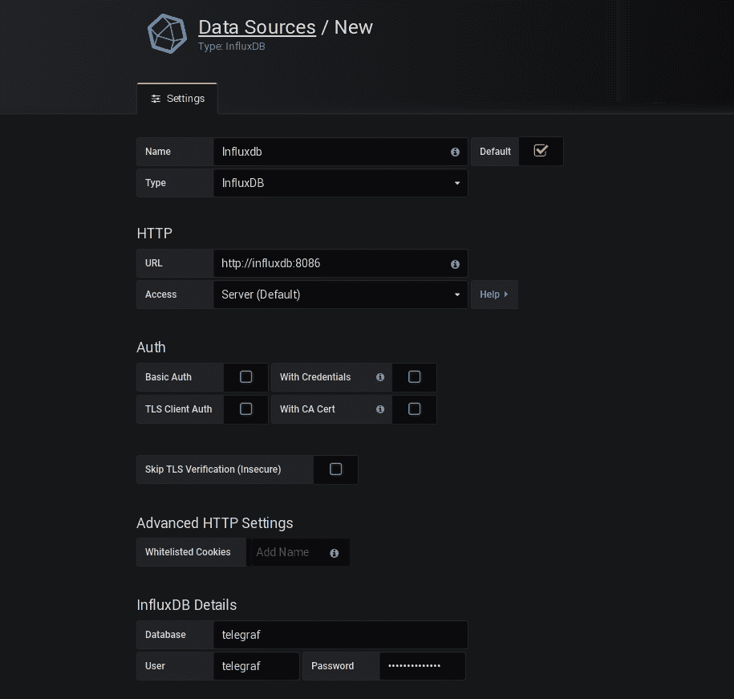
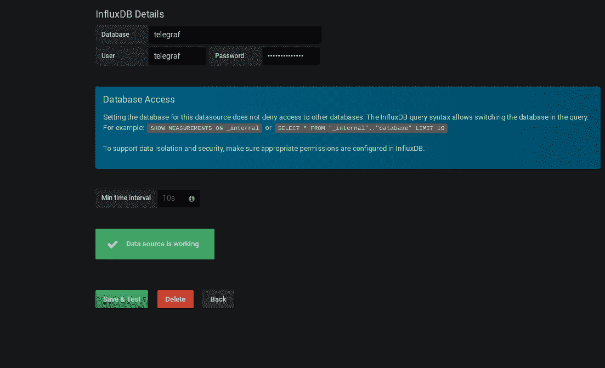
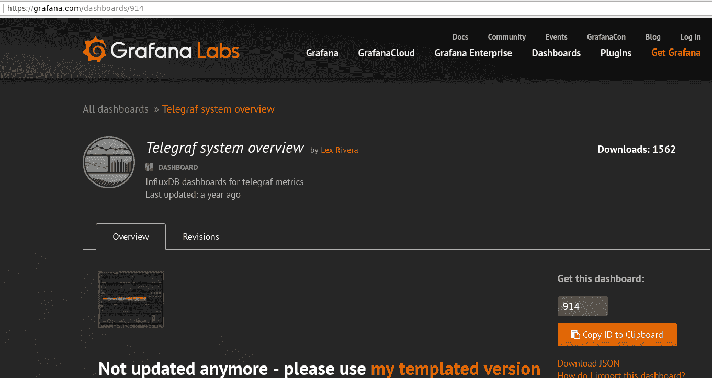
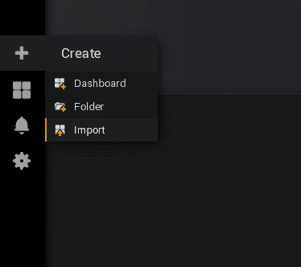
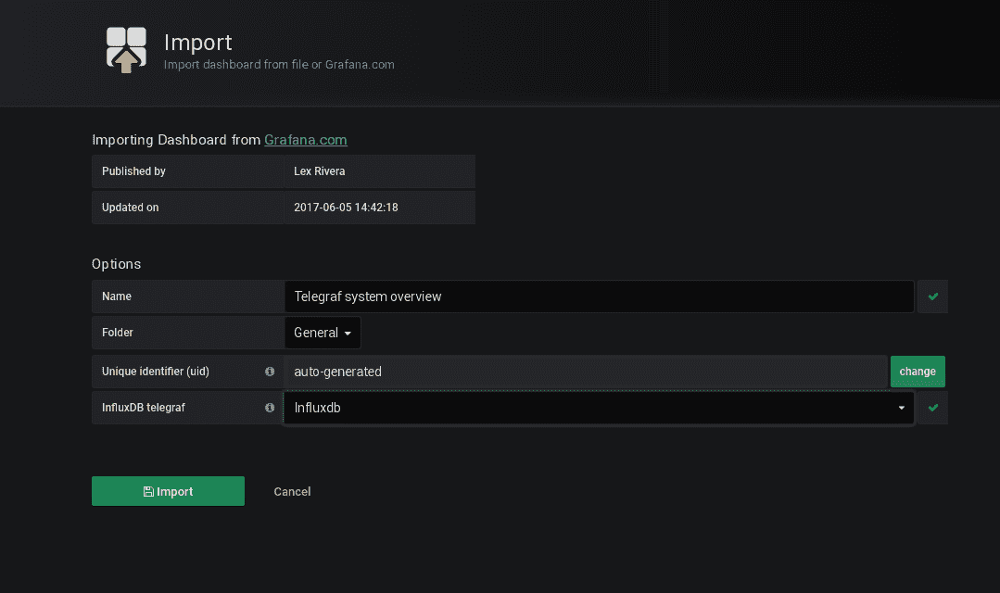

# 使用 Docker、Telegraf、Influxdb 和 Grafana 获取 5 分钟的系统指标

> 原文：<https://towardsdatascience.com/get-system-metrics-for-5-min-with-docker-telegraf-influxdb-and-grafana-97cfd957f0ac?source=collection_archive---------2----------------------->

总之，这里有一个非常快速的指南，告诉你如何使用一系列现代技术，如 Grafana、Docker 和 Telegraf with Influxdb，为一台或多台服务器配置系统监控。

本文的主要目标是展示如何快速简单地从服务器获取系统指标，而无需花费大量时间来配置庞大而复杂的监控系统。尤其是如果您只需要管理少数几个 Web 服务器，而不是监控拥有数百台设备的大公司基础架构。

我们将使用 Docker 来快速部署我们的监控系统，这也将使我们能够自由地使用任何软件，并且保持我们的系统干净。话题性的，你也可以从这个角度看 Docker，作为一个跨平台的包系统。

此外，我们将使用 Tick 堆栈的一部分，即 Influxdb 库来存储我们的指标和 Telegraf，就像远程系统上的代理一样，对于漂亮的图形，我们将采用 Grafana。

图例:

服务器 1 —监控服务器

服务器 2、服务器 3 等—我们需要从中获取指标的服务器

在 server1 上，我们将准备我们的监控系统，为此我们需要一个安装了 Docker 和 Docker Compose 的 Linux。

> [如何获取并安装 Docker](https://docs.docker.com/install/)

首先为我们的项目创建一个文件夹，例如/opt/monitoring:

```
server1$ mkdir /opt/monitoring && cd /opt/monitoring
```

在目录中，我们需要用 Grafana 和 Influxdb 服务创建 docker-compose.yml 文件:

```
version: "2"
services:
  grafana:
    image: grafana/grafana
    container_name: grafana
    restart: always
    ports:
      - 3000:3000
    networks:
      - monitoring
    volumes:
      - grafana-volume:/var/lib/grafana influxdb:
    image: influxdb
    container_name: influxdb
    restart: always
    ports:
      - 8086:8086
    networks:
      - monitoring
    volumes:
      - influxdb-volume:/var/lib/influxdbnetworks:
  monitoring:volumes:
  grafana-volume:
    external: true
  influxdb-volume:
    external: true
```

如您所见，我们使用自己的 docker 网络来提供这些服务，包括名称监控和外部卷来存储数据和配置，我们使用外部卷来防止容器重启后的任何数据丢失。

> 实际上，为容器组使用自己的网络是一个很好的实践，便于逻辑分离属于同一项目的容器，也便于从 docker 引擎获得内置服务发现。

现在我们需要创建 Docker 网络和卷:

```
server1$ docker network create monitoring
server1$ docker volume create grafana-volume
server1$ docker volume create influxdb-volume
```

确保一切都创建得很好:

```
server1$ docker network ls
NETWORK ID          NAME                DRIVER              SCOPE
8a744bc6ce04        bridge              bridge              local
a9fe3f026042        host                host                local
75c2b515def9        monitoring          bridge              local
c1a42ddaa998        none                null                local

server1$ docker volume ls
DRIVER              VOLUME NAME
local               69c5364fab3baa7b1c9418ace9c91dfcf13e54f0adce247136d887e46a347baf
local               grafana-volume
local               influxdb-volume
```

如我们所见，网络和卷已创建完毕，现在我们需要准备 Influxdb 参数，为此，我们将使用一些环境变量来运行容器，以创建数据库和用户:

```
server1$ docker run --rm \
  -e INFLUXDB_DB=telegraf -e INFLUXDB_ADMIN_ENABLED=true \
  -e INFLUXDB_ADMIN_USER=admin \
  -e INFLUXDB_ADMIN_PASSWORD=supersecretpassword \
  -e INFLUXDB_USER=telegraf -e INFLUXDB_USER_PASSWORD=secretpassword \
  -v influxdb-volume:/var/lib/influxdb \
  influxdb /init-influxdb.sh
```

> 我们使用–RM 密钥运行此容器，这将仅创建配置并在之后删除容器。

所有准备工作都已完成，我们准备启动新的监控系统，使用 docker-compose，转到/opt/monitoring 目录并运行:

```
server1$ docker-compose up -d

Creating network "monitoring_monitoring" with the default driver
Creating grafana
Creating influxdb

server1$ docker ps

CONTAINER ID        IMAGE               COMMAND                  CREATED             STATUS              PORTS                    NAMES
8128b72bdf44        grafana/grafana     "/run.sh"                23 seconds ago      Up 20 seconds       0.0.0.0:3000->3000/tcp   grafana
c00416d0d170        influxdb            "/entrypoint.sh infl…"   23 seconds ago      Up 21 seconds       0.0.0.0:8086->8086/tcp   influxdb
```

好了，所有的容器都被创建并启动了，所以我们的监控系统准备好为传入的请求服务了。我们公开了几个端口，正如你在 docker-compose 文件中看到的，8086 HTTP API 端口用于 Influxdb 数据，3000 端口用于 Grafana web UI。

我们几乎完成了新的监控系统，使用 Docker 真是又快又简单。为了完全完成，我们只需要稍微配置 Grafana，为 Influxdb 创建一个仪表板和新的数据源。

为此，将在浏览器中访问我们的 server1 public_ip:3000(在我们的示例中为 192.168.0.1:3000 ),并使用以下命令首次登录 Grafana web UI:

登录:管理员

密码:admin



然后 Grafana 会要求您更改密码，之后您将进入:



选择 Add data source 菜单，告诉 Grafana 从哪里获取 Influxdb 数据:



在这里，我们需要选择 Type = InfluxDB，给出这个数据源的名称，然后使用我们的 InfluxDB 容器名称作为地址放置 URL。正如我之前所说，Docker 给了我们一个简单的服务发现。

好的，我们还需要为我们的数据库插入数据库名称和用户/密码，这些参数是通过之前运行 Influxdb 容器创建的。

单击保存和测试，查看您的数据源是否正常:



太好了，我们刚刚添加了我们的 influxdb 作为 Grafana 的数据源，为了节省时间，我们将准备一个包含最流行参数的仪表板，转到[grafana.com](http://grafana.com/)并选择一个您喜欢的。举个例子:



复制数字 914，然后将其插入您的 grafana 导入菜单:



仅此而已，我们只需要在我们想要控制的系统上安装 telegraf，并将其配置为向 server1 上的 influxdb 发送数据。

您可以将 telegraf 作为软件包安装，或者编译最新版本并将其复制到远程服务器。

> [安装 Telegraf](https://docs.influxdata.com/telegraf/v1.7/introduction/installation/)

更改 telegraf 配置并配置 influxdb 数据库参数。

还要启用你需要的插件。

```
*###############################################################################*
*#                            OUTPUT PLUGINS                                   #*
*###############################################################################**# Configuration for sending metrics to InfluxDB*
[[outputs.influxdb]]
  *## The full HTTP or UDP URL for your InfluxDB instance.#### Multiple URLs can be specified for a single cluster, only ONE of the*urls = ["http://server1_ip:8086"] *## The target database for metrics; will be created as needed.*
   database = "telegraf" *## If true, no CREATE DATABASE queries will be sent.  Set to true when using## Telegraf with a user without permissions to create databases or when the## database already exists.*
  skip_database_creation = true *## Name of existing retention policy to write to.  Empty string writes to## the default retention policy.  Only takes effect when using HTTP.# retention_policy = ""* *## Write consistency (clusters only), can be: "any", "one", "quorum", "all".## Only takes effect when using HTTP.# write_consistency = "any"* *## Timeout for HTTP messages.*
   timeout = "5s" *## HTTP Basic Auth*
   username = "telegraf"
   password = "secretpassword"
```

干得好:)现在，我们有了一个非常漂亮的仪表板，时间最短:


您可以在多台服务器上安装 Telegraf，也可以将系统指标发送到一个 InfluxDB base，然后您只需在 Grafana dashboard 中选择服务器名称即可查看它们。

还有一件重要的事情是关于在 InfluxDb 中保存数据的持续时间，默认情况下它设置为 7 天，所以如果您需要比这更长的时间，请执行到 influxdb 容器并手动更改保留策略。

嗯，我想现在我们在 5 分钟内就有了一个很好的监控系统:)

祝你好运。