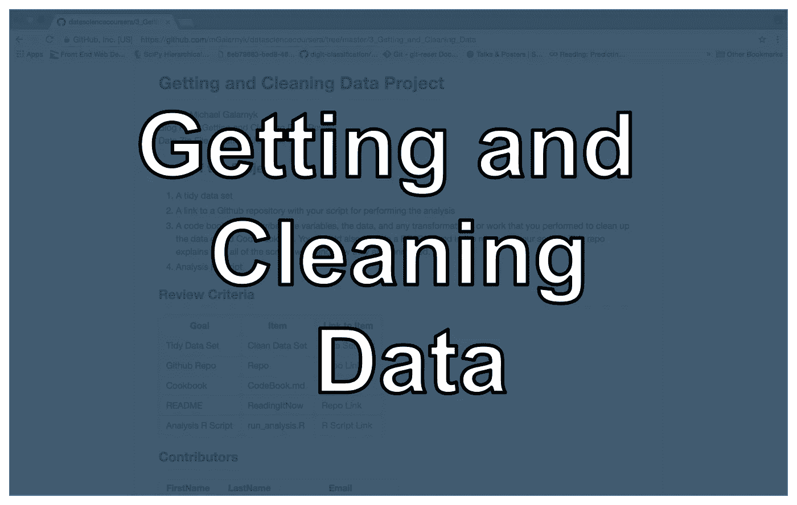

# 获取和清理数据(JHU Coursera，课程 3)

> 原文：<https://towardsdatascience.com/getting-and-cleaning-data-jhu-coursera-course-3-c3635747858b?source=collection_archive---------0----------------------->

Getting and Cleaning Data JHU Coursera Course 3 Review

数据科学专业的第三门课程“获取和清理数据”是一门基础课程。一如既往，测验和作业的代码位于我的 [github](https://github.com/mGalarnyk/datasciencecoursera) 上。

**第一周复习:**阅读 Excel、XML、JSON 文件必不可少。我很满意关于[数据表包](https://www.coursera.org/learn/data-cleaning/lecture/trMZ7/the-data-table-package)的讲座，因为我用它来做这个专业的所有测验和作业。我希望他们有一个以上的讲座，虽然因为它不是那么容易学会。

Getting and Cleaning Data John Hopkins Quiz 1

**第二周回顾:**更多相同的内容。与各种数据源(MySQL、HDF5 等)交互。我希望他们能更多地谈论 github API。我注意到很多学生在那个问题上有很多困难。以至于我写了一篇关于如何用 Github API 访问数据的独立博文。

Getting and Cleaning Data John Hopkins Quiz 2

**第 3 周和第 4 周回顾:**看完 data.table 后再看 dplyr 似乎有点多。第 4 周复习了正则表达式和编辑文本变量，这非常重要，应该在第 3 周测验之前完成，因为这是必要的。

Getting and Cleaning Data John Hopkins Quiz 3

Getting and Cleaning Data John Hopkins Quiz 4

**项目回顾:**这个项目非常有用，因为它让人们下载文件、解压缩、清理和组织数据文件。具有讽刺意味的是，同一周我在工作中也做了类似的事情，这让我对这门课程评价很高。正式任务位于我的 [github](https://github.com/mGalarnyk/datasciencecoursera/blob/master/3_Getting_and_Cleaning_Data/projects/README.md) 上。

Getting and Cleaning Data John Hopkins Project

请让我知道你是否有任何问题，或者如果你有任何关于我如何改进我的编码技巧！这个约翰·霍普斯金专业甚至帮助了我的工作。下一门课程[“探索性数据分析”](https://medium.com/@GalarnykMichael/exploratory-data-analysis-jhu-coursera-course-4-4a908e0d30d8#.g10ri88vo)的复习已上线。