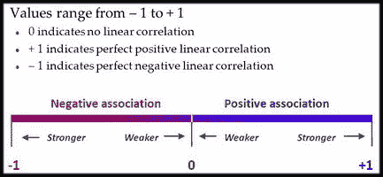
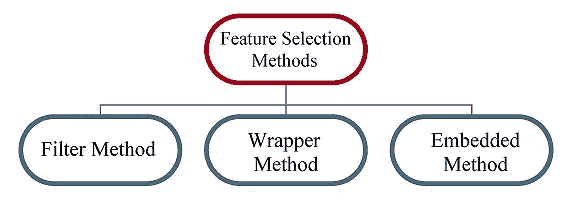
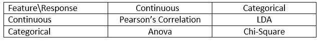
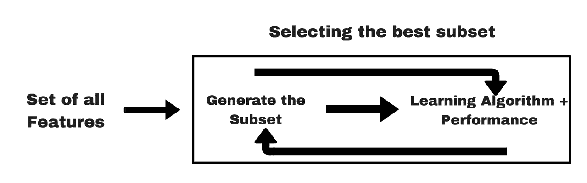
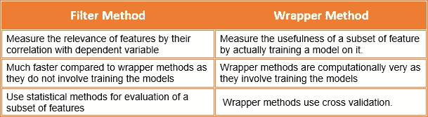

# 为建模准备数据:特征工程、特征选择、降维(下)

> 原文：<https://towardsdatascience.com/getting-data-ready-for-modelling-feature-engineering-feature-selection-dimension-reduction-39dfa267b95a?source=collection_archive---------4----------------------->


这是为建模准备数据系列的第二部分。如果您还没有阅读第 1 部分，那么我建议您先浏览一遍。因为特征工程通常是第一步。

[](https://medium.com/@desardaakash/getting-data-ready-for-modelling-feature-engineering-feature-selection-dimension-reduction-77f2b9fadc0b) [## 为建模准备数据:特征工程、特征选择、降维…

### 特征工程，特征选择，降维

…特征工程、特征选择、尺寸 Reductionmedium.com](https://medium.com/@desardaakash/getting-data-ready-for-modelling-feature-engineering-feature-selection-dimension-reduction-77f2b9fadc0b) 

一旦有了足够的、更少的或没有丢失的数据或异常值，接下来就是特征选择或特征提取(这两者通常做相同的工作，可以互换使用)。通常有两种方法:

1.  **特征提取/选择**
2.  **维度缩减或特征缩减**

让我们一个一个地，一步一步地解决它们。

# 第 2 部分:特征提取/选择

## 那么什么是特征选择呢？特征提取？他们的区别？

→在机器学习和统计学中，特征选择也称为变量选择，是选择相关特征(变量、预测器)的子集用于模型构建的过程。

→特征提取用于创建一个新的、更小的特征集，该特征集仍能捕获大部分有用信息。

→同样，特征选择保留原始特征的子集，而特征提取创建新的特征。

**特征选择/提取的重要性**

→当特征数量非常大时，这变得更加重要。

→你不需要使用你所掌握的每一个特性来创建一个算法。

→你可以通过只输入那些真正重要的特征来帮助你的算法。

**为什么要使用特征选择？**

→它使机器学习算法能够更快地训练，降低复杂性，并使其更容易解释。

→如果选择了正确的子集，它会提高模型的准确性。

→减少过度拟合。

> 它可以大致分为两种技术(尽管这不是“T8”的唯一方法)

I .单变量特征选择

二。多元特征选择

U 访问每一个特征，并根据目标检查其重要性。为了实现单变量特征选择，你应该掌握一些技巧。

→如果你有适当的**领域知识**并且相信你的判断，那么总是从这一步开始。分析所有的特征，去掉所有不需要的。是的，这是费时费力的一步，但是，嘿，你更相信谁呢，**“机器还是你自己”**

→ **检查所有特征的方差**(是的，永远令人困惑的偏差-方差权衡:)。这里的经验法则是设置一个阈值(假设一个特征的方差为 0，意味着它对每个样本都具有相同的值，因此这样的特征不会给模型带来任何预测能力)并相应地移除特征。

→ **皮尔森相关性的使用:**这可能是三种技术中最适用的一种。如果你不知道或者对它感到困惑，那么先看看这篇[文章](https://www.analyticsvidhya.com/blog/2015/06/correlation-common-questions/)。

*   因此，简而言之，它给了我们目标变量和特征之间的相互依赖性。



Thump Rule To analyse Pearson Correlation

*   使用皮尔逊相关性的经验法则:

I .仅选择与目标变量的中度至强关系。(见上图)。

二。当两个特征本身与目标变量有很强的相互关系时，选择其中任何一个(选择两个都不会增加任何值)。使用'[**seaborn . heat map()**](https://seaborn.pydata.org/generated/seaborn.heatmap.html)**'**进行可视化和挑选，很有帮助。

三。这里有一个陷阱😢。它最适用于线性数据，不适用于非线性数据(所以请避免使用它)。

M 所以用外行的话来说就是一次选择多个特性。

**多元特征选择大致分为三类:**



让我们来看看它们(我们将讨论每个类别中最广泛使用的技术)

# 过滤方法:

→过滤方法通常用作预处理步骤。特征的选择独立于任何机器学习算法。

→过滤方法对特征进行排序。等级表示每个特征对于分类的“有用”程度。一旦计算出这个排序，就创建了由最好的 N 个特征组成的特征集。

→根据其在各种统计测试中的得分选择特征，以确定其与结果变量的相关性。(这里的相关性是一个主观术语)。


Blueprint of Filter Method

1.  **皮尔逊相关:**哦对！皮尔逊相关是过滤方法。我们已经讨论过了。
2.  **方差** **阈值:**这一点我们也已经讨论过了。
3.  **线性判别分析:**目标是将数据集投影到一个具有良好类别可分性的低维空间，以避免过拟合(*)【维数灾难】，同时降低计算成本。*

*→没有进入数学领域，LDA 将所有的高维变量(我们不能绘制和分析)放到 2D 图上&同时这样做去除了无用的特征。*

*→ LDA 也是的 ***监督降维*** 技术，更像是**特征提取**而不是**选择**(因为它通过降低变量的维度来创建一种新的变量)。所以它只对带标签的数据有效。*

*→最大化类别间的*可分性*。(技术术语太多，对。不要担心看视频)。*

*Creator: Josh Starmer*

***其他:***

***ANOVA:** 方差分析除了使用一个或多个分类独立特征和一个连续相关特征进行操作之外，它类似于 LDA。它提供了几个组的平均值是否相等的统计检验。*

***卡方:**这是一种应用于分类特征组的统计检验，利用它们的频率分布来评估它们之间相关或关联的可能性。*

> **需要记住的一点是，过滤方法不能去除多重共线性。因此，在为数据训练模型之前，还必须处理要素的多重共线性。**

**

*What to choose when*

# *包装方法:*

**

*Blueprint Of Wrapper Method*

*→根据我们从之前的模型中得出的推论，我们决定在您的子集中添加或删除特征。*

*→包装方法之所以被称为包装方法，是因为它们将分类器包装在特征选择算法中。通常选择一组特征；这种设置的效率是确定的；进行一些扰动以改变原始集合，并评估新集合的效率。*

*→这种方法的问题是特征空间很大，查看每个可能的组合需要大量的时间和计算。*

*→问题本质上归结为一个搜索问题。这些方法通常在计算上非常昂贵。*

1.  ***正向选择:**正向选择是一种迭代方法，我们从模型中没有特征开始。在每一次迭代中，我们不断地添加最能改进我们模型的特性，直到添加一个新变量不能改进模型的性能。*
2.  ***向后消除:**在向后消除中，我们从所有特征开始，并在每次迭代中移除最不重要的特征，这提高了模型的性能。我们重复这一过程，直到在特征的移除上没有观察到改进。*
3.  *[**【递归特征消除(RFE)**](https://scikit-learn.org/stable/modules/generated/sklearn.feature_selection.RFE.html) **:** It 的工作原理是递归地删除属性，并在那些保留的属性上建立模型。它使用外部估计器为要素分配权重(例如，线性模型的系数)，以确定哪些属性(以及属性组合)对预测目标属性的贡献最大。*

*→这是一种贪婪优化算法，旨在找到性能最佳的特征子集。*

*→它重复创建模型，并在每次迭代中保留最佳或最差的性能特征。*

*→它用剩下的特征构造下一个模型，直到所有的特征都用完。然后，它根据要素被消除的顺序对其进行排序。*

```
*# Recursive Feature Elimination
from sklearn.feature_selection import RFE
from sklearn.linear_model import LinearRegression# create a base classifier used to evaluate a subset of attributes
model = LinearRegression()X, y = iowa.iloc[:,:-1], iowa.iloc[:,-1]
# create the RFE model and select 3 attributes
rfe = RFE(model, 10)
rfe = rfe.fit(X, y)# summarize the selection of the attributes
print(rfe.support_)
print(rfe.ranking_)
***Output:*** [False False  True  True False False False False False False False False
 False False False  True  True  True False  True  True  True  True False
  True False False False False False False False False False]
[16 24  1  1  4  9 18 13 14 15 11  6  7 12 10  1  1  1  2  1  1  1  1  5  1
 23 17 20 22 19  8 21 25  3]*
```

*→下面是上面例子中发生的情况，*

*I . '**rfe . support _【T9]'按顺序给出了与特性相关的结果(显然是基于所选型号和需求编号)。***

*二。 **rfe.ranking_** '分别给出所有特性的等级。当你需要的功能比输入给' **n_features_to_select'** (在上面的例子中是 10 个)的功能更多时，这真的很方便。所以，你可以设置一个阈值&分别选择它上面的所有特征。*

*[**4。顺序特征选择器**](http://rasbt.github.io/mlxtend/user_guide/feature_selection/SequentialFeatureSelector/) **:** 顺序特征选择算法是一类贪婪搜索算法，用于将初始的 *d* 维特征空间缩减为 *k* 维特征子空间(其中 *k < d)* 。*

*→逐步推进特性选择从评估每个单独的特性开始，并选择能够产生最佳性能选定算法模型的特性。*

*→后退功能选择密切相关，正如您可能已经猜到的，它从整个功能集开始，并从那里后退，删除功能以找到预定义大小的最佳子集。*

****→什么叫“最好？”****

*这完全取决于定义的评估标准(AUC、预测准确性、RMSE 等。).接下来，评估所选特征和后续特征的所有可能组合，并且选择第二特征，等等，直到选择了所需的预定数量的特征。*

*→简而言之，SFA 根据分类器性能一次删除或添加一个特征，直到达到所需大小的特征子集 *k* 。*

> *注意:我建议你访问官方文档，通过例子了解更多细节*

 *[## 顺序特征选择器— mlxtend

### 包含日常数据科学任务的有用工具和扩展的库。

rasbt.github.io](http://rasbt.github.io/mlxtend/user_guide/feature_selection/SequentialFeatureSelector/)* 

# *嵌入式方法:*

**

*Blueprint of Embbeded Methods*

*→嵌入式方法结合了过滤器和包装器方法的特性。它是由具有内置特征选择方法的算法实现的。*

*→因此，这不是任何类型的特殊特征选择或提取技术，它们也有助于避免过度拟合。*

1.  *线性回归中的套索正则化*
2.  *在随机森林中选择 k-best*
3.  *梯度推进机*

# *过滤器和包装器方法之间的区别*

**

# *第 3 部分:降维*

***所以，还是从同一个问题开始，什么是降维？***

*简单来说，就是将一个初始的 *d* 维特征空间缩减为一个 *k* 维特征子空间(其中*k<d】*)。*

***那么特征选择&提取又是为什么呢？***

*某种程度上，是的(但只是俗人术语*’)。为了理解这一点，我们必须深入研究。**

> **在机器学习中，**维度**简单来说就是指你的数据集中的**个特征**(即输入变量)的数量。当要素的数量相对于数据集中的观察值数量非常大时，*某些*算法很难训练出有效的模型。这被称为“维数灾难”，它尤其与依赖于距离计算的聚类算法相关。**

**(Quora 的一位用户为维度诅咒提供了一个很好的类比，看看吧)**

**因此，当你拥有 100 个甚至 1000 个特性时，你只有一个选择**降维。**让我们讨论两种非常健壮和流行的技术。**

1.  ****线性判别分析(LDA):** 是的，与过滤方法(如上所述)一起，它也被用作降维技术。**

**→当特征被标记时，我们在监督学习中使用 LDA。**

**→请努力理解 LDA(如果您还没有理解的话)。**

****2。主成分分析(PCA):** 主成分分析的主要目的是对数据进行分析，以识别模式并找出模式，从而以最小的信息损失降低数据集的维度。**

**→ PCA 将尝试通过探索数据的一个特征如何用其他特征来表示来降低维数(线性相关性)。相反，特征选择会考虑目标。**

**→ PCA 最适用于 3 维或更高维的数据集。因为随着维度的增加，从产生的数据云中做出解释变得越来越困难。**

**(PCA 有点复杂，没错。在这里解释会让这篇已经很长的博客更无聊。所以用这两个极好来源来理解，**

**[一、主成分分析一站式服务](/a-one-stop-shop-for-principal-component-analysis-5582fb7e0a9c)**

**二。Josh Starmer 的视频解释(来自 StatQuest 的同一个人)**

**Creator: Josh Starmer**

**W 说唱起来:但不是通过包装方法(咄…😜).这是系列的结尾。最后(但不是列表)分钟提示:**

**永远不要忽视特征工程和特征选择，一切都要依靠算法。**

**二。在尾注上，我分享了两个非常有用并且非常棒的工具(记住我的话，这会对你有很大帮助)**

**→ [***特征选择器***](/a-feature-selection-tool-for-machine-learning-in-python-b64dd23710f0) (这得感谢[威廉·科尔森](https://medium.com/u/e2f299e30cb9?source=post_page-----39dfa267b95a--------------------------------))**

**→ [***特征工具***](https://www.featuretools.com) (或[本](https://www.analyticsvidhya.com/blog/2018/08/guide-automated-feature-engineering-featuretools-python/))**