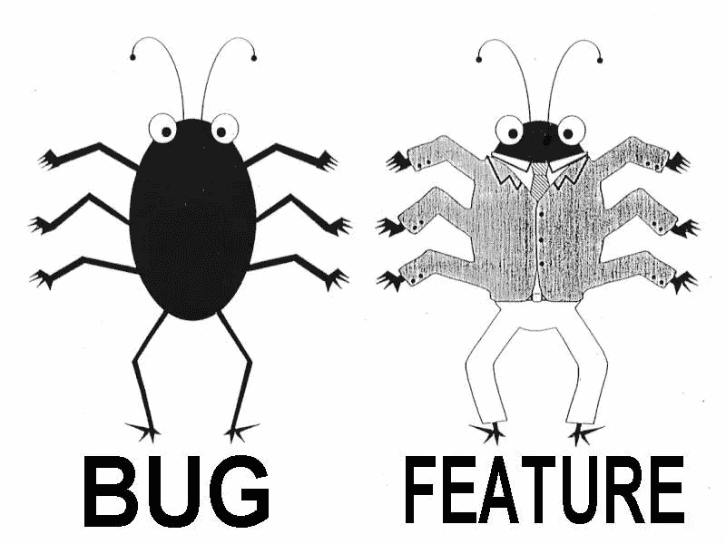
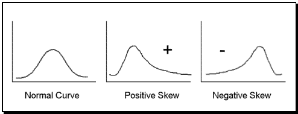
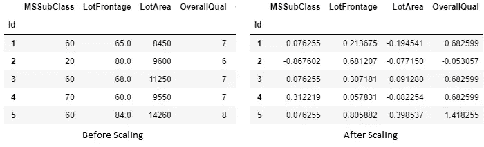
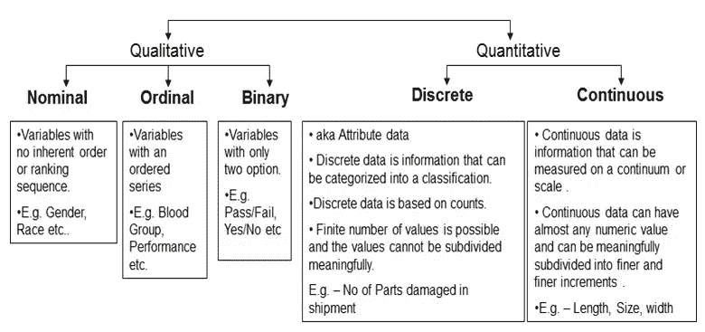
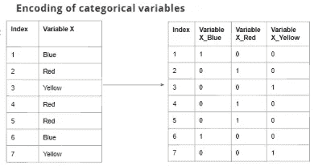
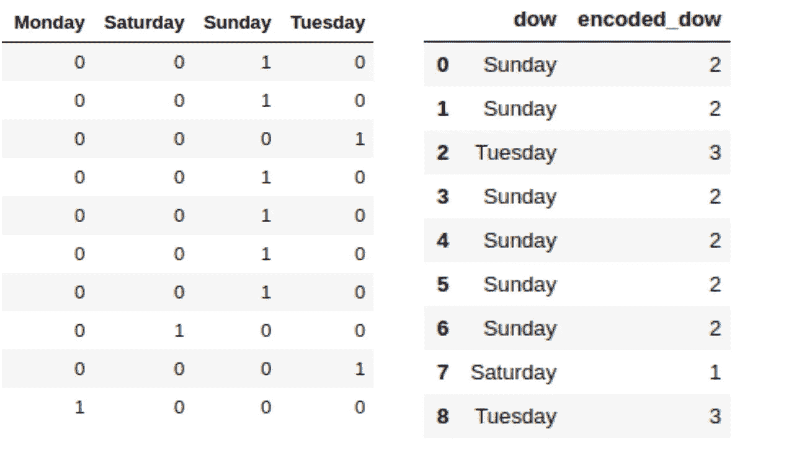

# 为建模准备数据:特征工程、特征选择、降维(第 1 部分)

> 原文：<https://towardsdatascience.com/getting-data-ready-for-modelling-feature-engineering-feature-selection-dimension-reduction-77f2b9fadc0b?source=collection_archive---------8----------------------->

即使在机器学习的幻想世界中，就像人类无法在崎岖的道路上正确驾驶车辆一样，ML 算法也无法在大量不需要的混杂数据上产生预期的结果。因此，让我们深入探讨优化数据所有选项。

**注意:**这可能有点冗长。所以我把它分成三个系列。因此，请一部分一部分地探索这一点。

# 第 1 部分:特征工程

***什么是特色工程，为什么要纠结于此*？**

特征工程是**使用数据的领域知识来创建使机器学习算法工作的特征**的过程。特征工程是机器学习应用的基础，既困难又昂贵。但如果处理得当，会产生奇迹。这就是同一个算法工作得很差和工作得很棒的区别。

很重要，不容忽视。让我们看看它的大致思想:

*   **数据清理&预处理**

→处理异常值

→处理缺失值

→处理偏斜

*   **缩放**
*   **编码**

1.  ***数据清理&预处理:*** 在现实世界中，我们永远不会得到适合某个算法的定制数据。我们需要通过以下方式做到这一点。

**i)异常值的处理:**异常值是不遵循数据一般趋势的数据点。许多算法对异常值很敏感。所以问题是怎么办？

→如果很少，那么就彻底清除。您可以设置阈值来识别它们，然后删除它们。如果一列有很多离群值，最好完全删除该列，行也是如此。

→您可以将所有内容转换为“日志形式”，因为日志会将所有内容带到相同的距离。(尽管只对数字数据有效)

→ **使用散点图、直方图和盒须图可视化数据**，并寻找极值。还有很多其他的技术可以用来处理异常值，我建议你去尝试一下。

**ii)处理缺失值:** **为什么要处理缺失值？**

训练数据集中的缺失数据会降低模型的功效/拟合度。缺少值会导致模型有偏差，因为我们没有正确分析行为以及与其他变量的关系。这很有用，因为有些算法无法处理或利用丢失的数据。因此，识别和标记这些丢失的数据是很重要的。一旦标记，就可以准备替换值。

→替换缺失值，均值、中值、众数(完全取决于判断)。你可以使用**sk learn . preprocessing . impute**来达到同样的目的。

→如果需要，可以用全新数据替换(再次判断)。

→或者，如果缺少的值太多，您可以删除整个列。因此，这主要需要再次判断！！！

**iii)偏度:**偏度是分布的不对称性的度量。偏斜度是对称性的一种度量，或者更准确地说，是对称性的缺乏。

The basic three types of Skewness

**为什么要处理偏斜？**

→许多模型构建技术都假设预测值呈正态分布并具有对称形状。因此，有时处理偏斜度是至关重要的。

→对称分布优于偏斜分布，因为它更容易解释和产生推论。

→使用对数变换、平方根变换等。

*2。* ***缩放:*** 像处理缺失值是一种强制，缩放不是。但这并不意味着它是不太重要的技术。考虑一个场景，其中一个列(比如 A)的值在 10k 到 100k 的范围内，另一个列的值在 0 到 1 的范围内(比如 B)，那么 A 将比 B 具有不适当的优势，因为它将承载更多的权重。

→缩放将特征修改为介于给定的最小值和最大值之间，通常介于 0 和 1 之间，或者将每个特征的最大绝对值缩放至单位大小，以提高某些模型的数值稳定性。

Effect Of Scaling

→但是标准化/缩放不能应用于分类数据，因此我们将分类数据和数值数据分开，以便对数值数据进行标准化。

→ *最小最大值定标器、标准巩膜、标准化器*等是一些技术。都可以使用**' sk learn . preprocessing . scaler '**来执行

*(建议你访问* [*本博客*](http://benalexkeen.com/feature-scaling-with-scikit-learn/) *更深入地研究缩放比例)*

***3。编码:*** 那么，编码是什么，为什么编码？

我们使用的大多数算法处理数值，而分类数据通常是文本/字符串(男性、女性)或 bin(0–4、4–8 等)。)形式。

一种选择是将这些变量排除在算法之外，只使用数字数据。但是在这样做的时候，我们可能会丢失一些关键的信息。因此，通过编码将分类变量转换成数值来将它们包含到算法中通常是一个好主意，但是，首先让我们学习一两件关于分类变量的事情。

Types of Variable

*对数据做的编码一般有两种，标签编码&一种热编码(或 pandas.get_dummies)。*

**i)标签编码:**每个类别被赋予一个标签(例如 0、1、2 等)。标签编码是编码分类变量的一种简便技术。然而，这种编码的名义变量可能最终被误解为序数。**所以标签编码只在有序类型的数据上进行(这些数据有一定的顺序感)。**

→因此，即使在标签编码后，所有数据也不会失去其排名或重要性水平。

eg of Label Encoding

可以使用**' sk learn . preprocessing . label encoder '**执行

**ii)一个热编码:**标签编码不能在名义或二进制上执行，因为我们不能根据它们的属性对它们进行排序。每个数据都被平等对待。考虑以下两个分类变量及其值，如

*→颜色*:蓝色、绿色、红色、黄色

*→学历*:小学、中学、研究生、研究生、博士。

Eg Of One hot Encoding

可以使用 **'pd.get_dummies'** 或**' sk learn . preprocessing . onehotencoder '**执行

具有更多维度的数据集需要模型理解更多的参数，这意味着需要更多的行来可靠地学习这些参数。使用一个热编码器的效果是增加了许多列(维度)。

如果数据集中的行数是固定的，添加额外的维度而没有添加更多的信息供模型学习，可能会对最终的模型准确性产生不利影响。

One Hot Encoding vs Label Encoding

**以此表示第 1 部分告一段落。请务必阅读第 2 部分，其中将讨论特征提取和非常重要的降维。**

