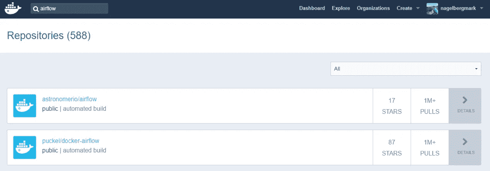
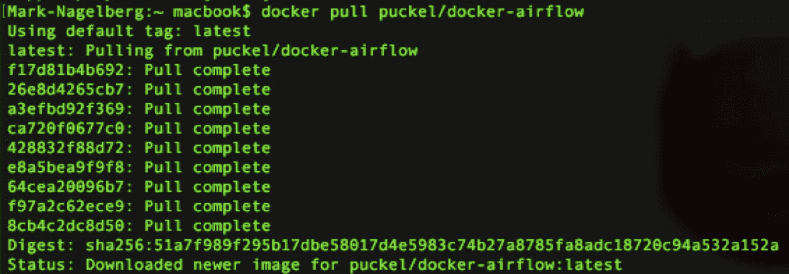
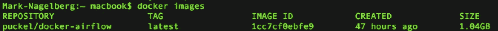
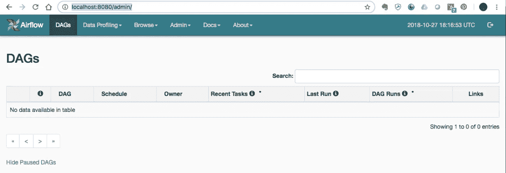
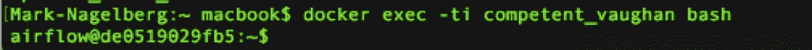
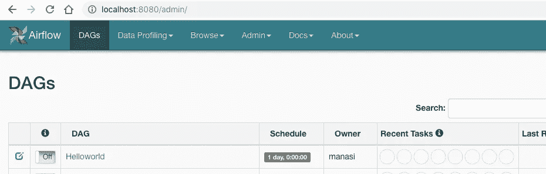
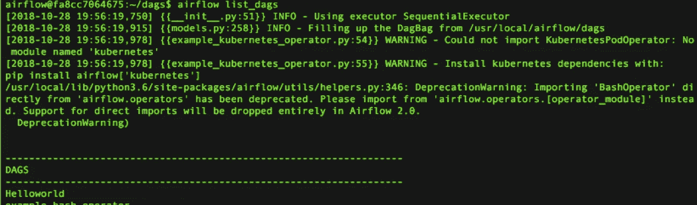
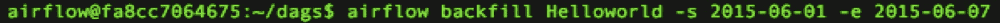
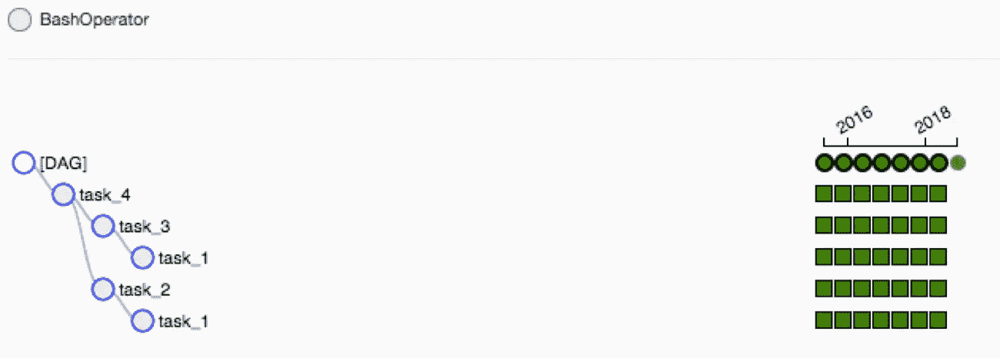

# 使用 Docker 开始使用气流

> 原文：<https://towardsdatascience.com/getting-started-with-airflow-using-docker-cd8b44dbff98?source=collection_archive---------1----------------------->


最近，在受到 Robert Chang 的这篇介绍数据工程领域的伟大文章的启发后，我一直在集中阅读该领域的内容。这篇文章的潜在信息真的引起了我的共鸣:当大多数人想到数据科学时，他们会立即想到谷歌或 Twitter 等非常成熟的科技公司正在做的事情，比如一直部署超级复杂的机器学习模型。

然而，许多组织还没有达到将这类模型作为首要任务的阶段。这是因为，为了高效地构建和部署这类模型，您需要有一个基础数据基础设施来构建模型。是的，你可以用你组织中的数据开发一个机器学习模型，但你必须问:你花了多长时间做这件事，你的工作是可重复/可自动化的吗，你能够以有意义和可靠的方式部署或实际使用你的解决方案吗？这就是数据工程的用武之地:它是关于构建数据仓库和 ETL 管道(提取-转换-加载)的，这些管道提供了做其他事情所需的基础管道。

在我对数据工程的研究中不断出现的一个工具是 [Apache Airflow](https://airflow.apache.org/) ，它是“一个以编程方式创作、调度和监控工作流的平台”。本质上，气流是类固醇上的 [cron](https://en.wikipedia.org/wiki/Cron) :它允许你安排任务运行，以特定的顺序运行它们，并且监控/管理你所有的任务。它在数据工程师/数据科学家中变得非常流行，成为编排 ETL 管道并在它们运行时监控它们的一个很好的工具。

在这篇文章中，我将对气流中的一些关键概念做一个简单的概述，然后展示气流在 Docker 容器中的一步一步的部署。

# 关键气流概念

在我们开始部署气流之前，有几个基本概念需要介绍。参见气流文档中的[这一页，其中详细介绍了这些内容，并描述了其他概念。](https://airflow.apache.org/concepts.html)

***【DAG】***:DAG 是你要运行的任务的集合，以及任务之间的关系和依赖关系。Dag 可以直观地表示为具有节点和边的图，其中节点表示任务，边表示任务之间的依赖性(即任务必须运行的顺序)。本质上，dag 表示您希望在 Airflow 中编排和监控的工作流。它们是“非循环的”，这意味着该图没有循环——在英语中，这意味着您的工作流必须有开始和结束(如果有循环，工作流将陷入无限循环)。

***操作符*** :操作符代表在组成 DAG 工作流的任务中实际完成的事情。具体来说，一个操作符代表 DAG 中的一个任务。Airflow 提供了许多预定义的类，这些类非常灵活，可以作为任务运行。这包括用于非常常见任务的类，如 BashOperator、PythonOperator、EmailOperator、OracleOperator 等。除了众多可用的操作符类之外，Airflow 还提供了定义自己的操作符的能力。因此，DAG 中的任务几乎可以做任何您想做的事情，并且您可以使用 Airflow 对其进行调度和监控。

***任务*** :一个操作符的运行实例。在实例化期间，您可以定义与操作符相关联的特定参数，并且参数化的任务成为 DAG 中的一个节点。

# 使用 Docker 部署气流并运行您的第一个 DAG

这篇文章的其余部分将重点介绍如何使用 docker 部署 Airflow，并且假设您对 Docker 有所了解，或者您已经阅读了我之前的文章[关于如何开始使用 Docker](http://www.marknagelberg.com/digging-into-data-science-tools-docker/) 。

作为第一步，你显然需要安装 Docker 并拥有一个 Docker Hub 帐户。一旦你这样做了，进入 [Docker Hub](https://hub.docker.com/) 并在存储库列表中搜索“Airflow ”,这会产生一堆结果。我们将使用第二个: *puckel/docker-airflow* ，它有超过 100 万个拉点和近 100 颗星。您可以在此处找到此回购[的文档。你可以在这里](https://hub.docker.com/r/puckel/docker-airflow/)找到与这个容器[相关的 github repo。](https://github.com/puckel/docker-airflow)



因此，要让这个预制的容器运行 Apache Airflow，您只需输入:

```
docker pull puckel/docker-airflow
```



过了一会儿，你就有了一个 Docker 镜像，用于运行 Docker 容器中的气流。您可以通过键入以下命令来查看您的图像已被下载:

```
docker images
```



现在您已经下载了映像，您可以使用以下命令创建一个运行容器:

```
docker run -d -p 8080:8080 puckel/docker-airflow webserver
```

一旦你这样做了，Airflow 就在你的机器上运行，你可以通过访问[http://localhost:8080/admin/](http://localhost:8080/admin/)来访问 UI



在命令行上，您可以通过运行以下命令来查找容器名称:

```
docker ps
```

您可以使用以下命令跳转到正在运行的容器的命令行:

```
docker exec -ti <container name> bash
```



(在我的例子中，我的容器被 Docker 自动命名为*主管 _ 沃恩*

## 运行 DAG

因此，您的容器已经启动并运行。现在，我们如何开始定义 Dag？

在 Airflow 中，DAGs 定义文件是 python 脚本(“配置为代码”是 Airflow 的优势之一)。您可以通过定义脚本并简单地将其添加到 AIRFLOW _ HOME 目录下的文件夹“dags”中来创建 DAG。在我们的例子中，我们需要在容器中添加 Dag 的目录是:

```
/usr/local/airflow/dags
```

事实是，您不希望直接跳到您的容器中并在其中添加 DAG 定义文件。一个原因是安装在容器中的 Linux 最小版本甚至没有文本编辑器。但一个更重要的原因是，在 Docker 中跳转到容器中并编辑它们被认为是不好的做法，而且是“hacky ”,因为您不能再从 Docker 文件中构建容器运行的映像。

相反，一个解决方案是使用“volumes”，它允许您在本地机器和 Docker 容器之间共享一个目录。您添加到本地容器中的任何内容都将被添加到 Docker 中与之连接的目录中。在我们的示例中，我们将使用以下命令创建一个卷，该卷映射本地计算机上保存 DAG 定义的目录，以及 Airflow 在容器上读取它们的位置:

```
docker run -d -p 8080:8080 -v /path/to/dags/on/your/local/machine/:/usr/local/airflow/dags  puckel/docker-airflow webserver
```

我们要添加的 DAG 可以在[中找到，这个 repo 是由 Manasi Dalvi](https://github.com/dalvimanasi/Data-Pipe-lining-Tools/tree/master/Airflow) 创建的。DAG 被称为 Helloworld，您可以在这里找到 DAG 定义文件。(另见[这个 YouTube 视频](https://www.youtube.com/watch?v=Qs02p3mh8m4)，她介绍了气流，并展示了这个 DAG 的运行情况。)

要将其添加到 Airflow 中，请将 *Helloworld.py* 复制到*/path/to/DAGs/on/your/local/machine*。等待几分钟后，刷新您的 Airflow GUI，瞧，您应该会看到新的 DAG *Helloworld* :



您可以通过进入容器并运行命令气流测试来测试 DAG 中的单个任务。首先，使用前面描述的 *docker exec* 命令进入容器。一旦你进入，你可以通过运行*气流列表 _dags* 看到你所有的 Dag。您可以在下面看到结果，我们的 Helloworld DAG 位于列表的顶部:



在运行完整 DAG 之前，您可以在命令行上运行的一个有用的命令是 airflow test 命令，它允许您将单个测试作为 DAG 的一部分进行测试，并将输出记录到命令行。您指定一个日期/时间，它模拟当时的运行。该命令不考虑依赖性，也不与数据库交流状态(运行、成功、失败等)，因此您不会在 Airflow GUI 中看到测试结果。因此，使用我们的 Helloworld DAG，您可以在 task_1 上运行测试

```
airflow test Helloworld task_1 2015-06-01
```

请注意，当我这样做时，它似乎运行没有错误；然而，我没有得到任何输出到控制台的日志。如果有人对为什么会这样有任何建议，请告诉我。

您可以运行回填命令，指定开始日期和结束日期，以便在这些日期运行 Helloworld DAG。在下面的示例中，我从 2015 年 6 月 1 日到 6 月 7 日每天运行 dag 7 次:



运行此命令时，您可以在 Airflow GUI 中看到以下内容，它显示了各个任务的成功以及 DAG 的每次运行。



# 资源

*   我对你能否用 UI 创建 Dag 感到困惑，并且[这个 Stackoverflow 线程](https://stackoverflow.com/questions/48986732/airflow-creating-a-dag-in-airflow-via-ui)似乎表明你不能。注意在回答中，回答者提到了一些潜在有用的工具，用于开发用户可以在不了解 Python 的情况下定义 Dag 的 UI。
*   [这个 Stackoverflow 线程](https://stackoverflow.com/questions/52453414/docker-airflow-configuration-issues-puckel-docker)有助于找出体积是将 Dag 添加到容器中运行的气流的解决方案。
*   [来自阿帕奇气流的官方教程](https://airflow.apache.org/tutorial.html)
*   [与阿帕奇气流相关的常见陷阱](https://cwiki.apache.org/confluence/display/AIRFLOW/Common+Pitfalls)
*   [使用气流的 ETL 最佳实践](https://gtoonstra.github.io/etl-with-airflow/index.html)
*   如果你对学习 Docker 感兴趣，[我在我的网站上有一些资源的链接](http://downloadmarksbrain.marknagelberg.com/decks?search=docker)，还有 Anki 抽认卡，这样你就可以无限期地记住它们

*原载于 2018 年 11 月 1 日*[*【www.marknagelberg.com】*](http://www.marknagelberg.com/getting-started-with-airflow-using-docker/)*。要访问我共享的 Anki deck 和 Roam Research notes 知识库，以及关于间隔重复和提高学习效率的技巧和想法的定期更新，* [*加入“下载马克的大脑”。*](http://downloadmarksbrain.marknagelberg.com/auth)