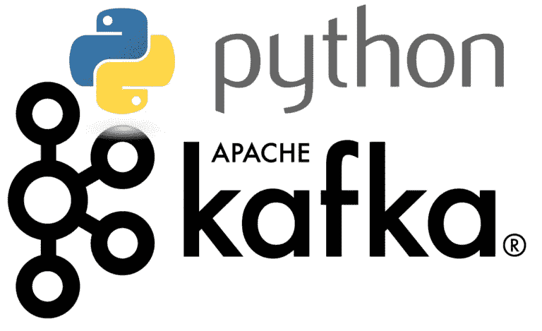
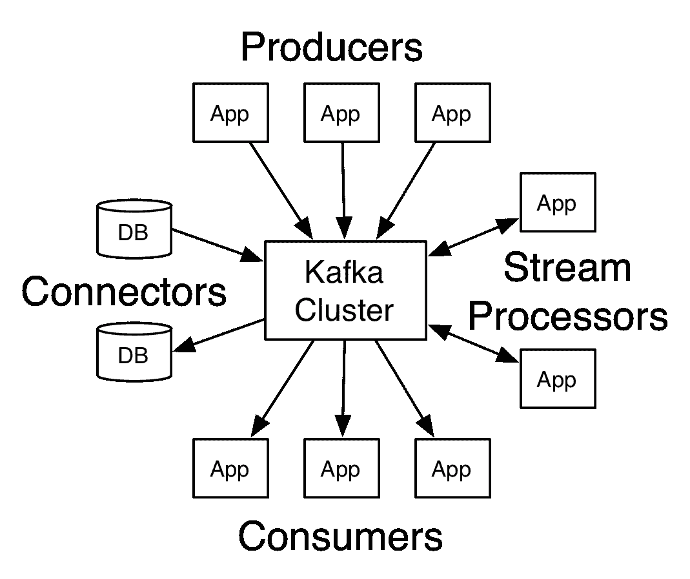
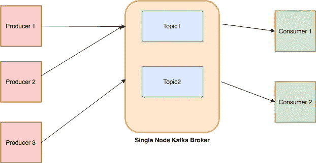
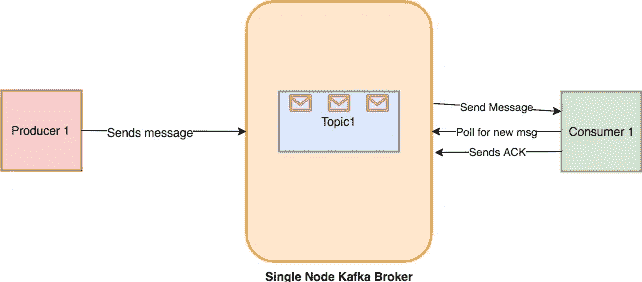
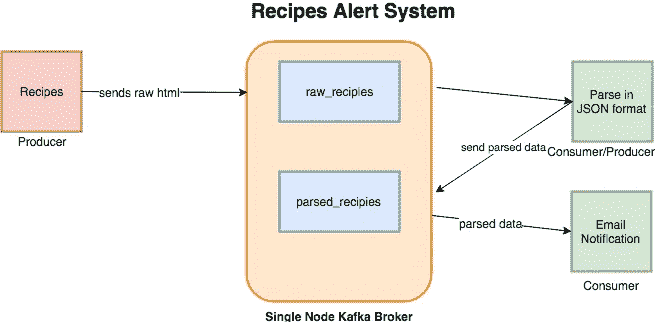
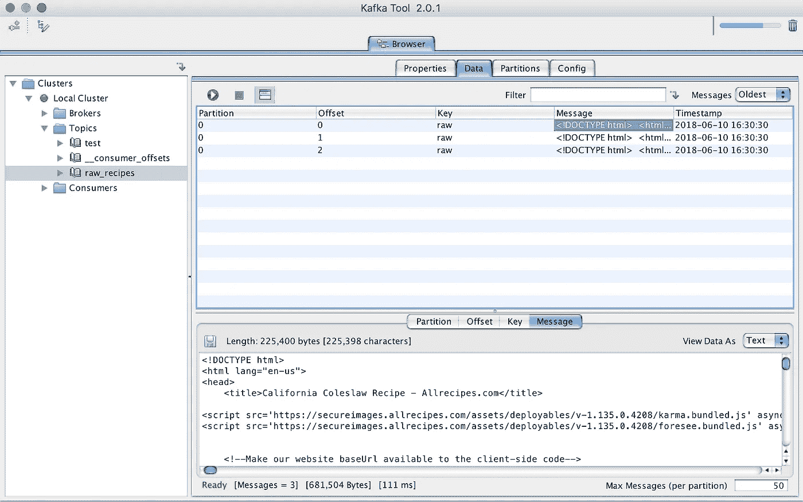
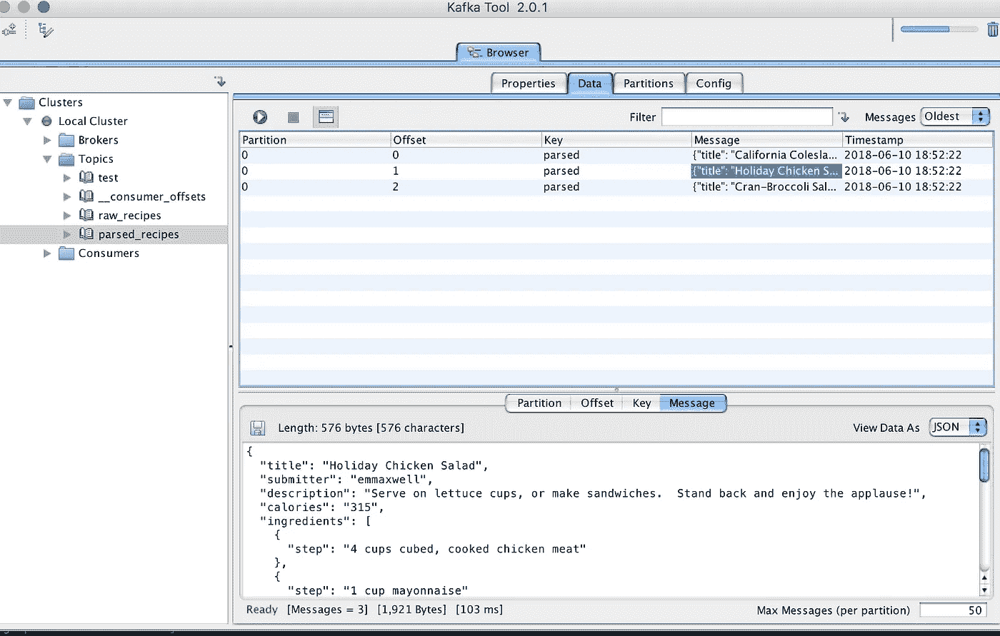

# Python 中的 Apache Kafka 入门

> 原文：<https://towardsdatascience.com/getting-started-with-apache-kafka-in-python-604b3250aa05?source=collection_archive---------0----------------------->



*Image Credit: linuxhint.com*

在这篇文章中，我将讨论 Apache Kafka 以及 Python 程序员如何使用它来构建分布式系统。

# 什么是阿帕奇卡夫卡？

Apache Kafka 是一个开源的流媒体平台，最初由 LinkedIn 创建。它后来被移交给 Apache 基金会，并于 2011 年开源。

根据 [**维基百科**](https://en.wikipedia.org/wiki/Apache_Kafka) :

*Apache Kafka 是由 Apache 软件基金会开发的开源流处理软件平台，用 Scala 和 Java 编写。该项目旨在为处理***实时数据提供一个* ***统一的、高吞吐量、低延迟的*** *平台。它的存储层本质上是一个“大规模可扩展的发布/订阅消息队列，以分布式事务日志的形式构建”，[3]这使得它对于企业基础设施处理流数据非常有价值。此外，Kafka 通过 Kafka Connect 连接到外部系统(用于数据导入/导出),并提供 Kafka Streams，这是一个 Java 流处理库。**

**

*Credit: Official Website*

*可以把它想象成一个大的提交日志，数据按照发生的顺序存储在其中。该日志的用户可以根据自己的需要访问和使用它。*

# *卡夫卡用例*

*卡夫卡的用途是多方面的。这里有几个用例可以帮助你理解它的用法。*

*   ***活动监测:-** Kafka 可以用于活动监测。该活动可能属于一个网站或物理传感器和设备。生产者可以发布来自数据源的原始数据，这些数据随后可用于发现趋势和模式。*
*   *消息传递:- 卡夫卡可以作为服务间的消息代理。如果您正在实现微服务架构，您可以将一个微服务作为生产者，将另一个微服务作为消费者。例如，您有一个微服务，负责创建新帐户，其他负责向用户发送有关帐户创建的电子邮件。*
*   ***日志聚合:-** 您可以使用 Kafka 从不同的系统收集日志，并存储在一个集中的系统中以供进一步处理。*
*   *Kafka 有一个几乎实时流的特性，因此你可以根据自己的需要设计一个 ETL。*
*   ***数据库:-** 基于我上面提到的东西，你可能会说卡夫卡也充当数据库。这不是一个典型的数据库，它具有根据需要查询数据的功能，我的意思是，你可以在 Kafka 中保存数据，只要你想，而不用消耗它。*

# *卡夫卡概念*

*让我们讨论卡夫卡的核心概念。*

**

# *主题*

*馈入系统的每条消息都必须是某个主题的一部分。题目不过是一串记录。消息以键值格式存储。每条消息被分配一个序列，称为*偏移*。一个消息的输出可以是另一个消息的输入，以便进一步处理。*

# *生产者*

**制作者*是负责将数据发布到 Kafka 系统的应用程序。他们根据自己选择的主题发布数据。*

# *顾客*

*发布到主题中的消息然后被*消费者*应用利用。消费者订阅自己选择的主题并消费数据。*

# *经纪人*

*负责消息交换的 Kafka 的每个实例被称为代理。Kafka 可以作为单机使用，也可以作为集群的一部分。*

*我试着用一个简单的例子来解释整个事情，有一个餐馆的仓库，所有的原材料都被倾倒在那里，比如大米、蔬菜等等。这家餐厅供应不同种类的菜肴:中国菜、德西菜、意大利菜等。每个菜系的厨师都可以参考仓库，挑选想要的东西，制作东西。有一种可能性是，用这种原料制成的东西以后可以被所有部门的厨师使用，例如，一些用于各种菜肴的秘制酱料。在这里，仓库是*经纪人*，货郎是*生产者*，厨师制作的商品和秘制酱料是*话题*而厨师是*消费者*。我的类比可能听起来很滑稽，也不准确，但至少它有助于你理解整件事:-)*

# *设置和运行*

*安装 Kafka 最简单的方法是下载二进制文件并运行它。因为它是基于像 Scala 和 Java 这样的 JVM 语言，所以你必须确保你使用的是 Java 7 或更高版本。*

*卡夫卡有两种不同的版本:一种由 [**阿帕奇基金会**](https://kafka.apache.org/downloads) 提供，另一种由 [**汇合**](https://www.confluent.io/about/) 作为 [**包**](https://www.confluent.io/download/) 。对于本教程，我将使用 Apache 基金会提供的教程。对了，合流是由卡夫卡的 [**原开发者**](https://www.confluent.io/about/) 创立的。*

# *启动动物园管理员*

*卡夫卡依赖于动物园管理员，为了让它运行，我们必须先运行动物园管理员。*

*`bin/zookeeper-server-start.sh config/zookeeper.properties`*

*它将在屏幕上显示大量文本，如果看到以下内容，这意味着它正常运行。*

```
*2018-06-10 06:36:15,023] INFO maxSessionTimeout set to -1 (org.apache.zookeeper.server.ZooKeeperServer)
[2018-06-10 06:36:15,044] INFO binding to port 0.0.0.0/0.0.0.0:2181 (org.apache.zookeeper.server.NIOServerCnxnFactory)*
```

# *启动 Kafka 服务器*

*接下来，我们必须启动 Kafka 代理服务器:*

*`bin/kafka-server-start.sh config/server.properties`*

*如果您在控制台上看到以下文本，这意味着它已启动。*

```
*2018-06-10 06:38:44,477] INFO Kafka commitId : fdcf75ea326b8e07 (org.apache.kafka.common.utils.AppInfoParser)
[2018-06-10 06:38:44,478] INFO [KafkaServer id=0] started (kafka.server.KafkaServer)*
```

# *创建主题*

*消息发布在主题中。使用此命令创建一个新主题。*

```
*➜  kafka_2.11-1.1.0 bin/kafka-topics.sh --create --zookeeper localhost:2181 --replication-factor 1 --partitions 1 --topic test
Created topic "test".*
```

*您还可以通过运行以下命令列出所有可用的主题。*

```
*➜  kafka_2.11-1.1.0 bin/kafka-topics.sh --list --zookeeper localhost:2181
test*
```

*如你所见，它打印了，`test`。*

# *发送消息*

*接下来，我们必须发送消息，*生产者*用于该目的。让我们发起一个生产者。*

```
*➜  kafka_2.11-1.1.0 bin/kafka-console-producer.sh --broker-list localhost:9092 --topic test
>Hello
>World*
```

*您启动基于控制台的生产者接口，默认情况下它运行在端口`9092`上。`--topic`允许您设置发布消息的主题。在我们的例子中，主题是`test`*

*它显示一个`>`提示，你可以输入任何你想要的。*

*邮件存储在本地磁盘上。你可以通过检查`config/server.properties`文件中`log.dirs`的值来了解它的路径。默认情况下，它们被设置为`/tmp/kafka-logs/`*

*如果您列出这个文件夹，您会发现一个名为`test-0`的文件夹。一旦列出，你会发现 3 个文件:`00000000000000000000.index 00000000000000000000.log 00000000000000000000.timeindex`*

*如果你在编辑器中打开`00000000000000000000.log`,它会显示如下内容:*

```
*^@^@^@^@^@^@^@^@^@^@^@=^@^@^@^@^BÐØR^V^@^@^@^@^@^@^@^@^Acça<9a>o^@^@^Acça<9a>oÿÿÿÿÿÿÿÿÿÿÿÿÿÿ^@^@^@^A^V^@^@^@^A
Hello^@^@^@^@^@^@^@^@^A^@^@^@=^@^@^@^@^BÉJ^B­^@^@^@^@^@^@^@^@^Acça<9f>^?^@^@^Acça<9f>^?ÿÿÿÿÿÿÿÿÿÿÿÿÿÿ^@^@^@^A^V^@^@^@^A
World^@
~*
```

*看起来像编码数据或分隔符分开，我不确定。如果有人知道这种格式，请告诉我。*

*不管怎样，Kafka 提供了一个实用程序，可以让您检查每个传入的消息。*

```
*➜  kafka_2.11-1.1.0 bin/kafka-run-class.sh kafka.tools.DumpLogSegments --deep-iteration --print-data-log --files /tmp/kafka-logs/test-0/00000000000000000000.log
Dumping /tmp/kafka-logs/test-0/00000000000000000000.log
Starting offset: 0
offset: 0 position: 0 CreateTime: 1528595323503 isvalid: true keysize: -1 valuesize: 5 magic: 2 compresscodec: NONE producerId: -1 producerEpoch: -1 sequence: -1 isTransactional: false headerKeys: [] payload: Hello
offset: 1 position: 73 CreateTime: 1528595324799 isvalid: true keysize: -1 valuesize: 5 magic: 2 compresscodec: NONE producerId: -1 producerEpoch: -1 sequence: -1 isTransactional: false headerKeys: [] payload: World*
```

*您可以看到带有其他详细信息的消息，如`offset`、`position`和`CreateTime`等。*

# *消费邮件*

*存储的消息也应该被消费。让我们开始一个基于控制台的消费者。*

```
*➜  kafka_2.11-1.1.0 bin/kafka-console-consumer.sh --bootstrap-server localhost:9092 --topic test --from-beginning*
```

*如果您运行，它将转储从开始到现在的所有消息。如果您只是想在运行消费程序后消费消息，那么您可以省略`--from-beginning`切换它并运行。它不显示旧消息的原因是，一旦消费者向 Kafka 代理发送关于处理消息的 ACK，偏移量就会更新。你可以看到下面的工作流程。*

**

# *用 Python 访问卡夫卡*

*有多个 Python 库可供使用:*

*   *[**Kafka-Python**](https://github.com/dpkp/kafka-python)—一个开源的基于社区的图书馆。*
*   *[**PyKafka**](https://github.com/Parsely/pykafka) —这个库由 Parsly 维护，它声称是一个 Pythonic API。与 Kafka-Python 不同，你不能创建动态主题。*

*在这篇文章中，我们将使用开源的 Kafka-Python 。*

# *卡夫卡中的食谱提醒系统*

*在上一篇关于弹性搜索的 [**帖子**](http://blog.adnansiddiqi.me/getting-started-with-elasticsearch-in-python/) 中，我搜集了所有的数据。在这篇文章中，我将使用相同的 scraper 作为数据源。我们要建立的系统是一个警报系统，如果达到一定的卡路里阈值，它将发送关于食谱的通知。将有两个主题:*

*   *raw_recipes :-它将存储每个食谱的原始 HTML。这个想法是使用这个主题作为我们数据的主要来源，以后可以根据需要进行处理和转换。*
*   ***parsed_recipes:-** 顾名思义，这将是 JSON 格式的每个食谱的解析数据。*

*卡夫卡题目名称长度不要超过 [**249**](https://github.com/apache/kafka/blob/trunk/clients/src/main/java/org/apache/kafka/common/internals/Topic.java#L34) 。*

*典型的工作流如下所示:*

**

*通过`pip`安装`kafka-python`*

*`pip install kafka-python`*

# *原料配方生产商*

*我们要写的第一个程序是制作人。它将访问 Allrecpies.com，获取原始 HTML 并存储在 **raw_recipes** 主题中。*

*这段代码将提取每个食谱的标记，并以`list`格式返回。*

*接下来，我们要创建一个生产者对象。在我们继续之前，我们将对`config/server.properties`文件进行修改。我们必须将`advertised.listeners`设置为`PLAINTEXT://localhost:9092`，否则您可能会遇到以下错误:*

*`Error encountered when producing to broker b'adnans-mbp':9092\. Retrying.`*

*我们现在将添加两个方法:`connect_kafka_producer()`将为您提供 Kafka producer 的实例，而`publish_message()`将只转储单个食谱的原始 HTML。*

*下面的`__main__`会是什么样子:*

```
*if __name__ == '__main__':
    headers = {
        'User-Agent': 'Mozilla/5.0 (Macintosh; Intel Mac OS X 10_11_6) AppleWebKit/537.36 (KHTML, like Gecko) Chrome/66.0.3359.181 Safari/537.36',
        'Pragma': 'no-cache'
    }all_recipes = get_recipes()
    if len(all_recipes) > 0:
        kafka_producer = connect_kafka_producer()
        for recipe in all_recipes:
            publish_message(kafka_producer, 'raw_recipes', 'raw', recipe.strip())
        if kafka_producer is not None:
            kafka_producer.close()*
```

*如果运行良好，它会显示以下输出:*

```
*/anaconda3/anaconda/bin/python /Development/DataScience/Kafka/kafka-recipie-alert/producer-raw-recipies.py
Accessing list
Processing..[https://www.allrecipes.com/recipe/20762/california-coleslaw/](https://www.allrecipes.com/recipe/20762/california-coleslaw/)
Processing..[https://www.allrecipes.com/recipe/8584/holiday-chicken-salad/](https://www.allrecipes.com/recipe/8584/holiday-chicken-salad/)
Processing..[https://www.allrecipes.com/recipe/80867/cran-broccoli-salad/](https://www.allrecipes.com/recipe/80867/cran-broccoli-salad/)
Message published successfully.
Message published successfully.
Message published successfully.Process finished with exit code 0*
```

*我正在使用一个 GUI 工具，名为 [**Kafka Tool**](http://www.kafkatool.com/features.html) 来浏览最近发布的消息。它适用于 OSX、Windows 和 Linux。*

**

*KafkaToolKit in action*

# *配方分析器*

*我们将要编写的下一个脚本将同时作为消费者和生产者。首先，它将消费来自`raw_recipes`主题的数据，解析数据并将其转换成 JSON，然后在`parsed_recipes`主题中发布。下面的代码将从`raw_recipes`主题中获取 HTML 数据，解析后输入到`parsed_recipes`主题中。*

*`KafkaConsumer`除了主题名和主机地址之外，还接受一些参数。通过提供`auto_offset_reset='earliest'`，你告诉卡夫卡从头开始返回信息。参数`consumer_timeout_ms`有助于消费者在一段时间后断开连接。一旦断开连接，您可以通过调用`consumer.close()`来关闭消费者流*

*在这之后，我使用相同的例程连接生产者并在新主题中发布解析的数据。 *KafaTool* 浏览器为新存储的消息带来喜讯。*

**

*到目前为止一切顺利。我们以 raw 和 JSON 两种格式存储食谱，以备后用。接下来，我们必须编写一个消费者，它将连接到`parsed_recipes`主题，并在满足某些`calories`标准时生成警报。*

*JSON 被解码，然后检查卡路里数，一旦符合标准就发出通知。*

# *结论*

*Kafka 是一个可伸缩的、容错的、发布-订阅消息传递系统，使您能够构建分布式应用程序。由于其[](http://searene.me/2017/07/09/Why-is-Kafka-so-fast/)**的高性能和高效率，它在那些从各种外部来源产生大量数据并希望从中提供实时发现的公司中越来越受欢迎。我刚刚谈到了它的要点。请仔细研究文档和现有的实现，它将帮助您理解它如何最适合您的下一个系统。***

***代码在 [**Github**](https://github.com/kadnan/Calories-Alert-Kafka) 上有。***

****本文原载* [*此处*](http://blog.adnansiddiqi.me/getting-started-with-apache-kafka-in-python/) *。****

******点击*** [***此处***](http://eepurl.com/TZynf) ***订阅我的简讯以备日后发帖。******