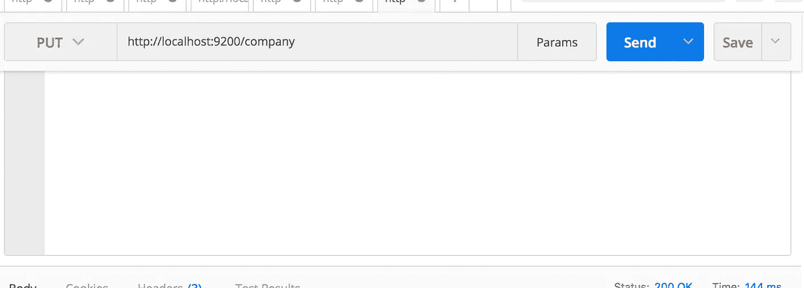
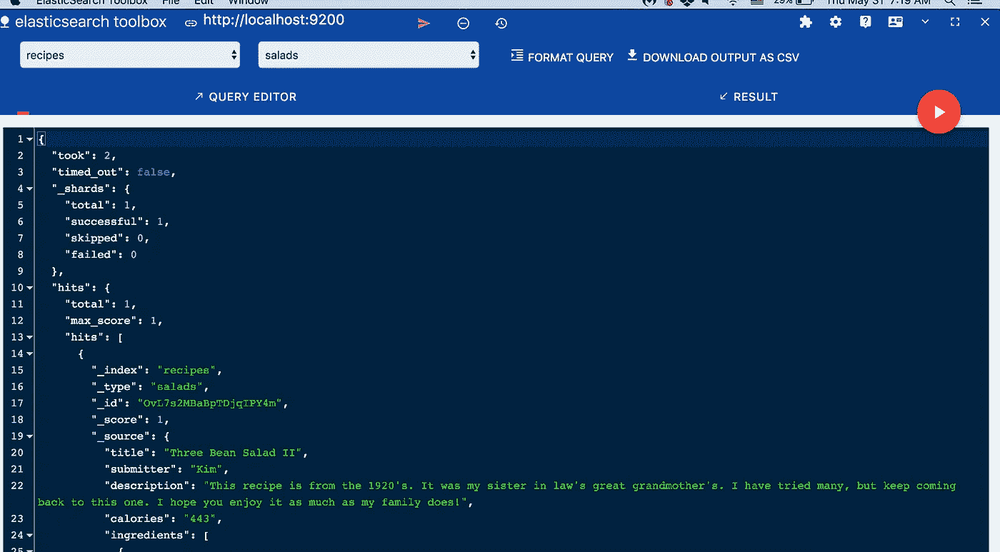

# Python 中的 Elasticsearch 入门

> 原文：<https://towardsdatascience.com/getting-started-with-elasticsearch-in-python-c3598e718380?source=collection_archive---------0----------------------->


*Image Credit: tryolabs.com*

***此贴为 Elasticsearch 7.x 更新版本*** [***此处***](http://blog.adnansiddiqi.me/getting-started-with-elasticsearch-7-in-python/) ***。***

在这篇文章中，我将讨论 Elasticsearch 以及如何将它与不同的 Python 应用程序集成。

# 什么是 ElasticSearch？

ElasticSearch (ES)是一个高度可用的分布式开源搜索引擎，构建在 Apache Lucene 之上。它是用 Java 构建的开源软件，因此适用于许多平台。你以 JSON 格式存储非结构化数据，这也使它成为一个 NoSQL 数据库。因此，与其他 NoSQL 数据库不同，es 还提供搜索引擎功能和其他相关功能。

# 弹性搜索用例

您可以将 ES 用于多种目的，下面给出了其中的几种:

*   你正在运营一个提供大量动态内容的网站；无论是电子商务网站还是博客。通过实现 ES，你不仅可以为你的 web 应用提供一个强大的搜索引擎，还可以在你的应用中提供原生的自动完成功能。
*   您可以接收不同种类的日志数据，然后使用来查找趋势和统计数据。

# 设置和运行

安装 ElasticSearch 最简单的方法就是 [**下载**](https://www.elastic.co/downloads/elasticsearch) 并运行可执行文件。您必须确保您使用的是 Java 7 或更高版本。

下载后，解压并运行它的二进制文件。

```
elasticsearch-6.2.4 bin/elasticsearch
```

滚动窗口中会有大量文本。如果你看到下面这样的东西，那么它似乎是向上的。

```
[2018-05-27T17:36:11,744][INFO ][o.e.h.n.Netty4HttpServerTransport] [c6hEGv4] publish_address {127.0.0.1:9200}, bound_addresses {[::1]:9200}, {127.0.0.1:9200}
```

但是，因为，眼见为实，在你的浏览器中或通过 cURL 访问 URL `http://localhost:9200`，像下面这样的东西应该会欢迎你。

```
{
  "name" : "c6hEGv4",
  "cluster_name" : "elasticsearch",
  "cluster_uuid" : "HkRyTYXvSkGvkvHX2Q1-oQ",
  "version" : {
    "number" : "6.2.4",
    "build_hash" : "ccec39f",
    "build_date" : "2018-04-12T20:37:28.497551Z",
    "build_snapshot" : false,
    "lucene_version" : "7.2.1",
    "minimum_wire_compatibility_version" : "5.6.0",
    "minimum_index_compatibility_version" : "5.0.0"
  },
  "tagline" : "You Know, for Search"
}
```

现在，在我开始用 Python 访问弹性搜索之前，让我们做一些基本的事情。正如我提到的，ES 提供了一个 [**REST API**](https://www.elastic.co/guide/en/elasticsearch/reference/current/docs.html) ，我们将使用它来执行不同的任务。

# 基本示例

你要做的第一件事就是创建一个索引。一切都存储在索引中。与*索引*相对应的 RDBMS 是一个*数据库*，所以不要把它与你在 RDBMS 中学到的典型索引概念相混淆。我正在使用 [**PostMan**](https://chrome.google.com/webstore/detail/postman/fhbjgbiflinjbdggehcddcbncdddomop?hl=en) 来运行 REST APIs。



如果运行成功，您将会看到类似下面的响应。

```
{
    "acknowledged": true,
    "shards_acknowledged": true,
    "index": "company"
}
```

所以我们创建了一个名为 *company* 的数据库。换句话说，我们创建了一个名为*公司*的*指数*。如果您从浏览器访问`http://localhost:9200/company`，您将看到如下内容:

```
{
  "company": {
    "aliases": {

    },
    "mappings": {

    },
    "settings": {
      "index": {
        "creation_date": "1527638692850",
        "number_of_shards": "5",
        "number_of_replicas": "1",
        "uuid": "RnT-gXISSxKchyowgjZOkQ",
        "version": {
          "created": "6020499"
        },
        "provided_name": "company"
      }
    }
  }
}
```

暂时忽略`mappings`,我们稍后会讨论它。它实际上只是为您的文档创建一个*模式*。`creation_date`不言自明。`number_of_shards`告知将保存该*索引*的数据的分区数量。将全部数据保存在一个磁盘上毫无意义。如果您正在运行一个由多个弹性节点组成的集群，那么整个数据将在这些节点上进行拆分。简而言之，如果有 5 个分片，那么整个数据在 5 个分片上都是可用的，ElasticSearch 集群可以为来自任何节点的请求提供服务。

副本讨论数据的镜像。如果你熟悉*主从*概念，那么这对你来说应该不陌生。你可以在这里 了解更多 ES 基本概念 [**。**](https://www.elastic.co/guide/en/elasticsearch/reference/current/_basic_concepts.html)

创建索引的 cURL 版本是一行程序。

```
➜  elasticsearch-6.2.4 curl -X PUT localhost:9200/company
{"acknowledged":true,"shards_acknowledged":true,"index":"company"}%
```

您还可以一次完成索引创建和记录插入任务。你所要做的就是以 JSON 格式传递你的记录。你可以在*邮差里看到类似下面的东西。*


确保将`Content-Type`设置为`application/json`

它将在这里创建一个名为`company`的索引，如果它不存在，然后在这里创建一个名为 *employees* 的新的*类型*。Type 实际上是 RDBMS 中一个*表*的 ES 版本。

上述请求将输出以下 JSON 结构。

```
{
    "_index": "company",
    "_type": "employees",
    "_id": "1",
    "_version": 1,
    "result": "created",
    "_shards": {
        "total": 2,
        "successful": 1,
        "failed": 0
    },
    "_seq_no": 0,
    "_primary_term": 1
}
```

你通过`/1`作为你的记录的 ID。但是这不是必须的。它所做的只是用值`1`设置`_id`字段。然后以 JSON 格式传递数据，这些数据最终将作为新记录或文档插入。如果你从浏览器访问`http://localhost:9200/company/employees/1`，你会看到如下内容。

```
{"_index":"company","_type":"employees","_id":"1","_version":1,"found":true,"_source":{
    "name": "Adnan Siddiqi",
    "occupation": "Consultant"
}}
```

您可以看到实际记录和元数据。如果您愿意，您可以将请求更改为`http://localhost:9200/company/employees/1/_source`，它将只输出记录的 JSON 结构。

cURL 版本应该是:

```
➜  elasticsearch-6.2.4 curl -X POST \
>   [http://localhost:9200/company/employees/1](http://localhost:9200/company/employees/1) \
>   -H 'content-type: application/json' \
>   -d '{
quote>     "name": "Adnan Siddiqi",
quote>     "occupation": "Consultant"
quote> }'
{"_index":"company","_type":"employees","_id":"1","_version":1,"result":"created","_shards":{"total":2,"successful":1,"failed":0},"_seq_no":0,"_primary_term":1}%
```

如果您想更新记录，该怎么办？嗯，这很简单。你所要做的就是改变你的 JSON 记录。如下图所示:


它将生成以下输出:

```
{
    "_index": "company",
    "_type": "employees",
    "_id": "1",
    "_version": 2,
    "result": "updated",
    "_shards": {
        "total": 2,
        "successful": 1,
        "failed": 0
    },
    "_seq_no": 1,
    "_primary_term": 1
}
```

注意`_result`字段现在被设置为`updated`而不是`created`

当然，你也可以删除某些记录。


如果你快疯了，或者你的女朋友/男朋友把你甩了，你可以从命令行运行`curl -XDELETE localhost:9200/_all`烧掉整个世界。

让我们做一些基本的搜索。如果运行`http://localhost:9200/company/employees/_search?q=adnan`，它将搜索类型`employees`下的所有字段，并返回相关记录。

```
{
  "took": 7,
  "timed_out": false,
  "_shards": {
    "total": 5,
    "successful": 5,
    "skipped": 0,
    "failed": 0
  },
  "hits": {
    "total": 1,
    "max_score": 0.2876821,
    "hits": [
      {
        "_index": "company",
        "_type": "employees",
        "_id": "1",
        "_score": 0.2876821,
        "_source": {
          "name": "Adnan Siddiqi",
          "occupation": "Software Consultant"
        }
      }
    ]
  }
}
```

`max_score`字段告诉记录的相关程度，即记录的最高分。如果有多条记录，那么它会是一个不同的数字。

还可以通过传递字段名将搜索条件限制在某个字段。因此，`http://localhost:9200/company/employees/_search?q=name:Adnan`将只在文档的`name`字段中搜索。它实际上是`SELECT * from table where name='Adnan'`的 SQL 等价物

我只是介绍了一些基本的例子。ES 可以做很多事情，但是我将让您通过阅读文档来进一步探索它，并将切换到用 Python 访问 ES。

# 用 Python 访问 ElasticSearch

老实说，ES 的 REST APIs 已经足够好了，你可以使用`requests`库来执行你所有的任务。尽管如此，你还是可以使用一个 [**Python 库**](https://elasticsearch-py.readthedocs.io/en/master/) 来进行 ElasticSearch，从而专注于你的主要任务，而不是担心如何创建请求。

通过 pip 安装它，然后你可以在你的 Python 程序中访问它。

`pip install elasticsearch`

要确保安装正确，请从命令行运行以下基本代码片段:

```
➜  elasticsearch-6.2.4 python
Python 3.6.4 |Anaconda custom (64-bit)| (default, Jan 16 2018, 12:04:33) 
[GCC 4.2.1 Compatible Clang 4.0.1 (tags/RELEASE_401/final)] on darwin
Type "help", "copyright", "credits" or "license" for more information.
>>> from elasticsearch import Elasticsearch
>>> es = Elasticsearch([{'host': 'localhost', 'port': 9200}])
>>> es
<Elasticsearch([{'host': 'localhost', 'port': 9200}])>
```

# 网页抓取和弹性搜索

我们来讨论一个使用 Elasticsearch 的小实际用例。目标是访问在线食谱，并将其存储在 Elasticsearch 中，以用于搜索和分析目的。我们将首先从 *Allrecipes* 中抓取数据，并将其存储在 es 中。在 ES 的情况下，我们还将创建一个严格的模式或*映射*，这样我们可以确保数据以正确的格式和类型被索引。我只是调出沙拉食谱的清单。我们开始吧！

## 抓取数据

```
import json
from time import sleepimport requests
from bs4 import BeautifulSoupdef parse(u):
    title = '-'
    submit_by = '-'
    description = '-'
    calories = 0
    ingredients = []
    rec = {}try:
        r = requests.get(u, headers=headers)if r.status_code == 200:
            html = r.text
            soup = BeautifulSoup(html, 'lxml')
            # title
            title_section = soup.select('.recipe-summary__h1')
            # submitter
            submitter_section = soup.select('.submitter__name')
            # description
            description_section = soup.select('.submitter__description')
            # ingredients
            ingredients_section = soup.select('.recipe-ingred_txt')# calories
            calories_section = soup.select('.calorie-count')
            if calories_section:
                calories = calories_section[0].text.replace('cals', '').strip()if ingredients_section:
                for ingredient in ingredients_section:
                    ingredient_text = ingredient.text.strip()
                    if 'Add all ingredients to list' not in ingredient_text and ingredient_text != '':
                        ingredients.append({'step': ingredient.text.strip()})if description_section:
                description = description_section[0].text.strip().replace('"', '')if submitter_section:
                submit_by = submitter_section[0].text.strip()if title_section:
                title = title_section[0].textrec = {'title': title, 'submitter': submit_by, 'description': description, 'calories': calories,
                   'ingredients': ingredients}
    except Exception as ex:
        print('Exception while parsing')
        print(str(ex))
    finally:
        return json.dumps(rec)if __name__ == '__main__':
    headers = {
        'User-Agent': 'Mozilla/5.0 (Macintosh; Intel Mac OS X 10_11_6) AppleWebKit/537.36 (KHTML, like Gecko) Chrome/66.0.3359.181 Safari/537.36',
        'Pragma': 'no-cache'
    }
    url = '[https://www.allrecipes.com/recipes/96/salad/'](https://www.allrecipes.com/recipes/96/salad/')
    r = requests.get(url, headers=headers)
    if r.status_code == 200:
        html = r.text
        soup = BeautifulSoup(html, 'lxml')
        links = soup.select('.fixed-recipe-card__h3 a')
        for link in links:
            sleep(2)
            result = parse(link['href'])
            print(result)
            print('=================================')
```

这是拉取数据的基本程序。由于我们需要 JSON 格式的数据，因此，我相应地转换了它。

## 创建索引

好了，我们得到了想要的数据，我们必须存储它。我们要做的第一件事就是创建一个索引。姑且称之为*食谱*。这种沙拉将被称为*。我要做的另一件事是为我们的文档结构创建一个*映射*。*

*在我们创建索引之前，我们必须连接 ElasticSearch 服务器。*

```
*import logging
def connect_elasticsearch():
    _es = None
    _es = Elasticsearch([{'host': 'localhost', 'port': 9200}])
    if _es.ping():
        print('Yay Connect')
    else:
        print('Awww it could not connect!')
    return _esif __name__ == '__main__':
  logging.basicConfig(level=logging.ERROR)*
```

*`_es.ping()`实际上 pings 服务器，如果连接上了就返回`True`。我花了一段时间想出如何捕捉堆栈跟踪， [**发现 ou**](https://github.com/elastic/elasticsearch-py/issues/666#issuecomment-343145564) t 它刚刚被记录！*

```
*def create_index(es_object, index_name='recipes'):
    created = False
    # index settings
    settings = {
        "settings": {
            "number_of_shards": 1,
            "number_of_replicas": 0
        },
        "mappings": {
            "members": {
                "dynamic": "strict",
                "properties": {
                    "title": {
                        "type": "text"
                    },
                    "submitter": {
                        "type": "text"
                    },
                    "description": {
                        "type": "text"
                    },
                    "calories": {
                        "type": "integer"
                    },
                }
            }
        }
    }try:
        if not es_object.indices.exists(index_name):
            # Ignore 400 means to ignore "Index Already Exist" error.
            es_object.indices.create(index=index_name, ignore=400, body=settings)
            print('Created Index')
        created = True
    except Exception as ex:
        print(str(ex))
    finally:
        return created*
```

*这里发生了很多事情。首先，我们传递了一个包含整个文档结构映射的配置变量。 [**映射**](https://www.elastic.co/guide/en/elasticsearch/reference/current/mapping.html) 是弹性图式的术语。就像我们在表中设置某些字段数据类型一样，我们在这里做一些类似的事情。检查文件，它涵盖了更多。所有字段的类型都是`text`，但`calories`的类型是`Integer`*

*接下来，我将确保该索引根本不存在，然后创建它。检查后不再需要参数`ignore=400`,但如果您不检查是否存在，您可以抑制错误并覆盖现有索引。尽管这很冒险。就像覆盖数据库一样。*

*如果索引创建成功，您可以通过访问[**http://localhost:9200/recipes/_ mappings**](http://localhost:9200/recipes/_mappings)来验证它，它将打印出如下内容:*

```
*{
  "recipes": {
    "mappings": {
      "salads": {
        "dynamic": "strict",
        "properties": {
          "calories": {
            "type": "integer"
          },
          "description": {
            "type": "text"
          },
          "submitter": {
            "type": "text"
          },
          "title": {
            "type": "text"
          }
        }
      }
    }
  }
}*
```

*通过传递`dynamic:strict`,我们迫使 Elasticsearch 对任何传入的文档进行严格检查。这里，`salads`实际上是文档类型。`Type`实际上是 Elasticsearch 对 RDBMS *表*的回答。*

## *记录索引*

*下一步是存储实际的数据或文档。*

```
*def store_record(elastic_object, index_name, record):
    try:
        outcome = elastic_object.index(index=index_name, doc_type='salads', body=record)
    except Exception as ex:
        print('Error in indexing data')
        print(str(ex))*
```

*运行它，您将受到以下欢迎:*

```
*Error in indexing data
TransportError(400, 'strict_dynamic_mapping_exception', 'mapping set to strict, dynamic introduction of [ingredients] within [salads] is not allowed')*
```

*你能猜到为什么会这样吗？由于我们没有在映射中设置`ingredients`，ES 不允许我们存储包含`ingredients`字段的文档。现在您知道了首先分配一个映射的好处。这样做可以避免损坏数据。现在，让我们改变映射一点，现在它将看起来如下:*

```
*"mappings": {
            "salads": {
                "dynamic": "strict",
                "properties": {
                    "title": {
                        "type": "text"
                    },
                    "submitter": {
                        "type": "text"
                    },
                    "description": {
                        "type": "text"
                    },
                    "calories": {
                        "type": "integer"
                    },
                    "ingredients": {
                        "type": "nested",
                        "properties": {
                            "step": {"type": "text"}
                        }
                    },
                }
            }
        }*
```

*我们添加了类型为`nested`的`ingrdients`，然后分配了内部字段的数据类型。在我们的例子中是`text`*

*[**嵌套**](https://www.elastic.co/guide/en/elasticsearch/reference/current/nested.html) 数据类型允许您设置嵌套 JSON 对象的类型。再次运行它，您将看到以下输出:*

```
*{
  '_index': 'recipes',
  '_type': 'salads',
  '_id': 'OvL7s2MBaBpTDjqIPY4m',
  '_version': 1,
  'result': 'created',
  '_shards': {
    'total': 1,
    'successful': 1,
    'failed': 0
  },
  '_seq_no': 0,
  '_primary_term': 1
}*
```

*由于您根本没有通过`_id`，ES 本身为存储的文档分配了一个动态 id。我用 Chrome，我用 ES data viewer 借助一个叫 [**ElasticSearch 工具箱**](https://chrome.google.com/webstore/detail/elasticsearch-toolbox/focdbmjgdonlpdknobfghplhmafpgfbp) 的工具查看数据。*

**

*在我们继续之前，让我们在`calories`字段中发送一个字符串，看看情况如何。记得我们把它设定为`integer`。建立索引时，它给出了以下错误:*

*`TransportError(400, 'mapper_parsing_exception', 'failed to parse [calories]')`*

*现在您知道了为文档分配映射的好处。如果不这样做，它仍然会工作，因为 Elasticsearch 会在运行时分配自己的映射。*

## *查询记录*

*现在，记录被索引，是时候根据我们的需要查询它们了。我将创建一个名为`search()`的函数，它将显示我们的查询结果。*

```
*def search(es_object, index_name, search):
    res = es_object.search(index=index_name, body=search)*
```

*这是非常基本的。您在其中传递索引和搜索标准。让我们尝试一些查询。*

```
*if __name__ == '__main__':
  es = connect_elasticsearch()
    if es is not None:
        search_object = {'query': {'match': {'calories': '102'}}}
        search(es, 'recipes', json.dumps(search_object))*
```

*上述查询将返回所有`calories`等于 102 的记录。在我们的例子中，输出将是:*

```
*{'_shards': {'failed': 0, 'skipped': 0, 'successful': 1, 'total': 1},
 'hits': {'hits': [{'_id': 'YkTAuGMBzBKRviZYEDdu',
                    '_index': 'recipes',
                    '_score': 1.0,
                    '_source': {'calories': '102',
                                'description': "I've been making variations of "
                                               'this salad for years. I '
                                               'recently learned how to '
                                               'massage the kale and it makes '
                                               'a huge difference. I had a '
                                               'friend ask for my recipe and I '
                                               "realized I don't have one. "
                                               'This is my first attempt at '
                                               'writing a recipe, so please '
                                               'let me know how it works out! '
                                               'I like to change up the '
                                               'ingredients: sometimes a pear '
                                               'instead of an apple, '
                                               'cranberries instead of '
                                               'currants, Parmesan instead of '
                                               'feta, etc. Great as a side '
                                               'dish or by itself the next day '
                                               'for lunch!',
                                'ingredients': [{'step': '1 bunch kale, large '
                                                         'stems discarded, '
                                                         'leaves finely '
                                                         'chopped'},
                                                {'step': '1/2 teaspoon salt'},
                                                {'step': '1 tablespoon apple '
                                                         'cider vinegar'},
                                                {'step': '1 apple, diced'},
                                                {'step': '1/3 cup feta cheese'},
                                                {'step': '1/4 cup currants'},
                                                {'step': '1/4 cup toasted pine '
                                                         'nuts'}],
                                'submitter': 'Leslie',
                                'title': 'Kale and Feta Salad'},
                    '_type': 'salads'}],
          'max_score': 1.0,
          'total': 1},
 'timed_out': False,
 'took': 2}*
```

*如果您想获得大于 20 的记录呢？*

*`search_object = {'_source': ['title'], 'query': {'range': {'calories': {'gte': 20}}}}`*

*您还可以指定要返回的列或字段。上述查询将返回卡路里大于 20 的所有记录。此外，它将只在`_source`下显示`title`字段。*

# *结论*

*Elasticsearch 是一款功能强大的工具，通过提供强大的功能来返回最准确的结果集，可以帮助您搜索现有或新的应用程序。我刚刚谈到了它的要点。一定要阅读文档，熟悉这个强大的工具。尤其是模糊搜索功能相当牛逼。如果有机会，我会在以后的帖子中讨论查询 DSL。*

*像往常一样，代码可以在 [**Github**](https://github.com/kadnan/Python-Elasticsearch) 上获得。*

**本文原载* [*这里*](http://blog.adnansiddiqi.me/getting-started-with-elasticsearch-in-python/) *。**

****点击*** [***此处***](http://eepurl.com/TZynf) ***订阅我的简讯以备日后发帖。****