# Hive 入门

> 原文：<https://towardsdatascience.com/getting-started-with-hive-ad8a93862f1a?source=collection_archive---------5----------------------->


[Image [0] (Image courtesy: [https://wall.alphacoders.com/big.php?i=380565](https://wall.alphacoders.com/big.php?i=380565))]

这篇博文的目的是帮助你开始使用 Cloudera Manager 使用 Hive。 **Apache Hive** 是一个[数据仓库](https://en.wikipedia.org/wiki/Data_warehouse)软件项目，构建在 [Apache Hadoop](https://en.wikipedia.org/wiki/Apache_Hadoop) 之上，用于提供数据汇总、查询和分析。Hive 给出了一个类似于 [SQL](https://en.wikipedia.org/wiki/SQL) 的接口来查询存储在与 Hadoop 集成的各种数据库和文件系统中的数据。

如果你对 R 编程感兴趣，可以看看我的其他文章——[利用 R](/exploratory-analysis-of-fifa-18-dataset-using-r-ba09aa4a2d3c) 和[gg plot ' Em All | Pokemon on R](/exploratory-analysis-of-pokemons-using-r-8600229346fb)对 FIFA 18 数据集的探索性分析。

我们将首先从莎士比亚开始，通过实现一个简单的字数统计程序来理解工作流程。然后，我们将移动到 MovieLens 数据，并使用 HQL 执行查询。

启动您的 Cloudera 虚拟机。去你的`ip:7180.`

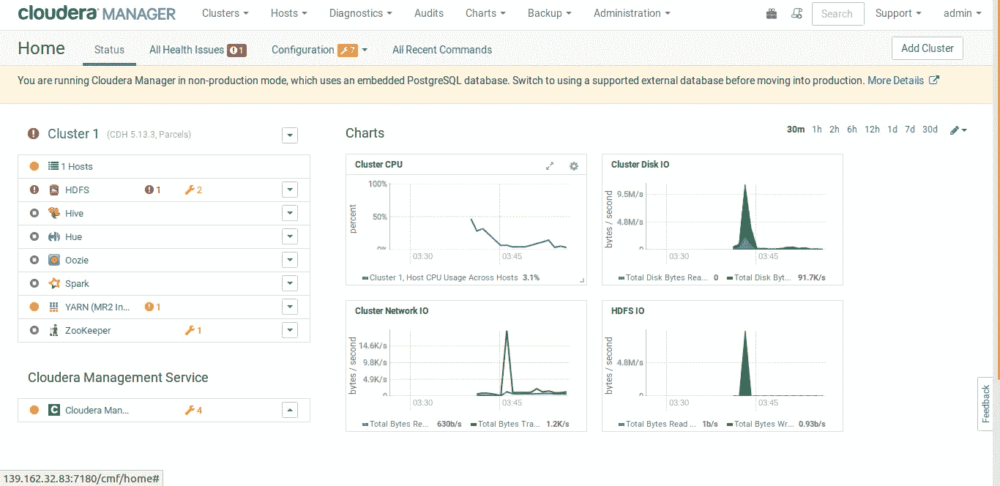

Cloudera Manager Console [Image [1]]

我们将使用 Hdfs、Hive 和 Yarn。因此，请确保它们正在运行。

现在，我们必须创建一个目录来存储我们将在其上运行 wordcount 程序的输入文件。

```
# to view the contents of the root directory on HDFS
hdfs dfs -ls /# create a new directory named 'input' in the HDFS
hdfs dfs -mkdir /input
```

您将看到权限被拒绝，因为 hdfs 用户拥有超级用户(root)权限。我们将在本文后面看到如何对此进行排序。

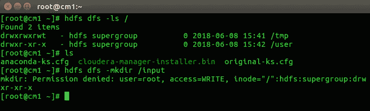

Permission denied [Image [2]]

现在，下载要进行字数统计的文本文件。我们将使用莎士比亚的作品。下载并解压文件。里面有五个文件。我们今天将使用喜剧文件。

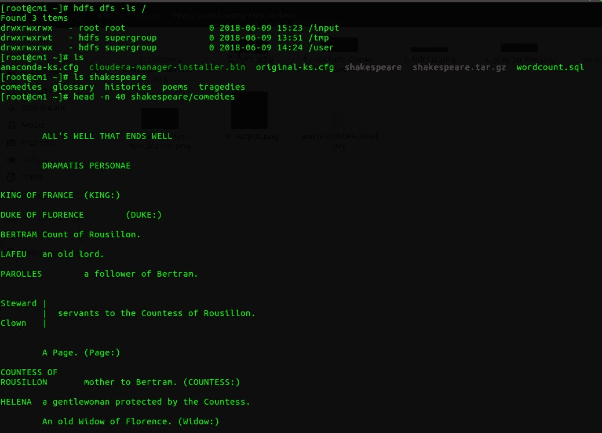

Shakespeare [Image [3]]

我们在本地文件系统中有喜剧文件。我们需要将它转移到`/input`文件夹中的 hdfs 中。在此之前，我们需要给我们的根用户添加一个文件到`/input`文件夹的权限。

```
# Give the su permission to root-user
hdfs dfs -chown root:root /input     

hdfs dfs -ls /
```

root 用户现在对 `/input`文件夹拥有超级用户权限。

回到根用户的状态。

```
exit
```

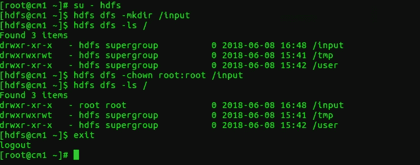

Chown [Image [4]]

编写一个 SQL 文件来执行字数统计。另存为`wordcount.sql`。

```
DROP DATABASE IF EXISTS documents CASCADE;CREATE DATABASE documents;USE documents;CREATE TABLE docs(words string);LOAD DATA LOCAL INPATH '/root/shakespeare' INTO TABLE docs;CREATE TABLE word_count AS
SELECT word, count(*) AS count FROM
(SELECT explode(split(words, '\\W+')) AS word FROM docs) w
GROUP BY word;SELECT * FROM word_count limit 100;
```

我们需要对`/shakespeare`目录的读写权限来运行`wordcount.sql`程序。成为 hdfs 用户并输入以下命令。

```
su - hdfs     # Change user to hdfs from roothdfs dfs -chmod -R 777 /shakespeareexit
```

现在，作为 root 用户，运行以下命令:

```
hive -f wordcount.sql
```

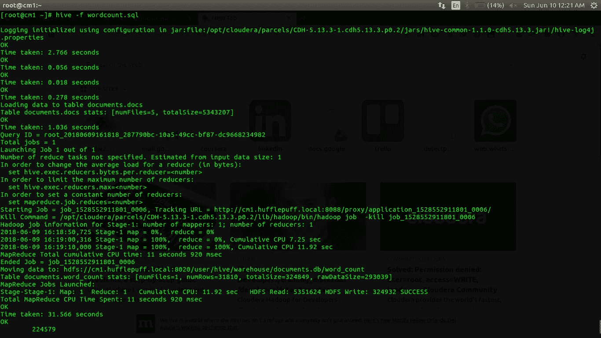

Execute Word Count program [Image [5]]

您应该会看到如下所示的输出。

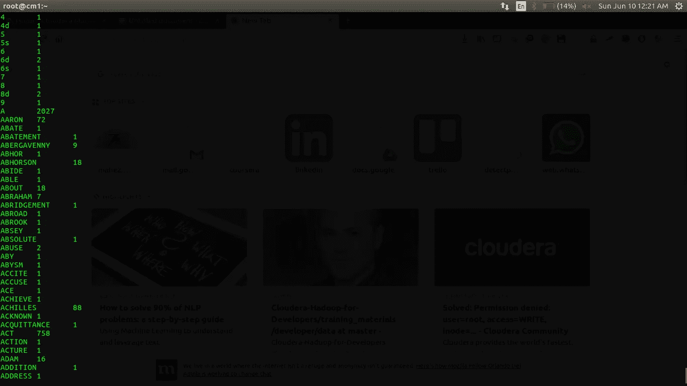

Output [Image [6]]

接下来，我们将尝试在 [MovieLens](https://grouplens.org/datasets/movielens/1m/) 数据集上运行 Hive 查询。

下载文件。当您看到前几行时，您会注意到该文件由`::`分隔。将分隔符改为`,` (csv)。

```
sed -i 's/::/,/g' ml-1m/movies.dat
sed -i 's/::/,/g' ml-1m/users.dat
sed -i 's/::/,/g' ml-1m/ratings.dat# Rename the files from .dat to .csv. Although, it doesn't really # matter. You can leave the files as .dat. I have OCD.mv ml-1m/movies.dat /ml-1m/movies.csv
mv ml-1m/ratings.dat /ml-1m/ratings.csv
mv ml-1m/users.dat /ml-1m/users.csv
```

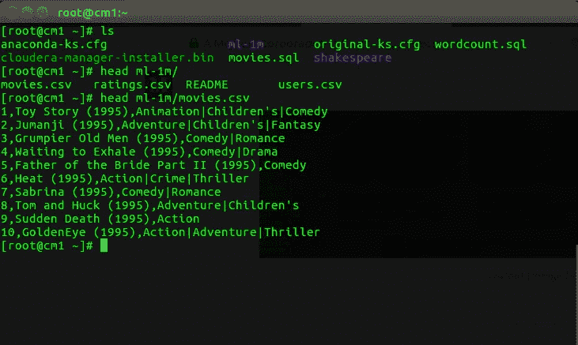

MovieLens data [Image [7]]

在 hdfs 中创建一个名为`movielens`的文件夹，并将文件移入其中。

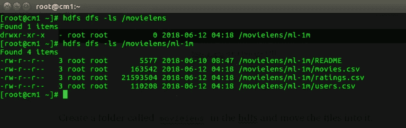

File in hdfs [Image [8]]

作为 hdfs 用户，创建以下文件`movies.sql`、`ratings.sql`和`users.sql`。

```
su - hdfs
nano movies.sql
nano ratings.sql
nano users.sql
```

要查看`movies.csv`文件中的数据，在`movies.sql`文件中复制以下代码并运行命令`hive -f movies.sql`。

```
DROP DATABASE IF EXISTS movielens CASCADE;CREATE DATABASE movielens;USE movielens;CREATE EXTERNAL TABLE movies (MovieID INT, 
Title varchar(60), 
Genres varchar(60))ROW FORMAT DELIMITED FIELDS TERMINATED BY ',' 
LINES TERMINATED BY "\n"
STORED AS TEXTFILE
LOCATION '/movielens/ml-1m/mvs.txt';LOAD DATA INPATH '/movielens/ml-1m/movies.csv' INTO TABLE movies;SELECT * FROM movies LIMIT 10;
```

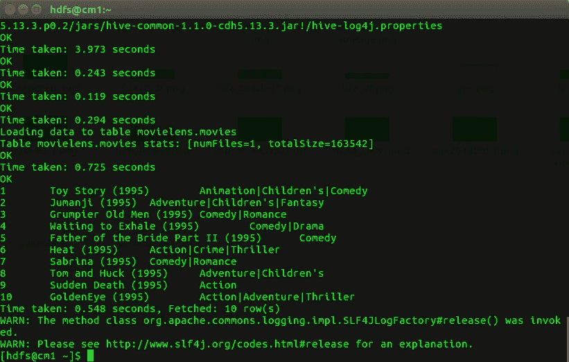

First 10 entries in the movies.csv [Image [9]]

要查看`ratings.csv`文件中的数据，在`ratings.sql`文件中复制以下代码并运行命令`hive -f ratings.sql`。

```
DROP DATABASE IF EXISTS movielens CASCADE;CREATE DATABASE movielens;USE movielens;CREATE EXTERNAL TABLE ratings (UserID INT, 
MovieID INT, 
Rating INT, 
Timestamp STRING)ROW FORMAT DELIMITED FIELDS TERMINATED BY ',' 
LINES TERMINATED BY "\n"
STORED AS TEXTFILE
LOCATION '/movielens/ml-1m/rts.txt';LOAD DATA INPATH '/movielens/ml-1m/ratings.csv' INTO TABLE ratings;SELECT * FROM ratings LIMIT 10;
```

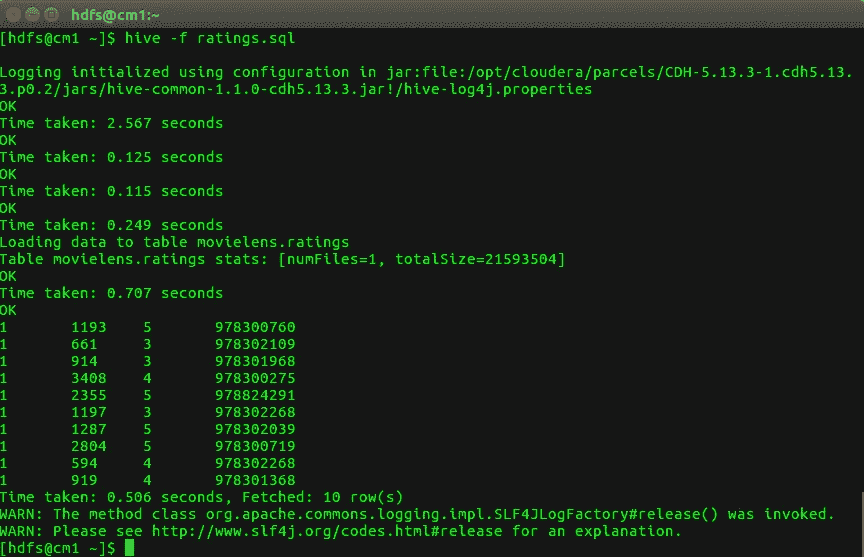

First 10 entries in ratings.csv [Image [10]]

要查看`users.csv`文件中的数据，在`users.sql`文件中复制以下代码并运行命令`hive -f users.sql`。

```
DROP DATABASE IF EXISTS movielens CASCADE;CREATE DATABASE movielens;USE movielens;CREATE EXTERNAL TABLE users (UserID INT, 
Gender STRING, 
Age INT,
Occupation INT, 
ZIP INT)ROW FORMAT DELIMITED FIELDS TERMINATED BY ',' 
LINES TERMINATED BY "\n"
STORED AS TEXTFILE
LOCATION '/movielens/ml-1m/usr.txt';LOAD DATA INPATH '/movielens/ml-1m/users.csv' INTO TABLE users;SELECT * FROM users LIMIT 10;
```

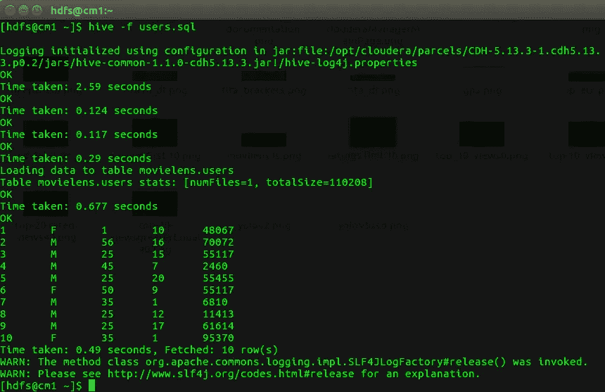

First 10 entries in users.csv [Image [11]]

十大热门电影。

```
DROP DATABASE IF EXISTS movielens CASCADE;CREATE DATABASE movielens;USE movielens;CREATE EXTERNAL TABLE movies (MovieID INT, 
                              Title varchar(60), 
                              Genres varchar(60))ROW FORMAT DELIMITED FIELDS TERMINATED BY ',' 
LINES TERMINATED BY "\n";CREATE EXTERNAL TABLE ratings (UserID INT, 
                               MovieID INT, 
                               Rating INT, 
                               Timestamp STRING)

ROW FORMAT DELIMITED FIELDS TERMINATED BY ',' 
LINES TERMINATED BY "\n";LOAD DATA INPATH '/movielens/ml-1m/movies.csv' 
OVERWRITE INTO TABLE movies;LOAD DATA INPATH '/movielens/ml-1m/ratings.csv' 
OVERWRITE INTO TABLE ratings;SELECT movies.MovieID,movies.Title,COUNT(DISTINCT ratings.UserID) as views
FROM movies JOIN ratings ON (movies.MovieID = ratings.MovieID)
GROUP BY movies.MovieID, movies.Title
ORDER BY views DESC
LIMIT 10;
```

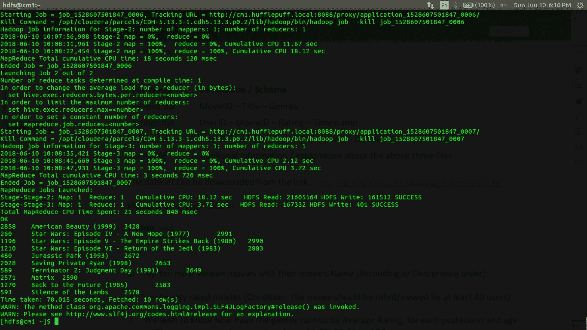

Top 10 viewed movies [Image [12]]

收视率最高的 20 部电影至少有 40 次观看。

```
DROP DATABASE IF EXISTS movielens CASCADE;CREATE DATABASE movielens;USE movielens;CREATE EXTERNAL TABLE movies (MovieID INT, 
                              Title varchar(60), 
                              Genres varchar(60))ROW FORMAT DELIMITED FIELDS TERMINATED BY ',' 
LINES TERMINATED BY "\n";CREATE EXTERNAL TABLE ratings (UserID INT, 
                               MovieID INT, 
                               Rating INT, 
                               Timestamp STRING)ROW FORMAT DELIMITED FIELDS TERMINATED BY ',' LINES TERMINATED BY "\n";LOAD DATA INPATH '/movielens/ml-1m/movies.csv' OVERWRITE INTO TABLE movies;LOAD DATA INPATH '/movielens/ml-1m/ratings.csv' OVERWRITE INTO TABLE ratings;SELECT movies.MovieID,movies.Title,AVG(ratings.Rating) as rtg,COUNT(DISTINCT ratings.UserID) as viewsFROM movies JOIN ratings ON (movies.MovieID = ratings.MovieID)
GROUP BY movies.MovieID,movies.Title
HAVING views >= 40
ORDER BY rtg DESC
LIMIT 20;
```

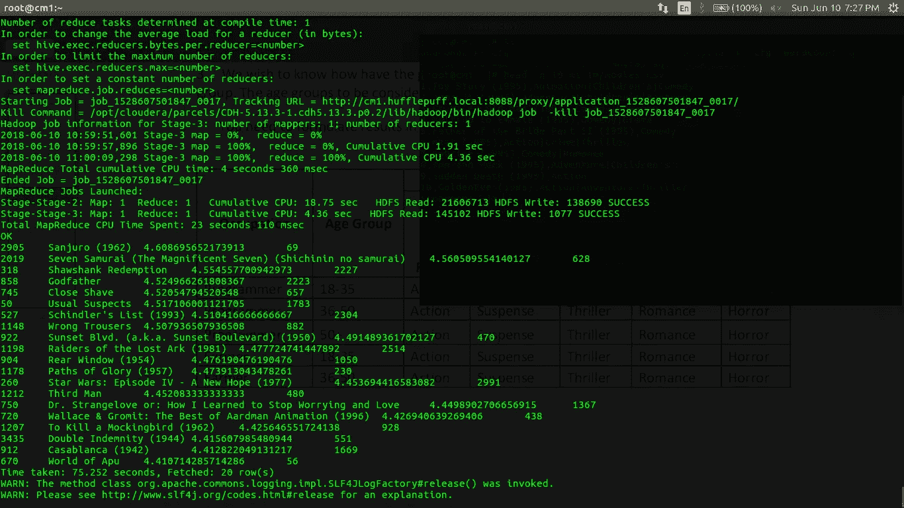

Top 20 rated movies. [Image [13]]

感谢您的阅读。希望您发现它对开始使用 Hive 很有用。欢迎提出建议和建设性的批评。:)你可以在 [LinkedIn](https://www.linkedin.com/in/akshajverma7/) 和 [Twitter](https://twitter.com/theairbend3r) 上找到我。

点击这里查看我的其他博客。

[](https://www.buymeacoffee.com/theairbend3r)