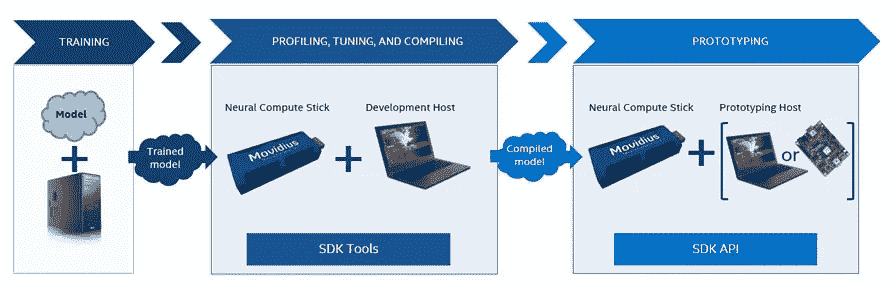
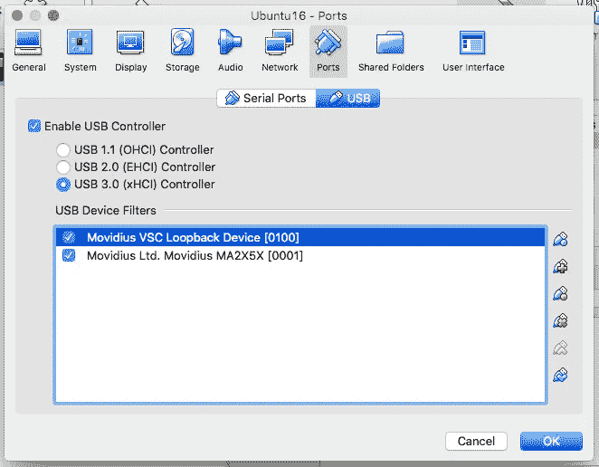

# 英特尔 Movidius 入门

> 原文：<https://towardsdatascience.com/getting-started-with-intel-movidius-d8ba13e7d3ae?source=collection_archive---------2----------------------->


英特尔 Movidius 是一款有趣的硬件，可以在类似 Raspberry Pi 的嵌入式系统上工作，支持神经网络计算。即使 think 只在 Linux 下受支持，我们也可以使用 Oracle Virtual Box 让它在 Mac 或 Windows 平台上工作。

英特尔 Movidius 还支持 Caffe 和 TensorFlow 模型，典型的工作流程如下



Typical Intel Movidius workflow (Image courtesy: [https://movidius.github.io/ncsdk/](https://movidius.github.io/ncsdk/))

完整文档可从英特尔 Movidius NCSDK[1]获得

在这篇文章中，我将重点介绍如何使用 Ubuntu 16.x 变体在 Oracle Virtual Box 和 Rapsberry Pi 3 Model B 环境上入门。

# Oracle 虚拟机箱

从 Oracle Virtual Box 下载[2]并安装扩展包。

在安装 Ubuntu 16.x 之前，配置/添加以下 USB 设备。请注意，英特尔 Movidius 有两种模式，因此需要两种不同的设备配置

> **配置 1**
> 名称:Movidius VSC 环回设备【0100】
> 厂商 ID : 03e7
> 产品 ID : f63b
> 版本:0100
> 制造商:Movidius
> 产品:VSC 环回设备
> 
> **配置 2**
> 名称:m ovidius ltd . Movidius MA2X5X[0001]
> 厂商 ID : 03e7
> 产品 ID : 2150
> 版本:0001
> 制造商:Movidius Ltd.
> 产品:m ovidius MA2X5X

如下图所示，使用配置 1 和配置 2 的 Oracle Virtual Box USB 设备的配置要求



Oracle Virtual Box USB setup

# 树莓 Pi 3 型号 B

目前我正在使用树莓官网的 NOOBS[3]。请注意，我们需要连接显示器和键盘+鼠标进行初始安装。之后，通过在 Raspberry Pi 3 Model B 上打开 SSH，一切都将无头化。Raspberry 的人从 Raspberry Documentation[4]获得了关于打开 SSH 登录的很好的文档

Raspberry Pi 需要做更多的工作来安装来自源代码[5]的 OpenCV，其中包括 **e**

**1。增加交换空间**
我们还需要通过编辑 **/etc/dphys-swapfile** 中的文件来增加交换空间，使用下面的命令，**CONF _ 交换空间=2048** 来拥有 2GB 的交换空间
，然后发出下面的命令来生效

```
$ sudo /etc/init.d/dphys-swapfile stop
$ sudo /etc/init.d/dphys-swapfile start
```

2 **。我们将移除 wolfram 和 libreoffice 来节省一些 NOOBS 默认的空间**

```
$ sudo apt-get purge wolfram-engine
$ sudo apt-get purge libreoffice*
$ sudo apt-get clean
$ sudo apt-get autoremove
```

**3。安装依赖关系** 依赖关系包括构建工具和一些开发库，这些是构建 Open CV 所必需的

```
$ sudo apt-get update && sudo apt-get upgrade
$ sudo apt-get install build-essential cmake pkg-config
$ sudo apt-get install libjpeg-dev libtiff5-dev libjasper-dev libpng12-dev
$ sudo apt-get install libavcodec-dev libavformat-dev libswscale-dev libv4l-dev
$ sudo apt-get install libxvidcore-dev libx264-dev
$ sudo apt-get install libgtk2.0-dev libgtk-3-dev
$ sudo apt-get install libcanberra-gtk*
$ sudo apt-get install libatlas-base-dev gfortran
$ sudo apt-get install python2.7-dev python3-dev
```

**4。下载 Open CV 源代码** 我们需要构建 opencv 和 opencv_contrib 源代码

```
$ cd ~
$ wget -O opencv.zip [https://github.com/Itseez/opencv/archive/3.3.0.zip](https://github.com/Itseez/opencv/archive/3.3.0.zip)
$ unzip opencv.zip
$ wget -O opencv_contrib.zip [https://github.com/Itseez/opencv_contrib/archive/3.3.0.zip](https://github.com/Itseez/opencv_contrib/archive/3.3.0.zip)
$ unzip opencv_contrib.zip
```

**5。编译开放 CV 源代码** 我们将从 ARM 平台的源代码中编译开放 CV

```
$ cd ~/opencv-3.3.0/
$ mkdir build
$ cd build
$ cmake -D CMAKE_BUILD_TYPE=RELEASE \
 -D CMAKE_INSTALL_PREFIX=/usr/local \
 -D OPENCV_EXTRA_MODULES_PATH=~/opencv_contrib-3.3.0/modules \
 -D ENABLE_NEON=ON \
 -D ENABLE_VFPV3=ON \
 -D BUILD_TESTS=OFF \
 -D INSTALL_PYTHON_EXAMPLES=OFF \
 -D BUILD_EXAMPLES=OFF ..
$ sudo make install
```

**6。打开 CV** 的最后一步我们将把默认安装的库(cv2 . cpython-35m-arm-Linux-gnueabihf . so)移动为 cv2.so

```
$ cd /usr/local/lib/python3.5/site-packages/
$ sudo mv cv2.cpython-35m-arm-linux-gnueabihf.so cv2.so
```

7 .**。安装 TensorFlow** 我们需要为树莓 Pi 3 Model B 安装 ARM 版本的 TensorFlow

```
$ wget [https://github.com/lhelontra/tensorflow-on-arm/releases/download/v1.4.0/tensorflow-1.4.0-cp35-none-linux_armv7l.whl](https://github.com/lhelontra/tensorflow-on-arm/releases/download/v1.4.0/tensorflow-1.4.0-cp35-none-linux_armv7l.whl)
$ sudo pip3 install tensorflow-1.4.0-cp35-none-linux_armv7l.whl
```

# 英特尔 Movidius 常规安装

这些步骤适用于 Oracle Virtual Box 和 Raspberry Pi 3 Model B 设置

```
$ sudo apt-get install git
$ git clone [https://github.com/movidius/ncsdk](https://github.com/movidius/ncsdk)
$ cd ncsdk
$ sudo make install
```

# 测试和基准测试

我使用来自[https://github.com/movidius/ncappzoo](https://github.com/movidius/ncappzoo)的 ncappzoo 按照以下步骤做了一些基准测试

```
$ git clone [https://github.com/movidius/ncappzoo](https://github.com/movidius/ncappzoo)
$ cd ncappzoo/apps/benchmarkncs
$ ./mobilenets_benchmark.sh | grep FPS
```


使用时间命令
**Raspberry Pi 3 Model B:**
real 40m 56.595s
user 36m 41.170s
sys 0m 58.780s

**Oracle 虚拟盒子:**
实 11m52.631s
用户 4m43.956s
sys 0m37.612s

**英特尔 Movidius 的性能似乎介于嵌入式系统(Raspberry Pi 3 Model B)和台式机/笔记本电脑系统(Oracle Virtual Box)之间。**测试期间唯一的缺点是运行测试的时间，但我认为重要的一点是运行神经网络模型。

根据英特尔 Movidius 官方网站[6]，可能的应用涵盖机器人、AR/VR、可穿戴设备和智能安防。我能想到的一个很酷的想法是修改 Sun Founder[7]的机器人汽车解决方案，将英特尔 Movidius 作为自动驾驶能力和面部识别的视觉，可以检测入侵者。

如果你对这篇文章有任何问题，请不要犹豫，在下面留言或者给我发邮件:**me@chclab.net**

参考资料:-
【1】【https://movidius.github.io/ncsdk/】[【2】](https://movidius.github.io/ncsdk/)[https://www.virtualbox.org/wiki/Downloads](https://www.virtualbox.org/wiki/Downloads)
【3】[https://www.raspberrypi.org/downloads/](https://www.raspberrypi.org/downloads/)
【4】[https://www . raspberrypi . org/documentation/remote-access/ssh/](https://www.raspberrypi.org/documentation/remote-access/ssh/)
【5】[https://github.com/Itseez/opencv/archive/3.3.0.zip](https://github.com/Itseez/opencv/archive/3.3.0.zip)
【6】https://www.movidius.com/applications
【7】[https://www.sunfounder.com/picar-s-kit-1502.html【](https://www.sunfounder.com/picar-s-kit-1502.html)