# 马尔可夫决策过程入门:强化学习

> 原文：<https://towardsdatascience.com/getting-started-with-markov-decision-processes-reinforcement-learning-ada7b4572ffb?source=collection_archive---------2----------------------->

## 第二部分:解释 ***马尔可夫决策过程、*** 贝尔曼方程和政策的概念

在这篇博文中，我将解释理解如何解决强化学习问题所需的概念。这一系列的博客文章包含了大卫·西尔弗在[关于强化学习的介绍](http://www0.cs.ucl.ac.uk/staff/d.silver/web/Teaching.html)中解释的概念总结。

零件:[1](/reinforcement-learning-an-introduction-to-the-concepts-applications-and-code-ced6fbfd882d)2[3](https://medium.com/@taggatle/planning-by-dynamic-programming-reinforcement-learning-ed4924bbaa4c)[4](/model-free-prediction-reinforcement-learning-507297e8e2ad)…

到目前为止，我们已经在很高的层次上学习了设置强化学习问题所需的组件。现在，我们将更详细地正式描述强化学习的环境。在本帖中，我们将看看一个*完全可观测的* *环境*以及如何将环境正式描述为 ***马尔可夫决策过程*** (MDPs)。

> 如果我们能解决马尔可夫决策过程，那么我们就能解决一大堆强化学习问题。

MDPs 需要满足 ***马尔可夫性质*** 。

> **马尔可夫性质:** *要求“未来独立于过去给定的现在”。*

***性质*** :麟州 *Sₜ* 是马氏当且仅当:

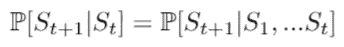

简单地说，这意味着状态 *Sₜ* 从历史中获取所有相关信息。 *S₁，S₂，…，Sₜ₋₁* 可以丢弃，我们仍然得到相同的 ***状态转移概率*** 到下一个状态 *Sₜ₊₁* 。

> **状态转移概率 *:*** *状态转移概率告诉我们，给定我们处于状态* s *下一个状态*s’*会发生的概率是多少。*

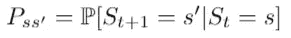

*P without the double lines represents the state transitions. The above equation has the transition from state s to state s’. P with the double lines represents the probability from going from state s to s’.*

我们也可以根据一个*状态转移矩阵* ***P*** 来定义所有的状态转移，其中每一行都告诉我们从一个状态到所有可能的后续状态的转移概率。

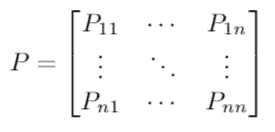

State transition matrix.

# **马尔可夫过程/马尔可夫链**

第一个也是最简单的 MDP 是一个 ***马尔可夫过程*** 。

> **马尔可夫过程/马尔可夫链** : *具有*马尔可夫性质的随机状态序列 S₁、S₂、… *。*

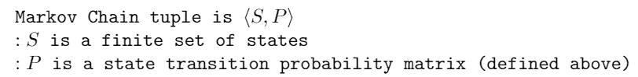

下面是一个马尔可夫链的图示，其中每个节点代表一个状态，有可能从一个状态转移到下一个状态，其中 *Stop* 代表一个终止状态。

Markov Chain

我们可以拿一个 ***样本*** 集来遍历这个链，最后到达终点状态。一个示例情节是从*阶段 1* 到*阶段 2* 到*赢得*到*停止。*以下是几个样本集的代表:

- *S1 S2 赢停
- S1 S2 瞬移 S2 赢停
- S1 暂停 S1 S2 赢停*

上述马尔可夫链具有以下转移概率矩阵:

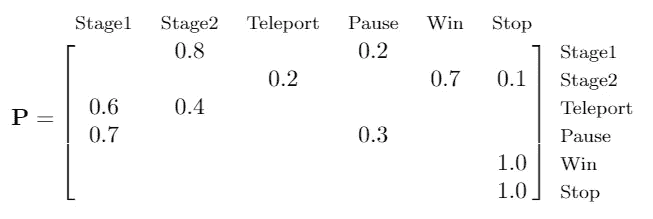

对于每个状态，该状态的转移概率之和等于 1。

# 马尔可夫奖励过程

在上面的马尔可夫链中，我们没有与达到目标的状态相关联的值。一个 ***马尔可夫奖励过程*** 是一个带有奖励值的马尔可夫链。

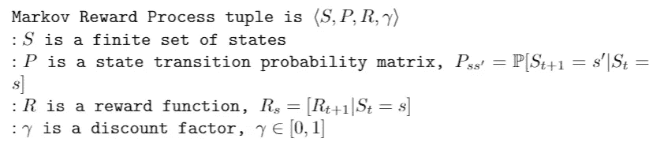

> *我们的目标是最大化* **回报** *。回报* Gₜ *是从时步* t *开始的总折扣奖励。*

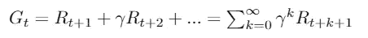

Equation to calculate return

***折现因子*** *γ* 是介于 0 和 1 之间的一个值(可以选择)。如果γ接近 0，则导致近视评估，而接近 1 的值有利于远视评估。

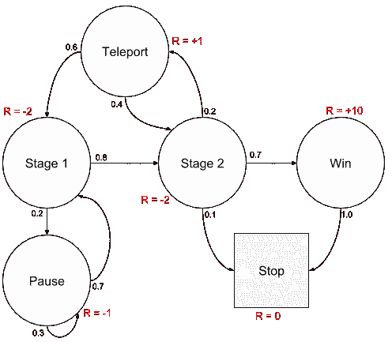

Markov Reward Process

***注*** *:由于在马尔可夫奖励过程中我们没有采取行动，Gₜ是通过遍历随机样本序列来计算的。*

## MRP 的价值函数

> **状态值函数** v(s) *:给出状态* s *的长期值。它是从状态* s 开始的预期收益

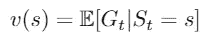

state-value function

我们可以这样看，从状态 *s* 开始，通过状态 *s* 的各种样本，我们的预期收益是多少。我们更喜欢给予更多总回报的州。

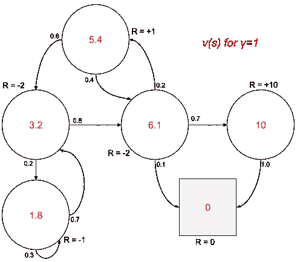

state-values for MRP with *γ=1*

## MRPs 的贝尔曼方程

价值函数可以分解为两部分:

*   ***即时奖励:*** *Rₜ₊₁*
*   ***继承国贴现值***:*γ(s*ₜ₊₁*)*

我们可以使用上面的*状态值*函数和*返回函数*定义一个新的等式来计算状态值函数:

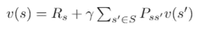

updated bellman state-value equation

或者，这可以写成矩阵形式:

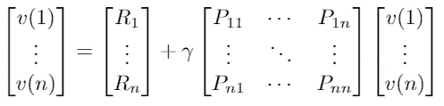

使用这个等式，我们可以计算每个状态的状态值。由于我们在上面有一个简单的模型，带有γ=1 的 MRP 的*“状态值”*，我们可以使用一个联立方程，使用更新的状态值函数来计算状态值。

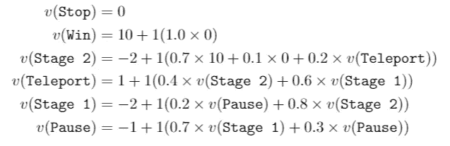

对于较小的 MRPs，求解上面的方程很简单，但是对于较大的数目，就变得非常复杂。为了解决大型 MRP，我们需要其他技术，如*动态规划*、*蒙特卡洛评估*和*时差学习*，这些将在后面的博客中讨论。

# 马尔可夫决策过程

一个 ***马尔可夫决策过程*** 是一个马尔可夫回报过程的扩展，因为它包含了一个代理必须做出的决策。环境中的所有状态都是马尔可夫的。

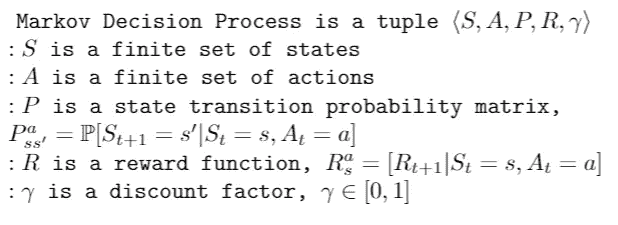

在马尔可夫决策过程中，我们现在对进入哪个状态有了更多的控制。在下面的 MDP 的例子中，如果我们选择进行*传送*动作，我们将在 40%的时间里回到状态*阶段 2* 中，在 60%的时间里回到状态*阶段 1* 中。当选择相应的动作时，其他状态转换以 100%的概率发生，例如采取动作*前进 2* 从*阶段 2* 将把我们带到*胜利。*

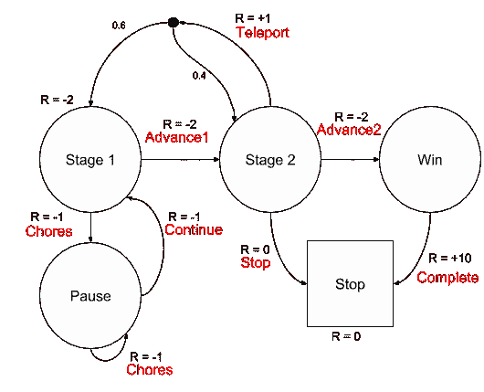

## 政策

> 一个**策略** *π* 是给定状态下动作的分布。它完全定义了一个代理的行为。MDP 政策取决于现状，而不是历史。

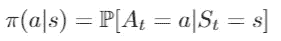

Policy function

策略给出了从一个状态到下一个状态的映射。如果我在状态 *s，*它从那个状态映射出采取每一个行动的概率。示例如果我们有策略 *π(杂务|阶段 1)=100%，*这意味着代理将在处于状态*阶段 1 时采取动作*杂务 100%* 。*

## MDP 的价值函数

因为我们采取行动，所以根据我们的行为会有不同的期望。

> *MDP 的* **状态值函数***v _*π*(s)*是从状态* s *开始，然后遵循策略π的期望收益。**

*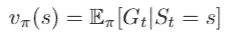*

*状态值函数告诉我们通过遵循策略 *π* 处于状态 *s* 有多好。*

> ****动作值函数** q_π(s，a) *是从状态* s *开始，采取动作* a *，然后跟随策略* π的期望收益。**

**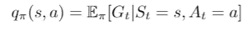**

**行动价值函数告诉我们从特定状态采取特定行动有多好。让我们知道我们应该在各州采取什么行动**

## **贝尔曼期望方程**

**价值函数也可以以 ***的形式写成贝尔曼期望方程*** 如下:**

*****状态值函数:*****

**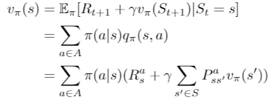**

*****动作值功能:*****

**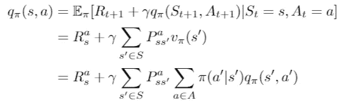**

## **最优值函数**

**在上述所有等式中，我们使用给定的策略来遵循，这可能不是要采取的最佳行动。强化学习的关键目标是找到能使我们的回报最大化的最优策略。**

> *****最优状态值函数***v∫(s)*是所有策略的最大值函数。它告诉我们你能从系统中获得的最大回报。*****

**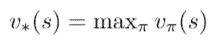**

> *****最优动作值函数**q∫(s，a) *是所有策略上的最大动作值函数。它告诉我们，从状态* s *开始并采取行动* a *时，你能从系统中获得的最大回报是什么。****

**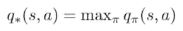**

**如果你知道*q∫*，那么你就知道在 MDP 中应该采取的正确行动和最佳表现，从而解决 MDP 问题。**

> **q∑(s，a)表示采取哪些行动来获得最佳表现。**

## **寻找最佳策略**

**通过最大化超过*q∫(s，a)* 可以找到最优策略:**

**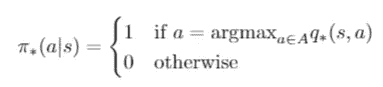**

*****贝尔曼最优方程*** 是非线性的，很难求解。在后面的博客中，我将讨论使用各种技术来解决这个方程的迭代解决方案，例如*值迭代、策略迭代、Q-Learning* 和 *Sarsa。***

# **参考**

*   **[关于 RL 的 UCL 课程——第 2 讲](http://www0.cs.ucl.ac.uk/staff/d.silver/web/Teaching_files/MDP.pdf)**
*   **《强化学习导论》，萨顿和巴尔托，1998 年**

**如果你喜欢这篇文章，并想看到更多，不要忘记关注和/或留下掌声。**