# mlFlow 入门

> 原文：<https://towardsdatascience.com/getting-started-with-mlflow-52eff8c09c61?source=collection_archive---------7----------------------->

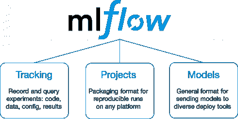

# 什么是 mlFlow？

mlFlow 是一个支持机器学习生命周期的框架。这意味着它具有在训练和运行期间监控模型的组件，能够存储模型，在生产代码中加载模型并创建管道。

该框架引入了 3 个不同的特性，每个特性都有自己的功能。

## 物流跟踪

跟踪可能是该框架最有趣的特性。它允许您围绕您的模型创建一个广泛的日志框架。您可以定义自定义指标，以便在运行后可以将输出与之前的运行进行比较。

我们将主要关注这一部分，但也给你一窥其他功能。

## MlFlow 项目

此功能允许您根据需要创建管线。该特性使用自己的模板来定义您希望如何在云环境中运行模型。由于大多数公司都有在生产中运行代码的方法，所以您可能对这个特性不太感兴趣。

## ml 流程模型

最后，我们有模型功能。mlFlow 模型是包装机器学习模型的标准格式，可用于各种下游工具，例如，通过 REST API 或 Apache Spark 上的批处理推理进行实时服务。

# 理论完成:是时候开始了

理论总是好的，但现在是时候采取更实际的方法了。首先，在我们真正开始之前，我们需要启动一个 mlFlow 服务器。为了正确地做到这一点，我创建了一个 docker 容器以便于部署。

在展示代码之前，配置存储后端也很重要。因为我们希望我们的模型存储在某个地方，所以我选择了 Azure blob 存储(请注意，AWS S3 也是受支持的)。

所以创建一个 blob 存储帐户，并在里面创建一个容器。

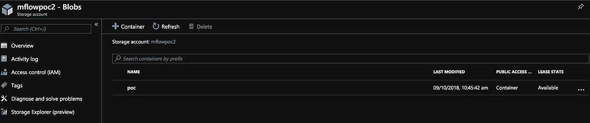

Blob storage account Azure

一旦它被创建，你将需要写下 wasb 链接，因为你将需要这个值来启动 docker。url 通常定义如下:“wabss://<container>@<storage_account_name>. blob . core . windows . net”</storage_account_name></container>

接下来，我们可以开始构建 docker。因为 mlFlow 需要 python，所以我从 python 图像开始，让我的生活变得简单了一些。基本上，只要确保 Python 在容器中可用，就可以从任何图像开始。对于本例，您只需安装以下两个软件包:

*   mlflow 版本 0.8.0
*   azure 存储 0.36.0

完整的 docker 解决方案只需看看我的 Github 账户:【https://github.com/Ycallaer/mlflowdocker 

接下来你需要构建容器，如果你不知道怎么做，看看自述文件。

一旦您在本地机器上启动了 docker 映像，它应该可以通过以下 url 获得: [http://localhost:5000/](http://localhost:5000/#/)

如果一切顺利，你的主页可能会像这样。

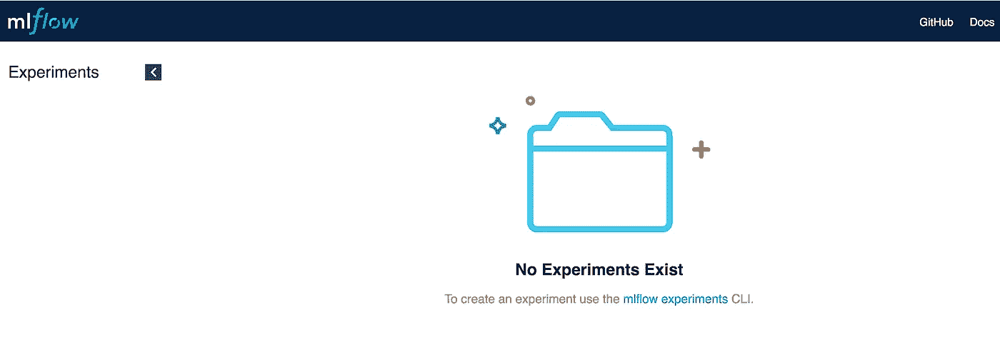

Homepage mlFlow

# 调整模型以使用 mlFlow

一旦服务器部分准备好了，是时候修改我们的代码了。我创建了一个小的 ARIMA 模型实现来展示这个框架。

在开始之前，我们需要定义运行服务器的 URL。您可以通过调用方法“set_tracking_uri”来实现这一点。这已经为这个演示进行了硬编码，但理想情况下，这将指向一个公共端点。

接下来，我们需要创建一个实验。这应该是一个唯一的标识符。确保它唯一的一种方法是在每次调用实验方法时生成一个 uuid。在我的例子中，我硬编码它以加速演示。

通过调用“start_run()”方法，我们告诉 mlFlow 这是运行的起点，这将为您的运行设置开始日期。不要忘记将实验 id 传递给方法，这样所有的日志记录都保留在实验中。

省略实验 id 将导致所有日志被写入默认实验。

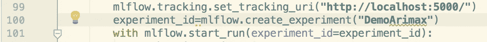

Start point mlFlow Tracking

接下来，我们需要指定在运行过程中要监控的值。一方面，您有“log_param()”，它为字符串值记录一个键值对。另一方面，我们有“log_metric()”，它只允许您将值定义为整数。

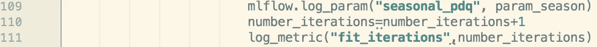

Example of log_param and log_metric

# 视觉效果

现在让我们回到 UI，看看我们运行的视觉结果是什么。在主页上，你会发现你的实验列在左侧。

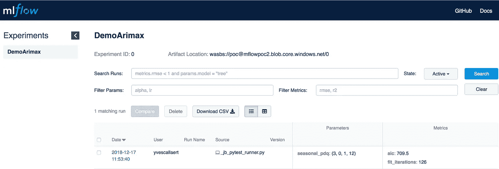

Homepage with experiment

如果你点击日期，你会看到那次跑步的概况。

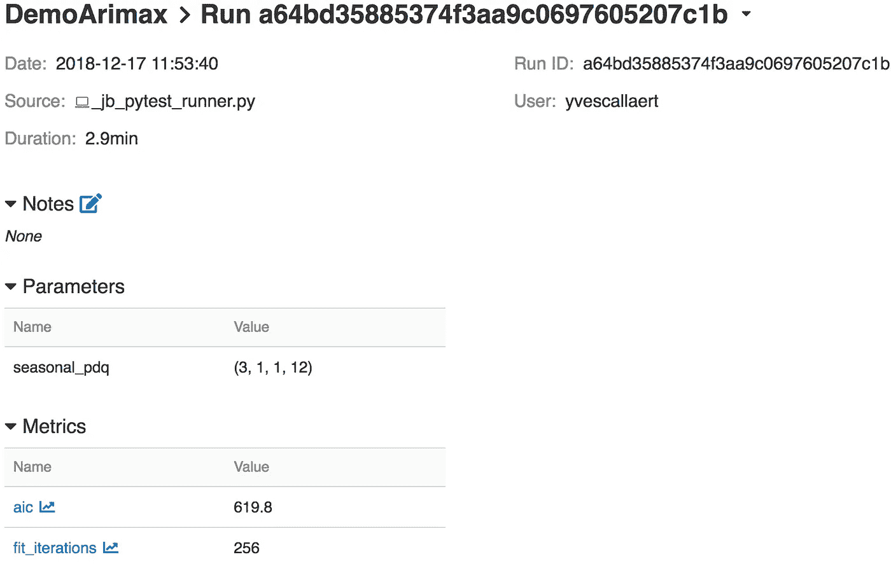

Detailed info of an experiment

在指标旁边，您会看到一个图形符号，如果您单击它，您可以看到在运行过程中该指标是如何变化的。

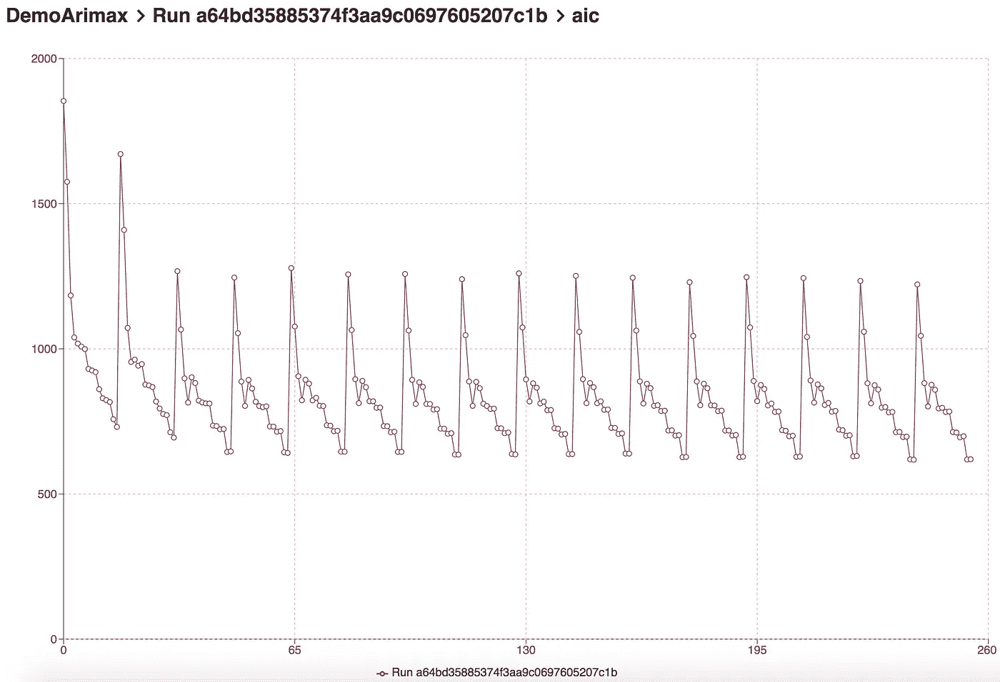

Detailed graph of a metric

# 保存模型

我们还希望能够使用框架保存模型。该框架允许您以与大多数流行框架兼容的格式加载和保存模型(例如:Scikit、Pytorch、Tensorflow 等)。完整的名单请看这里的。

将模型保存为工件的代码相当简单:

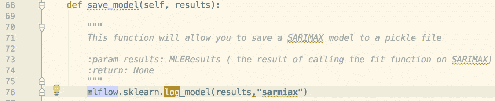

Example of log_model call in mlFlow

拟合的结果将作为第一个参数传递给函数，第二部分是目录。如果您导航到 UI 并单击 run，您将在页面底部找到工件信息。

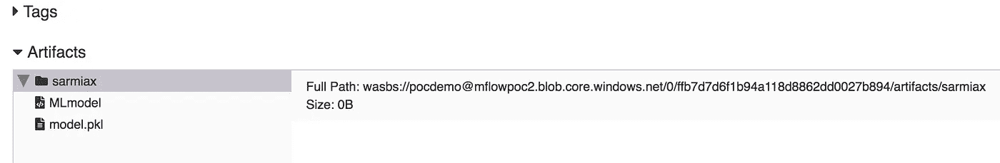

Model saved on Azure from mlFlow

如果你是偏执狂类型的，你现在可以看看 blob 存储帐户，以验证模型确实被保存了。

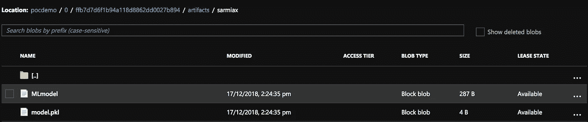

Model on blob store

不错吧？如果你愿意，你可以看看加载特性，然后开始围绕这个模型构建应用程序。

用于该演示的完整回购可以在 [Github](https://github.com/Ycallaer/ArimaMlfowExample) 上找到。

# 问题

我发现这个框架更大的问题是，所有的日志都只存储在 docker 容器中，即使你已经定义了一个存储后端。这意味着，如果您重新启动容器，您的所有记录都将丢失。我记录了一个问题([https://github.com/mlflow/mlflow/issues/613](https://github.com/mlflow/mlflow/issues/613))，得到的回应是当前团队正在重新设计日志功能。所以祈祷吧。