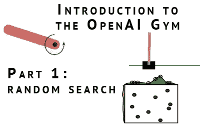
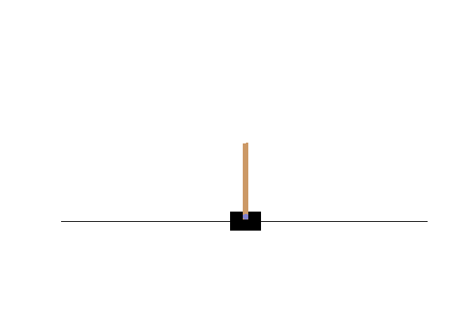
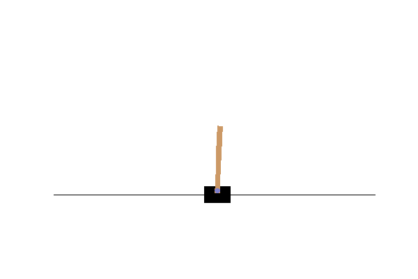

# OpenAI 健身房入门

> 原文：<https://towardsdatascience.com/getting-started-with-openai-gym-932c7311d26c?source=collection_archive---------7----------------------->



OpenAI 健身房环境是了解更多机器学习的最有趣的方式之一。特别是强化学习和神经网络可以完美地应用到基准和雅达利游戏集合中。每个环境都有多种特色解决方案，并且您经常可以找到关于如何获得相同分数的文章。通过观察别人的方法和想法，你可以以一种有趣的方式快速提高自己。我注意到开始健身有点困难。虽然网上有很多算法教程，但第一步是理解你正在工作的编程环境。为了让新人更容易适应这个环境，我决定用 docker 容器和 jupyter 笔记本制作一个小教程。


## 你需要什么

开始之前，[安装 Docker](https://docs.docker.com/engine/installation/#supported-platforms) 。Docker 是一个让你在电脑上运行虚拟机的工具。我创建了一个“图像”,其中包含了几个你想要的东西:tensorflow、健身房环境、numpy、opencv 和一些其他有用的工具。

安装 docker 后，运行以下命令下载我准备好的 Docker 映像:

```
docker run -p 8888:8888 rmeertens/tensorflowgym
```

在浏览器中，导航到:localhost:8888，并打开 TRADR 文件夹中的 OpenAI Universe 笔记本。

## 自己玩个游戏

让我们从自己玩翻筋斗游戏开始。你控制一个上面有杆子的酒吧。“游戏”的目标是尽可能长时间地保持横杠直立。在这个游戏中，你可以做两个动作:向左用力，或者向右用力。要手动玩这个游戏，请执行代码的第一部分。

通过左右点击你施加一个力，你会看到新的状态。请注意，我将游戏编程为当您“丢失”游戏时自动重置。

```
%matplotlib notebook
import numpy as np
import matplotlib.pyplot as plt

from ipywidgets import widgets
from IPython.display import display

import gym

from matplotlib import animation
from JSAnimation.IPython_display import display_animation

def leftclicked(something):
    """ Apply a force to the left of the cart"""
    onclick(0)

def rightclicked(something):
    """ Apply a force to the right of the cart"""
    onclick(1)

def display_buttons():
    """ Display the buttons you can use to apply a force to the cart """
    left = widgets.Button(description="<")
    right = widgets.Button(description=">")
    display(left, right)

    left.on_click(leftclicked)
    right.on_click(rightclicked)

# Create the environment and display the initial state
env = gym.make('CartPole-v0')
observation = env.reset()
firstframe = env.render(mode = 'rgb_array')
fig,ax = plt.subplots()
im = ax.imshow(firstframe) 

# Show the buttons to control the cart
display_buttons()

# Function that defines what happens when you click one of the buttons
frames = []
def onclick(action):
    global frames
    observation, reward, done, info = env.step(action)
    frame = env.render(mode = 'rgb_array')
    im.set_data(frame)
    frames.append(frame)
    if done:
        env.reset()
```



## 重播

既然你已经玩过了，你可能想看重播。我们保存了游戏的每一次按钮点击状态，你可以在你的浏览器中显示出来:

```
def display_frames_as_gif(frames, filename_gif = None):
    """
    Displays a list of frames as a gif, with controls
    """
    plt.figure(figsize=(frames[0].shape[1] / 72.0, frames[0].shape[0] / 72.0), dpi = 72)
    patch = plt.imshow(frames[0])
    plt.axis('off')

    def animate(i):
        patch.set_data(frames[i])

    anim = animation.FuncAnimation(plt.gcf(), animate, frames = len(frames), interval=50)
    if filename_gif: 
        anim.save(filename_gif, writer = 'imagemagick', fps=20)
    display(display_animation(anim, default_mode='loop'))

display_frames_as_gif(frames, filename_gif="manualplay.gif")
```

## 表现

在 [OpenAI 网站](https://gym.openai.com/envs/CartPole-v0)上描述了弹球环境。观察参数中的值显示位置(x)、速度(x_dot)、角度(theta)和角速度(theta_dot)。如果杆的角度超过 15 度，或者手推车从中心移动超过 2.4 个单位，游戏“结束”。然后可以通过调用 env.reset()来重置环境。

## 开始学习

如果没有简单的“学习”机制，这篇博文将是不完整的。凯文·弗朗斯写了一篇关于简单算法的博文，你可以应用在这个问题上:【http://kvfrans.com/simple-algoritms-for-solving-cartpole/[。](http://kvfrans.com/simple-algoritms-for-solving-cartpole/)

实现起来最简单的就是他的随机搜索算法。通过将参数与观察参数相乘，推车决定向左或向右施力。现在的问题是:什么是最好的参数？随机搜索随机定义它们，查看购物车在这些参数下可以持续多长时间，并记住找到的最佳参数。

```
def run_episode(env, parameters):  
    """Runs the env for a certain amount of steps with the given parameters. Returns the reward obtained"""
    observation = env.reset()
    totalreward = 0
    for _ in xrange(200):
        action = 0 if np.matmul(parameters,observation) < 0 else 1
        observation, reward, done, info = env.step(action)
        totalreward += reward
        if done:
            break
    return totalreward

# Random search: try random parameters between -1 and 1, see how long the game lasts with those parameters
bestparams = None  
bestreward = 0  
for _ in xrange(10000):  
    parameters = np.random.rand(4) * 2 - 1
    reward = run_episode(env,parameters)
    if reward > bestreward:
        bestreward = reward
        bestparams = parameters
        # considered solved if the agent lasts 200 timesteps
        if reward == 200:
            break

def show_episode(env, parameters):  
    """ Records the frames of the environment obtained using the given parameters... Returns RGB frames"""
    observation = env.reset()
    firstframe = env.render(mode = 'rgb_array')
    frames = [firstframe]

    for _ in xrange(200):
        action = 0 if np.matmul(parameters,observation) < 0 else 1
        observation, reward, done, info = env.step(action)
        frame = env.render(mode = 'rgb_array')
        frames.append(frame)
        if done:
            break
    return frames

frames = show_episode(env, bestparams)
display_frames_as_gif(frames, filename_gif="bestresultrandom.gif")
```



## 练习以了解更多关于 OpenAI 健身房的信息

接下来就是自己玩自己学了。以下是一些建议:

*   继续凯文·弗兰斯的教程:[http://kvfrans.com/simple-algoritms-for-solving-cartpole/](http://kvfrans.com/simple-algoritms-for-solving-cartpole/)
*   上传并分享您的结果。比较随机算法的效果，或者你自己实现的算法与其他人相比的效果。如何做到这一点可以在这个页面找到:【https://gym.openai.com/docs#recording-and-uploading-results】T2 标题下的“记录和上传结果”
*   看看其他环境:【https://gym.openai.com/envs】T4。如果你能解决 cartpole 环境，你当然也能解决钟摆问题(注意，你必须调整你的算法，因为这个只有 3 个变量在观察中)。

## 结论

恭喜你！你在开放的健身房里制作了你的第一个自动平衡杆。既然这样做了，是时候要么改进你的算法，要么开始尝试不同的环境了。这个 Jupyter 笔记本跳过了很多关于你实际在做什么的基础知识，在 [OpenAI 网站](https://gym.openai.com/docs)上有一篇关于这个的很棒的文章。

## 下一步

除非你决定把自己的算法作为练习，否则你不会在本教程中做很多机器学习(我不认为寻找随机参数是“学习”)。请看看:

*   [第二部分:哪里会看深度 q 网络:预测每个动作的回报的神经网络。](http://www.pinchofintelligence.com/introduction-openai-gym-part-2-building-deep-q-network/)
*   [第 3 部分:我们将使用深度 q 网络，以雅达利游戏的图片作为输入](http://www.pinchofintelligence.com/openai-gym-part-3-playing-space-invaders-deep-reinforcement-learning/)

## 感谢

这篇博客是我的 TRADR summerschool 关于在强化学习算法中使用人类输入的研讨会的第一部分。更多信息可以在他们的主页上找到。