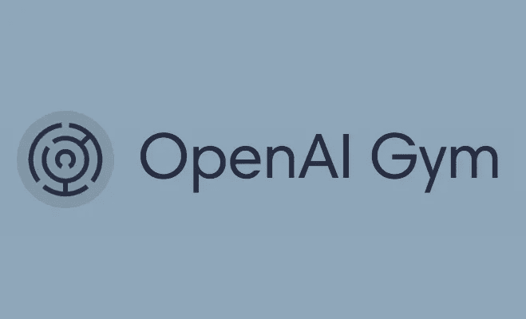

# OpenAI 健身房入门

> 原文：<https://towardsdatascience.com/getting-started-with-openai-gym-d2ac911f5cbc?source=collection_archive---------2----------------------->

OpenAI gym 是一个开发和测试学习代理的环境。它是集中的，最适合强化学习代理，但不限制人们尝试其他方法，如硬编码游戏求解器/其他深度学习方法。

# **我为什么要使用 OpenAI 健身房环境？**

1.  你想学习强化学习算法——有各种各样的环境供你使用和尝试不同的强化学习算法。
2.  你对学习代理有一个新的想法，并想测试一下——这个环境最适合在模拟中尝试新的算法，并与现有的算法进行比较。
3.  想要在我们不想在现实中建模的情况下训练代理-深度学习需要大量的正面和负面的训练示例，并且很难提供这样的示例，例如训练自动驾驶汽车了解事故，自动驾驶汽车知道事故会发生什么以及如何发生是很重要的，并且在现实世界中建模既昂贵又有风险。模拟可以帮助我们。
4.  将学习-做活动的速度提高 10 倍，在模拟中更好还是在现实生活中更好？当然是模拟，在这里我们的代理可以学得更快。

# **设置**

开放式健身房很容易设置

**要求**

1.  Python 3.5+-我还没试过用 Python 2.7 安装。请随时尝试，并让我知道你所面临的问题。
2.  无论是从源代码安装还是直接安装，都需要 pip- pip。

**安装**

1.  使用 pip 安装

> pip 安装健身房

2.从源安装

> git 克隆[https://github.com/openai/gym](https://github.com/openai/gym)&&CD 馆
> 
> pip 安装-e。

# **示例**

首先，进口健身房

> 进口健身房

创造试验环境

> env = gym.make('MountainCar-v0 ')

等等，这是什么环境？健身房就是在这种环境下的这种互动。

有大量的环境供我们玩——到目前为止，有 797 个环境。使用下面的代码片段找出所有

# **随机代理**

请在此处找到源代码

在上述示例中，我们使用了以下环境 APIs

1.  **action_space:** 该状态下的一组有效动作
2.  **步骤:**采取指定的行动并返回从环境中收集的更新信息，如**观察**、**奖励**、是否达到**目标**以及对调试有用的其他**信息**。

**观察**针对环境；例如，在*山地车*中，它将返回速度，速度是建立动量以实现目标所需要的。在某些情况下，它将是原始像素数据。

**奖励**是上一次行动获得的金额。默认情况下，目标是报酬最大化(当然！)

**搞定**这个真的很有用。这告诉我们什么时候完成，代理人什么时候达到目标。

当出错时，它会发出有用的调试信息，你必须弄清楚代理到底在做什么。

现在，我们的上述随机代理只是为了实现目标一次。在训练其他深度学习算法时，添加外部循环，就像历元数一样。在这里，人们把时代称为插曲。

# **基本模板**

> 持续 n 次
> 而目标未实现
> take _ action()
> take _ step()
> 结束而
> 结束

# **阅读更多并参考**

*   更多环境:[https://gym.openai.com/envs/](https://gym.openai.com/envs/#classic_control)
*   【https://gym.openai.com/docs/】