# OpenCV 入门:在 Windows +图像混合上安装 OpenCV

> 原文：<https://towardsdatascience.com/getting-started-with-opencv-installing-opencv-on-windows-using-anaconda-6d88d02f141f?source=collection_archive---------14----------------------->

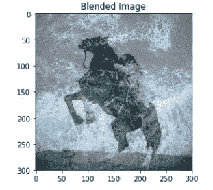

Source: Author-generated.

这个简短的教程包括以下说明:

*   为 Windows 安装 Anaconda
*   安装 Jupyter 笔记本、OpenCV 和其他软件包
*   使用 OpenCV 实现图像混合

# 1.下载和设置 Anaconda

Anaconda 发行版的主要好处是它使得软件包的安装和维护变得方便快捷；此外，它还包含了 150 多个自动安装的软件包。

在继续学习本教程之前，请确保您的系统具备以下条件，以便确认可以安装 Anaconda 发行版:Windows、macOS 或 Linux x86 或 POWER8，32 位或 64 位，3GB HD 可用。

导航到 https://www.anaconda.com/download/的[，点击 Windows 选项，下载 Windows 的 **Python 3.6** 版本。如果您有 64 位计算机，请单击 64 位图形安装程序(631 MB)；如果您有 32 位计算机，请单击 32 位图形安装程序。](https://www.anaconda.com/download/)

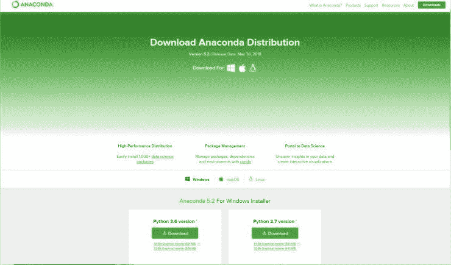

Source: Screenshot from [https://www.anaconda.com/download/](https://www.anaconda.com/download/)

打开。然后在“欢迎使用 Anaconda3”GUI 上单击 Next 继续安装。同意许可协议，选择您的首选安装类型(推荐“仅我”选项)，并选择您的目标文件夹。我建议使用“C:\Users\User_Name\Anaconda3”目录路径，因为它使其他包/库更容易访问 Anaconda，也更容易被 Anaconda 访问。因此，在“高级选项”页面上，将 Anaconda 注册为您的默认 Python 3.6 这一步假设您之前没有在系统上安装 Python。现在，您将能够在您的系统上安装 Anaconda。

# 2.安装所需的软件包(包括 Jupyter 笔记本和 OpenCV)

安装 Anaconda 之后，在您的系统上搜索并打开 Anaconda 提示符。

您需要创建一个环境，在这个环境中您可以安装必要的包并使用 OpenCV。您可以通过在 Anaconda 提示符下输入以下命令来实现这一点；您可以用自己选择的环境名替换 *env* :

`conda create -n env pip python=3.6`

在这一步之后，Anaconda 提示符将显示一组需要下载、解压缩和安装的包；要继续安装，请按键盘上的 *y* 键。

然后，您需要通过键入以下内容来激活环境:

`conda activate env`

**每次您想要使用为本教程安装的包，包括 Jupyter Notebook 和 OpenCV，您都需要使用上面的命令激活环境。**

在本教程中，我将使用 Jupyter Notebook，这是一个开源的 web 应用程序，它允许用户创建包含实时代码和可视化效果的文档，还有许多其他好处。如果您愿意，也可以使用 Spyder IDE 或您选择的 IDE 来运行本教程的代码。

您需要使用以下命令安装 Jupyter Notebook:

`pip install jupyter notebook`

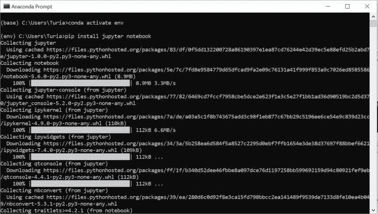

Source: Author

您还需要使用以下命令安装 matplotlib(这是一个常用的 Python 绘图库):

`pip install matplotlib`

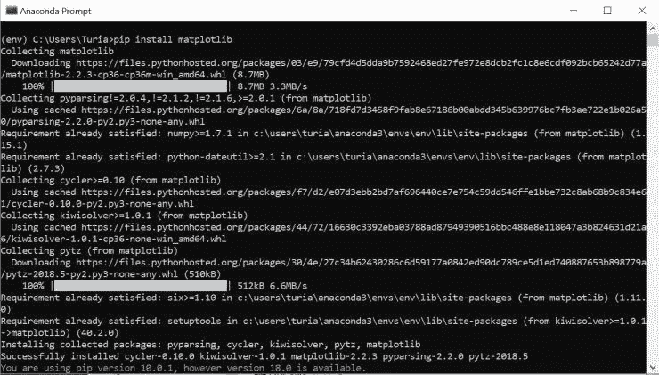

Source: Author

现在，让我们安装 OpenCV，它代表开源计算机视觉库；该库的目的是支持实时计算机视觉应用。我们可以使用以下命令来执行安装:

`pip install opencv-python`

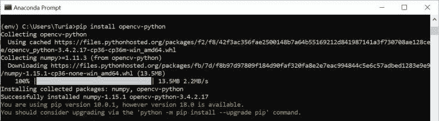

Here, I’m installing the OpenCV library release 3.4.2.17\. Source: Author

请注意，如果您希望能够通过 OpenCV 操作/使用 JPEGs(专门用于图像混合任务)，您将需要安装 Pillow 库，它使我们能够通过使用以下命令打开、操作和保存许多不同的图像文件格式:

`pip install pillow`

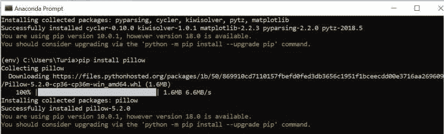

Source: Author

# 初步测试:熟悉 Jupyter 笔记本电脑

您可以在默认的 web 浏览器中打开 Jupyter Notebook，方法是在 Anaconda 提示符下输入以下命令:

`jupyter notebook`

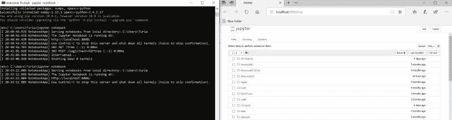

Source: Author

在您的笔记本仪表盘(打开笔记本的 web 浏览器)中，单击“新建”按钮并选择一个 Python 3 笔记本。注意:如果你想看到完整的代码和结果，你可以访问这个链接:[https://github . com/riacheruvu/DemystifyMLCode/blob/master/OpenCV _ Example/OpenCV _ Example . ipynb](https://github.com/riacheruvu/DemystifyMLCode/blob/master/OpenCV_Example/OpenCV_Example.ipynb)。您还可以下载位于[https://github.com/riacheruvu/DemystifyMLCode](https://github.com/riacheruvu/DemystifyMLCode)的这个博客的主存储库的 zip 文件，提取 zip 文件的内容，导航到 OpenCV_Example 文件夹，然后上传。ipynb 文件和图像到 Jupyter 笔记本上，以便跟踪和运行代码。

如果您使用的是新的 Python 3 笔记本:您可以通过在笔记本中的一个“代码单元”或空框中输入`print("Hello, world")`或`5+5`来测试安装是否正常进行，然后单击 Run 按钮。如果你以前用 Python 编程过，你会注意到你可以得到一个等式的输出，比如 5+5，而不需要使用 print()语句。如果你想了解更多，请看 Jupyter 笔记本文档([https://jupyter-notebook.readthedocs.io/en/stable/](https://jupyter-notebook.readthedocs.io/en/stable/))。

为了快速测试是否安装了 *numpy* 包，在其中一个单元格中键入以下内容，以创建一个 numpy 数组，将其分配给一个变量，并打印变量的类型:

```
import numpy as npa = np.array([0, 1, 2])print(type(a))
```

`a`的类型应该是<class‘numpy . ndarray’>。

# OpenCV 入门:混合图像

为了开始并测试 OpenCV 是否已经正确安装，让我们实现图像混合，这涉及到对图像执行算术运算，并允许我们执行时间交叉融合，类似于电影、摄影幻灯片等中流行的特殊效果。

首先我们需要导入所需的包；在 Python 中，注释通过#符号后跟文本来描述。

```
import numpy as npimport cv2%matplotlib inline#Comment: The purpose of the above line is to display matplotlib plots inlineimport matplotlib.pyplot as pltimport matplotlib.image as mpimg
```

如果在这一步出现任何问题，请返回并检查您是否正确安装了软件包。如果你对软件包安装有任何疑问，请在下面的评论中分享。

接下来，从互联网上下载两张您选择的图像(您可以使用。JPG 或者。本教程图像的 PNG 文件格式)。对于这个例子，我使用的是以下照片，分别由 [Josiah Weiss](https://unsplash.com/photos/QU-zhliIV8Q) 在 [Unsplash](https://unsplash.com/) 和 [Gül Kurtaran](https://unsplash.com/photos/8W2m4Vhnqls) 在 [Unsplash](https://unsplash.com/) 拍摄。您可以下载。JPG 图片文件在下面提供的链接，或者右键单击这篇文章中的图片，并保存它们。**确保将图片放在与您正在处理的笔记本文件相同的目录中。**


Photo by [Josiah Weiss](https://unsplash.com/photos/QU-zhliIV8Q) on [Unsplash](https://unsplash.com/)

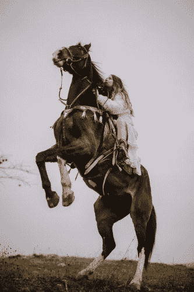

Photo by [Gül Kurtaran](https://unsplash.com/photos/8W2m4Vhnqls) on [Unsplash](https://unsplash.com/)

下载完图片后，下一步就是从文件名中读取图片。对于这一步，我们将使用 matplotlib 的 *image.imread* 函数，该函数将图像从文件读入 Numpy 数组，如该函数的文档中所述(【https://matplotlib.org/api/image_api.html】)。从每个图像输出的阵列需要具有相同的大小/尺寸；否则，我们将收到一条错误消息，指出:

```
error: OpenCV(3.4.2) C:\projects\opencv-python\opencv\modules\core\src\arithm.cpp:659: error: (-209:Sizes of input arguments do not match) The operation is neither 'array op array' (where arrays have the same size and the same number of channels), nor 'array op scalar', nor 'scalar op array' in function 'cv::arithm_op'
```

我们可以通过使用 cv2.resize 命令将两个图像的高度和宽度调整为(300，300)来避免这个错误；如果您愿意尝试，可以更改高度和宽度的值。接下来，使用 matplotlib，我们可以绘制图像，给它一个标题，并在笔记本中显示它。

```
img_water = mpimg.imread(‘photo.jpg’)resized = cv2.resize(img_water, (300, 300))plt.imshow(resized)plt.title(‘Image’)plt.show()
```

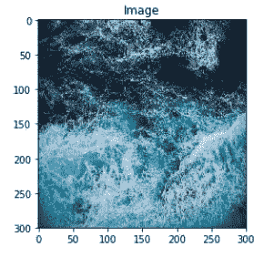

```
img_horse = mpimg.imread(‘photo2.jpg’)resized2 = cv2.resize(img_horse, (300, 300))plt.imshow(resized2)plt.title(‘Image’)plt.show()
```

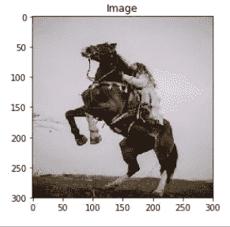

OpenCV 让我们能够使用 cv2.addWeighted 函数轻松地混合这些图像(类似于图像相加)，该函数对图像应用以下等式，如 OpenCV 3.0.0-dev 文档中的[“图像算术运算”一文所述:](https://docs.opencv.org/3.0-beta/doc/py_tutorials/py_core/py_image_arithmetics/py_image_arithmetics.html)

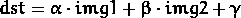

在 cv2.addWeighted 函数的下一行代码中，每个图像名称后面的数字是权重(在上面的等式中定义)，它可以在 0 到 1 之间变化，以混合图像并使它们更透明/不透明。例如，下面我对水的图像使用了 0.5 的权重，对骑马的女人的图像使用了 0.6 的权重。作为一个快速练习，尝试用 addWeighted 代码行的权重来观察交叉叠化的变化。代码行末尾的附加 0 表示 gamma 或，出于本教程的目的，我们将把它设置为零。

```
blend = cv2.addWeighted(resized,0.5,resized2,0.6,0)plt.imshow(blend)plt.title(‘Blended Image’)plt.show()
```

显示混合图像会产生以下令人惊叹的结果:

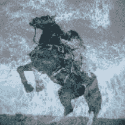

本教程到此结束；感谢您的阅读！如果你有任何反馈或问题，请在下面的评论中分享。

*原载于 2018 年 8 月 30 日*[*demystifymachinelearning.wordpress.com*](https://demystifymachinelearning.wordpress.com/2018/08/30/installing-opencv-on-windows-using-anaconda/)*。*