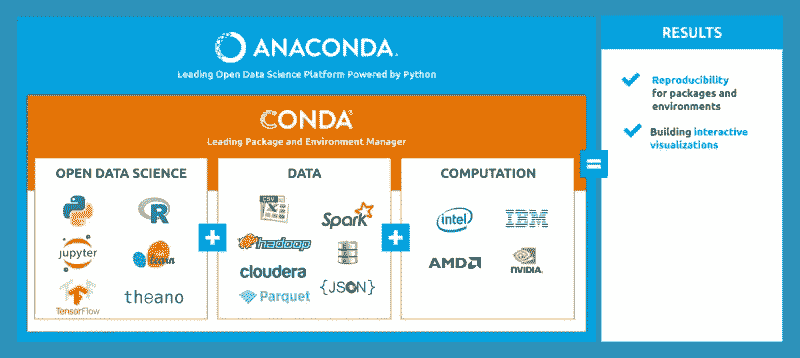

# Python 环境入门(使用 Conda)

> 原文：<https://towardsdatascience.com/getting-started-with-python-environments-using-conda-32e9f2779307?source=collection_archive---------0----------------------->


无论你想要一个还是不知道它是什么，你最终都必须用 Python 来处理
环境。如果你像我一样是 Python 的新手
或者是为任何编程语言设置工作空间的新手，那么你可能已经第一次经历了设置环境的痛苦。

我不知道自己在做什么，也不知道为什么有必要这么做，许多不同的在线指南可能没有完全相同的说明，还有许多帮助解决特定情况的堆栈溢出帖子，我发现很难理解到底什么是环境，什么时候需要它们，以及如何设置自己的环境。本指南旨在帮助建立对环境的直觉，并提供一些处理环境的例子，特别是使用 **Anaconda** 的包管理器 **conda** 。

# 你的代码是你的环境的产物



**Python** 和很多其他编程语言一样，有不同的版本。有时，当我们创建软件时，软件需要在特定版本的语言上运行，因为我们的软件期望在旧版本中出现某种行为，但在新版本中会发生变化。同样，出于类似的原因，我们可能需要使用特定版本的库。但是我们的电脑上可能有很多项目，可能是一个运行在 0.11 版本上的 **Flask** 应用(你做的第一个！)和 **Python 2.7** 甚至更现代的 **Flask** app，运行在版本 0.12 和 **Python 3.4** 上。如果我尝试在 **Python 2** 或 **Python 3** 上同时运行两个，其中一个可能会中断，因为在 **Python 2** 上运行的一些代码在 **Python 3** 上不能运行，反之亦然。这就是虚拟环境变得有用的地方。

虚拟环境将这些依赖关系保存在单独的“沙箱”中，因此您可以在两个应用程序之间轻松切换，并让它们运行。对于那些更熟悉编程的人来说，虚拟环境类似于 Docker 容器。此外，其他语言的包管理器，比如 JavaScript 的 **NPM** ( **节点包管理器**)，会帮你处理大部分细节，但是你必须亲自动手处理 **Python** 的环境。

# 创建你玩的沙盒


创建环境有多种方式，包括使用 virtualenv、venv(内置于 Python 3 标准库中)和 conda，
与 **Anaconda** 关联的包管理器。关于你为什么应该选择 conda 而不是 **virtualenv** 有一些争论，正如这篇博客文章中的神话#5 所概述的，但我将在本指南中重点关注如何使用 **conda** ，因为它是数据科学的一个流行工具，这也是我现在关注的重点。
本指南假设您已经安装了 **Anaconda** 或**miniconda**；所有的指令都在 bash 命令行上。
作为参考，我在 **Mac OS X** 的终端上运行我的命令。

要使用 **conda** 快速创建环境，您可以键入以下命令:

```
conda create --name your_env_name python=3.7 -y
```

在这个命令中，‘**python = 3.7**’部分指定了我想要在哪个版本的 python
中设置环境；您可以根据自己的需要更改版本。在你在网上看到的其他片段中，你可能会看到' **-n** '而不是'**-name**'；它们的意思完全一样。' **-y** '标志实际上是告诉命令行对随后出现的所有提示说“是”；这不是绝对必要的，但它确实为您节省了一点麻烦。

```
conda create --name your_env_name python=3.7 scipy=0.15.0 astroid babel
```

命令将有效地一次加载所有的包，这比一次加载一个包要好，因为这会导致依赖冲突。所以你可以手动添加所有你需要的包，但是如果你有很多包，这可能会很乏味；
除此之外，在命令行
上会有大量的输入，手指滑动可能会导致你重新输入命令。更糟糕的是，该命令可能不会保留在您的 shell 历史中，如果您想要在将来重新创建完全相同的环境，即使不困难，也会非常繁琐。

如果出于这些或其他原因，您不想从命令行创建环境，您可以创建一个 **YAML** (YAML 不是标记语言)文件，它的作用就像一个配置文件。你的 **YAML** 文件可能是这样的:

```
name: your_env_name
channels:
 — defaults
dependencies:
 — ca-certificates=2018.03.07=0
prefix: /Users/your_username/anaconda3/envs/your_env_name
```

如果该文件名为' *environment.yml'* ，那么我可以使用下面的命令创建环境:

```
conda env create -f environment.yml
```

“ **-f** 标志代表文件， **YAML** 文件的文件名
应该紧跟在“ **-f** 标志之后。

如果你能很容易地创建一个 **YAML** 文件，并且知道你需要的所有包，那就太好了。但是，如果您有一个想要复制的现有环境，该怎么办呢？也许您希望将应用程序复制到另一台服务器上，并希望有完全相同的设置来保持一致性。如果是这种情况，那么您可以运行下面的命令。

```
conda env export > my_environment.yml
```

大于号“>”表示输出正在将
写入名为“ *my_environment.yml* ”的文件。如果在此命令之前' *my_environment.yml'* 中有任何内容
，它们将被覆盖。

注意，对于 **conda** 你需要一个 **YAML** 文件；如果你决定使用 **virtualenv** ，
一个 txt 文件也能满足这里所做的一切，但是 **conda** 特别需要一个 **YAML** 文件。

# 掌控您的环境


现在您已经创建了一个环境，并假设您正在使用 conda，让我们使用以下命令快速验证它是否存在:

```
conda info --envs
```

该命令应该显示当前环境，可能如下所示:

```
practice /Users/your_username/anaconda3/envs/practice
base /Users/your_username/anaconda3
your_env_name /Users/your_username/anaconda3/envs/your_env_name
```

在确认您创建了环境之后，您现在可以实际使用它了。我们可以通过键入以下命令来实现这一点(假设您的环境在您的基础之下):

```
conda activate your_env_name
```

此时，您的终端提示符应该如下所示:

```
(your_env_name) Your_Machine:your_directory username$
```

如果该命令由于某种原因没有产生类似的输出，
您可以通过键入类似以下命令的内容来指定完整路径:

```
conda activate /Users/your_username/anaconda3/envs/your_env_name
```

如果像我一样，您想知道当您键入单词“activate”时会发生什么，它会运行一个 bash 脚本，该脚本存在于环境的一个子目录中。在我的例子中，脚本的文件路径看起来像这样:

```
/Users/my_username/anaconda3/envs/my_env_name/lib/python3.6/venv/scripts/common/activate
```

要停止使用环境，请键入

```
conda deactivate
```

与 activate 命令类似，deactivate 命令运行 activate bash 脚本中的一个函数。

如果您想要更新环境，请键入:

```
conda env update –f environment.yml –n your_env_name
```

如果您想摆脱整个环境，只需键入:

```
conda remove --name your_env_name --all
```

“ **—所有**”标志用于从环境中移除所有软件包，并且
是彻底清洁环境所必需的。

# 结论

作为一个快速总结，本指南介绍了如何通过在命令行以及从 **YAML** 文件中指定包来创建您的虚拟环境，如何进入和退出虚拟环境，如何更新它，以及如何在您不再需要它时将其删除。

在这一点上，您应该知道足够的信息来独立地配置您认为合适的环境，并且有足够的背景来解释为什么您应该创建一个虚拟环境。虽然本指南没有深入探讨 **virtualenv** 、 **venv** 和 **conda** 虚拟环境之间的区别，但我在下面提供了几个链接让你开始。

请让我知道，如果你有任何问题或建议如何做得更好。

[https://jakevdp . github . io/blog/2016/08/25/conda-myths-and-misconcepts/](https://jakevdp.github.io/blog/2016/08/25/conda-myths-and-misconceptions/)
[https://real python . com/python-virtual-environments-a-primer/](https://realpython.com/python-virtual-environments-a-primer/)
[https://medium . freecodecamp . org/why-you-need-python-environments-and-how-to-management-them-with-conda-85f 155 f 4353 c【中](https://medium.freecodecamp.org/why-you-need-python-environments-and-how-to-manage-them-with-conda-85f155f4353c)