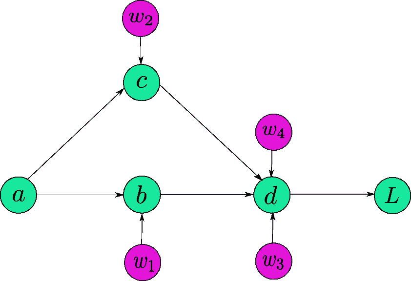
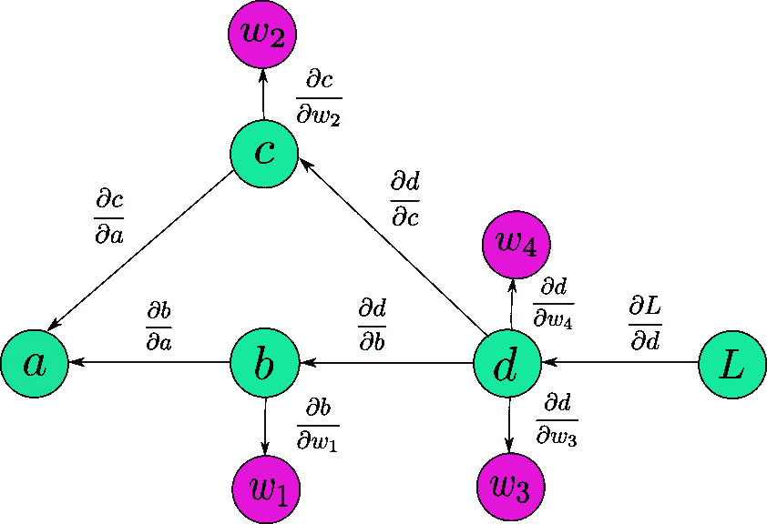
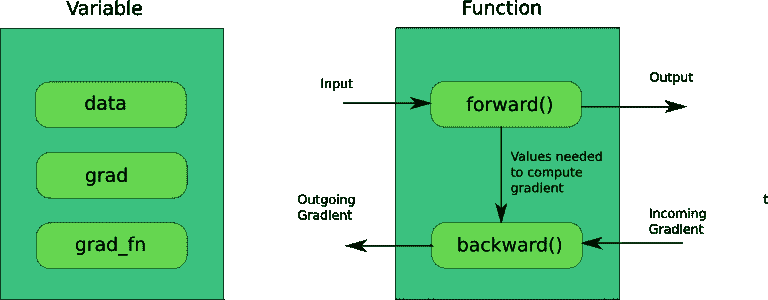
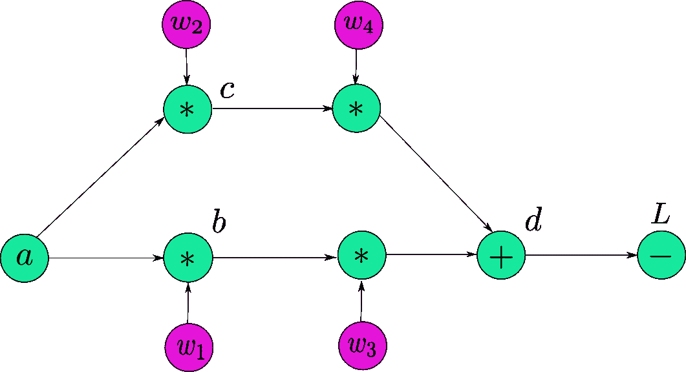
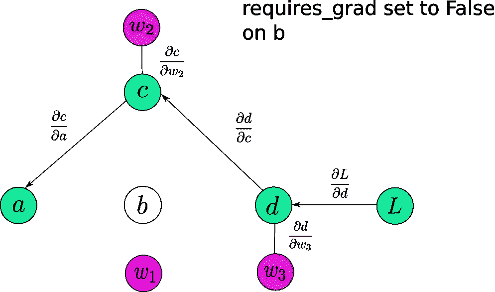
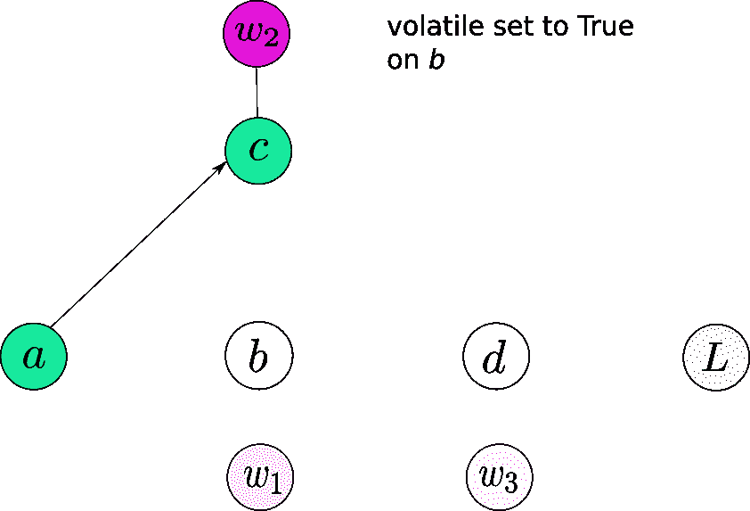

# PyTorch 入门第 1 部分:了解自动微分的工作原理

> 原文：<https://towardsdatascience.com/getting-started-with-pytorch-part-1-understanding-how-automatic-differentiation-works-5008282073ec?source=collection_archive---------1----------------------->

**更新:这个帖子是 2018 年初写回来的。PyTorch 已经走过了漫长的道路，更新版本的帖子可以在**[](https://blog.paperspace.com/pytorch-101-understanding-graphs-and-automatic-differentiation/)****这里找到。****

**当我开始编写神经网络代码时，我最终使用了我周围所有人都在使用的东西。张量流。**

**但是最近，PyTorch 已经成为深度学习框架之王的主要竞争者。真正吸引人的是它的动态计算图范例。如果最后一行对你来说没有意义，也不要担心。在这篇文章的结尾，它会的。但请相信我的话，它使调试神经网络的方式更容易。**

**If you’re wondering why your energy has been low lately, switch to PyTorch!**

# **先决条件**

**在我们开始之前，我必须指出，你至少应该有这样的基本概念:**

*   **与神经网络训练相关的概念，特别是反向传播和梯度下降。**
*   **应用链式法则计算导数。**
*   **Python 中类的工作原理。(或者关于面向对象编程的一般概念)**

**如果你错过了以上任何一个，我在文章的最后提供了链接来指导你。**

**所以，是时候开始使用 PyTorch 了。这是 PyTorch 系列教程的第一篇。**

**这是第 1 部分，我将描述基本的构建模块，以及*亲笔签名的*。**

> ****注意:**需要注意的一点是，本教程是为 PyTorch 0.3 及更低版本制作的。提供的最新版本是 0.4。我决定坚持使用 0.3，因为到目前为止，0.3 是在 Conda 和 pip 渠道中发布的版本。此外，开源中使用的大部分 PyTorch 代码还没有更新到包含 0.4 中提出的一些更改。然而，我会指出，在某些地方，事情在 0.3 和 0.4 不同。**

# **积木#1:张量**

**如果你曾经用 python 做过机器学习，你很可能遇到过 NumPy。我们使用 Numpy 的原因是因为它在做矩阵运算时比 Python 列表快得多。为什么？因为它完成了 c 语言中的大部分繁重工作。**

**但是，在训练深度神经网络的情况下，NumPy 阵列根本不能满足它。我懒得在这里做实际的计算(Google for“FLOPS in a iteration of ResNet to get a idea”)，但是仅使用 NumPy 数组的代码就需要几个月的时间来训练一些最先进的网络。**

**这就是**张量**发挥作用的地方。PyTorch 为我们提供了一种叫做*张量*的数据结构，与 NumPy 的 *ndarray 非常相似。*但与后者不同的是，**张量可以利用 GPU 的资源来显著加快矩阵运算的速度。****

**这是你做张量的方法。**

```
In [1]: import torch In [2]: import numpy as npIn [3]: arr = np.random.randn((3,5))In [4]: arr
Out[4]:array([[-1.00034281, -0.07042071,  0.81870386],
       [-0.86401346, -1.4290267 , -1.12398822],
       [-1.14619856,  0.39963316, -1.11038695],
       [ 0.00215314,  0.68790149, -0.55967659]])In [5]: tens = torch.from_numpy(arr)In [6]: tens
Out[6]:

-1.0003 -0.0704  0.8187
-0.8640 -1.4290 -1.1240
-1.1462  0.3996 -1.1104
0.0022  0.6879 -0.5597
[torch.DoubleTensor of size 4x3]In [7]: another_tensor = torch.LongTensor([[2,4],[5,6]])In [7]: another_tensor
Out[13]:  2  4
 5  6
[torch.LongTensor of size 2x2]In [8]: random_tensor = torch.randn((4,3))In [9]: random_tensor
Out[9]:1.0070 -0.6404  1.2707
-0.7767  0.1075  0.4539
-0.1782 -0.0091 -1.0463
 0.4164 -1.1172 -0.2888
[torch.FloatTensor of size 4x3]
```

# **构建模块#2:计算图**

**现在，我们在商业方面的事情。当训练神经网络时，我们需要计算损失函数相对于每个权重和偏差的梯度，然后使用梯度下降来更新这些权重。**

**随着神经网络达到数十亿个权重，高效地执行上述步骤可以决定训练的可行性。**

## **构建模块#2.1:计算图表**

**计算图是现代深度学习网络工作方式的核心，PyTorch 也不例外。让我们先了解一下它们是什么。**

**假设，你的模型是这样描述的:**

```
*b = w1 * a
c = w2 * a 
d = (w3 * b) + (w4 * c)
L = f(d)*
```

**如果我真的画出计算图，它可能会像这样。**

****

**Computation Graph for our Model**

****现在**，你必须注意到，上图并不完全是 PyTorch 在引擎盖下的图表的准确表示。然而，就目前而言，这足以证明我们的观点。**

**当我们可以顺序执行计算输出所需的操作时，为什么要创建这样的图形呢？**

**想象一下，如果你不仅要计算输出，还要训练网络，会发生什么。你必须计算所有紫色节点标记的权重的梯度。这将需要你找到自己的方式，然后更新权重。**

****计算图是一种简单的数据结构，允许您有效地应用链规则来计算所有参数的梯度。****

****

**Applying the chain rule using computation graphs**

**这里有一些需要注意的事情。首先，图中箭头的方向现在颠倒了。那是因为我们是反向传播，箭头标记的是梯度反向流动。**

**第二，为了这些例子，你可以把我写的渐变想象成*边缘权重*。注意，这些梯度不需要计算链式法则。**

**现在，为了计算任意节点的*梯度，比如 L，相对于任意其他节点，比如 c ( dL / dc)* 我们要做的就是。**

1.  **追踪从 L 到 c 的路径*。这将是*L→d→c****
2.  ***沿着这条路径遍历时，将所有的*边权重*相乘。你最终得到的数量是:(*dL/DD)**(*DD/DC)=(dL/DC)****
3.  ***如果有多条路径，将它们的结果相加。例如，在 *dL/da 的情况下，*我们有两条路径。 *L → d → c → a 和 L→d→b→a*我们将它们的贡献相加得到*L w r t a*的梯度***

****(*dL/DD)**(*DD/DC)**(*DC/da)】*+*[*(*dL/DD)**(*DD/db)**(*db/da)】*****

****原则上，可以从 *L* 开始，开始向后遍历图形，计算沿途每个节点的梯度。****

# ****构建块#3:变量和亲笔签名****

****PyTorch 使用*亲笔签名的*包完成了我们上面描述的任务。****

****现在，关于*亲笔签名的*是如何工作的，基本上有三件重要的事情需要理解。****

## ****构建模块#3.1:变量****

*****变量*，就像*张量*一样，是一个用来保存数据的类。然而，它的不同之处在于它的使用方式。 ***变量*专门用于保存在神经网络训练期间变化的值，即我们网络的可学习参数。**另一方面，张量用于存储不需要学习的值。例如，张量可用于存储每个示例产生的损失值。****

```
**from torch.autograd import Variablevar_ex = Variable(torch.randn((4,3))   #creating a Variable**
```

****一个*变量*类包装了一个张量。你可以通过调用 ***来访问这个张量。数据*变量的**属性。****

*****变量*也存储标量(比如说损耗)相对于它所保存的参数的梯度。这个渐变可以通过调用 ***来访问。grad*** 属性。这基本上是直到这个特定节点计算的梯度，并且每个后续节点的梯度可以通过将*边权重*乘以在它之前的节点计算的梯度来计算。****

****一个*变量*持有的第三个属性是一个 ***grad_fn*** ，一个*函数*对象，它创建了这个变量。****

********

> ******注:** PyTorch 0.4 将变量和张量类合二为一，张量可以通过一个开关做成一个“变量”而不是实例化一个新的对象。但是既然，我们在本教程中做的是 v 0.3，我们就继续吧。****

## ****构建模块#3.2:功能****

****我上面说*功能*了吗？它基本上是一个函数的抽象。接受输入并返回输出的东西。比如我们有两个变量， *a* 和 *b* ，那么如果，****

*****c = a + b*****

****然后 *c* 是一个新变量，它的 *grad_fn* 是一个叫做 *AddBackward* (PyTorch 内置的两个变量相加的函数)*，*这个函数以 *a* 和 *b* 为输入，创建了 *c* 。****

****那么，你可能会问，既然 python 确实提供了定义函数的方法，为什么还需要一个全新的类呢？****

****训练神经网络时，有两个步骤:前向传递和后向传递。通常，如果您使用 python 函数来实现它，您将必须定义两个函数。一个是计算正向传递期间的输出，另一个是计算要传播的梯度。****

****PyTorch 将编写两个独立函数(用于向前传递和向后传递)的需求抽象成一个名为*torch . autograded . function .*的类的两个函数成员****

****PyTorch 结合了*变量*和*函数*来创建一个计算图。****

## ****积木#3.3:亲笔签名****

****现在让我们深入研究 PyTorch 如何创建计算图。首先，我们定义变量。****

****上面几行代码的结果是，****

****现在，让我们分析一下刚刚到底发生了什么。如果您查看源代码，事情是这样的。****

*   ******定义图形的*叶*变量(第 5-9 行)。**我们从定义一堆“变量”开始(正常的，python 语言的用法，不是 pytorch *变量*)。如果您注意到，我们定义的值是我们的计算图中的叶节点。只有我们必须定义它们才有意义，因为这些节点不是任何计算的结果。现在，这些家伙占用了我们 Python 名称空间中的内存。意味着，它们是百分之百真实的。我们**必须**将***requires _ grad****属性设置为 True，否则，这些变量将不会包含在计算图形中，并且不会为它们计算任何梯度(以及依赖于这些特定变量进行梯度流的其他变量)。*****
*   *******创建图表(第 12-15 行)**。到目前为止，我们的记忆中还没有计算图之类的东西。只有叶节点，但是只要您写下第 12–15 行，一个图就会被动态生成**。确定这个细节非常重要。在飞行中。**当你写 *b =w1*a* 时，就是图形创建开始的时候，一直持续到第 15 行。当从输入中计算输出时，这正是我们模型的正向传递。每个变量的*正向*函数可以缓存一些输入值，以便在计算反向传递的梯度时使用。(例如，如果我们的 forward 函数计算出 *W*x* ，那么 *d(W*x)/d(W)* 就是 *x* ，需要缓存的输入)*****
*   ****现在，我告诉你我之前画的图不准确的原因？因为 PyTorch 做图的时候，并不是*变量*对象才是图的节点。它是一个*函数*对象，确切地说，是构成图形节点的每个*变量*的 *grad_fn* 。PyTorch 图应该是这样的。****

********

****Each Function is a node in the PyTorch computation graph.****

*   ****我用名字表示了叶节点，但是它们也有自己的*grad _ fn’*(返回 None 值。这是有意义的，因为您不能反向传播到叶节点之外)。剩下的节点现在被它们的*grad _ fn’*所代替，我们看到单个节点 *d* 被三个函数代替，两个乘法，一个加法，而 loss 被一个*减*函数代替。****
*   ******计算梯度(第 18 行)。**我们现在通过调用*来计算梯度。 *L* 上的 backward()* 功能。这到底是怎么回事？首先，L 处的梯度就是 1 ( *dL / dL* )。**然后，我们调用它的*向后*函数，它的基本工作是计算*函数*对象的输出到*函数*对象的输入的梯度。**这里 L 是 10 — d 的结果，也就是说，逆向函数会将梯度( *dL/dd)* 计算为-1。****
*   ***现在，这个计算的梯度乘以累积的梯度(存储在当前节点对应的*变量*的 *grad* 属性中，在我们的例子中是 *dL/dL = 1* )，然后发送到输入节点，存储在输入节点对应的变量 ***grad* 属性中。**技术上，我们所做的是应用链式法则(*dL/dL*)*(*dL/DD*)=*dL/DD。****
*   ***现在，让我们了解梯度是如何传播给*变量* *d 的。d* 是从它的输入(w3，w4，b，c)计算出来的。在我们的图中，它由 3 个节点、2 个乘法和 1 个加法组成。***
*   ***首先，函数 *AddBackward (* 在我们的图中表示节点 *d* 的加法运算)计算它的输出( *w3*b + w4*c* )相对于它的输入( *w3*b 和 w4*c* )的梯度，这是(两者都是 1)。现在，这些*局部*梯度乘以累积梯度(两者都是 *dL/dd* x *1* = -1)，结果保存在各自输入节点的 *grad* 属性中。***
*   ***然后，函数 *MulBackward (* 代表 *w4*c* 的乘法运算)分别计算其输入输出 w.r.t 到其输入( *w4 和 c)* a *s (c* 和 *w4)* 的梯度。局部梯度乘以累积梯度( *dL/d(w4*c)* = -1)。结果值( *-1* x *c* 和-1 x *w4* )然后分别存储在*变量* *w4* 和 *c* 的 *grad* 属性中。***
*   ***所有节点的梯度以相似的方式计算。***
*   ****L* w.r.t 任何节点的梯度都可以通过调用来访问。 *grad* 在对应于那个节点的变量上，**假设它是一个叶节点** (PyTorch 的默认行为不允许你访问非叶节点的渐变。稍后会有更多相关内容)。现在我们已经得到了梯度，我们可以使用 SGD 或任何你喜欢的优化算法来更新我们的权重。***

```
*w1 = w1 — (learning_rate) * w1.grad    #update the wieghts using GD*
```

***诸如此类。***

# ***亲笔签名的一些俏皮细节***

***所以，我不是告诉过你不能访问非叶子*变量*的 *grad* 属性吗。是啊，这是默认行为。您可以通过调用来重写它。 *retain_grad()* 对*变量*进行定义，然后你就可以访问它的 *grad* 属性。但是说真的，到底发生了什么事。***

## ***动态计算图***

***PyTorch 创建了一个叫做**的动态计算图**，这意味着这个图是动态生成的。**在变量的 *forward* 函数被调用之前，图中不存在*变量的节点(它是 grad_fn)* 。**该图是调用多个*变量*的*前进*功能的结果。只有这样，缓冲区才会分配给图形和中间值(用于以后计算梯度)。当您调用 *backward()* 时，随着梯度的计算，这些缓冲区基本上被释放，图形被破坏。你可以尝试在一个图形上多次向后调用*()，你会看到 PyTorch 会给你一个错误。这是因为图形在第一次调用 *backward()* 时被破坏，因此，第二次调用时没有图形可以向后调用。****

****如果再次调用 *forward* ，会生成一个全新的图形。分配了新的内存。****

******默认情况下，只保存叶节点的渐变( *grad* 属性)，非叶节点的渐变被破坏。**但是这种行为是可以改变的，如上所述。****

****这与 TensorFlow 使用的**静态计算图**形成对比，tensor flow 在运行程序的 之前声明了 ***。动态图范例允许您在运行时对网络架构进行更改，因为只有在运行一段代码时才会创建一个图。这意味着一个图可以在程序的生命周期中被重新定义。然而，这对于静态图形是不可能的，在静态图形中，图形是在运行程序之前创建的，只是在以后执行。动态图也使调试更容易，因为错误的来源很容易追踪。*******

# ****一些贸易技巧****

## ****要求 _grad****

****这是*变量*类的一个属性。默认情况下，它是 False。当你不得不冻结一些层，并阻止他们在训练时更新参数时，这是很方便的。您可以简单地将 *requires_grad* 设置为 False，这些*变量*不会包含在计算图中。因此，没有梯度会传播到它们，或者传播到依赖这些层进行梯度流动的那些层。 *requires_grad* ，**设置为 True 时** **会传染**，意思是即使一个运算的一个操作数 *requires_grad* 设置为 True，结果也会如此。****

********

******b** is not included in the graph. No gradient is backpropagated through ***b*** now. **a** only gets gradients from **c** now. Even if **w1** has requires_grad = True, there is no way it can receive gradients.****

## ****不稳定的****

****这也是一个*变量*类的属性，当变量*被设置为真时，它会导致变量*被排除在计算图之外。这可能看起来与*要求 _grad* 非常相似，因为当设置为真时**也会传染。但是比*要求 _ grad*优先级高。带有 *requires_grad* 等于真且 *volatile* 等于真的变量将不包括在计算图中。******

****你可能会想，当我们可以简单地将 *requires_grad* 设置为 False 时，为什么还需要另一个开关来覆盖 *requires_grad* ？我暂时跑题一下。****

****当我们进行推理时，不创建图形是非常有用的，并且不需要梯度。首先，消除了创建计算图的开销，提高了速度。第二，如果我们创建一个图形，由于没有*向后*被调用，用于缓存值的缓冲区永远不会被释放，这可能会导致内存耗尽。****

****通常，我们在神经网络中有许多层，我们可能在训练时将 *requires_grad* 设置为 True。为了防止在推断时制作图表，我们可以做两件事中的任何一件。设置 r *equires_grad* False 在**所有**层上(也许，152 层？).或者，只在输入端设置 *volatile* 为真，我们保证没有任何结果操作会产生一个图形。你的选择。****

********

****No graph is created for **b or** any node that depends on **b.******

> ******注意:** PyTorch 0.4 没有组合张量/变量类的可变参数。相反，推理代码应该放在 torch.no_grad()上下文管理器中。****

```
**with torch.no_grad():
    -----  your inference code goes here ----**
```

# ****结论****

****所以，那是*给你的签名*。理解*签名*是如何工作的，可以在你被困在某个地方时，或者在你开始时处理错误时，帮你省去很多头痛。感谢阅读到目前为止。我打算在 PyTorch 上写更多的教程，讨论如何使用内置函数快速创建复杂的架构(或者，可能没有这么快，但比一个块一个块地编码要快)。所以，敬请期待！****

# ****进一步阅读****

1.  ****[理解反向传播](http://neuralnetworksanddeeplearning.com/chap2.html)****
2.  ****[理解链式法则](https://www.youtube.com/watch?v=MKWBx78L7Qg)****
3.  ****Python 中的类[第一部分](https://www.hackerearth.com/practice/python/object-oriented-programming/classes-and-objects-i/tutorial/)和[第二部分](https://www.hackerearth.com/practice/python/object-oriented-programming/classes-and-objects-ii-inheritance-and-composition/tutorial/)****
4.  ****[PyTorch 官方教程](http://pytorch.org/tutorials/beginner/deep_learning_60min_blitz.html)****