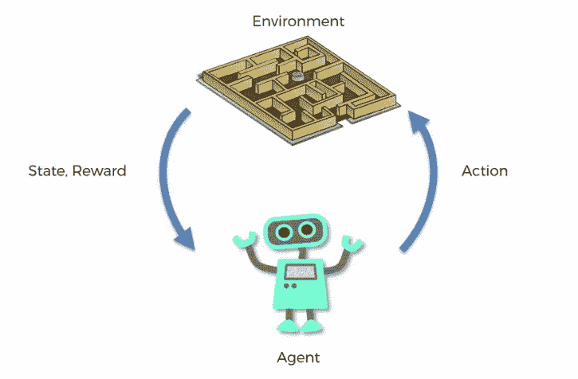
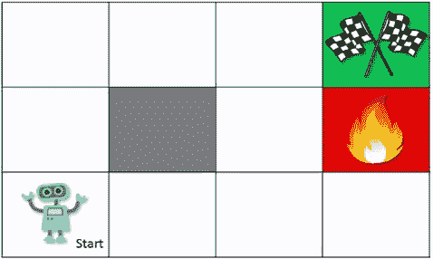
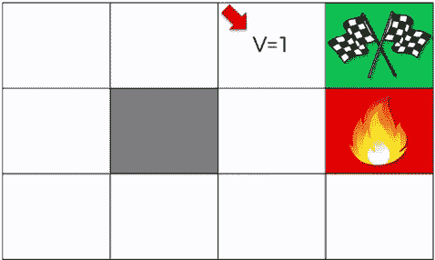
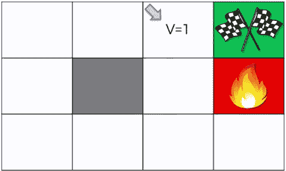
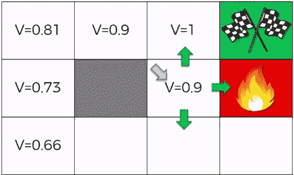
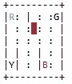

# 强化 Q 学习入门

> 原文：<https://towardsdatascience.com/getting-started-with-reinforcement-q-learning-77499b1766b6?source=collection_archive---------2----------------------->

**简介**

当 DeepMind 的 AlphaGo 击败围棋世界冠军李·塞多尔(Lee Sedol)时，人工智能(AI)真正崛起。人工智能代理的基本构建模块是 Q 学习，所以让我们直接进入它。正如著名作家安德鲁·特拉斯克所说的那样，“我用可以玩的玩具代码学得最好”。所以下面你会发现我们的玩具代码只使用了 Numpy，我们将在本文的其余部分更详细地讨论它。

**什么是强化学习？**

强化学习有一个“环境”和一个“代理”，前者是我们试图解决的问题集，后者是我们的人工智能算法。环境和代理之间的关系非常简单。代理将执行某些动作(像我们的玩具代码中的出租车上、下、右、左等移动)，作为该动作的结果，他的状态将改变(出租车的新位置)，这将导致代理获得奖励(到达其目的地的正奖励，或者如果您错误地搭载或放下乘客，则为负奖励)。通过行动和奖励过程的迭代，代理学习环境。它开始明白在哪个状态下，哪个动作给他最大的奖励，哪个动作给他负的奖励。这个执行一个动作并从奖励中学习的过程叫做强化学习。



**贝尔曼方程**



让我们假设我们的代理在相邻 gif 的“开始”图像所示的环境中开始。最初，它只是做一些随机的运动，比如向右、向左、向上、向下等，最终在某个时候，它会到达目的地。现在只要它到达目的地，它就会得到奖励，比如说+1 分。这触发算法意识到这个地方(绿色方块)是它需要的地方。然后代理开始问问题，我是怎么到这个方块的，我之前是什么状态，我做了什么让我得到奖励。因此，它回顾和回溯其先前的状态，如下图所示



它首先用虚拟奖励“1”标记绿色方块左边的方块，告诉自己他只需要到达前面的方块，然后它需要做的只是向右移动，他就会到达目的地。这个过程继续，直到他回溯他的完整路径。这种路由回溯，代理执行多次迭代。

现在，如果我们永远不重置代理，一切都可以工作了，它会一直保持在 ON 状态，并在内存中记忆他刚才绘制的地图。但是，如果代理重置，并且下次被调用时从不同的状态启动，会发生什么呢？现在他很困惑，不知道该做什么，这就是为什么这种方法没有真正发挥作用。

这就是贝尔曼方程发挥作用的地方。

贝尔曼方程-> **V(s) = max(R (s，a)+γV(s′))**其中 V(s)是任意给定状态下的一个值

s —状态，a —行动，R —奖励，γ —折扣，s' —采取行动‘a’后的下一个状态

贝尔曼方程说的是，一个国家的价值。V(s ),等于通过执行任何允许的动作 R(s，a)你可以从该状态获得的不同奖励的最大值，以及通过采取特定动作“a”你将到达的新状态的“贴现”值。参考下面的 gif 图可以更好的理解上面的公式。



目的地绿色方块左边的方块的值是 1，因为如果我们向右移动，我们可以得到 1 的奖励。回溯，现在不是像前面的情况一样将下一个左边的方块也指定为 1，而是使用伽玛值为 0.9 的贝尔曼方程，并将下一个方块的值指定为 0.9，对于路线的其余部分以此类推。



同样，我们可以原路返回，填满我们的地图。现在我们已经创建了我们的地图，对于我们的代理来说，无论它从哪个位置开始，它应该走哪条路都变得非常明显。

有了对强化学习和贝尔曼方程的清晰理解，让我们来看看我们的玩具代码，看看它是如何实现上述概念的。为了更好的理解，我将逐行解释完整的代码。



**问题陈述**:有 4 个地点(用不同的字母标注)，你的工作是在一个地点接乘客，在另一个地点让他下车。你成功脱手可获得+20 分，每完成一个时间步长将失去 1 分。非法上下车行为还会被扣 10 分。在此环境中，实心正方形代表出租车，(" | ")代表墙壁，蓝色字母代表上车地点，紫色字母代表下车地点。出租车上有乘客时会变绿

**代码走查**

第 1–3 行:导入所需的库

```
#Importing Libararies
import gym
import numpy as np
```

第 5–8 行:设置开放的健身房环境。这只是建立任何健身房环境的标准方式

```
#Environment Setup
env = gym.make("Taxi-v2")
env.reset()
env.render()
```

第 10–17 行:首先，让我们看看我们的代理在随机选择要执行的动作时表现如何。

第 11 行:获取当前状态，即阻塞代理所处的状态。对于此特定环境，该值可以在 0–499 之间。

```
# Random Moments
state = env.reset()
```

第 12 行和第 13 行:初始化计数器和奖励。在这一点上，我会建议你手动玩环境，只是为了感受一下。在你的代码中使用下面两个例子来将代理置于特定的状态，或者使它向你喜欢的方向移动。

```
counter = 0
reward = None# Change state
env.env.s = 114
env.render()# Take an action
env.step(3)
env.render()
```

第 14 行:直到我们得到 20 英镑的奖励，这是我们正确放下乘客的奖励。

```
while reward != 20:
```

第 15 行:env.action_space.sample()是一个 gym 函数，它返回从允许的动作中选择的一个随机动作。我们调用 env.step()来执行这个随机选择的动作。env.step()总是返回新的状态、对前一个动作的奖励、挑战是否完成，以及一些对调试有用的附加信息。我们将所有这些值存储在各自的变量中，仅供参考。

```
state, reward, done, info = env.step(env.action_space.sample())
```

第 16 行:由于我们已经走了一步，我们将计数器加 1

```
counter += 1
```

第 17 行:每当我们最终将乘客送到正确的位置时，我们将退出 while 循环(因为收到的奖励将是 20)。打印计数器值，指示该特定迭代完成任务所用的步骤数。玩几次 while 循环，了解在随机采取行动的情况下完成挑战需要多少步。我们将把这个值与我们通过实现强化学习算法得到的值进行比较。

```
print(counter)
```

第 20 行:我们通过创建一个“可能状态的数量”到“可能动作的数量”维度的矩阵来开始 Q(强化)学习。记住，从我们的学习中，我们需要为每个状态和该状态下允许的每个动作保持一个 Q 值(贝尔曼方程中的 V(s))。正如在解释贝尔曼方程时所说的，最初代理不知道任何 Q 值，所以我们用全零初始化它。

```
Q = np.zeros([env.observation_space.n, env.action_space.n])
```

第 21 行:初始化奖励变量 G(因为变量‘reward’用于存储 env.step()给出的返回值，这里使用其他变量名 G)

```
G = 0
```

第 22 行:使用伽玛值 0.618。这纯粹是实验出来的。你可以试试你的价值观，在这里分享你的结果，只是为了比较。

```
gamma = 0.618
```

第 23 行:对于上千次迭代

```
for episode in range(1,1001):
```

第 24 行:初始化“done”值，我们将使用它在完成任务后退出 while 循环。

```
done = False
```

第 25 行:每次迭代各自的值初始化

```
G, reward, counter = 0,0,0
```

第 26 行:重置环境并获取其状态

```
state = env.reset()
```

第 27 行:虽然我们还没有“完成”

```
while done != True:
```

第 28 行:现在当创建 Q 矩阵时，记住我们已经创建了维度行= '可能状态的数量'和列= '可能动作的数量'。np.argmax(Q[state])从 Q 矩阵的行“state”中挑选出最大值。换句话说，它获取当前状态，在 Q 矩阵中查找，找到该状态的特定行，并返回沿着该行的最大值的索引(这将是“动作”号)

```
action = np.argmax(Q[state])
```

第 29 行:使用上面获得的“动作”来执行一个步骤并存储其结果。

```
state2, reward, done, info = env.step(action)
```

第 30 行:根据贝尔曼方程和上一步得到的结果更新我们的 Q 表。如果你遵循了本教程，你应该能够清楚地将这条线与上一节描述的贝尔曼方程对应起来。

```
Q[state,action] = (reward + gamma * np.max(Q[state2]))
```

第 31–33 行:更新了相应的变量

```
G += reward
counter += 1
state = state2
```

第 35 行:打印迭代，每 50 次迭代的奖励和计数器值。检查这些值，并将其与我们通过随机实现获得的“计数器”值进行比较。还要检查代理如何在初始迭代期间以负回报和高计数器值结束，以及它们如何随着它执行更多迭代而显著改善，从它的动作中学习并根据贝尔曼方程更新 Q 矩阵。

```
if episode % 50 == 0:
        print('Episode {} Total Reward: {} counter: {}'.format(episode,G,counter))
```

这是完整的代码

```
#Importing Libararies
import gym
import numpy as np#Environment Setup
env = gym.make("Taxi-v2")
env.reset()
env.render()# Random Moments
state = env.reset()
counter = 0
reward = None
while reward != 20:
    state, reward, done, info = env.step(env.action_space.sample())
    counter += 1
print(counter)# Q table implementation
Q = np.zeros([env.observation_space.n, env.action_space.n])
G = 0
gamma = 0.618
for episode in range(1,1001):
    done = False
    G, reward, counter = 0,0,0
    state = env.reset()
    while done != True:
            action = np.argmax(Q[state])
            state2, reward, done, info = env.step(action)
            Q[state,action] = (reward + gamma * np.max(Q[state2]))
            G += reward
            counter += 1
            state = state2   
    if episode % 50 == 0:
        print('Episode {} Total Reward: {} counter: {}'.format(episode,G,counter))
```

唷！！就是这样伙计们。深呼吸，祝贺你自己学会了一个 Q 学习人工智能代理的基本概念。高端 Atari 游戏中使用的 AI 代理的概念与本教程中解释的非常相似。不同的是，在这些游戏中，环境的状态数量变得非常多，所以不可能用 Q 矩阵表来实现，因为它的维数非常非常大。所以他们用神经网络来实现同样的功能。遵循 OpenAI 的文档来了解如何安装 openai 健身房环境。

如果你喜欢这篇文章，**在[推特](https://twitter.com/percyjaiswal)上关注、转发**将鼓励我开始我的博客世界之旅。

下次见。干杯！！