# SAS 入门:初学者

> 原文：<https://towardsdatascience.com/getting-started-with-sas-beginner-354a94a48f08?source=collection_archive---------1----------------------->

## 这本快速入门指南是为新的 SAS 用户准备的。我已经包括了 SAS 的基本要素，以帮助您尽快使用 SAS。

# 什么是 SAS？

SAS 是分析统计数据的工具。SAS 是统计分析软件的缩写。SAS 的主要目的是检索、报告和分析统计数据。SAS 环境中的每个语句都以分号结束，否则该语句将给出错误消息。它是一个强大的工具，用于运行 SQL 查询和通过宏自动执行用户的任务。

除此之外，SAS 通过图形提供描述性的可视化，还有各种 SAS 版本提供机器学习、数据挖掘、时间序列等报告。SAS 支持两种类型的语句来运行程序。广义地说，SAS 程序中的语句分为:数据步骤和过程。

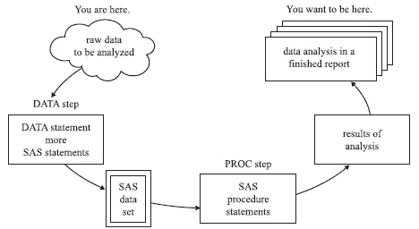

在这篇文章中，我试图解释使用 SAS 的数据分析。为了解释这个问题，我创建了数据汽车，其中包含以美元为单位的价格、汽车的长度、汽车的维修等级(这是一个分类值)、国外价值(显示汽车是国外的还是国内的)、重量以及最终的 mpg(汽车的里程)。

# SAS Essentials 入门:

**数据步:**

数据步骤由所有 SAS 语句组成，以行数据开始，以行数据行结束。它描述和修改你数据。在数据步骤中，您告诉 SAS 如何读取数据以及生成或删除变量和观察值。数据步骤将原始数据转换成 SAS 数据集。SAS 可以互换使用卡和数据线语句。数据导入、报告变量和描述性分析是数据步骤流程的一部分。在数据步骤中有四种常用的语句。

*   数据语句命名数据集
*   输入语句列出了变量的名称
*   CARDS 语句表示数据行紧随其后。
*   INFILE 语句表示数据在一个文件中，以及该文件的名称。

```
data newdata;
input name $ price mpg rep78 wgt len foreign;
datalines;AMC     4099 22  3     2930   186    0
AMC     4749 17  3     3350   173    0 
AMC     3799 22  3     2640   168    0 
Audi    9690 17  5     2830   189    1 
Audi    6295 23  3     2070   174    1 
BMW     9735 25  4     2650   177    1 
Buick   4816 20  3     3250   196    0 
Buick   4453 26  3     2230   170    0 
Buick   5189 20  3     3280   200    0 
Buick  10372 16  3     3880   207    0 
Buick   4082 19  3     3400   200    0 
Cad.   11385 14  3     4330   221    0 
Cad.   14500 14  2     3900   204    0 
Cad.   15906 21  3     4290   204    0 
; run;
```

**解释:在上面的代码中，我们创建了一个新的数据集 newdata，它包含变量 name、price、mpg、rep78(维修等级)、wgt、len 和 foreign。数据集 newdata 的维度包含 14 条记录和 7 个变量。**

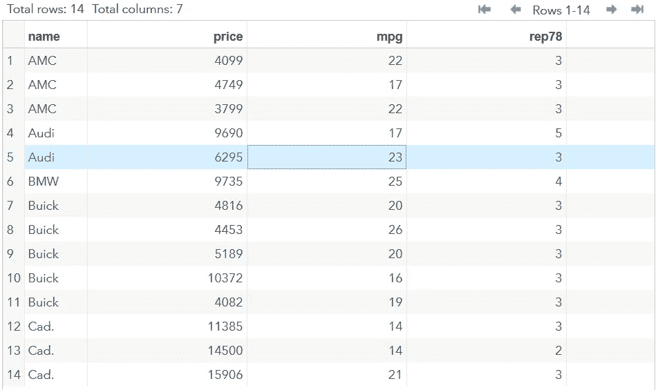

**PROC 步骤:**

PROC 步骤告诉 SAS 对数据执行了什么分析，比如回归、方差分析、均值计算等。每个 PROC 语句都以 PROC 关键字开始。

```
proc print data=newdata(obs=10);
run;
```

上述语句将以如下方式运行并输出数据:

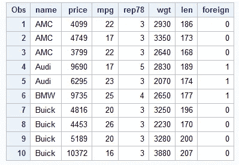

# SAS 编程:

## 1)导入 SAS 数据:

SAS 中的 PROC 导入功能用于从 excel 文件中导入数据集。除了将数据加载到 SAS 环境之外，SAS 还有内置的库，其中存储了数据集以供用户帮助。

*   **临时数据:**数据仅持续到当前 SAS 会话。这意味着当会话结束时，生命周期短的文件也会被删除。

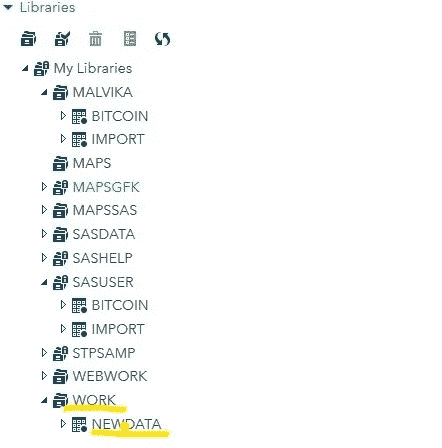

*   **永久数据:**SAS 存储的终身数据，会话结束后不能删除。

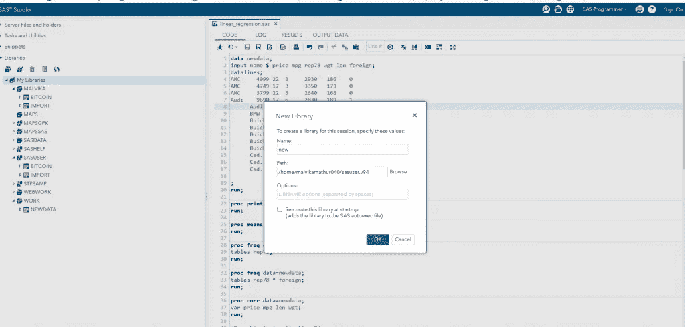

## 2)统计描述性分析:

**缺失值:**

用句号()表示的缺失值函数。)标识数据中缺失记录的数量。在我们的数据集中，没有缺失值。

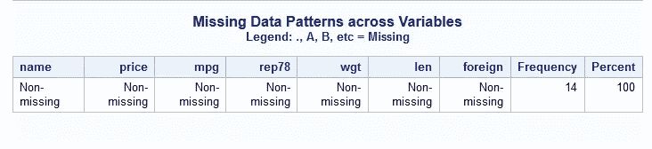

**PROC 意思是:**

SAS 有计算平均值的基本程序。

```
proc means data=newdata;                 
 run;
```

**解释:给定汽车数据的平均价格为$7790.71，其中最低价格为$3799，最高价格为$15906。**

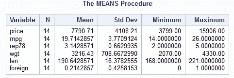

PROC FREQ:

SAS 有一个叫做 **PROC FREQ** 的程序来计算数据集中数据点的频率分布。频率分布是显示数据集中数据点频率的表格。表中的每个条目都有值在特定组或间隔内出现的频率或计数，这样，就可以使用表汇总值的分布。

```
proc freq data=newdata;
tables rep78; 
run;
```

**解释:评级为 3 的列修复评级在数据中频繁出现，这意味着比其余值出现的几率高 78.5%。**

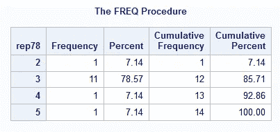

**PROC CORR**

两个变量 x 和 y 之间的关系可以使用 SAS 中的 CORR 函数来计算。相关性取-1 到+1 之间值，值 1 表示非常强的正相关性，而值-1 表示强的负相关性。

**解释:在下面的输出中，汽车的长度和重量显示出 0.864 的正相关性，这意味着如果汽车的长度增加，那么它的重量可能会增加，也就是说，如果我们在这两个变量之间绘制一个图形，那么我们会得到一条直向上的对角线，可以看出-0.74 的值表示 len 和 mpg 之间的负关系。**

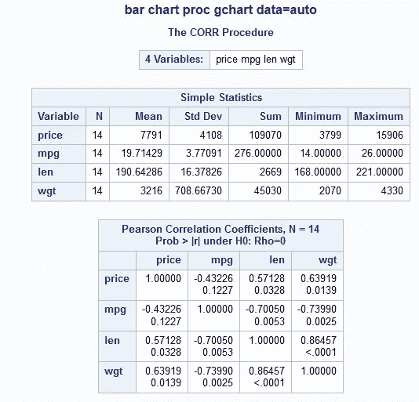

## 3)图表和可视化

SAS 工具具有强大的图形功能，有助于分析和报告数据。

**简单条形图**:

条形图是最常用的表示分类数据的图表之一。在这种情况下，由值 1 表示的外国汽车相对多于国内汽车值 0。

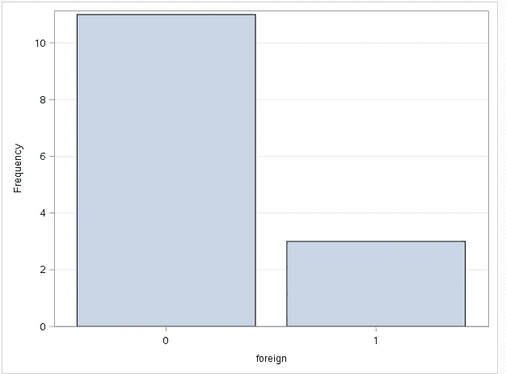

**直方图:**

直方图解释了连续值的分布。长度值稍微向左倾斜，这意味着向左的长尾表明长度数据不是正态分布的。

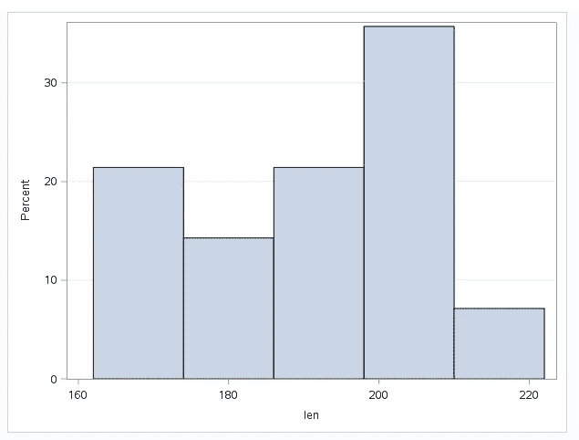

**散点图**:

散点图表示的两个变量之间的关系。两个连续变量之间的图表。在这里，我们可以看到一个强劲的上升趋势，这表明长度和重量之间有很强的相关性。

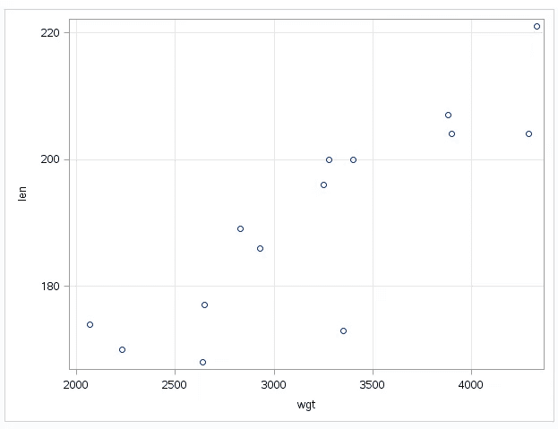

**方框图:**

下图是箱线图的一个特例，其中我们通过分类变量来显示连续变量。如果数据集有异常值(极端值)，盒须图可能不仅显示最小值或最大值。相反，胡须的末端代表四分位数范围(1.5*IQR)，这是计算异常值的一个很好的属性。该变量的平均值为 7790.71，中位数更接近第一个四分位数。价格变量很少有极端值，在建模前需要进一步处理。

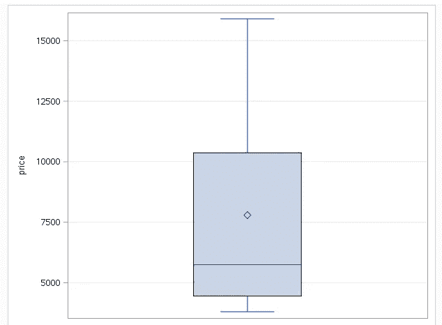

阅读:

[第 1 课:SAS | STAT 480 入门—在线统计](https://onlinecourses.science.psu.edu/stat480/node/7/)

【SAS.pdf 入门