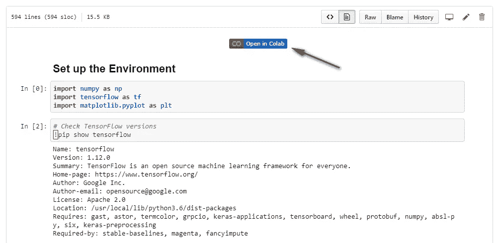
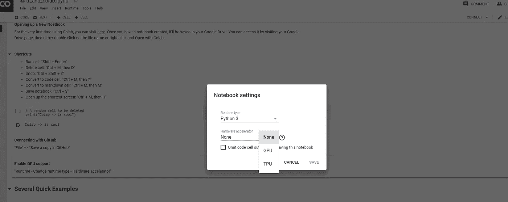
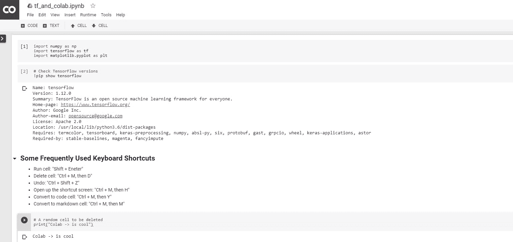
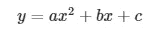
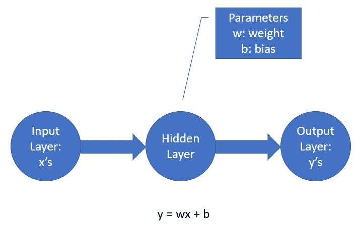

# Google 联合实验室 TensorFlow 入门

> 原文：<https://towardsdatascience.com/getting-started-with-tensorflow-in-google-colaboratory-9a97458e1014?source=collection_archive---------5----------------------->

## 10 分钟学会两项激动人心的技术！


Photo by [Franck V.](https://unsplash.com/@franckinjapan?utm_source=medium&utm_medium=referral) on [Unsplash](https://unsplash.com?utm_source=medium&utm_medium=referral)

TensorFlow 是数据科学家的主导深度学习框架，Jupyter Notebook 是数据科学家的首选工具。如果您可以在任何地方使用 TensorFlow，而无需设置环境，那会怎么样？更好的是，如果你可以免费使用 GPU 来训练你的深度学习模型呢？

谷歌合作实验室(Colab)就是答案！这是一项非常令人兴奋的技术，它允许数据科学家专注于建立机器学习模型，而不是物流！

在本文中，我们不仅将介绍使用 Colab 的基础知识，还将通过易于理解的示例帮助您开始使用 TensorFlow。

开始了。

# 打开 Colab 笔记本

首次使用 Colab 时，您可以在此处启动新笔记本:

[](https://colab.research.google.com/) [## 谷歌联合实验室

### 编辑描述

colab.research.google.com](https://colab.research.google.com/) 

创建笔记本后，它将保存在您的 Google Drive (Colab 笔记本文件夹)中。您可以通过访问您的 Google Drive 页面来访问它，然后双击文件名，或者右键单击，然后选择“用 Colab 打开”。

# 与 GitHub 连接

Colab 的构建者考虑得非常周到，他们甚至在 Github 中加入了承诺的功能。

要连接 GitHub，首先需要在 GitHub 上创建一个带有主分支的 repo。然后，从下拉菜单中选择“文件—在 GitHub 中保存副本”。您将仅在第一次被要求授权。方便的是，它甚至允许你在笔记本中包含一个“在 Colab 中打开”按钮，就像这样:



# 启用 GPU 支持

要为深度学习项目打开 GPU，只需进入下拉菜单，选择“运行时—更改运行时类型—硬件加速器”，然后选择 GPU:



# 使用单元格

在大多数情况下，这与本地 Jupyter 笔记本完全相同。例如，要运行代码单元格，只需按“Shift + Enter”即可。查看以下常用键盘快捷键(在使用 Chrome 的 Windows 上):

*   运行单元格:“Shift + Enter”
*   删除单元格:“Ctrl + M，然后 D”
*   撤消:“Ctrl + Shift + Z”
*   转换为代码单元格:“Ctrl + M，然后 Y”
*   转换为 markdown 单元格:“Ctrl + M，然后 M”
*   保存笔记本:“Ctrl + S”
*   打开快捷方式屏幕:“Ctrl + M，然后 H”

# 使用文件

您也可以将数据上传到您的 Colab 文件夹。见下图:



# 张量

TensorFlow 的名字基于“张量”一词。张量到底是什么？简而言之，多维数组。让我们看看这意味着什么！

*   我们有一个单一的数字，例如 6，我们称之为“**标量**”；
*   我们有三个数字，例如[ 6，8，9]，我们称之为“**向量**”；
*   我们有一个数字表，例如[[6，8，9]，[2，5，7]]，我们称之为“**矩阵**”(有两行三列)；
*   我们有**一个数表**的表格，例如[[[6，8，9]，[2，5，7]]，[[6，8，9]，[2，5，7]]]，还有……我们这里用词不多了:(朋友，那是一个**张量**！*张量是数组的广义形式，可以有任意维数*。

在张量流术语中，标量是秩为 0 的张量，向量是秩为 1 的，矩阵是秩为 2 的，等等。有三种常用的张量类型:常量、变量和占位符，解释如下。

# 张量的类型

**常量**顾名思义。它们是你等式中的固定数字。要定义一个常数，我们可以这样做:

```
a = tf.constant(1, name='a_var')
b = tf.constant(2, name='b_bar')
```

除了值 1，我们还可以为张量提供一个名称，比如“a_var ”,它独立于 Python 变量名“a”。这是可选的，但将有助于以后的操作和故障排除。

定义之后，如果我们打印变量 a，我们会得到:

```
<tf.Tensor 'a_var:0' shape=() dtype=int32>
```

**变量**是要优化的模型参数，例如，神经网络中的权重和偏差。同样，我们也可以定义一个变量，并像这样显示它的内容:

```
c = tf.Variable(a + b)
c
```

并且有这样的输出:

```
<tf.Variable 'Variable:0' shape=() dtype=int32_ref>
```

但是需要注意的是，所有变量在使用前都需要初始化，如下所示:

```
init = tf.global_variables_initializer()
```

你可能已经注意到 a 和 b 的值，也就是整数 1 和 2，没有出现在任何地方，为什么？

这是 TensorFlow 的一个重要特征——“惰性执行”，意思是首先定义事物，但不运行。它只有在我们告诉它去做的时候才会被执行，这是通过运行一个会话来完成的！(注意 TensorFlow 也有急切执行。查看此处的[了解更多信息)](https://www.tensorflow.org/guide/eager)

# 会话和计算图

现在让我们定义一个会话并运行它:

```
with tf.Session() as session:                    
    session.run(init)                            
    print(session.run(c))
```

请注意，在会话中，我们运行变量的初始化和 c 的计算。我们将 c 定义为 a 和 b 的和:

```
c = tf.Variable(a + b)
```

用 TensorFlow 和深度学习的话说，这就是“计算图”。听起来很复杂，对吧？但它实际上只是我们想要进行的计算的一种表达方式！

# 占位符

另一个重要的张量类型是**占位符**。它的用例是保存要提供的数据的位置。例如，我们定义了一个计算图，我们有大量的训练数据，然后我们可以使用占位符来表示我们将在以后输入这些数据。

让我们看一个例子。假设我们有这样一个等式:



我们有一个 x 的向量，而不是一个单一的 x 输入。所以我们可以用一个占位符来定义 x:

```
x = tf.placeholder(dtype=tf.float32)
```

我们还需要系数。让我们使用常数:

```
a = tf.constant(1, dtype=tf.float32)
b = tf.constant(-20, dtype=tf.float32)
c = tf.constant(-100, dtype=tf.float32)
```

现在让我们制作计算图，并提供 x 的输入值:

```
y = a * (x ** 2) + b * x + c
x_feed = np.linspace(-10, 30, num=10)
```

最后，我们可以运行它:

```
with tf.Session() as sess:
  results = sess.run(y, feed_dict={x: x_feed})
print(results)
```

这给了我们:

```
[ 200\.         41.975304  -76.54321  -155.55554  -195.06174  -195.06174  -155.55554   -76.54324    41.97534   200\.      ]
```

# **综合考虑**

现在我们有了 TensorFlow 的基础知识，让我们做一个迷你项目来构建一个线性回归模型，也就是神经网络:)(代码改编自 TensorFlow 指南中的示例[这里](https://www.tensorflow.org/guide/low_level_intro)

假设我们有一堆 x，y 值对，我们需要找到最佳拟合线。首先，由于 x 和 y 都有值要输入到模型中，我们将它们定义为占位符:

```
x = tf.placeholder(dtype=tf.float32, shape=(None, 1))
y_true = tf.placeholder(dtype=tf.float32, shape=(None, 1))
```

行数被定义为 None，以便灵活地输入我们想要的任意行数。

接下来，我们需要定义一个模型。在这种情况下，我们的模型只有一个层，只有一个权重和一个偏差。



TensorFlow 允许我们非常容易地定义神经网络层:

```
linear_model = tf.layers.Dense(
                   units=1, 
                   bias_initializer=tf.constant_initializer(1))
y_pred = linear_model(x)
```

单元的数量被设置为 1，因为我们在隐藏层中只有一个节点。

此外，我们需要有一个损失函数，并建立优化方法。损失函数基本上是一种使用训练数据来衡量我们的模型有多差的方法，所以当然，我们希望它最小化。我们将使用梯度下降算法来优化这个损失函数(我将在以后的文章中解释梯度下降)。

```
optimizer = tf.train.GradientDescentOptimizer(0.01)
train = optimizer.minimize(loss)
```

然后我们可以初始化所有的变量。在这种情况下，我们所有的变量包括权重和偏差都是我们上面定义的层的一部分。

```
init = tf.global_variables_initializer()
```

最后，我们可以为占位符提供培训数据并开始培训:

```
x_values = np.array([[1], [2], [3], [4]])
y_values = np.array([[0], [-1], [-2], [-3]])with tf.Session() as sess:
  sess.run(init)
  for i in range(1000):
    _, loss_value = sess.run((train, loss),
                             feed_dict={x: x_values, y_true: y_values})
```

我们可以得到权重，并做出这样的预测:

```
weights = sess.run(linear_model.weights)
bias = sess.run(linear_model.bias)
preds = sess.run(y_pred, 
                 feed_dict={x: x_values})
```

由此产生了这些预测:

```
[[-0.00847495]  [-1.0041066 ]  [-1.9997383 ]  [-2.99537   ]]
```

如果你像我一样好奇，你可以通过以下方式验证模型是否使用其训练的权重和偏差进行预测:

```
w = weights[0].tolist()[0][0]
b = weights[1].tolist()[0]
x_values * w + b
```

这给了我们完全相同的结果！

```
array([[-0.00847495],        [-1.00410664],        [-1.99973834],        [-2.99537003]])
```

瞧啊。Google Colab 中使用 TensorFlow 搭建的一个简单的神经网络！希望你觉得这个教程有趣和丰富。

包含所有代码的笔记本可以在[这里](https://github.com/georgeliu1998/tf_and_colab/blob/master/tf_and_colab.ipynb)找到。一定要试一试！

## 最后的想法

云计算绝对是深度学习计算的未来。谷歌 Colab 显然是一款面向未来的产品。当我们可以在云上启动笔记本电脑并开始构建模型时，很难想象人们还想花时间建立深度学习环境！