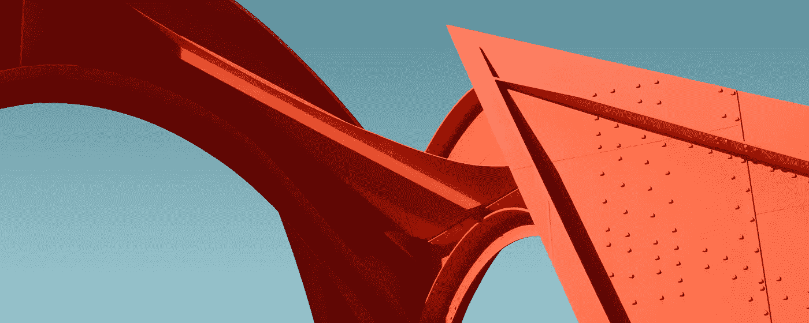

# 如何开始使用宇宙魔方

> 原文：<https://towardsdatascience.com/getting-started-with-tesseract-part-i-2a6a6b1cf75e?source=collection_archive---------2----------------------->



Photo by [Pierre Châtel-Innocenti](https://unsplash.com/@chatelp).

## 从头开始设置您的开源 OCR 堆栈

众所周知，Tesseract 不是一个可以识别各种文本和图形的一体化 OCR 工具。事实上，这与事实相去甚远。如果这是一个秘密，我已经破坏了它，无论如何已经太晚了。所以，为什么不深入研究宇宙魔方，并分享一些可以改善你的结果的技巧和诀窍呢？

# 我喜欢免费的东西！

不过，真的。我真的很感谢那些为开源项目做出贡献而不期望任何回报的开发人员。毕竟，它们为我们提供了个人相对难以实现的能力，例如通过 [TensorFlow](https://www.tensorflow.org/) 创建深度神经网络，而没有太多的麻烦。谁能想到机器学习会像今天这样触手可及？

[宇宙魔方](https://github.com/tesseract-ocr/tesseract)也帮助我们完成简单的 OCR 任务，成功率很高，并且是完全开源的。在这篇文章中，我将试着让你继续使用宇宙魔方，并希望帮助你清除在使用它时可能会遇到的一些障碍。

即使该领域有相当多的选择，例如， [OCRopus](https://github.com/tmbdev/ocropy) ，宇宙魔方似乎仍然是大多数免费骑手的首选。嗯，如果你考虑到宇宙魔方仍在由谷歌社区开发，并随着时间的推移不断增长，这一切加在一起。然而，如果你以前有过使用 Tesseract 的经验，你可能会注意到，在图像预处理或自定义字体训练方面，Tesseract 很可能会让你失望。

自定义字体的训练留待以后讨论，现在，我将主要集中在复习基础知识，让你开始使用 Tesseract。首先，让我们快速检查一下安装。

# 装置

## 马科斯

我将使用[家酿](https://brew.sh/)，一个软件包管理器，来安装宇宙魔方库。安装 HomeBrew 后，您应该提示以下命令。

```
$ brew install tesseract
```

或者，如果你愿意，你也可以用 MacPorts 做同样的事情。

```
$ sudo port install tesseract
```

## 人的本质

在 Ubuntu 上，这也很简单。

```
$ sudo apt-get install tesseract-ocr
```

## Windows 操作系统

对于 Windows，可以从[官方 GitHub 库](https://github.com/tesseract-ocr/tesseract/wiki#windows)下载非官方安装程序。多好的句子，嗯？

## 我如何知道安装是否正确？

要验证 Tesseract 是否安装成功，您可以点击您的终端并键入以下内容。

```
$ tesseract -v
```

如果您收到类似下面的几行提示，您的宇宙魔方安装正确。否则，您可能希望从系统中的 **PATH** 变量开始检查出了什么问题。

```
tesseract 3.05.01
 leptonica-1.74.4
  libjpeg 9c : libpng 1.6.34 : libtiff 4.0.9 : zlib 1.2.11
```

## 安装更多的库

首先，Tesseract 不是一个 Python 库。它也没有 Python 的官方包装器。这就是那些热心的开发者来为我们创造[这个](https://github.com/madmaze/pytesseract)令人敬畏的 Python 包装器 pytesseract 的地方。我们还需要安装 OpenCV 和 PIL 来操作图像。

```
$ pip install pillow
$ pip install pytesseract
$ pip install opencv-python
```

就是这样！

# 图像预处理

现在，您已经将您的宇宙魔方安装在您的计算机上，准备好使用 Python 了。你还在等什么？嗯，没有人阻止你；请继续尝试。不过，这里有一个“但是”。正如许多文章(包括官方文档)所述，如果没有图像预处理，Tesseract 很可能会失败。

## 什么是图像预处理？

很长一段时间以来，我一直是 TensorFlow 知识库中[提高质量](https://github.com/tesseract-ocr/tesseract/wiki/ImproveQuality)页面的常客，在那里他们列出了一些你可以尝试提高准确度的方法。虽然它声称内部有各种图像处理操作，但这往往是不够的。在这里，我将尝试应用一些我们可以通过使用 OpenCV 完成的事情。

让我们定义一个简单的函数，它将图像路径作为输入，并将字符串作为输出返回。我要发挥超级创造力，把这个函数命名为“get_string”

```
def get_string(img_path):
    # Read image using opencv
    img = cv2.imread(img_path)

    # Extract the file name without the file extension
    file_name = os.path.basename(img_path).split('.')[0]
    file_name = file_name.split()[0]

    # Create a directory for outputs
    output_path = os.path.join(output_dir, file_name)
    if not os.path.exists(output_path):
        os.makedirs(output_path)
```

**重定比例**:镶嵌立方体最适合 300 dpi 或更高的图像。如果您处理的图像的 DPI 小于 300 dpi，您可以考虑重新缩放。否则，重新调整可能不会产生你认为会产生的影响。

就我个人而言，我更倾向于确保图像至少为 300 dpi，而不是在后期重新缩放。但是，每个人都有自己的喜好。你做你的。

```
 # Rescale the image, if needed.
    img = cv2.resize(img, None, fx=1.5, fy=1.5, interpolation=cv2.INTER_CUBIC)
```

**去噪:**大多数打印文档都可能在某种程度上受到噪声的影响。虽然这种噪音的主要原因可能各不相同，但很明显，它使计算机更难识别字符。结合使用几种不同的技术可以去除图像上的噪声。这些包括但不限于将图像转换为灰度、膨胀、腐蚀和模糊。

膨胀、侵蚀和模糊需要一个内核矩阵来处理。简单地说，你的内核越大，你的方法工作的区域就越广。同样，没有一个内核大小值适合所有情况。你需要玩数字游戏，最终为你的图像找到正确的值。

然而，一个好的经验法则是从小字体的小内核值开始。同样，对于较大的字体，您可以尝试使用较大的内核。

```
 # Convert to gray
    img = cv2.cvtColor(img, cv2.COLOR_BGR2GRAY)

    # Apply dilation and erosion to remove some noise
    kernel = np.ones((1, 1), np.uint8)
    img = cv2.dilate(img, kernel, iterations=1)
    img = cv2.erode(img, kernel, iterations=1) # Apply blur to smooth out the edges
    img = cv2.GaussianBlur(img, (5, 5), 0)
```

正如您在上面的代码中可能注意到的，我们可以用两种类似的方式创建内核:使用 NumPy 数组或者直接将内核传递给函数。

**二值化:**这绝对是必须的。让我们试着像电脑一样思考一下。在这个一切最终归结为 1 和 0 的网络现实中，将图像转换为黑白极大地帮助宇宙魔方识别字符。但是，如果输入文档缺乏对比度或背景稍暗，这可能会失败。

```
 # Apply threshold to get image with only b&w (binarization)
    img = cv2.threshold(img, 0, 255, cv2.THRESH_BINARY + cv2.THRESH_OTSU)[1]
```

在输出目录中保存过滤后的图像后，我们可以通过将处理后的图像传递给 Tesseract 来完成 get_string 函数的编写，如下所示。

```
 # Save the filtered image in the output directory
    save_path = os.path.join(output_path, file_name + "_filter_" + str(method) + ".jpg")
    cv2.imwrite(save_path, img)

    # Recognize text with tesseract for python
    result = pytesseract.image_to_string(img, lang="eng")
    return result
```

# 临终遗言

现在，你可能认为你已经准备好了一切——但是总有改进的空间。如果我们有更多的过滤选项不是更好吗？实际上，有很多！我将在我的下一个故事中[解释其中的一些。](https://medium.com/@bkaankuguoglu/getting-started-with-tesseract-part-ii-f7f9a0899b3f)

对于那些想在进入下一个故事之前看看我的源代码的人来说，这里是我在 [GitHubGist](https://gist.github.com/bkaankuguoglu/111f9f5e0c30b5f57d7c5338d6dcb6fc) 上的完整代码。你可能注意到了，它实际上不仅仅是文本识别。事实上，它在图像的给定区域查找正则表达式并返回值。

我们很快就会到达那里，别担心！同时，最好继续你的一天，寻找更好的机会。