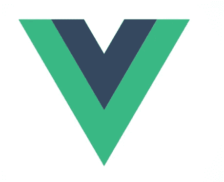
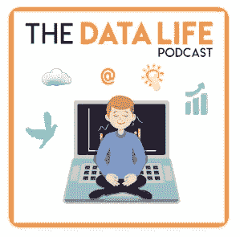

# Vue.js for Data Science 入门

> 原文：<https://towardsdatascience.com/getting-started-with-vue-js-for-data-science-f3c34d22cd38?source=collection_archive---------5----------------------->

Vue.js 是一个轻量级、易于使用的 JavaScript 框架，用于构建更复杂的前端网站。在这篇博客中，我将分享我作为一个从事数据科学项目的人对学习 Vue.js 的看法。我以前尝试过学习 jQuery 来做 JavaScript 工作，我发现它非常不直观并且难以使用。Vue.js 是一股新鲜空气，是与 jQuery — esp 完全不同的体验。对于主要生活在 HTML/CSS 世界中进行前端开发的人来说。



Vue.js is a light-weight JavaScript framework to build dynamic websites

## I .我的数据科学工作流程与 web 开发:

1.  像许多数据科学家一样，我通常使用像 Python 这样的脚本语言来构建模型。这些模型通常经过训练并存储在磁盘上的某个地方，通常用 Python 或另一种语言部署到生产中。(我曾经写过关于[使用 **Go** 进行数据科学](/moving-to-go-from-python-9ebbd9a8aec4)的文章——这是一种非常棒的语言，可以用于许多数据科学任务。)
2.  对于我来说，构建网站的常见用例是从访问网站、登录并为您标记或分类数据的用户那里获取训练数据。
    对于这个工作流程，我使用了 [**Flask**](http://flask.pocoo.org/) 作为 web 框架，以及 [**Bootstrap**](https://getbootstrap.com/docs/4.0/getting-started/introduction/) 和 [**Jinja**](http://jinja.pocoo.org/) 前端模板引擎来构建小型网站。(这些可以通过 [AWS](https://medium.com/@rodkey/deploying-a-flask-application-on-aws-a72daba6bb80) 或 [Heroku](https://devcenter.heroku.com/articles/getting-started-with-python) 部署)
3.  网站需要交互性怎么办？如果需要键盘快捷键怎么办？如果你希望需要动态图表来展示模型的不同状态呢？这些任务需要 JavaScript。通常人们使用 Angular、React 或 [Vue](https://vuejs.org/) 这样的框架来帮助编写代码。

## 二。Vue.js 入门:

Vue。JS 是轻量级的，有更温和的学习曲线，更直观，有很好的文档，在单页应用程序(spa)中越来越受欢迎。SPAs 允许大部分工作在客户端完成，不需要持续的页面重载。

Youtube 上的[网络忍者视频的大呼小叫，他们是学习 Vue 的绝佳选择。让我们从一些 Vue 代码开始:](https://www.youtube.com/watch?v=5LYrN_cAJoA&list=PL4cUxeGkcC9gQcYgjhBoeQH7wiAyZNrYa)

**a)调用函数和动态访问数据:**

在 HTML 代码中:添加带有`id`、`vue-app`的`div`，这将让 Vue 实例控制应用程序。HTML 使用`{{`和`}}`与 Javascript 数据交互——这让 Vue 知道动态加载这些数据。在`<script>`标签中，添加到托管在 CDN 上的 Vue Javascript 文件和本地 Javascript 文件的链接。

JavaScript 文件内部:

Vue 实例使用`el`与 DOM 连接，`data`有键值对来保存所有可以动态更新的数据——这个名称是固定的。`methods`拥有所有可以使用`{{`和`}}`在 HTML 内部调用的函数。在`methods`内部，可以使用`this`访问`data`。要得到`name`，就会是`this.name` : Vue 自动理解`this`是指这个对象。

关于这个过程，我发现的最好的事情之一是，我们可以将所有逻辑保留在纯 JavaScript 代码中，并将所有数据保留在一个 JavaScript 对象中。这对我来说感觉比什么都合并干净。

**b)事件处理:** vue . js 的另一个伟大之处是它如何无缝地处理像`click`和`keyup`这样的事件。假设您希望用户使用两个按钮来编辑年龄。

在 JavaScript 文件中，编写了方法`add`和`subtract`:

上面的代码将在点击时增加或减少年龄，并在不重新加载页面的情况下动态显示给用户。其他事件可以是`@keyup`、`@dblclick, @mousemove`等。
如果你想通过使用`n`在不同的`divs`之间切换，你可以使用`@keyup.78`来捕获这个事件，并引导用户使用你的 JavaScript 函数。

对循环和条件句使用 v-for 和 v-if:

比方说，用户在数据对象中有另一个名为`favorites`的属性。它有一个数据数组`[“Batman”, “Spider-Man”, “Iron-Man”, “Black Panther”]`。我们可以用`<div v-for="(fav, index) in favorites"><h4>{{ fav }} </h4><div>`。这将允许 HTML 代码逐个呈现项目列表。类似地，`v-if`可以用来检查条件和`data`对象中值的存在。

**d)基于逻辑操纵类:** [类绑定](https://vuejs.org/v2/guide/class-and-style.html)是 Vue 中我最喜欢的特性之一。比方说，您正在显示一个项目列表，并且希望在用户按下向上或向下按钮时突出显示该项目。这在使用类绑定的 Vue 中是可能的。下面是代码的[完整示例](https://jsfiddle.net/mnahara/7bmquu1e/12/)。

```
<li v-for=’item in items’ :class=’{“active-item”: currentItem === item.id}’>
```

`currentItem`可以在`data`对象中操作，当 currentItem 匹配当前项目的 id 时，它会使用类`active-item`高亮显示。

我已经非常简要地介绍了这些概念，这些例子只是 Vue.js 可以做什么的预告片，Vue.js 实际上有一些令人惊讶的文档，你可以在这里[找到](https://vuejs.org/v2/guide/)。

## 三。数据科学的要点:

在最后一部分，我们将讨论关于 Vue.js 的数据科学关键要点。

1.  **Vue.js 非常适合为全栈数据科学编写客户端代码:**
    虽然了解用于开发模型的服务器端语言很好，但了解客户端框架也很好。这使得**全栈数据科学**。通过服务器端和客户端代码之间的交互，数据科学模型可以成为网站的一部分。Vue.js 在客户端代码开发上确实大放异彩。
2.  **Vue.js 允许快速 XHR 请求将数据发送回服务器:** 在浏览器中收集了用户的数据后，Vue 允许快速 XHR 请求使用 POST 请求将数据发送回服务器。在 Vue 实例的方法中，您可以使用`this.$http.post(‘/post_url’, JSON.stringify(this.data))`将数据发送回服务器，您只需要在 HTML 脚本标签中添加`vue-resource`库——您可以使用 [CDN 链接](https://cdnjs.com/libraries/vue-resource)来完成。
3.  **Vue.js 对于已经熟悉 HTML 的人来说很棒:** Vue 让你用 HTML 编辑网页，很多数据科学家已经很熟悉了。Vue 小巧、可扩展、直观。

已经在使用 Vue.js 的网站有阿里巴巴、小米、Gitlab、路透社和 Adobe。围绕 Vue 有很多真正令人兴奋的事情，学习了它并在项目中使用，很容易理解为什么。

**学习 Vue 的优秀资源:**
1) [Net Ninja 的 Youtube 视频系列](https://www.youtube.com/watch?v=5LYrN_cAJoA&list=PL4cUxeGkcC9gQcYgjhBoeQH7wiAyZNrYa)是互联网上最好的视频系列之一
2) [Vue.js 文档](https://vuejs.org/v2/guide/)非常干净，写得很好
3)[awesome-Vue](https://github.com/vuejs/awesome-vue)Github 页面，链接到世界各地的多个项目、资源和社区

希望你喜欢 Vue 和数据科学的世界！

**PS，看看我的新播客！我开始了一个名为“数据生活播客”的新播客。如果你已经在工作中处理数据，并且想听听在数据科学中处理数据、工具和技术的真实生活经历，这是为你准备的播客。在最近的一期节目中，我谈到了使用 Flask 和 Vue.js 构建一个单页面 web 应用程序。你可以在这里或者任何你听播客的地方听播客。**



[My new podcast: The Data Life Podcast](https://link.chtbl.com/d8Cg-H7N)

如果你有任何问题，给我的 LinkedIn 个人资料留言，或者发邮件到 sanket@omnilence.com。感谢阅读！