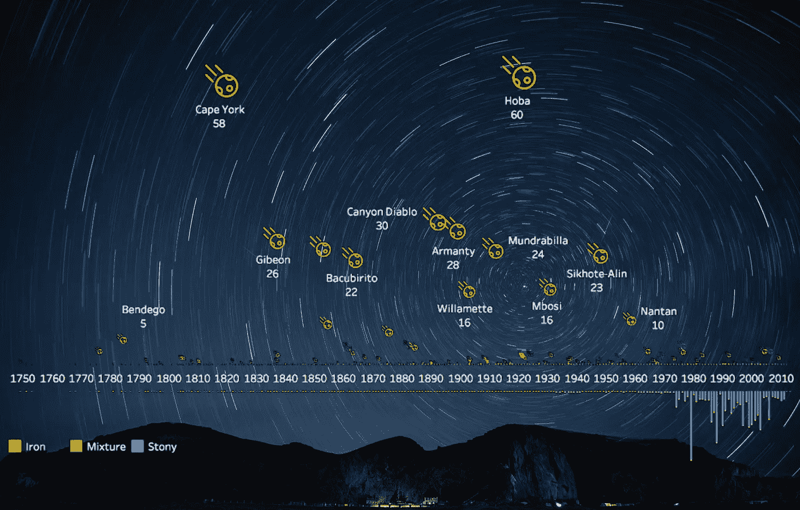
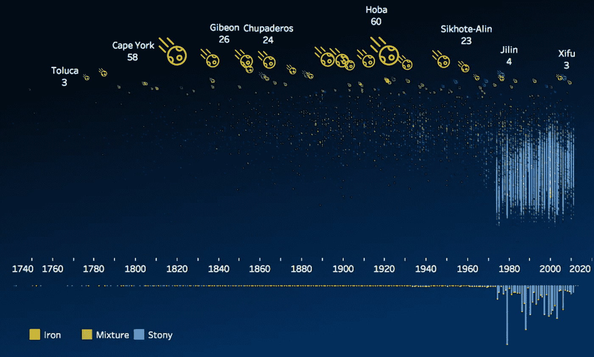
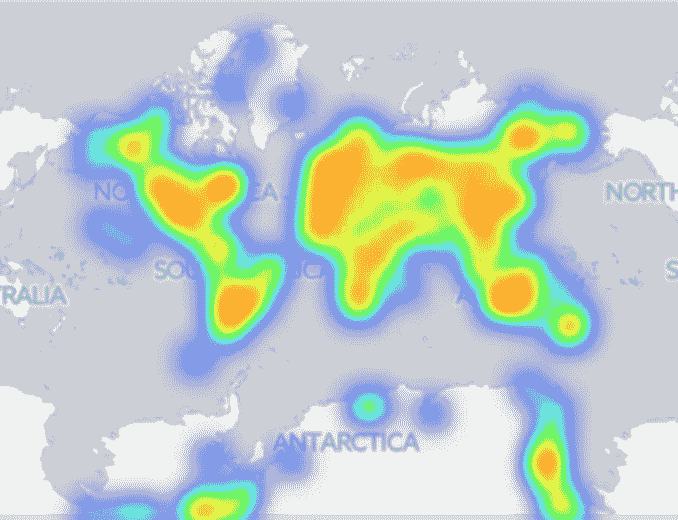
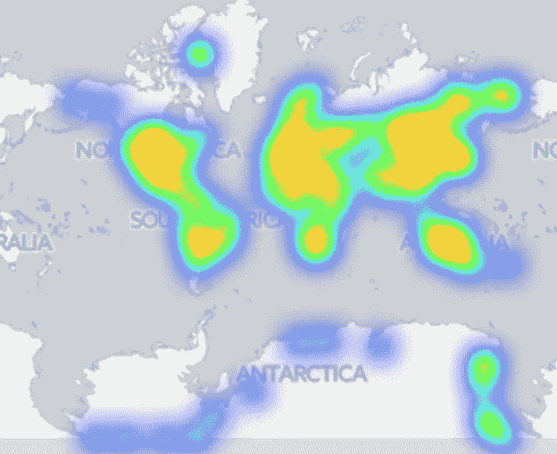
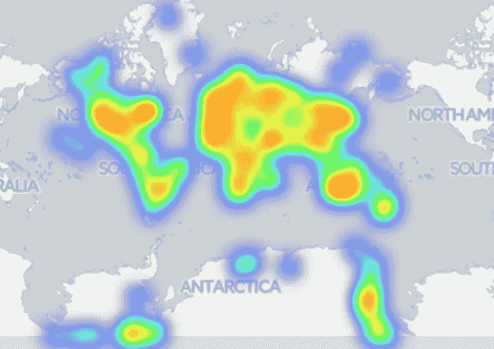

# 了解陨石

> 原文：<https://towardsdatascience.com/getting-to-know-the-meteorites-ef4a6a04290c?source=collection_archive---------2----------------------->

陨石是从天空坠落并降落在地球上幸存下来的流星。今天我查看了 NASA 数据库中由陨石学会收集的陨石数据。在这次探索中，我想揭示的是陨石的分类和质量，以及着陆的地理位置。

在根据[分类](https://en.wikipedia.org/wiki/Meteorite_classification)将 386 块陨石分成 3 个桶(铁、石头或混合物)的一些预处理后，我在时间轴上画出了陨石的大小和数量，按照其质量垂直展开，并标注了名称和质量(以吨为单位)。我们可以观察到:

*   到达地球的最大陨石主要是铁
*   1920 年着陆的 60 吨重的“霍巴”是迄今为止世界上最大的火箭
*   大多数是石质的，但相对较小。直觉上，这是有道理的，因为它们在进入地球大气层时更有可能因其材料而解体
*   从 20 世纪 80 年代开始，收集了大量的陨石数据

为了放大较小的陨石，我们可以转换 y 轴来显示质量的对数标度，这揭示了近几十年来记录的从几克到几千克的更多石质陨石的数据点。这是画在纯黑色的背景上，以获得更好的可视性。

接下来，我开始绘制登陆地图。当有太多点重叠时，热图比散点图提供了更好的视图。

Meteorite landings

我们可以在南极看到陨石回收活动。如果按陨石类型划分，似乎铁陨石不太经常从南极洲收集，这可能与铁陨石沉入冰下更深有关，而在白色大陆上更容易找到小石头陨石。BBC [文章](http://www.bbc.com/news/science-environment-38805430)对此有更多报道。

(Left) Iron meteorite landings; (Right) Stony meteorite landings

这是我关于数据科学和视觉故事的[# 100 天项目](https://medium.com/@yanhann10)的第 18 天。代码在 [github](https://github.com/yanhann10/opendata_viz/blob/55fedb97607e254bc787d43e99eb55122c02eb83/meteorites/meteorites.Rmd) 上。由于休假，我已经离开一个星期了🌠。

感谢您的阅读，欢迎您提出想法和建议。