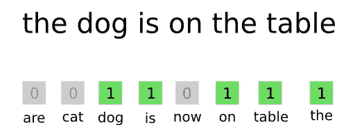
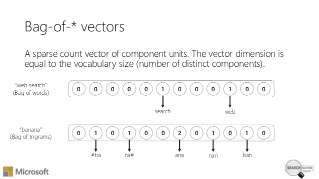

# 为您的自然语言处理之旅准备好文本数据

> 原文：<https://towardsdatascience.com/getting-your-text-data-ready-for-your-natural-language-processing-journey-744d52912867?source=collection_archive---------17----------------------->

Photo by [Patrick Tomasso](https://unsplash.com/photos/Oaqk7qqNh_c?utm_source=unsplash&utm_medium=referral&utm_content=creditCopyText) on [Unsplash](https://unsplash.com/search/photos/books?utm_source=unsplash&utm_medium=referral&utm_content=creditCopyText)

在我们生活的各个方面，我们都被语言所包围。语言是我们存在的基础，是让我们成为我们自己的东西。语言使我们能够以如此简单的方式做事情，否则这是不可能的，比如交流思想，像指环王一样讲述巨大的故事，甚至深入了解我们的内心。

由于语言是我们生活和社会不可或缺的一部分，我们自然会被大量的文本所包围。我们可以从书籍、新闻文章、维基百科文章、推文以及许多其他形式的资源中获取文本。

这些大量的文本可能是我们所能处理的最大数量的数据。从书面文字中可以获得许多真知灼见，由此提取的信息可以产生非常有用的结果，可用于各种应用。但是，所有这些数据都有一个小缺陷，即文本是我们可用的最无结构的数据形式。这是纯粹的语言，没有任何数学含义。可悲的是，我们所有的机器学习和深度学习算法都是针对数字而不是文本的。

那么，我们该怎么办？

简单！我们需要清理这些文本，并将其转换为数学数据(向量)，我们可以将这些数据提供给我们饥饿的算法，这样它们就可以为我们提供一些很好的见解。这被称为*文本预处理。*

文本预处理可以大致分为两个主要步骤:

1.  **文字清理**
2.  **文本到矢量的转换**

让我们深入了解他们的细节…

# **文字清理**

为了避免占用我们的内存(自然语言处理是一个耗时耗内存的过程)，在我们将文本转换成向量之前，文本必须尽可能的干净。以下是清理数据时可以遵循的几个步骤:

**移除 HTML 标签:**大多数可用的文本数据都是 web 废弃的，因此几乎总是包含 HTML 标签(例如:< br/ >、< p >、< h1 >等)。如果我们把它们转换成向量，它们只会占用内存空间，增加处理时间，而不会提供任何关于文本的有价值的信息。

**去掉标点:**标点没有用。与 HTML 标签相同。这些也需要清洗，原因和上面提到的一样。

**去除停用词:**像‘this’，‘there’，‘that’，‘is’等词。不能提供非常有用的信息，而且会在我们的记忆中制造一些无用的混乱。这种词被称为停用词。可以使用删除此类单词，但建议在这样做时要小心，因为像“not”这样的单词也被视为停用词(这对于情感分析等任务可能是危险的)。

**词干:**像‘有味道的’、‘有品味地’等词都是‘有味道的’这个词的变体。因此，如果我们的文本数据中有所有这些单词，当所有这些暗示(或多或少)相同的事情时，我们将最终为每个单词创建向量。为了避免这种情况，我们可以提取所有这些单词的*词根*，并为*词根*创建一个向量。提取出*词根*词的过程称为*词干化。“雪球斯特梅尔”是最先进的词干分析器之一。*

该代码片段给出了以下输出:

令人惊讶的是，tasty 的词根竟然是 tasti。

**将所有内容转换为小写:**在我们的数据中同时包含“饼干”和“饼干”是没有意义的，最好将所有内容转换为小写。此外，我们需要确保没有文字是字母数字。

实现上述所有过程的最终代码如下所示:

# **文本到矢量的转换**

一旦我们完成了对数据的清理，就应该将清理后的文本转换为我们的机器学习/深度学习算法可以理解的向量。

有相当多的技术可供我们使用来实现这种转换。其中最简单的就是*袋字。*

**文字袋—简短介绍**

单词包基本上创建了一个*‘d’*单词的字典(这不是 python 字典)，其中*‘d’*是我们的文本语料库中*唯一*单词的数量。然后，它为每个文档创建*‘d’*维向量(将其视为长度为‘d’的数组)，每个维(单元格)的值等于相应单词在文档中出现的次数。

类似这样的-

[credits](https://cdn-images-1.medium.com/max/1600/1*j3HUg18QwjDJTJwW9ja5-Q.png)

在上面的例子中，字典有八个单词(are，cat，dog，is，on，table，the)。问题中的句子(查询)有六个单词(The，dog，is，on，the，table)。显然，每个单元格都具有相应单词在查询中出现的次数的计数值。

在非常高维的向量中，零的数量将大大超过非零值的数量，因为每个向量将具有针对数据语料库中所有唯一单词的维度。这样的向量维数可以是几千、几万甚至更多，但是单个文档不会有这么多独特的单词。这种类型的向量(其中大多数元素为零)被称为稀疏向量。

它们看起来像这样-

[visiting link](https://image.slidesharecdn.com/vectorland-151126121952-lva1-app6892/95/vectorland-brief-notes-from-using-text-embeddings-for-search-11-638.jpg?cb=1448540745)

当这些稀疏向量相互叠加时，我们得到一个稀疏矩阵。

类似这样的-

[Source](https://www.researchgate.net/profile/Nidhal_El_abbadi/publication/269410885/figure/fig2/AS:392105793998849@1470496714111/suggested-sparse-matrix.png)

在这个图中，可以清楚地看到大多数值是零。该稀疏矩阵将我们的整个文本语料库表示为 n*d 矩阵，其中‘n’表示文本语料库中的文档数量，而‘d’表示其中唯一单词的数量(各个向量的维数)。

下面是获取单词包的代码片段:

获得的输出是:

因此，对于我们的每个文档(总共 525814 个—‘n’)，我们得到一个 70780(‘d’)维向量！这是巨大的！

我希望这个数字能说明为什么我们需要在将数据转换成向量之前清理数据，因为如果我们不清理数据，数据的维数会比我们现有的维数大得多。

文本已经被转换成向量，我们现在已经准备好建立我们的 ML/DL 模型了！

更多关于单词袋方法的信息可以在[这里](https://machinelearningmastery.com/gentle-introduction-bag-words-model/)找到。

其他更复杂的文本到矢量转换技术包括:

1.  [Tfidf](https://www.quora.com/How-does-TF-IDF-work)
2.  [Word2Vec](/light-on-math-machine-learning-intuitive-guide-to-understanding-word2vec-e0128a460f0f)

这个项目的完整 Jupyter 笔记本可以在[这里](https://github.com/tanmaylata/Text-Cleaning-and-BoW/blob/master/Text%20Cleaning%20and%20BoW.ipynb)找到。

这里完成的预处理步骤是在 [Kaggle](https://www.kaggle.com) 上可用的[亚马逊美食评论数据集](https://www.kaggle.com/snap/amazon-fine-food-reviews)上执行的。执行所有步骤所依据的*“文本”*功能是指不同食品的审查(被视为文件)。

暂时就这样吧！感谢人们读到这里！

[BBYE!!](https://media1.tenor.com/images/0584ba2a53ae5f9ef7782eef423b69c3/tenor.gif?itemid=9394190)