# 马拉松入门 v0.5.0a

> 原文：<https://towardsdatascience.com/gettingstartedwithmarathonenvs-v0-5-0a-c1054a0b540c?source=collection_archive---------8----------------------->

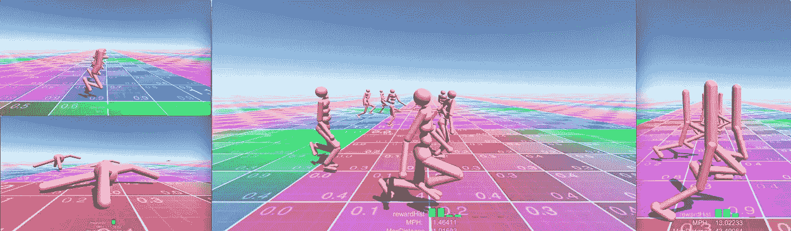

Marathon Environments for Unity ML-Agents

我花了两年时间学习强化学习。我创造了马拉松环境，以帮助探索机器人和运动研究在活跃的布娃娃和虚拟代理领域的视频游戏中的适用性。

Introduction to Marathon Environments. From Hopper to Backflips

# 关于本教程

本教程提供了马拉松环境的入门知识。在此，您将了解到:

*   如何设置你的**开发环境** (Unity，MarthonEnvs+ML-Agents+TensorflowSharp)
*   如何让每个代理使用他们预先训练好的模型。
*   如何**重新培训料斗**代理并遵循 **Tensorboard** 中的培训。
*   如何修改漏斗奖励功能**训练它跳**。

# 关于马拉松环境

[Marathon Environments](https://github.com/Unity-Technologies/marathon-envs) 使用 ML-Agents 工具包重新实现了深度强化学习文献中常见的经典连续控制基准集，即 Unity environments。

Marathon Environments 与 Unity ML- Agents v0.5 一起发布，包括四个连续控制环境。基于 [DeepMind 控制套件](https://github.com/deepmind/dm_control)和 [OpenAI Gym](http://gym.openai.com/envs/#mujoco) 中可用环境的沃克、霍普、人形和蚂蚁。

所有的环境都有一个单一的 ML-Agent 大脑，有连续的观察和连续的行动。没有视觉观察。每个动作都与一个电动关节轴相关。使用嵌套关节策略实现多轴关节。每个环境包含 16 个同时训练的代理。

马拉松环境主页是 https://github.com/Unity-Technologies/marathon-envs——如果您有任何问题或疑问，请提出 Github 问题。

# 设置您的开发库

## 安装 Unity 2017.4 或更高版本

从 Unity 商店下载 [Unity](https://store.unity.com/download)

## 设置存储库

转到 [GitHub MarathonEnvs 0.5.0a 版本](https://github.com/Unity-Technologies/marathon-envs/releases/tag/0.5.0a)并下载`QuickStart_xxx.zip`。

快速入门在一个 zip 文件中包含以下内容:

*   马拉松-envs-0.5.0a
*   毫升-药剂-0.5-3.0a
*   张量流图

解压缩到您的开发文件夹。

## 设置 Python

跟随优秀的 [ML-Agents 文档](https://github.com/Unity-Technologies/ml-agents/blob/master/docs/Installation.md#install-python-and-mlagents-package)学习如何设置 python 开发环境。

# 运行预先训练的模型

打开 Unity 和您的项目:

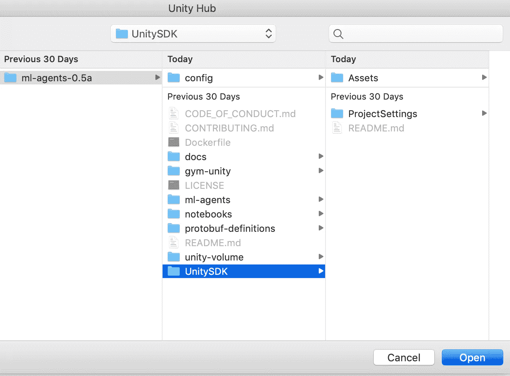

Open Unity and Your Project

打开 DeepMindWalker 场景:

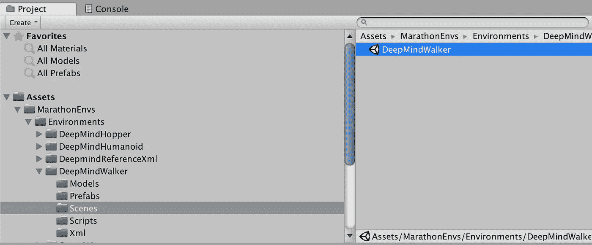

Open `UnitySDK⁩\Assets⁩\MarathonEnvs⁩\Environments⁩\DeepMindWalker⁩\Scenes⁩\DeepMindWalker.unity`

按下**播放。**这将运行预训练模型`DeepMindWalker108-1m.bytes`


DeepMind Walker — This model was trained using 16 agents over 1m simulation steps

**步行者**代理有 6 个关节/动作和 41 个观察值。奖励函数对于骨盆速度和骨盆垂直度具有正的奖励信号。对于当前动作状态的努力有一个负的奖励信号，如果身高低于 1.1 米则有一个惩罚。

# 人形，漏斗和蚂蚁

重复上述步骤运行其他环境:

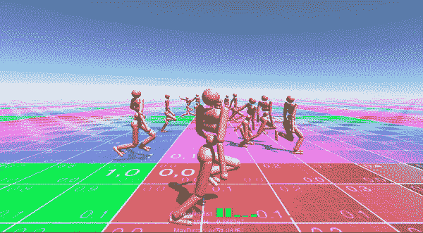

DeepMind Humanoid

**人形**智能体有 21 个关节/动作，88 个观察值。奖励函数对于骨盆速度和直立度有一个正信号，对于当前动作状态的努力有一个负信号，如果身高低于 1.2m 则有一个惩罚。它还根据其腿部的相位周期增加额外的奖励。

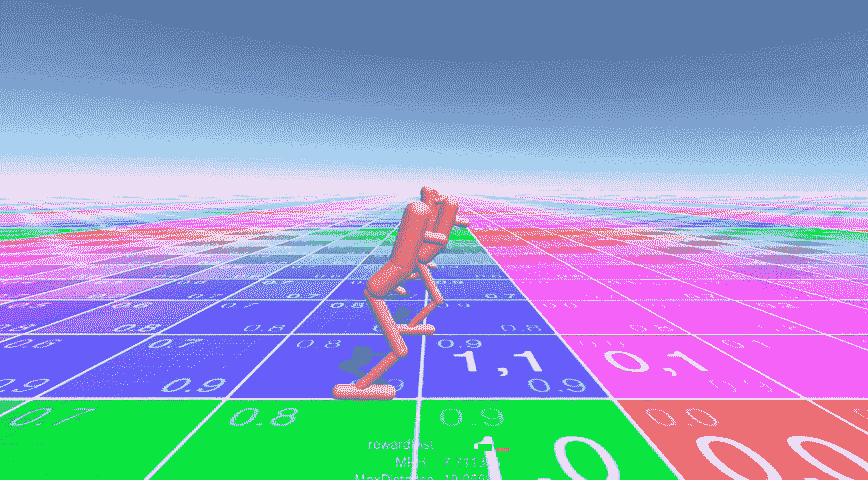

DeepMind Hopper

**料斗**代理有 4 个关节/动作和 31 个观察值。奖励函数对于骨盆速度和骨盆垂直度具有正的奖励信号。同样，对于当前动作状态的努力有一个负的奖励信号，如果身高低于 1.1 米则有一个惩罚信号。

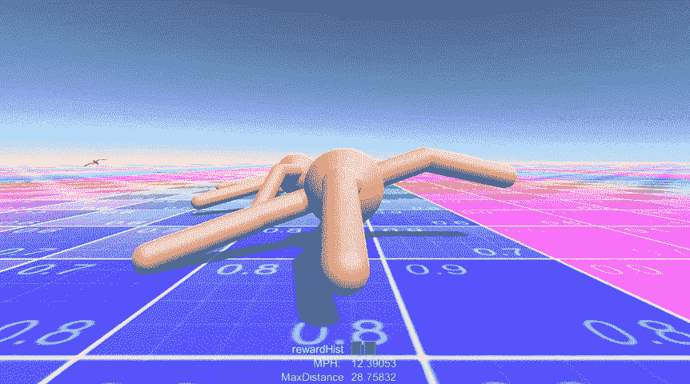

OpenAI Ant

蚂蚁智能体有 8 个关节/动作和 53 个观察值。奖励函数对于骨盆速度具有正的奖励信号，对于当前动作状态的努力具有负的奖励信号，并且如果关节处于它们的极限则具有负的信号。

# 培训绩效

这里是每个环境之间的训练性能比较，训练 16 个并发代理。

These results are using home PC. All environments where build and trained as executables.

# 训练料斗

到目前为止，我们已经运行了预训练的模型，然而，真正的乐趣开始于你自己训练和运行实验。首先，我们将重新训练料斗。稍后，我们将修改它的奖励函数来完全改变它的行为。

## 切换到训练模式

在 Unity 中，选择`Academy -> DeepMindHopperBrain`。然后，在检查器中，选择`Brain Type`下的`External`。顾名思义；代理现在需要外部输入。

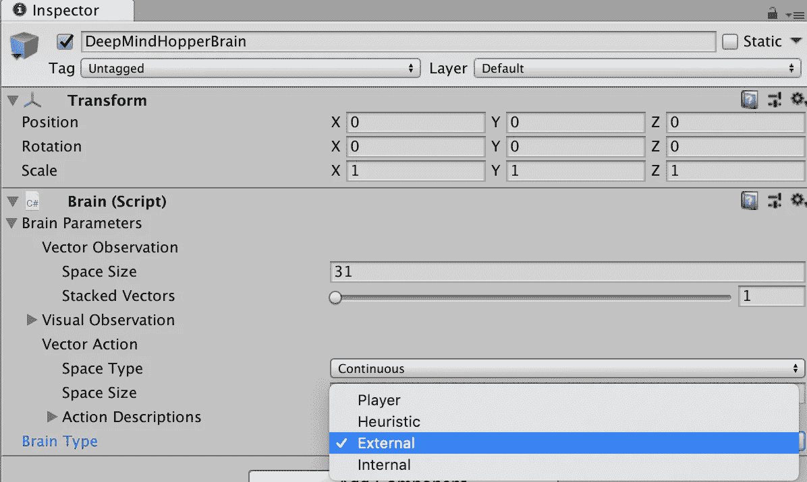

## 调用培训

打开终端或命令窗口，调用您的 python 环境:`source activate ml-agents`。转到项目`cd /Development/ml-agents-0.5a/`的根目录。

训练命令包含以下元素:

`mlagents-learn <trainer-config-file> --train --run-id=<run-identifier>`

*   `mlagents-learn`-ml-代理脚本
*   `<trainer-config-file>` -路径和文件名。yaml 配置文件。我们将使用`config/marathon_envs_config.yaml`
*   `--train`将 ml-agent 设置为训练模式
*   `--run-id=<run-identifier>`设置本次训练运行的唯一标识符。(在 Tensorboard 中使用的名称和训练模型文件名)

然后调用 ml-agents python 脚本:`mlagents-learn config/marathon_envs_config.yaml --train --run-id=hopper001`

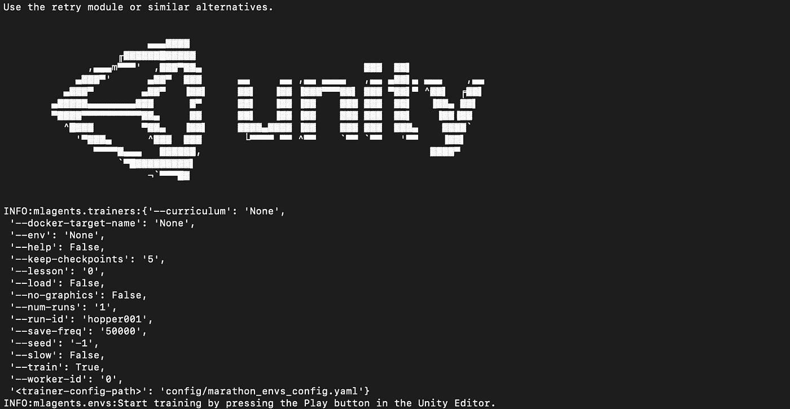

最后切换回 Unity，按 play 开始训练。

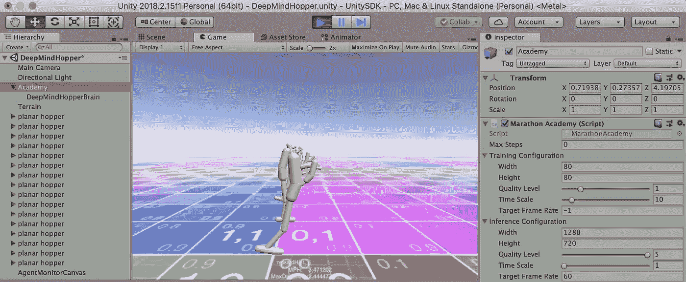

> 专业提示:使用可执行文件构建和训练将减少训练时间。更多信息见 [ML-Agents 培训文件](https://github.com/Unity-Technologies/ml-agents/blob/master/docs/Training-ML-Agents.md#training-ml-agents)。

# 使用 Tensorboard 监控训练

打开第二个终端或命令窗口，调用您的 python 环境:`source activate ml-agents.`转到项目的根目录:`cd /Development/ml-agents-0.5a/`。使用`tensorboard --logdir=summaries`调用 Tensorboard。最后打开浏览器，指向 Tensorboard 输出:`[http://yourPcName:6006](http://yourPcName:6006)`。

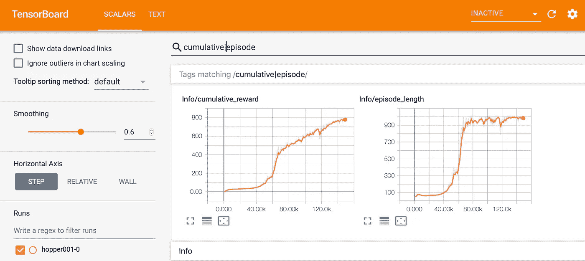

Tensorboard allows you to track training in real time

# 在 Unity 中运行训练好的模型

为了查看您新训练的模型，我们需要将训练好的模型文件`models/hopper001-0/editor_Academy_hopper001-0.bytes`复制到模型文件夹`.../DeepMindHopper/Models`

然后，通过选择`Academy -> DeepMindHopperBrain`将大脑设置回内部模式，然后在检查器中，选择`Brain Type`下的`Internal`。接下来，选择`GraphModel`下的`editor_Academy_hopper001-0`。

按“运行”查看您的训练模型:

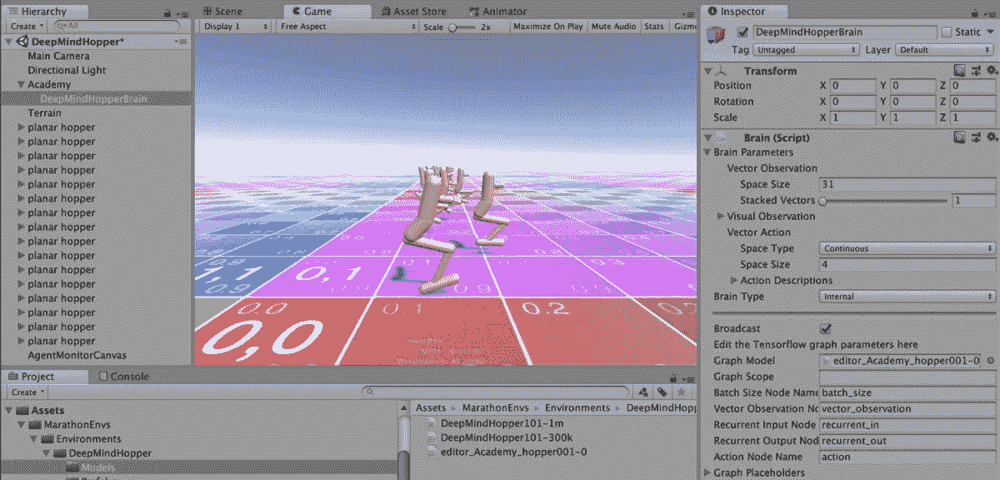

Your newly trained model running in Unity

# 编辑奖励函数让 hopper 跳起来。

现在你明白了基本原理，让我们来玩一玩吧！

打开`DeepMindHopperAgent.cs`你喜欢的代码编辑器。默认情况下，Unity 会安装 Visual Studio，但我更喜欢轻量级、响应性更好的 Visual Studio 代码。

找到`StepRewardHopper101()`函数并添加下面一行:

```
var jumpReward = SensorIsInTouch[0] == 0 ? BodyParts["foot"].transform.position.y + .5f : 0f;
```

这在脚不接触地面时产生一个奖励信号，并根据脚的高度而增加。

> 专业提示:通常我们希望所有的观察和奖励保持在-1 到 1 之间的“正常”范围内。然而，ML-Agents 可以在训练期间正常化观察和奖励值，这允许我们稍微偷懒！

通过用`jumpReward`替换`velocity`来更新`reward`。它应该是这样的:

```
var reward = jumpReward
                     + uprightBonus
                     - effortPenality
                     - jointsAtLimitPenality;
```

确保您的 ***保存*** `DeepMindHopperAgent.cs`。然后，按照之前的培训步骤，重新培训代理。结果将如下所示:

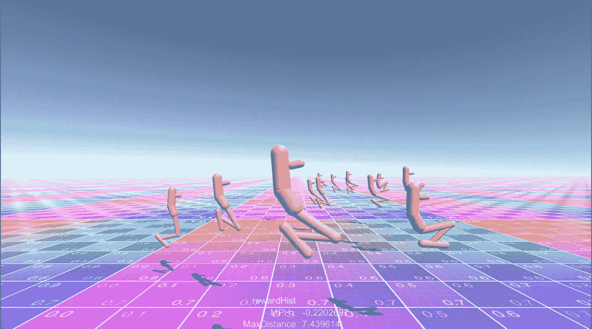

Hopper is now trained to jump!

# 更深入

下面是一些关于使用和扩展马拉松环境的更多技术细节。

**奖励**、**终止**和**观察**功能受到 DeepMind 控制套件和 OpenAI.Roboschool 的影响，一个例外是人形机器人，它在奖励中实现了一个阶段功能，以提高训练速度。

每个环境都是一个独立的 Unity 场景，每个代理类型都有一个预置，并且包含一个或多个预先训练的 Tensorflow 模型。从 MarathonAgent.cs 继承的自定义代理类用于定义该代理的行为。对于每个环境，开发人员应该实现以下内容:

`AgentReset()`用于初始化代理。它应该为 StepRewardFunction、TerminateFunction 和 ObservationsFunction 设置回调。开发人员应该将模型元素添加到 BodyParts 列表中，并调用`SetupBodyParts()`来初始化 body parts。这使得回调能够利用助手函数；例如，`GetForwardBonus("pelvis")`根据身体部位与前向向量的距离计算奖金。

`StepReward()`返回一个`float`，带有当前动作步骤的奖励。辅助函数包括以下:`GetVelocity("pelvis")`返回指定身体部位的速度；`GetEffort()`返回当前动作的总和(可以传递一个要忽略的身体部位列表)；并且`GetJointsAtLimitPenality()`返回对达到其极限的动作的惩罚。

如果满足终止条件，则`TerminateFunction()`返回`true`。终止功能通过减少代理暴露于无用的观察来帮助提高训练速度。辅助终止函数包括`TerminateNever()`，它永远不会终止(总是返回`false`)和`TerminateOnNonFootHitTerrain()`，如果不是脚的身体部位与地形发生碰撞，它将返回`true`。身体部位在功能`OnTerrainCollision()`中定义。一些代理商要求小腿身体部位贴上`"foot"`标签，因为它们从足部几何形状中突出来，造成假阳性终止。

# 包扎

在本教程中，我们学习了如何安装马拉松环境，运行预训练的 Tensorflow 模型，我们重新训练了 hopper，然后我们学习了如何修改奖励函数来奖励 Hopper 的跳跃。

这应该给你一个很好的基础，让你用强化学习来尝试马拉松。

> P ro 提示:我强烈建议您阅读 [ML-Agents 培训文档](https://github.com/Unity-Technologies/ml-agents/blob/master/docs/)以了解有关使用 Unity ML-Agents 的更多详细信息。

你可以在下面的 Github 项目中关注我的一些研究。

*   [github.com/Sohojoe/ActiveRagdollStyleTransfer](https://github.com/Sohojoe/ActiveRagdollStyleTransfer)——对活动布娃娃运动方式转移的研究(来自动作捕捉数据)
*   [github.com/Sohojoe/ActiveRagdollAssaultCourse](https://github.com/Sohojoe/ActiveRagdollAssaultCourse)—训练突击课目研究
*   [github.com/Sohojoe/ActiveRagdollControllers](https://github.com/Sohojoe/ActiveRagdollControllers)—主动布娃娃控制器的研究
*   [github.com/Sohojoe/MarathonEnvsBaselines](https://github.com/Sohojoe/MarathonEnvsBaselines)—实验性—开放式健身房/基线

如果您遇到任何问题或 bug，或者有任何疑问，请在该项目的 Github 页面[https://github.com/Unity-Technologies/marathon-envs](https://github.com/Unity-Technologies/marathon-envs)提出问题