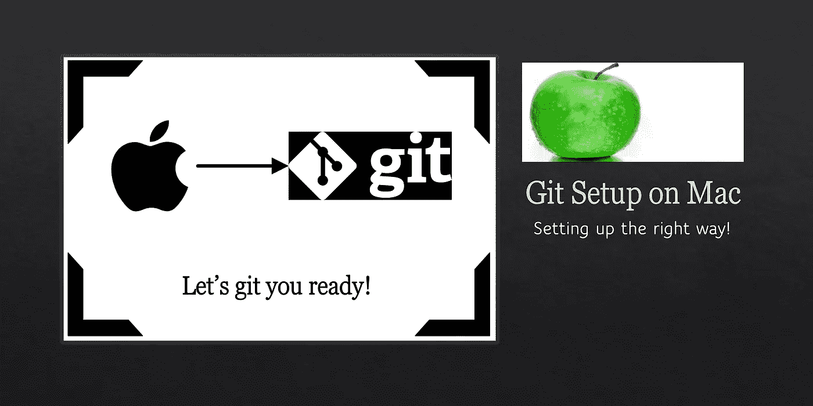
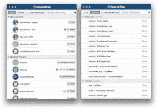

# Mac 用户的 Git 设置

> 原文：<https://towardsdatascience.com/git-mac-setup-be1d16162e79?source=collection_archive---------4----------------------->

## Mac 用户，让我们以正确的方式设置 Git！



## **动机**(个人，即):

几个月前，我偶然发现了 Medium——最初，我发现它的内容范围很广，材料也很注重质量——在博客和整体界面上已经有了显著的改进。有了这些，当我为实验室配置一台新的 iMac 时(例如，[微笑实验室](https://web.northeastern.edu/smilelab/)——稍后会详细介绍)，我想我应该记录下安装和配置 Git 的过程。我打算把这作为我的第一篇博客；尽管如此，我认为这个简单的教程是一个“打破僵局”的好方法。我希望你喜欢它！

现在让我们转到一些不错的老式 Mac Git——我们将正确设置您的 Mac 机器。

# 目录

*   [安装 Git](#9b4f)
*   [初始设置](#cc42)
*   [终端中的 Git 样式](#26c5)
*   [Git 自动完成](#4ddc)
*   [Git 忽略](#852b)
*   [Git 别名](#852b)
*   [Git 认证](#8cd3)
*   [桌面(GUI)应用](http://7e4e)

# Git 安装

首先是安装。这很简单。有几种不同的方法可以做到这一点。为了安装 *brew* 包管理器，我推荐使用[家酿](https://brew.sh/)。

## 通过自制 Git

打开终端，通过运行以下命令安装 [Homebrew](https://brew.sh/) :

```
/usr/bin/ruby -e "$(curl -fsSL https://raw.githubusercontent.com/Homebrew/install/master/install)"
```

然后安装 git

```
brew install git
```

—或者—

## Git for Mac 安装程序

在 Mac 上安装 Git 最简单的方法是通过独立的安装程序:

1.  下载最新的 [Git for Mac 安装程序](https://sourceforge.net/projects/git-osx-installer/files/)。
2.  按照提示安装 Git。

# 初始设置

1.  打开终端，通过在终端中键入并运行以下命令来验证安装是否成功

```
git --version
```

2.使用以下命令配置您的 Git 用户名和电子邮件，用您自己的名字替换艾娃的名字。与您创建的任何提交相关联的这些详细信息:

```
git config --global user.name "Ava Paris"
git config --global user.email "aparis@domain.com"
```

3.(可选)为了在使用 HTTPS 存储库时记住您的 Git 用户名和密码，[配置 git-credential-osxkeychain 助手](https://www.atlassian.com/git/tutorials/install-git#install-the-git-credential-osx)。

# 终端中的 Git 样式

有许多风格可供展示。无论如何，让我们保持简单和整洁——设置 Git 配色方案和显示在终端中的分支信息。

**颜色:**

除非您是从单色显示器上阅读这篇文章，否则让我们利用 git 的一些彩色特性。最明确的是，Git 的特定组件最好用彩色显示，这样更容易识别不同的组件，因此阅读起来也更舒服。

从终端运行以下命令集(即，从任何文件夹):

```
git config --global color.status auto
git config --global color.branch auto
git config --global color.interactive auto
git config --global color.diff auto
```

Mac 终端可以配置为使用颜色来改善显示效果。为此，将以下内容复制并粘贴到文件`~/.gitconfig`中。

```
[color]
	branch = auto
	diff = auto
	status = auto
[color "branch"]
	current = yellow reverse
	local = yellow
	remote = green
[color "diff"]
	meta = yellow bold
	frag = magenta bold
	old = red bold
	new = green bold
[color "status"]
	added = yellow
	changed = green
	untracked = cyan
```

**回购及分行挂牌:**

在我看来，Git 最好的定制之一是在终端中显示分支信息。

为此，只需将以下几行文本添加到`~/.bash_profile`文件中:

```
parse_git_branch() {git branch 2> /dev/null | sed -e '/^[^*]/d' -e 's/* \(.*\)/ (\1)/'}export PS1="$NO_COLOUR[\t] $BLUE\u$SSH_FLAG:$YELLOW\w$NO_COLOUR: \n$GREEN\$(parse_git_branch) $BLUE\\$ $NO_COLOUR" 
```

现在，在当前的回购中，提示符看起来如下:

```
**[**jrobinso@blackhawk matlab **(**master**)]**$
```

# Git 自动完成

通过 *tab 键*键自动完成可能是一个方便的特性。但是，MacOS 上不会自动设置自动完成功能。幸运的是，设置这个只需要几个简单的步骤。

首先，安装所需的 brew 软件包，如下所示:

```
brew install bash-completion
```

接下来，将下面的代码片段添加到`~/.bash_profile`文件中。

`source /usr/local/etc/bash_completion.d/git-completion.bash`

要么打开一个新的终端或运行`source ~/.bash_profile`和享受！

# Git 忽略

某些文件或文件类型通常不会添加到 repo 中。因此，如果省略这些文件,“状态”显示打印输出会更清晰。为此需要做的就是创建`~/.gitignore`并添加。首先，让我们创建一个包含以下内容的文件:

```
.DS_Store
```

注意，`~/.gitexcludes`也适用于每个项目，在这种情况下，文件存在于 repo 的根目录中。尽管如此，按照上面的说明，应该全局忽略`.DS_Store`。

# Git 别名

别名，特别是对于 Git，通常是值得的！如果没有其他的，至少将这个特性添加到您的全局 Git 配置中。请注意，我将配置称为“全局的”——`~/.gitconfig`是应用于系统范围的配置，而特定于项目的配置在位于存储库根的`.gitconfig`中处理(即`<repo>/.gitconfig`)。

对于别名，通常添加到全局配置中最有意义。如果以后需要，则为特定项目添加唯一的别名。也许值得注意的是，alias 或所有 Git 配置都是首先使用本地配置来设置的，如果没有在本地指定，则是全局设置。换句话说，假设您在本地和全局配置中定义了相同的别名，那么本地定义将用于该特定的回购。

不管是局部的还是全局的，但建议使用全局，将下面的*【别名】*块添加到`.gitconfig`:

```
**[**alias**]**
  st **=** status -uno
  ci **=** commit
  br **=** branch
  co **=** checkout
  df **=** diff
  lg **=** log -p
  lgg **=** log --graph --pretty**=**format:'%Cred%h%Creset -%C(yellow)%d%Creset %s %Cgreen(%cr) %C(bold blue)<%an>%Creset' --abbrev-commit --date**=**relative
  f **=** fetch
```

现在尝试+添加额外的别名，只要看到合适的…就这么简单。

```
**[**jrobinso@blackhawk matlab **(**feature_branch**)]**$ git co master 
 Switched to branch 'master'
**[**jrobinso@blackhawk matlab **(**master**)]**$ git st
 *# On branch master*
 nothing to commit **(**use -u to show untracked files**)**
**[**jrobinso@blackhawk matlab **(**master**)]**$ git f *# <fetch output>*
```

# Git 认证

通常认证需要一个 [SSH 密钥](https://help.github.com/articles/generating-a-new-ssh-key-and-adding-it-to-the-ssh-agent/)。

为此，从终端生成一个密钥:

```
**[**jrobinso@blackhawk ~**]**$ ssh-keygen
```

按几次 return 键(即，将密码留空)。

接下来，通过以下方式将 SSH 密钥复制到剪贴板

```
**[**jrobinso@blackhawk ~**]**$ cat ~/.ssh/id_rsa.pub | pbcopy
```

最后，将密钥粘贴到存储库主机上的[设置页面](https://github.com/account)中。

# 桌面(GUI)应用程序

考虑到 Git 确实有一点点的学习曲线，即使克服这一点的最好方法是熟悉它的核心(即从终端)，也许一些人会更喜欢 GUI。因此，我认为有必要提一下基于 GUI 的 Git 回购工具。为此，两个选项脱颖而出: [*SourceTree*](https://www.sourcetreeapp.com/) 和 [*Github 桌面 App*](https://desktop.github.com/) 。



Source Tree: View of local projects.


Open session, i.e., git repo


Github Desktop App

*SourceTree* 的优势在于可以与来自各种主机(例如 Github、Bitbucket 等)的存储库协同工作。)，而 *Github 桌面 App* 是 Github 特有的。

# 结论

在大多数项目中，正确地建立开发环境是首要的。花几分钟时间完成本教程，Git 版本控制现在已经在您的机器上正确地设置好了，可以增强和优化您的吞吐量。

对于那些刚接触 git 或者不习惯使用终端的人来说，也许桌面应用程序最适合你(例如 *SourceTree* 或者 *GitHub 桌面应用*)。这些在 GUI 中提供了许多特性、工具和可视化。无论如何，终端在某些情况下是必须的。另外，如果面对从终端使用 g it 带来的学习曲线，将会获得对 Git 和版本控制的更好理解。

无论如何，无论是专家还是初学者，您的系统现在都应该可以使用 Git 了。我希望你喜欢它！

如果有什么缺失或可以改进的地方，请在下面分享——是否有一个你离不开的 Git 别名，一个简洁的特性，或者一个可以改进或过时的方面。当然，也欢迎大家提问！

感谢你阅读我的第一篇博客——希望你会喜欢，请随时提供关于如何改进未来博客的反馈。

macOS 卡特琳娜 10 . 15 . 3[**博客**](/git-setup-like-a-pro-67bc3fe86fd1) 结账版本。