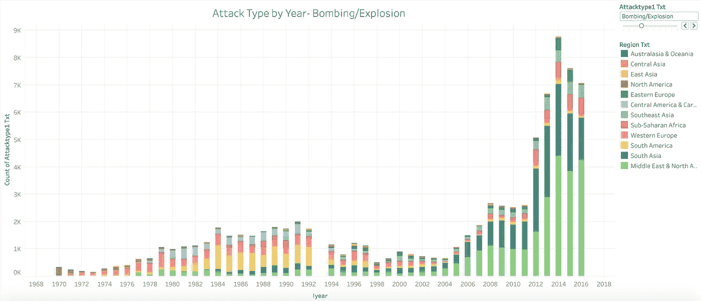
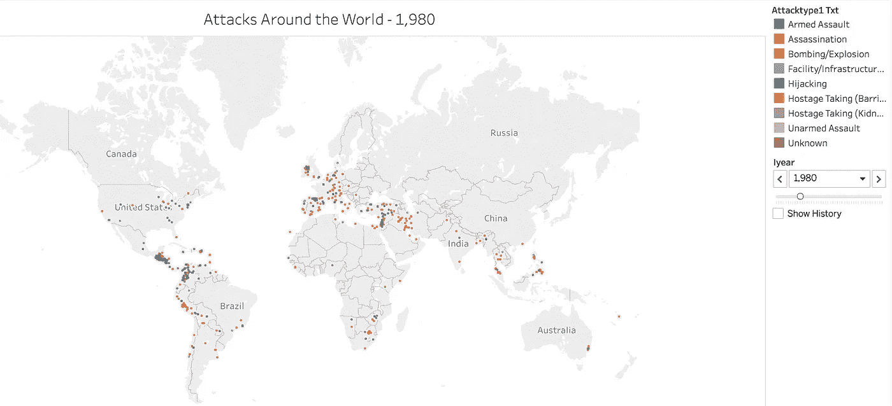
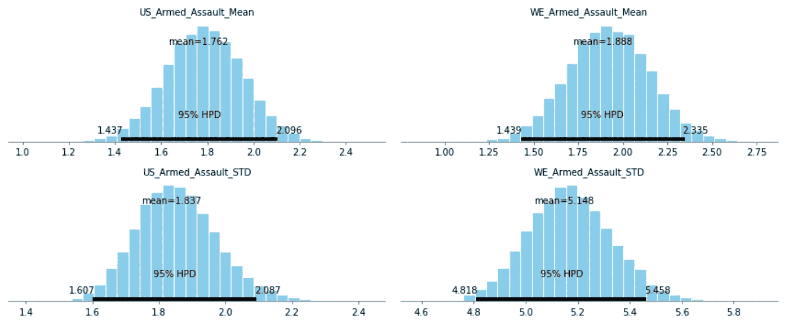
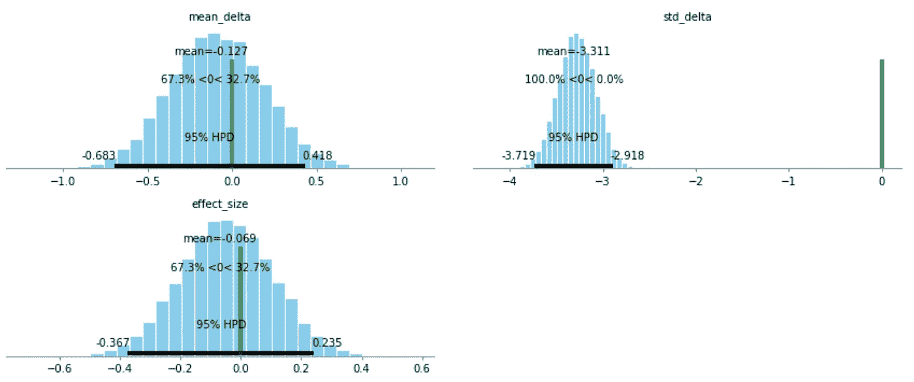
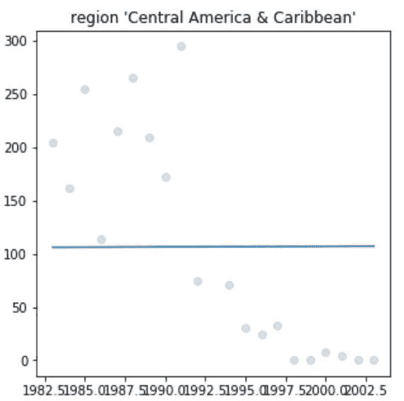
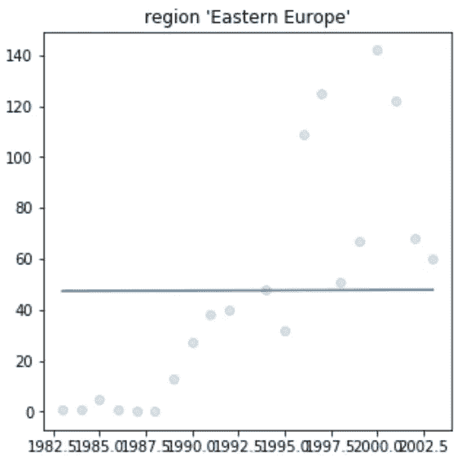
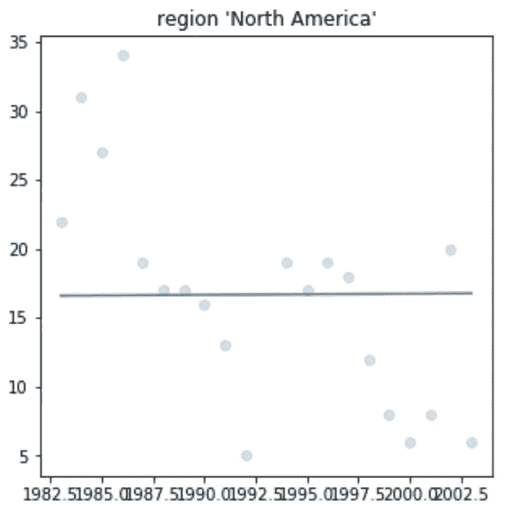

# 基于贝叶斯推理的全球恐怖主义数据库

> 原文：<https://towardsdatascience.com/global-terrorism-database-with-a-bayesian-inference-7d6e23ae5024?source=collection_archive---------9----------------------->

在大会的数据科学沉浸式课程中，我的一个项目是使用全球恐怖主义数据库，利用贝叶斯技术进行分析。该项目由三部分组成。第一部分是做一些 EDA(探索性数据分析)和可视化，这将帮助你更好地理解数据。第二部分是对我们选择的一部分数据进行贝叶斯推断。最后一部分是对 1993 年“爆炸/爆炸”类袭击的数量进行预测。

## 数据

全球恐怖主义数据库由国家研究恐怖主义和应对恐怖主义联合会创建和维护
(START)。它是在 2006 年编制的。它不包括 1993 年，因为缺乏该年的数据收集。全球恐怖主义数据库顾问委员会估计，他们只收集了那一年大约 15%的攻击数据。一些比较突出的栏目包括:日期栏，地区，县，攻击类型，目标类型和杀死的数量。你可以在[http://start.umd.edu/gtd/downloads/Codebook.pdf](http://start.umd.edu/gtd/downloads/Codebook.pdf)的密码本上阅读更多关于数据收集过程和数据集的更详细信息。

## 第一部分

这个项目的第一部分是做一些 EDA 和熟悉数据集，以完成第二部分和第三部分。我首先浏览代码本，并尝试了解数据集中一些列的含义的背景信息。我看的第一个是“attacktype”。该数据集中有九种不同类型的攻击。我关注的一些类型还有爆炸、暗杀和武装袭击。这些特别重要，因为爆炸对第三部分很重要，在这个项目中，我想尝试用暗杀或武装袭击作为第二部分的推理主题。

有了所有的时间序列信息和地理信息，我知道理解这些数据的最好和最有趣的方法是使用可视化。我首先想看看数据集中包含的历年攻击类型。使用 Tableau，我能够创建一个信息丰富的图表，能够将每种攻击类型分开，以查看每年每种攻击的数量。然后，我可以给图表中的每个区域赋予自己的颜色，以给出一些地理背景。下面是爆炸/爆炸的截图但是请到我的 Tableau 公众号和图互动。

[https://public.tableau.com/profile/cbjohnson30#!/vizhome/WorldTerror-T_S/Sheet2](https://public.tableau.com/profile/cbjohnson30#!/vizhome/WorldTerror-T_S/Sheet2)

我从这个图表中得到的一个重要信息是，当我试图预测 1993 年发生的爆炸事件的数量时，这个信息对这个项目的第三部分是有用的。只看这个图表，我就能猜出我要找的数字在 1000 到 1500 之间。

我创建的下一个可视化是关注数据集中多年来每次攻击的地理信息。再次使用 tableau，我能够在世界地图上按年份标出每次袭击的位置。下面是 1980 年的可视化设置的截图。

[https://public.tableau.com/profile/cbjohnson30#!/vizhome/WorldTerror-T_S/Sheet1](https://public.tableau.com/profile/cbjohnson30#!/vizhome/WorldTerror-T_S/Sheet1)

通过在 Tableau 公众帐户上查看，您可以与可视化交互以更改显示的攻击年份。在 Tableau Desktop 上创建时，年份之间的过渡更加平滑，让您可以更清楚地看到世界各地的攻击活动。

## 第二部分

这个项目的第二部分是在这个数据集上创建一个贝叶斯推理。我问的问题是，美国和西欧“成功的”武装袭击造成的死亡人数是否有显著差异。要使一次袭击“成功”，必须至少有一人死亡。随着枪支暴力成为全世界的热门话题，我想深入探讨一下这类袭击。所有的贝叶斯推理都包括一个先验信念和一个后验信念。对于我的先验，我使用了西欧和北美袭击中的死亡人数，我比较的两个后验是西欧的死亡人数和美国的武装袭击死亡人数。第一步是找到先验的均值和标准差。西欧和北美袭击死亡人数的均值和标准差分别为 1.94 和 4.3。接下来，我绘制了 95%置信水平下两个后验概率的均值和标准差。以下是每一项的图表:

美国的真实平均值在 1.44 和 2.1 之间，在 95%的置信水平下，其标准偏差在 1.61 和 2.87 之间。西欧的真实平均值在 1.44 和 2.34 之间，其标准偏差在 4.81 和 5.46 之间，两者的置信度均为 95%。最后一步是绘制两个相互对立的后验概率。这可以从下面看出:

在这些图表中，绿线代表我正在查看的每个统计数据的西欧基线数字。Delta-mean 相对接近，意味着这些数字相当相似。Delta-STD 则相反，绿线并不靠近条形图。这是因为西欧的标准差比美国高得多。这意味着西欧在他们的袭击中有更大范围的死亡。鉴于这一数据的性质，这意味着西欧的武装袭击死亡人数高于美国。

## 第三部分

该项目的最后一部分是试图预测 1993 年爆炸袭击的数量。由于这个项目的性质，我想留在贝叶斯分析领域做这件事。在我的 EDA(第 1 部分)中，我找到了我所寻找的攻击数量的目标范围。我的目标数字在 1000 到 1500 之间。我的目标是创建一个爆炸袭击数量的散点图，并在图上画一条最佳拟合线。然后我会用 1993 年的那个时间点，作为我对攻击次数的估计。建议该课程在预测攻击数量之前将数据分成几个部分。我决定按地区来划分，因为我认为这是对世界和这个时间范围内可能发生的趋势的合理划分。为了得到更准确的数字，我还决定使用 1993 年前后 10 年的数据。我想这也能帮助我更好地了解每个地区的情况。一个很好的例子就是看看中东和北非的爆炸袭击数量。大约在 2004 年，由于该地区冲突和战争的增加，爆炸事件的数量开始急剧上升。我不希望这一攻击高峰影响我的预测。在对每个地区做出预测后，我将它们相加，得到 1993 年所有爆炸袭击的数字。结果这个数字是 1250。这是我刚开始写这一部分时正在寻找的产品系列的中间位置。

正如你在上面的图表中看到的，我的最佳拟合线确实有问题。对于每一个图，我的线实际上是水平的，即使它们应该有更多的斜率，只看标绘的点。每张图都估计了一个非极端的数字，总的估计值在我期望的范围内。我不知道为什么我对视觉化有这个问题。我的作品可以在我的 GitHub 上看到，(文章底部的链接)如果有人知道为什么会这样，请随时联系我。

我所有的代码都可以在我的 GitHub 上找到:[https://github.com/CBJohnson30/Global-Terrorism](https://github.com/CBJohnson30/Global-Terrorism)